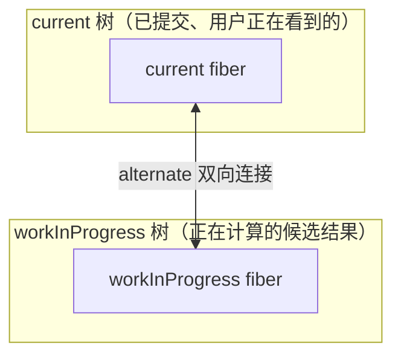
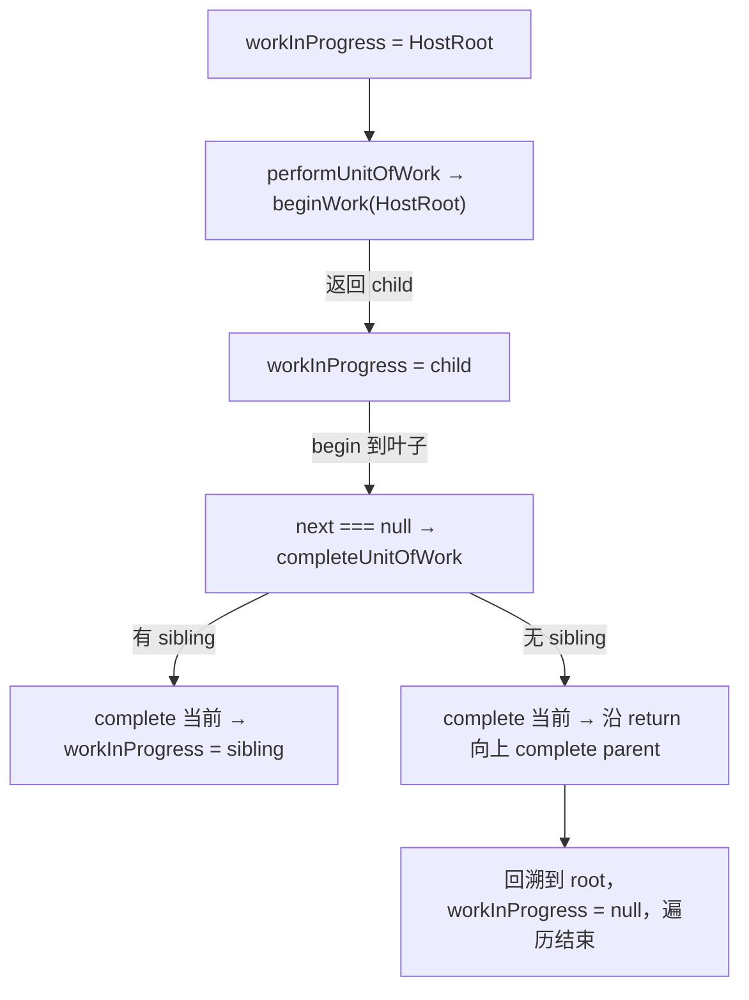

# 第3章：实现 Reconciler 架构

## 本章要解决的问题

普通函数递归一旦开始，“进度”就全部锁在调用栈里——你读不到它，也没法在渲染到一半时先停下来处理更紧急的事，做完再回来接着渲染。本章要做的，就是把这份“进度”搬出调用栈，变成一个可以随时读写的对象：`FiberNode`，以及一套“处理完当前节点后，下一步该去哪”的规则。

## 本章定位

- **数据流定位**：定义 Fiber 工作单元及其树指针 → 写出 work loop 的控制流骨架 → 为后续构树与双缓存提供数据基础。
- **难度**：★★★☆☆ —— 进入计算层的第一章，重点是 FiberNode 为什么能把递归现场显式化；本章还没有完整 render 入口。
- **前置依赖**：第 1 章（包边界，知道 reconciler 负责「计算变化」）、第 2 章（`ReactElement` 是输入）。自检：能说出 ReactElement 与 Fiber 的区别；能说出 `react-reconciler` 与 react-dom 的边界在哪。
- **读后检验**：能画出 `child/sibling/return` 怎样表达下一步；能指出 `FiberNode` 当前有哪些字段；能解释本章代码为什么还不能实际推进一个 Fiber。
- **本章实现边界**：本章只建立最小 `FiberNode` 与单步推进的 work loop 骨架；`FiberRootNode`、`Update`、真正的更新入口第 4 章加入，flags 冒泡与 commit 第 5、6 章加入，Lane 与可中断调度第 14、17、18 章加入。下文不再逐句重复这条边界，只在必要处提醒一次。

## 整体架构思路：把隐式调用栈变成显式工作单元

Fiber 并不是把树换一种链表写法，也不是某种更快的 Virtual DOM。它要解决一个更具体的问题：**离开 JavaScript 递归栈之后，怎样只靠对象上的字段，就能找到“深度优先遍历”的下一步？**

先看普通递归怎么渲染一棵树：

```ts
function walk(node) {
	begin(node);
	for (const child of node.children) {
		walk(child);
	}
	complete(node);
}
```

这段代码的遍历进度，全部隐含在 JavaScript 调用栈里。假设刚处理完 B，只看 B 这一个对象本身，是无法知道下一步该进入兄弟 C，还是回到父级 A 的——这个信息只存在于调用栈的“现在正挂在哪一层”，而调用栈这东西没法被你读取、暂停、序列化。

```text
A
├─ B  <- 当前完成位置
└─ C  <- 下一工作单元
```

Fiber 的解法是：给每个节点显式记录三个指针——`child`（往下走）、`sibling`（走到同层下一个）、`return`（回溯到父级）。有了这三个指针，“下一步在哪里”就变成读一个字段，而不是依赖调用栈还没弹出。

这个转变的意义在于：调用栈一旦返回，进度就彻底丢了，没法暂停恢复；而对象字段可以随时读、随时存、随时被别的代码打断再恢复。work loop 能不能被中断和继续，根子上就在于进度是不是显式存在对象里——本章先把这套“记录”搭出来，还没有让它真正跑起来。

### Fiber 需要具备哪些能力？

把“可中断、可恢复”的目标拆开，至少要满足：

1. 一次只处理一个节点，不必一口气做完整棵子树。
2. 处理完当前节点后，不依赖调用栈也能找到下一步。
3. 暂停时只需要保存少量指针，恢复时不用从根重新猜进度。
4. 更紧急的更新到来时，可以放弃或重做还没提交的结果。
5. 没算完的中间结果不能污染用户当前看到的界面。
6. 节点还要能保存跨越多次更新的 state、身份、优先级和待办操作。

这些约束各自对应一个设计选择：

| 约束             | Fiber 方案                                  |
| ---------------- | -------------------------------------------- |
| 不依赖调用栈遍历 | `child/sibling/return` 显式保存控制流       |
| 每次只做一点工作 | 一个 Fiber 就是一个可独立执行的工作单元     |
| 能恢复           | 模块级 `workInProgress` 指向下一单元        |
| 能放弃未提交结果 | current 与 workInProgress 两棵树彼此隔离    |
| 能比较前后输入   | `pendingProps/memoizedProps` 与 `alternate` |
| 延后真实副作用   | render 阶段只记录 `flags`，commit 阶段才执行 |
| 保存组件状态     | `memoizedState/updateQueue` 挂在 Fiber 上   |
| 支持优先级       | 后续加入 `lanes/childLanes`（第 14 章）      |

所以更准确的定义是：**Fiber 是 React 对“组件实例、树节点、工作进度、副作用计划”这四件事的统一记录；Fiber 架构则是围绕这份记录建立起来的、可调度、可中断、集中提交的更新机制。**

### Fiber 没有解决什么

厘清边界，避免把 Fiber 想象成“万能优化”：

- 它不保证 diff 得到理论最少的 DOM 操作——第 12 章用的是启发式 O(n) 策略，不是最优解。
- 它不让 JavaScript 真正并行——并发仍然是单线程上的合作式调度，谁也没有多开一个线程。
- 它不让 commit 可以被打断——DOM、ref 这些外部状态一旦开始改，就必须一次性改完，否则界面会处在中间态。
- 它不负责“什么时候该运行”——这是 Scheduler 和 Lane 的工作，本章只有同步推进，时间切片要到第 17、18 章才接入。
- 它不是 ReactElement 换个名字——ReactElement 是“用户想要什么”的输入描述，Fiber 是“现在做到哪一步了”的持久工作记录，两者职责完全不同。

## 本章实现：Fiber 长什么样、work loop 骨架怎么搭

### 核心数据结构：FiberNode

[FiberNode](../../packages/react-reconciler/src/fiber.ts) 是每个节点的工作单元。本章只保留已经参与创建、连接、推进的字段，后续章节要用到的 Update、Lane、effect 等字段这里先不塞进来：

```ts
class FiberNode {
	tag; // 当前工作单元的节点类型
	key;
	stateNode; // 与该 Fiber 对应的实例；本章暂不展开宿主创建
	type;

	return;
	child;
	sibling;
	index;

	pendingProps;
	memoizedProps;

	alternate; // current <-> workInProgress 的同身份连接
	flags;
}
```

一个 Fiber 上保存的信息可以归成四类：

- **节点身份**：`tag`、`type`、`key`——它是什么类型的节点。
- **树结构**：`return`、`child`、`sibling`——它在树里的位置，也是遍历下一步的依据。
- **输入快照**：`pendingProps`、`memoizedProps`——这一轮和上一轮分别拿到什么输入，供后面比较。
- **对应记录与工作标记**：`alternate`、`flags`——连接到“另一份自己”，以及待执行的副作用标记。

`stateNode`（对应的宿主实例，比如真实 DOM 节点）本章也先留空，宿主创建要等第 6 章。

#### 为什么不能直接用 ReactElement 当工作单元？

`ReactElement` 只回答“用户想要什么 UI”：它有 `type/key/props`，但没有 `return/child/sibling`，没法表达遍历顺序；没有 `alternate`，没法保存“上一次的自己”用来比较；也没有工作标记，没法记录“这个节点现在处理到哪一步”。

如果硬要用 ReactElement 兼职保存这些运行时信息，同一个对象就要同时扛“用户这次声明了什么”和“这次渲染算到哪了”两份职责——一次 render 的临时写入会污染下一次 render 该读到的声明输入，也没法同时留住“已提交的旧结果”和“正在计算的新结果”。所以 React 需要另一种数据结构，这就是 `FiberNode` 存在的理由。

不过要澄清一点：本章还没有把这两种数据结构真正接上。源码里还没有 `createFiberFromElement` 这样的函数，也没有任何代码读取 `ReactElement.type/key/props` 去创建对应的 Fiber——本章唯一真实存在的输入，只有 `new FiberNode(tag, pendingProps, key)` 这三个构造参数。“ReactElement 转换成 Fiber”这条路径要等后面构树的章节才会出现。

### `alternate`：本章只是预留了一个连接点

`alternate` 未来的用途是把“同一个逻辑节点”的两份工作记录（current 树上的和 workInProgress 树上的）连起来，方便随时对比、随时切换。但本章还没有 `FiberRootNode`，也没有创建 WIP 的函数——新建的每个 Fiber，`alternate` 就是 `null`，仅此而已。



上图画的是这个字段**将来**要撑起的结构——第 4 章创建根对象和 WIP 时，才会第一次真的写这根连线。本章理解“为什么需要预留这个连接点”就够了。

### work loop：骨架先搭好，还不能真的走

按照设计，`performUnitOfWork` 应该让 `beginWork` 返回 `child` 或 `null`：拿到 child 就往下走，没有就沿 `sibling`/`return` 回溯。这套“选择下一步”的规则画出来是这样的：



即：

```text
begin A -> begin B -> complete B
                    -> begin C -> complete C
                               -> complete A
```

#### 具体走一遍：三个节点的指针会长什么样

光看规则容易停留在抽象层面，代入一棵具体的树会更直接——**注意这是一次手算推演，不是本章能跑出来的代码**：本章既没有 `createFiberFromElement`，也没有任何函数会真的把三个 Fiber 的 `child/sibling/return` 连起来，下面纯粹是假设“如果连好了会是什么样”。假设 `A` 是根，有两个子节点 `B`、`C`（`B` 在前）。三个 Fiber 建好、`return/child/sibling` 接上之后，字段是这样的：

```text
A.child = B      A.sibling = null   A.return = null
B.child = null   B.sibling = C      B.return = A
C.child = null   C.sibling = null   C.return = A
```

按照前面的选择规则手动走一遍：

```text
1. workInProgress = A   -> beginWork(A) 返回 B（A.child）
2. workInProgress = B   -> beginWork(B) 返回 null（B 没有 child）
3. B 进入 complete：B.sibling = C，不为 null -> workInProgress = C
4. workInProgress = C   -> beginWork(C) 返回 null（C 没有 child）
5. C 进入 complete：C.sibling = null，沿 C.return 回溯 -> 触发 A 的 complete
6. A 进入 complete：A.sibling = null，沿 A.return 回溯到 null -> 遍历结束
```

这六步只用到 `child/sibling/return` 三个字段，就完整表达了一次深度优先遍历——不需要调用栈替你记住“处理完 B 该看 C”，这个信息已经写死在 `B.sibling` 字段里了，随时可以读、也可以在读之前先被别的代码打断。

#### 为什么 `workInProgress` 是模块级变量，不是递归参数？

如果 `performUnitOfWork` 处理完一个节点后，直接调用自己去处理下一个（写成普通递归），进度又会重新回到调用栈里，等于绕了一圈回到最初要解决的问题。把 `workInProgress` 放在模块作用域、每次只推进一步、再把控制权交还给外层调用者，好处是外层可以在“这一步做完、下一步开始前”这个间隙插入别的判断——比如未来的 Scheduler 判断“这一帧的时间是不是快用完了，要不要先让出主线程”（`shouldYield`，第 18 章接入）。本章还没有这个判断，但“进度存在可读写的模块级变量里、而不是锁在调用栈或函数参数里”，正是为了给这类插入点留出位置。

这套规则本章只写出了骨架，还没接上能让它真正跑起来的部分：`beginWork`、`completeWork` 目前是空函数（没有 `return`，调用后拿到的其实是 `undefined`，并不满足 `FiberNode | null` 的约定）；模块级 `workInProgress` 初始为 `null`，也没有谁去初始化它、没有入口反复调用 `workLoop`：

```ts
function workLoop() {
	if (workInProgress !== null) {
		performUnitOfWork(workInProgress);
	}
}
```

第 4 章会补上根对象和更新入口，让 `workInProgress` 第一次真的被赋值；第 5 章填入 `beginWork`/`completeWork` 该做的事；第 6 章才让这个循环第一次真正走完一整棵树。这三个函数都在 [workLoop.ts](../../packages/react-reconciler/src/workLoop.ts)：`performUnitOfWork` 负责“向下或回溯”的分支判断，`completeUnitOfWork` 负责 sibling/return 的后续规则——本章能检查的是这两个函数的控制流写法，不是运行结果。

## 与官方 React 的差异

- 官方 React 的 `FiberNode` 构造函数还有一个 `mode` 参数（记录 ConcurrentMode、StrictMode 等标志），并且带 `_debugOwner`、`_debugHookTypes` 等调试字段；big-react 的 `FiberNode` 省略了它们。
- 官方 React 的 work loop 里，同步路径 `workLoopSync` 与并发路径 `workLoopConcurrent`（结合 `shouldYield`）并存，且与 Scheduler、lane 的优先级模型深度耦合；big-react 的同步循环先建立，`shouldYield` 与优先级第 18 章才接入。
- 官方 React 首屏 mount 走 `createContainer`/`updateContainer`（big-react 第 4 章引入）之后还有 hydrate、服务端渲染等分支；big-react 只实现客户端挂载路径。

这些差距不影响本章主线：**Fiber 先通过 child/sibling/return 把遍历现场对象化；本章的 alternate 还只是后续双缓存所需的连接点。**

## 思考题

### Q1: 本章定义了 `alternate`，是否已经完成双缓存？

没有。本章只声明字段，并把新 Fiber 的 `alternate` 初始化为 `null`；源码中还没有根对象，也没有创建另一份 Fiber 的函数。字段只说明“同一逻辑节点未来可以连接另一份工作记录”。第 4 章真正创建 WIP 并双向写入 `alternate` 后，两份记录才建立联系。区分“预留数据结构”和“运行流程已经闭环”，可以避免仅凭字段名推导出源码尚未具备的能力。

### Q2: 为什么 Fiber 同时需要 `child/sibling/return`，只有 child 和 parent 不够吗？

child 让遍历进入第一个子节点，sibling 让同一层工作继续，return 则在子树完成后回到父节点执行 completeWork。没有 sibling，就必须在父节点额外保存数组下标；没有 return，就仍需依赖调用栈找回父级。三个指针把深度优先遍历的前进、横移和回溯都对象化。第 5 章会填入 begin/complete 的节点处理规则，第 6 章才用完整循环反复执行“有 child 向下、无 child 完成并找 sibling、无 sibling 沿 return 回溯”。

### Q3: ReactElement 已经保存了 `type/key/props`，为什么不能直接把它当作工作单元？

ReactElement 按本章职责是一次声明快照，回答“用户希望渲染什么”，不用于保存运行时遍历现场；Fiber 是可变的执行记录，回答“这项工作现在进行到哪里、对应哪个宿主实例、与上一次结果是什么关系”。两者有意保存不同的信息：

| 能力               | ReactElement     | 本章 FiberNode                  |
| ------------------ | ---------------- | -------------------------------- |
| 描述声明输入       | `type/key/props` | `type/key/pendingProps`          |
| 组成可遍历的工作树 | 无               | `child/sibling/return`           |
| 保存本轮执行结果   | 无               | `memoizedProps/stateNode/flags`  |
| 连接前后两份记录   | 无               | 预留 `alternate`                 |

如果直接修改 ReactElement 来保存遍历进度，同一个声明对象就会同时承担用户输入与运行时状态：一次 render 的临时写入可能污染后续 render，也无法同时保留 current 与候选结果。本章还没有完成“ReactElement → Fiber 子树”的协调过程，但 `FiberNode` 的字段已经把声明和值得长期保存的执行现场分开；第 5 章才会由 child reconciler 真正创建子 Fiber。

### Q4: 本章已经有 FiberNode 和 work loop，为什么还不能称为“可中断并继续的 render”？

FiberNode 让“保存现场”成为可能，但执行器还没有形成完整闭环。`performUnitOfWork` 确实会把下一个 child、sibling 或 return 方向写回模块级 `workInProgress`，所以离开函数后遍历位置不会只存在于 JavaScript 调用栈里——这一点已经具备。但本章没有 root 更新入口，也没有调度器反复驱动 workLoop，更没有“时间片到期时让出、之后从同一位置恢复”的判断；`beginWork`/`completeWork` 也仍是空函数。

因此本章完成的是**可恢复数据结构的前提**，不是可中断调度本身。第 4～6 章会补 WIP、节点计算与完整 render/commit，第 17、18 章才把 `shouldYield` 和 Scheduler 接到这份显式现场上。

## 本章小结

Reconciler 是 React 的“更新解释器”：它不关心 DOM API 的细节，也不关心 JSX 如何编译，它关心的是如何把新的 UI 描述和旧的 Fiber 树进行比较，生成一棵带副作用标记的新 Fiber 树。这个架构是后续 mount、update、Hooks、并发调度的基础。

本章真正完成的只是骨架：`FiberNode` 定义好了，`child/sibling/return` 的选择规则也写出来了，但 `workLoop` 还是单次 `if` 的起步形态，`beginWork`/`completeWork` 是空占位，也没有任何入口能产生一次“更新”。dispatch 之后发生什么，是第 4 章的更新机制。
