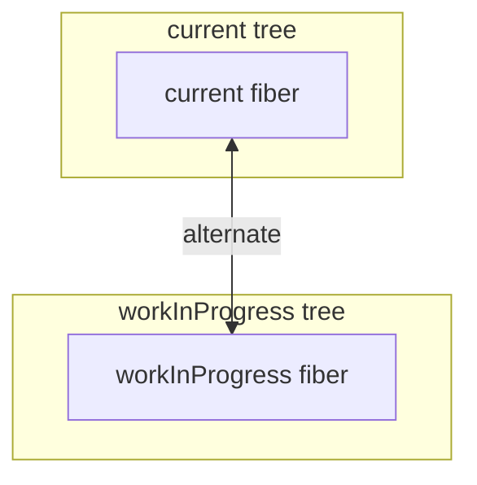
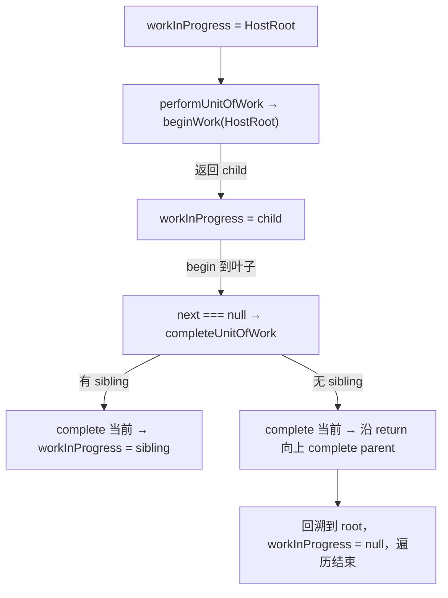

# 第3章：实现 Reconciler 架构

## 本章定位

- **数据流定位**：定义 Fiber 工作单元及其树指针 → 写出 work loop 的控制流骨架 → 为后续构树与双缓存提供数据基础。
- **难度**：★★★☆☆ —— 进入计算层的第一章，重点是 FiberNode 为什么能把递归现场显式化；本章还没有完整 render 入口。
- **前置依赖**：第 1 章（包边界，知道 reconciler 负责「计算变化」）、第 2 章（`ReactElement` 是输入）。自检：能说出 ReactElement 与 Fiber 的区别；能说出 `react-reconciler` 与 react-dom 的边界在哪。
- **读后检验**：能画出 `child/sibling/return` 计划如何表达下一步；能指出 `FiberNode` 当前有哪些字段；能解释本章代码为什么还不能实际推进一个 Fiber。

本章进入 React 的核心：`react-reconciler`。JSX runtime 只能告诉我们“用户想要什么 UI”，但不能告诉我们“这次更新要复用谁、创建谁、删除谁、什么时候操作宿主环境”。Reconciler 就是负责把静态描述变成可执行更新流程的模块。

> **big-react 实现边界**：本章代码只建立最小 FiberNode 与单步推进的 work loop；FiberRootNode、Update、更新入口在第 4 章加入，flags 冒泡与 commit 在第 5、6 章加入，Lane 与可中断调度在第 14、17、18 章加入。正文聚焦本章字段，后续名称只用于标出能力边界。

## 整体架构思路：把隐式调用栈变成显式工作单元

Fiber 并不是为了把树换一种链表写法，也不是某种更快的 Virtual DOM。本章先处理一个更小的问题：**离开 JavaScript 递归栈后，怎样只靠对象字段找到深度优先遍历的下一步？**

先看普通递归如何渲染一棵树：

```ts
function walk(node) {
	begin(node);
	for (const child of node.children) {
		walk(child);
	}
	complete(node);
}
```

这段代码的遍历进度隐含在 JavaScript 调用栈里。假设刚处理完 B，仅看 B 本身无法知道下一步应该进入兄弟 C，还是回到父级 A：

```text
A
├─ B  <- 当前完成位置
└─ C  <- 下一工作单元
```

`child/sibling/return` 分别保存向下、同层和回溯路径，使“下一步在哪里”不再依赖调用栈。本章只定义这套记录与选择规则；它还没有初始化 workInProgress，也没有可运行的 render 入口。

递归调用栈一旦返回就无法暂停和恢复；Fiber 必须把节点身份、父子关系和下一步路径保存为显式对象，work loop 才能自行控制遍历。

### Fiber 需要具备哪些能力？

为了让 render 可控制，至少需要满足：

1. 一次可以只处理一个节点，而不是必须完成整棵子树。
2. 处理完当前节点后，能在不依赖调用栈的情况下找到下一步。
3. 暂停时只保存少量指针，恢复时不必从根重新猜测进度。
4. 高优先级更新到来时，可以放弃或重做尚未提交的结果。
5. 未完成计算不能污染用户当前看到的 UI。
6. 节点还要保存跨更新的 state、身份、优先级和待提交操作。

这些约束分别推导出 Fiber 的关键设计：

| 约束             | Fiber 方案                                  |
| ---------------- | ------------------------------------------- |
| 不依赖调用栈遍历 | `child/sibling/return` 显式保存控制流       |
| 每次只做一点工作 | 一个 Fiber 作为一个可执行工作单元           |
| 能恢复           | 模块级 `workInProgress` 指向下一单元        |
| 能放弃未提交结果 | current 与 workInProgress 两棵树隔离        |
| 能比较前后输入   | `pendingProps/memoizedProps` 与 `alternate` |
| 延后真实副作用   | render 记录 `flags`，commit 再执行          |
| 保存组件状态     | `memoizedState/updateQueue` 挂在 Fiber 上   |
| 支持优先级       | 后续加入 `lanes/childLanes`                 |

因此，更准确的定义是：**Fiber 是 React 对组件实例、树节点、工作进度和副作用计划的统一记录；Fiber 架构则是围绕这些记录建立的可调度 render 与集中 commit 机制。**

### Fiber 没有解决什么？

- 它不保证 diff 得到理论最少的 DOM 操作；第 12 章采用的是启发式 O(n) 策略。
- 它不让 JavaScript 真正并行执行；并发仍是单线程上的合作式调度。
- 它不让 commit 随意中断；DOM、ref 等外部状态需要一致提交。
- 它不负责安排任务何时运行：时间切片与优先级由 Scheduler、Lane 承担，本章只有同步推进，Lane 第 14 章接入，时间切片第 17/18 章接入。
- 它不是 ReactElement 的另一个名字；ReactElement 是输入描述，Fiber 是持久工作记录。

## 本章实现：Fiber 如何接管一次 render？

### Fiber 对象生命周期账本

| 时刻          | 输入                           | 写入对象/字段                              | 当前消费者              | 结果                               |
| ------------- | ------------------------------ | ------------------------------------------ | ----------------------- | ---------------------------------- |
| 调用构造器    | `tag`、`pendingProps`、`key`   | `FiberNode` 的身份和输入字段               | 本章没有构树调用方      | 类具备创建能力，源码入口尚未使用它 |
| 初始化树指针  | 无父子关系输入                 | `child/sibling/return` 全部初始化为 `null` | 本章没有连接树的函数    | 只声明可表达关系的字段，尚未形成树 |
| 预留对应关系  | 无另一份记录                   | `alternate = null`                         | 本章没有 WIP 创建函数   | 尚未形成双缓存                     |
| 调用 workLoop | `workInProgress` 初始为 `null` | 不进入 `performUnitOfWork`，字段没有变化   | `workLoop` 也未导出调用 | 控制流函数存在，但本章没有执行结果 |

本章只建立 Fiber 作为工作记录的最小形态。`FiberRootNode`、Update 和真正的外部更新入口由第 4 章接入；本章不能从 JSX 独立跑出一棵可提交的树。

### 本章先定义记录，不消费 JSX

Reconciler 的最终职责是把声明输入变成可执行工作并计算变化，但本章还没有 `createFiberFromElement`，也没有任何函数读取 ReactElement.type/key/props。这里应追踪的真实输入只有 `new FiberNode(tag, pendingProps, key)` 的三个构造参数；ReactElement 到 Fiber 的转换从后续构树章节才开始。

#### ReactElement 的局限

`ReactElement` 适合表达“一个节点长什么样”，但不适合执行更新：

- 它没有 `return`、`child`、`sibling` 指针，无法表达树遍历所需的结构。
- 它没有 `alternate`，无法保存双缓存树。
- 它没有 Fiber 的输入快照和工作标记，不能记录一个节点处理到哪一步。

所以 React 需要另一种数据结构：`FiberNode`。

#### FiberNode 的定位

[FiberNode](../../packages/react-reconciler/src/fiber.ts)将来位于 ReactElement 与宿主节点之间，但本章只定义对象本身：

```text
new FiberNode(tag, pendingProps, key)
-> 初始化身份字段、树指针、输入快照与工作标记
```

它既是数据单元，也是工作单元。一个 Fiber 保存：

- 节点身份：`tag`、`type`、`key`
- 树结构：`return`、`child`、`sibling`
- 宿主实例：`stateNode`
- 输入快照：`pendingProps`、`memoizedProps`
- 对应记录：`alternate`，本章只定义字段，尚未创建另一份 Fiber
- 工作标记：`flags`

这些字段先回答“一个工作单元需要保存什么”。本章没有把 ReactElement 写入 Fiber，也没有创建宿主实例。

### `alternate`：本章只预留连接点

> **本节数据流**：创建 FiberNode → `alternate` 初始化为 `null` → 第 4 章才创建并连接另一份 Fiber。

`alternate` 的最终用途是连接同一逻辑节点的两份工作记录，但本章还没有 `FiberRootNode` 和创建 WIP 的函数。此时能从源码确认的事实只有两个：每个 Fiber 都预留了 `alternate`，新建时它仍是 `null`。

下面的图只表达字段的设计目标，不表示本章已经创建了两棵树：



第 4 章创建根对象和 WIP 时，才会第一次双向写入 `alternate`。本章理解“为什么需要给另一份记录留连接点”即可，不提前展开创建、复用与提交切换。

### 核心数据结构

#### FiberNode

`FiberNode` 是每个节点的工作单元。本章只跟踪当前已经参与创建、连接和推进的字段，不把后续 Update、Lane、effect 等字段提前塞进同一张类定义：

```ts
class FiberNode {
	tag; // 当前工作单元的节点类型
	key;
	stateNode; // 与该 Fiber 对应的实例；本章暂不展开宿主创建
	type;

	return;
	child;
	sibling;
	index;

	pendingProps;
	memoizedProps;

	alternate; // current <-> workInProgress 的同身份连接
	flags;
}
```

本章中 `child/sibling/return` 决定怎样找到下一工作单元，`pendingProps` 是本轮输入。根级更新入口由第 4 章引入，因此本章不展开 `FiberRootNode`、UpdateQueue 或提交过程。

### 本章真正实现的 work loop

> **本节数据流**：`workInProgress` 指向一个 Fiber → `beginWork` 返回 child 或 `null` → 写入下一指针 → 本次调用结束。

本章的 `beginWork` 和 `completeWork` 仍是空占位，模块级 `workInProgress` 初始为 `null` 且没有初始化入口，`workLoop` 也没有导出。因此下面代码只是控制流骨架，不会被外部调用来推进 Fiber：

```ts
function workLoop() {
	if (workInProgress !== null) {
		performUnitOfWork(workInProgress);
	}
}
```

按计划，`performUnitOfWork` 应让 `beginWork` 返回 child 或 `null`：返回 child 就向下，没有 child 就根据 sibling 和 return 回溯。但本章 `beginWork` 没有 return，实际值是 `undefined`；若强行调用，代码会把 `workInProgress` 写成 `undefined`，并不满足 `FiberNode | null` 协议。



上图只描述预期的指针选择规则，不代表本章已有可执行结果。第 4 章加入根与更新入口，第 5 章填充 begin/complete 的节点逻辑，第 6 章再让循环一次走完整棵树。

```text
begin A -> begin B -> complete B
                    -> begin C -> complete C
                               -> complete A
```

这三个函数都在 `packages/react-reconciler/src/workLoop.ts`：`performUnitOfWork` 写出“向下或回溯”的分支，`completeUnitOfWork` 写出 sibling/return 的后继规则。本章能检查的是代码结构与 Fiber 字段，不是运行结果。

## 与官方 React 的差异

- 官方 React 的 `FiberNode` 构造函数还有一个 `mode` 参数（记录 ConcurrentMode、StrictMode 等标志），并且带 `_debugOwner`、`_debugHookTypes` 等调试字段；big-react 的 `FiberNode` 省略了它们。
- 官方 React 的 work loop 里，同步路径 `workLoopSync` 与并发路径 `workLoopConcurrent`（结合 `shouldYield`）并存，且与 Scheduler、lane 的优先级模型深度耦合；big-react 的同步循环先建立，`shouldYield` 与优先级第 18 章才接入。
- 官方 React 首屏 mount 走 `createContainer`/`updateContainer`（big-react 第 4 章引入）之后还有 hydrate、服务端渲染等分支；big-react 只实现客户端挂载路径。

这些差距不影响本章主线：**Fiber 先通过 child/sibling/return 把遍历现场对象化；本章的 alternate 还只是后续双缓存所需的连接点。**

## 思考题

### Q1: 本章定义了 `alternate`，是否已经完成双缓存？

没有。本章只声明字段，并把新 Fiber 的 `alternate` 初始化为 `null`；源码中还没有根对象，也没有创建另一份 Fiber 的函数。字段只说明“同一逻辑节点未来可以连接另一份工作记录”。第 4 章真正创建 WIP 并双向写入 `alternate` 后，两份记录才建立联系。区分“预留数据结构”和“运行流程已经闭环”，可以避免仅凭字段名推导出源码尚未具备的能力。

### Q2: 为什么 Fiber 同时需要 `child/sibling/return`，只有 child 和 parent 不够吗？

child 让遍历进入第一个子节点，sibling 让同一层工作继续，return 则在子树完成后回到父节点执行 completeWork。没有 sibling，就必须在父节点额外保存数组下标；没有 return，就仍需依赖调用栈找回父级。三个指针把深度优先遍历的前进、横移和回溯都对象化。第 5 章会填入 begin/complete 的节点处理规则，第 6 章才用完整循环反复执行“有 child 向下、无 child 完成并找 sibling、无 sibling 沿 return 回溯”。

### Q3: ReactElement 已经保存了 `type/key/props`，为什么不能直接把它当作工作单元？

ReactElement 按本章职责是一次声明快照，回答“用户希望渲染什么”，不用于保存运行时遍历现场；Fiber 是可变的执行记录，回答“这项工作现在进行到哪里、对应哪个宿主实例、与上一次结果是什么关系”。两者有意保存不同的信息：

| 能力               | ReactElement     | 本章 FiberNode                  |
| ------------------ | ---------------- | ------------------------------- |
| 描述声明输入       | `type/key/props` | `type/key/pendingProps`         |
| 组成可遍历的工作树 | 无               | `child/sibling/return`          |
| 保存本轮执行结果   | 无               | `memoizedProps/stateNode/flags` |
| 连接前后两份记录   | 无               | 预留 `alternate`                |

如果直接修改 ReactElement 来保存遍历进度，同一个声明对象就会同时承担用户输入与运行时状态：一次 render 的临时写入可能污染后续 render，也无法同时保留 current 与候选结果。本章还没有完成“ReactElement → Fiber 子树”的协调过程，但 `FiberNode` 的字段已经把声明和值得长期保存的执行现场分开；第 5 章才会由 child reconciler 真正创建子 Fiber。

### Q4: 本章已经有 FiberNode 和 work loop，为什么还不能称为“可中断并继续的 render”？

FiberNode 只是让“保存现场”成为可能，执行器还没有形成完整闭环。本章的 `workLoop` 只用一次 `if` 处理当前单元：

```ts
function workLoop() {
	if (workInProgress !== null) {
		performUnitOfWork(workInProgress);
	}
}
```

`performUnitOfWork` 确实会把下一个 child、sibling 或 return 方向写回模块级 `workInProgress`，所以离开函数后遍历位置不会只能存在于 JavaScript 调用栈中；但本章没有 root 更新入口，也没有调度器反复驱动 workLoop，更没有“时间片到期时让出、之后从同一位置恢复”的判断。beginWork/completeWork 也仍是空规则。

因此本章完成的是**可恢复数据结构的前提**，不是可中断调度本身。第 4～6 章会补 WIP、节点计算与完整 render/commit，第 17、18 章才把 `shouldYield` 和 Scheduler 接到这份显式现场上。

## 本章小结

Reconciler 是 React 的“更新解释器”。它不关心 DOM API 的细节，也不关心 JSX 如何编译；它关心的是如何把新的 UI 描述和旧的 Fiber 树进行比较，生成一棵带副作用标记的新 Fiber 树。这个架构是后续 mount、update、Hooks、并发调度的基础。

不过，骨架里的 `workLoop` 还是单次 `if` 的起步形态，`beginWork`/`completeWork` 是空占位——而且没有任何入口能产生一次「更新」。dispatch 之后发生什么，是第 4 章的更新机制。
