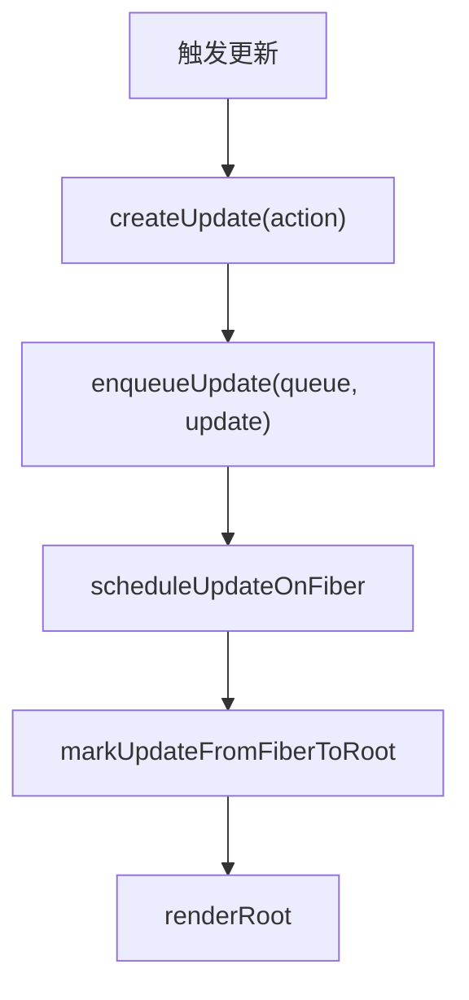

# 第4章：如何触发更新

## 本章定位

- **数据流定位**：消费 `updateContainer(element, root)` → 创建 HostRoot Update 并找到 FiberRoot → 调用 renderRoot；状态消费尚未接通。
- **难度**：★★★☆☆ —— 一次更新的入口链路，概念不多，但 lane、批处理、并发都从这条链路展开。
- **前置依赖**：第 3 章（FiberNode、`child/sibling/return` 与 `alternate` 连接点）。自检：能区分 ReactElement 与 Fiber；知道第 3 章的 `alternate` 还只是 `null` 字段。本章才创建 FiberRootNode、HostRoot Fiber 和第一对 WIP/current 记录。
- **读后检验**：能画出 `updateContainer` 从 element 入队到 renderRoot 的调用链；能指出这条链停在哪里，以及 `processUpdateQueue` 为什么尚未生效。

本章先回答 HostRoot 的入口问题：`updateContainer(element, root)` 如何把 element 包装成 Update、挂到 HostRoot Fiber 的 UpdateQueue，再找到 FiberRoot 并进入 renderRoot。公开 `root.render` 和 Hook setter 都还没有接入。

## 整体架构思路：保存更新意图，再从 Fiber 找到 root

本章输入是一个 ReactElement，但 work loop 的入口接收的是 FiberRoot。核心问题是：**如何把“根接下来要渲染这个 element”保存到 HostRoot Fiber，再从这棵树的入口启动 render？**

最直接的实现是 setter 立即计算状态并直接调用 render：

```ts
// 示意：让入口直接修改 HostRoot 状态
function updateContainer(element, root) {
	root.current.memoizedState = element;
	renderRoot(root);
}
```

它会导致：

- 触发意图与已计算状态混在一起，无法判断值来自队列消费还是直接写入。
- render 尚未开始，current 就已经被污染，不再是已提交快照。
- 后续若要积累多次更新，没有独立对象保存每次 action。

因此 React 把“更新意图”和“执行更新”分开：

- 触发阶段：创建 Update(action)，加入拥有状态的队列
- 找根阶段：从拥有队列的 HostRoot Fiber 得到 FiberRoot
- render 入口：基于 root.current 创建 WIP
- 状态计算：本章只定义 `processUpdateQueue`，尚未从 beginWork 调用

setter 触发时先保存“想怎样更新”，而不是立即计算并修改页面。UpdateQueue 记录意图，Fiber 标识意图属于谁，root 负责启动后续工作。

### Update 模型由哪些部分组成？

| 需要的能力           | 设计选择                                  |
| -------------------- | ----------------------------------------- |
| 延迟到 render 再计算 | Update 保存 `action`，不只保存结果        |
| 记录归属             | UpdateQueue 挂在 HostRoot Fiber 上        |
| 单条延迟计算         | `processUpdateQueue` 接收 action 与基准值 |
| 从局部回到全局       | 沿 Fiber.return 找到 HostRoot.stateNode   |

函数 action 尤其能说明为什么必须延迟计算：

```text
baseState = 0
pending.action = n => n + 1
processUpdateQueue(baseState, pending) -> 1
```

这里说明 action 可以延迟到消费函数执行；本章单槽 pending 不能同时保存两条 action，不能用它推导连续更新语义。

### HostRoot Fiber 与 FiberRoot 是两个对象

UpdateQueue 挂在 HostRoot Fiber 上，而 renderRoot 需要 FiberRoot 管理 current 与 container。因此入口先拿到 `root.current` 入队，再由 `scheduleUpdateOnFiber` 沿 return 确认顶层 Fiber，并读取它的 `stateNode`：

```text
HostRoot Fiber（拥有 UpdateQueue）
-> stateNode
-> FiberRootNode（拥有调度状态）
```

这解释了两个容易混淆的对象：Fiber 保存局部组件工作，FiberRootNode 保存整棵树的调度与提交状态。

### 本章的职责边界

Update 模型回答“变化如何被记录”，不直接回答“何时执行”和“怎样比较子节点”。第 14 章用 Lane 与微任务补充调度，第 18 章增加跳过与重放，第 10/12 章处理 reconcile。把这些问题分开，才能理解 UpdateQueue 为什么是架构接缝，而不是一个普通数组。

## 本章实现：一次更新如何到达 root？

### Update 生命周期账本

| 时刻     | 输入                      | 写入对象/字段                                         | 消费者                        | 结果                                 |
| -------- | ------------------------- | ----------------------------------------------------- | ----------------------------- | ------------------------------------ |
| 触发更新 | element、值或函数 action  | `Update.action`                                       | enqueueUpdate                 | 变化被保存为意图，而不是立即改 state |
| 加入队列 | Update                    | `UpdateQueue.shared.pending`                          | 尚未接通的 HostRoot beginWork | HostRoot 拥有一条待消费记录          |
| 向上找根 | 发生更新的 Fiber          | 沿 `return` 读取祖先，最终读取 HostRoot `stateNode`   | scheduleUpdateOnFiber         | 局部触发点被转换成 FiberRoot 入口    |
| 启动工作 | FiberRoot 与待处理 Update | `workInProgress = createWorkInProgress(root.current)` | 空 beginWork                  | 入口到达 WIP，但 Update 仍未消费     |

阅读本章源码时不要把 enqueue、找 root 和 render 混成一个“setState”。它们分别保存内容、解析执行范围和启动计算；第 14、18 章只会扩展队列与调度策略，不会改变这条职责链。

先看整条链的全貌：



这条「创建 Update → 入队 → 找 root → render」是本章要闭环的最小职责链。下面两节分别建立前半段（4-1 创建与入队）和后半段（4-2 找 root 与触发 render）；先按当前对象字段把链路走通，不在这里展开优先级与更新筛选。

### 4-1 实现状态更新机制

> **本节数据流**：action → `createUpdate` 写入 Update → `enqueueUpdate` 写入所属 queue；`processUpdateQueue` 已定义但尚未接到 render。

本步新增 `updateQueue.ts`：定义 `Update` 与 `UpdateQueue` 两个最小数据结构，并实现 `createUpdate` 与 `enqueueUpdate`。state 的变化从此有了统一载体：不立即计算，只登记意图。

#### 更新机制的组成部分

big-react 代码先从两个最小数据结构开始（示意：早期最小形态，只保存一个 action）：

```ts
// 示意：早期最小形态
interface Update<State> {
	action: Action<State>;
}

// 示意：早期最小形态
interface UpdateQueue<State> {
	shared: {
		pending: Update<State> | null;
	};
}
```

本章只有 `action` 和单个 `shared.pending`。它能证明“先把意图放进所属 Fiber”，但还不能证明 render 已经消费它；连续入队还会覆盖前一条记录。第 14 章才把 pending 改为环形队列。

##### Update

`Update` 表示一次变化意图。本章接入的是 HostRoot：`updateContainer` 传入的 ReactElement 被保存为 `action`。由于 HostRoot beginWork 仍为空，它还不会成为 HostRoot 的新 `memoizedState`。

##### UpdateQueue

`UpdateQueue` 挂在 Fiber 上。早期最小实现只是用 `shared.pending` 保存最新 Update（示意，连续更新会覆盖前一个）：

```ts
// 示意：早期最小形态，连续更新会覆盖前一个
updateQueue.shared.pending = update;
```

这意味着连续更新会覆盖，尚不能正确批处理。这个限制应保留为本章可观察结果，不能用后续的环形队列替它完成账本。

### 4-2 接入状态更新机制

> **本节数据流**：HostRoot Update 入队 → 从 HostRoot Fiber 找到 FiberRoot → renderRoot 创建根 WIP → 空 beginWork 无法继续。

本步把更新机制接到 renderRoot 入口：`fiberReconciler` 的 `updateContainer` 创建并入队 Update，`workLoop` 里沿 `return` 链向上找到 FiberRootNode，再由 `prepareFreshStack` 创建 HostRoot WIP。节点处理仍是空占位，因此本章只打通“到达 render”，没有打通“完成 render”。

#### HostRoot 的更新入口

本章直接从 reconciler 的 [updateContainer](../../packages/react-reconciler/src/fiberReconciler.ts) 入口观察 HostRoot 更新；公开的 `createRoot(...).render(...)` 要到第 6 章才接上（类型标注从简）：

```ts
export function updateContainer(element, root) {
	const hostRootFiber = root.current;
	const update = createUpdate(element); // updateQueue.ts

	enqueueUpdate(hostRootFiber.updateQueue, update);
	scheduleUpdateOnFiber(hostRootFiber); // workLoop.ts

	return element;
}
```

这段代码的设计含义：

- `root.current` 找到当前 Fiber 树的 HostRoot。
- `createUpdate` 把新的 element 包装成更新对象。
- `enqueueUpdate` 把更新放进 HostRoot 的队列。
- `scheduleUpdateOnFiber` 从当前 Fiber 向上找到 FiberRootNode 并直接调用 renderRoot；本章没有任务优先级与异步调度。

#### 为什么入口仍写成“从 Fiber 找 root”？

本章的 Update 挂在 HostRoot Fiber 上，理论上可以直接读取它的 `stateNode`。源码仍把查找写成沿 `return` 上溯的通用函数，是为了让调度入口只接收 Fiber，而不依赖调用者已经处于根节点。当前能够验证的是 HostRoot 这条路径；深层函数组件触发更新要到第 8 章接入。

当前源码的 [markUpdateFromFiberToRoot](../../packages/react-reconciler/src/workLoop.ts)只做「找 root」一件事：

```ts
function markUpdateFromFiberToRoot(fiber) {
	let node = fiber;
	let parent = node.return;
	while (parent !== null) {
		node = parent;
		parent = node.return;
	}
	if (node.tag === HostRoot) {
		return node.stateNode;
	}
	return null;
}
```

它沿 `return` 指针一路上溯到 HostRoot，再通过 `stateNode` 返回 FiberRootNode。本章只验证“从一个 Fiber 得到所属 root”，不讨论沿途优先级标记。

#### 根节点保存的通用信息

本章的 `FiberRootNode` 只保存三项跨更新信息：`container`、`current` 与 `finishedWork`。HostRoot Fiber 的 `stateNode` 指回 FiberRootNode，FiberRootNode 的 `current` 指回 HostRoot Fiber，形成双向入口。

把这些信息放在 root 上，而不是散落在全局变量中，可以支持多个 root：

```js
const rootA = createRoot(containerA);
const rootB = createRoot(containerB);
```

每个 root 都有自己的 `current` 与 `finishedWork`，因此两个 root 不会共用同一棵候选树。

#### 易错点

- 本章的 `pending` 只能容纳一个 Update，会覆盖更早的记录；不要误以为已经支持批处理。
- `scheduleUpdateOnFiber` 需要处理找不到 root 的情况。big-react 项目里可以开发环境告警并返回。
- HostRoot 的 state 可以理解为“当前 root 要渲染的 ReactElement”。

#### 本章入口实际停在哪里？

以 `updateContainer(element, root)` 为例：

```text
createContainer(container)
-> 创建 HostRoot Fiber 与 FiberRootNode
updateContainer(element, root)
-> createUpdate(element)
-> enqueueUpdate(hostRootFiber.updateQueue, update)
-> scheduleUpdateOnFiber(hostRootFiber)
-> markUpdateFromFiberToRoot：找 root
-> renderRoot
-> prepareFreshStack：创建 HostRoot WIP
-> workLoop：调用一次 beginWork
-> beginWork 返回 undefined，workInProgress 被写成 undefined，本次 renderRoot 直接结束
```

element 没有直接传给 work loop，而是先包装成 Update。当前收益只是触发处与状态计算函数解耦；由于 beginWork 尚未调用 `processUpdateQueue`，`shared.pending` 仍保留这条 Update，HostRoot.memoizedState 也没有变化。

#### action 为什么延迟计算？

独立调用 `processUpdateQueue` 时，值 action 会直接成为结果，函数 action 会接收传入的 `baseState`。因此 Update 可以保存计算规则，而不是在触发处提前写死结果。但本章 render 没有调用这个函数，讲义只能验证它的纯函数行为，不能声称页面或 HostRoot 状态已经更新。

#### 本章队列边界

本章的单槽 pending 只为验证“Update 属于哪个 queue、queue 属于哪个 Fiber、render 从哪里消费”这条最小链路。它不能保存两次 render 之间连续到达的多条 Update，因此不能据此推导完整批处理语义。第 14 章会在调度允许更新积累时，把该字段改成环形队列；环形指针的结构与归约过程留到那一章展开。

#### FiberRoot 与 HostRoot Fiber 的区别

| 对象             | 范围                 | 典型数据                                 |
| ---------------- | -------------------- | ---------------------------------------- |
| `FiberRootNode`  | 整个渲染根           | container、current、finishedWork         |
| `HostRoot Fiber` | Fiber 树的根工作单元 | memoizedState、updateQueue、child、flags |

`root.current` 从根对象进入 Fiber 树；`hostRootFiber.stateNode` 从树返回根对象。本章的 HostRoot 更新就在这两个对象之间完成入口转换。

## 与官方 React 的差异

| 能力     | big-react                                                                   | 官方 React                           |
| -------- | --------------------------------------------------------------------------- | ------------------------------------ |
| 更新来源 | 本章只接入 HostRoot 的 `updateContainer`；Hook dispatch 第 8 章加入         | 同样收敛到统一 Update 模型，入口更多 |
| 调度     | big-react 到第 14 章才引入 Lane 与微任务/Scheduler                          | 官方从一开始就有完整调度模型         |
| 批处理   | 本章单槽 pending 会丢连续更新，批处理要到第 14 章环形链表与调度接入后才成立 | 官方自动批处理覆盖更多场景           |

## 思考题

### Q1: Update 为什么保存 action，而不直接保存计算后的 nextState？

因为函数 action 需要以消费时拿到的 `baseState` 为输入。`createUpdate` 只保存 `{ action }`，`processUpdateQueue` 才判断它是值还是函数并生成 `memoizedState`。如果入队前就把函数替换成结果，Update 就失去了“基于 render 时状态计算”的语义。本章只验证单条 Update 的延迟计算；连续函数更新要等队列支持保存多条记录后再讨论。

### Q2: Update、UpdateQueue 和 Fiber 分别保存什么？

- Update 是一次变化意图，本章只有 `action`；
- UpdateQueue 通过 `shared.pending` 保存一条尚未消费的 Update；
- Fiber 提供队列所属的节点身份，本章实际使用的是 HostRoot Fiber。

以 `updateContainer(element, root)` 为例，element 被包装成 Update，进入 HostRoot Fiber 的 updateQueue。UpdateQueue 说明这条意图属于哪个状态源，FiberRoot 则提供 render 入口；二者不能合并成一个全局队列。本章状态消费尚未接通，所以 `memoizedState` 仍保持旧值。

### Q3: FiberRootNode 与 HostRoot Fiber 为什么要分成两个对象？

它们描述的是两个层级。`FiberRootNode` 管理整个渲染根，保存 container、当前树入口和未来的提交结果；HostRoot Fiber 是 Fiber 树里的第一个工作单元，保存这棵树根节点的 state、UpdateQueue、child 和遍历关系。

本章用双向引用把两个层级接起来：

```text
FiberRootNode.current ──────> HostRoot Fiber
FiberRootNode <────── HostRoot Fiber.stateNode
```

调用 `updateContainer` 时，`root.current` 让根对象进入 Fiber 树并找到 HostRoot 的 updateQueue；调度从任意 Fiber 沿 `return` 到达 HostRoot 后，又通过 `stateNode` 回到 FiberRootNode，取得 container 与整棵树的 render 入口。

如果只保留 HostRoot Fiber，container、current 和 finishedWork 等整棵树级别的数据会与节点工作混在一起；如果只保留 FiberRootNode，HostRoot 又无法像普通 Fiber 一样参与 beginWork、保存 state 和连接 child。多个 root 并存时，这种分层也让每棵树拥有独立的 current 与提交状态。

## 本章小结

React 不是每种更新来源写一套流程，而是把它们都收敛成 `Update -> UpdateQueue -> scheduleUpdateOnFiber`。本章用最小单 Update 打通入口，后续再加入 commit、环形队列、Lane 与真正调度。

不过，render 阶段本身还是空占位：从 `Update` 入队、找到 root 到触发 render 的骨架通了，但遍历 Fiber 树时每个节点具体做什么、宿主实例在哪里创建，还没有答案。第 5 章的 `beginWork`/`completeWork` 填上这一层。
