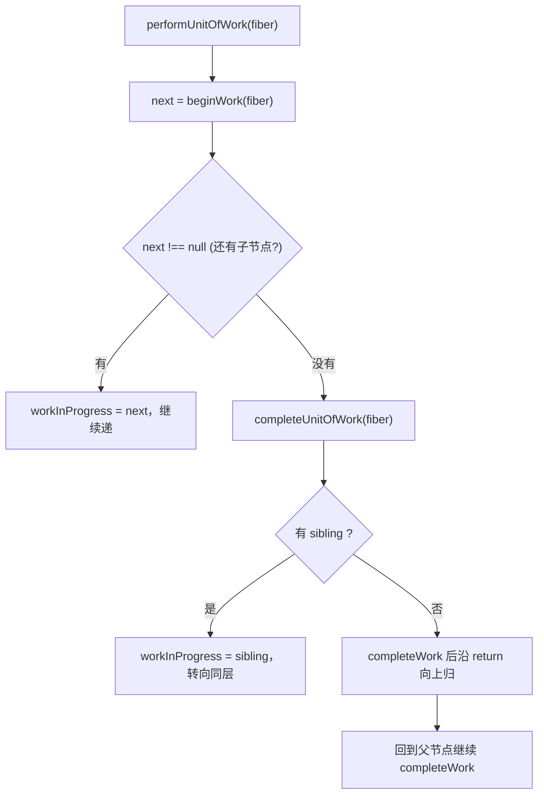

# 第5章：初探 mount 流程

## 本章定位

- **数据流定位**：定义单个 Fiber 的 begin/complete 处理规则 → 逐步写入 child、stateNode 与 subtreeFlags → 第 6 章用完整 work loop 驱动整棵树并提交。
- **难度**：★★★☆☆ —— render 阶段的“递”与“归”，是理解后续 diff、Hooks、commit 的基础。
- **前置依赖**：第 3 章（Fiber 架构、双缓存与 render/commit 两阶段概念）、第 4 章（Update 如何进入 root）。自检：知道 `child/sibling/return` 与 `alternate`；能说出 current/WIP 两棵树的区别。
- **读后检验**：能画出 `beginWork → completeWork` 的指针规则，并解释本章为什么还不能完成整棵树的首屏渲染。

本章开始实现 render 阶段。它先定义 HostRoot、HostComponent、HostText 三类 Fiber 在“递”与“归”阶段各做什么，并实现单 element、单文本的子 Fiber 创建。整棵树的循环与宿主实现尚未接通，因此这一章是在建立 mount 工作单元，而不是得到可运行的首屏页面。

## 整体架构思路：一次深度优先遍历分成递与归

有了 Fiber 数据结构，还需要定义 Fiber 树到底怎样执行。核心问题是：**如何把一次树递归拆成统一的工作单元，同时让父节点既能根据输入产生子节点，又能等子树完成后汇总结果？**

树节点天然有两类工作：

```text
进入节点时：读取 props/state，决定 children
离开节点时：children 已完成，创建或汇总宿主结果
```

如果把两者塞进一个函数，父节点要么在孩子尚未完成时创建 DOM，要么重新递归处理孩子，工作边界又回到不可控调用栈。Fiber 因此把一次节点处理拆成 [beginWork](../../packages/react-reconciler/src/beginWork.ts)和 [completeWork](../../packages/react-reconciler/src/completeWork.ts)：

| 阶段         | 遍历方向 | 已知信息                        | 主要工作                                    |
| ------------ | -------- | ------------------------------- | ------------------------------------------- |
| beginWork    | 父到子   | HostRoot/HostComponent 当前输入 | 消费根 Update 或宿主 children、返回 child   |
| completeWork | 子到父   | 子树已经完成                    | 创建宿主实例、append 子宿主节点、冒泡 flags |

beginWork 根据当前 Fiber 的输入生成或复用 child，completeWork 在 child 已完成后创建宿主结果并向父级汇总 flags。两段方向相反，却共同完成一次深度优先遍历。

### 为什么拆成 beginWork 和 completeWork？

对下面这棵树：

```jsx
<section>
	<span>A</span>
</section>
```

显式 work loop 的顺序是：

```text
begin section
begin span
begin text(A)
complete text(A)
complete span
complete section
```

这相当于把递归函数调用前的逻辑放进 begin，把递归返回后的逻辑放进 complete。上面是指针算法完整运行后的顺序；本章代码一次只执行一个工作单元，第 6 章把 `if` 改成 `while` 后才会在一次 render 中走完它。[performUnitOfWork](../../packages/react-reconciler/src/workLoop.ts)负责选择下一指针：有 child 就向下，没有 child 就完成当前并沿 return 回溯，遇到 sibling 再转向同层：



### mount 为什么也需要 reconcile？

mount 没有旧树可比较，但仍要把 children 输入转成 Fiber。本章的 `childFibers.ts` 只识别一个 ReactElement，或一个 string/number 文本，并写好新 Fiber 的 `return`；数组、Fragment 与多兄弟节点尚未支持。Reconciliation 不只等于“比较旧节点”，也包含把本次声明输入规范化成下一棵 Fiber 子树。

### 为什么宿主实例在 completeWork 创建？

HostComponent 的宿主实例需要包含已经完成的子宿主实例。complete 阶段子先于父，所以父实例可以一次创建，再通过 [appendAllChildren](../../packages/react-reconciler/src/completeWork.ts)收集宿主后代：

```text
HostComponent div
  -> HostComponent span
    -> HostText "hello"
```

本章树中只有宿主类型能够正常完成，因此 `appendAllChildren` 会把已完成的 span 实例追加给 div；span 内的文本已在 span 自己的 completeWork 中组装。代码保留了继续向非宿主 child 下钻的结构，但函数组件要到第 7 章才真正进入 begin/complete 流程。

### flags 为什么只记录、不执行？

render 可能失败、被更高优先级更新推翻，未来还可能被中断。因此 begin/complete 只能生成候选树和副作用说明，不能让用户看见半成品：

```text
render 输出 = finishedWork + flags
commit 输入 = 已完整计算的 finishedWork
```

`flags` 描述当前 Fiber 自身工作，`subtreeFlags` 是父节点对后代工作的摘要。摘要让 commit 不必逐个检查完全无副作用的子树。

## 本章实现：mount render 的递与归

### mount 对象生命周期账本

| 当前连接点                        | 输入                                   | 写入对象/字段                                     | 当前消费者                    | 结果                                      |
| --------------------------------- | -------------------------------------- | ------------------------------------------------- | ----------------------------- | ----------------------------------------- |
| prepareFreshStack                 | `root.current`                         | HostRoot WIP 与 `workInProgress`                  | 本章单次 workLoop             | 得到本轮根工作单元                        |
| 单次 begin HostRoot               | 根 Update 中的 ReactElement            | HostRoot `memoizedState/child`，子 Fiber `return` | 本次 performUnitOfWork        | `workInProgress` 只推进到 HostComponent   |
| HostComponent/HostText begin 规则 | 对应 Fiber 的 children 或文本          | 计划写 child 或返回 `null`                        | 本章入口不会再次调用 workLoop | 函数已经实现，但同一次 render 中不会到达  |
| complete 与冒泡规则               | 已完成的宿主后代、`flags/subtreeFlags` | `stateNode`、父 Fiber `subtreeFlags`              | 本章入口不会到达 complete     | hostConfig 也未实现，离屏子树尚未实际形成 |

因此 beginWork 的产物不是 DOM，而是下一层 Fiber；completeWork 的产物不是页面变化，而是离屏实例和副作用摘要。需要特别注意：本章 `workLoop` 每次只调用一次 `performUnitOfWork`，所以这些单元规则尚不能在一次调度中走完整棵树。

beginWork 向下递归，completeWork 向上回溯并收集 flags。

### 5-1 实现 mount 流程的 beginWork

> **本节数据流**：当前 WIP 的输入 → beginWork 计算 children → `reconcileChildren` 写入 `wip.child` 与 sibling/return → work loop 进入下一 Fiber。

本步实现 render 的递阶段：`beginWork` 按 Fiber tag 分发处理，向下产出子 Fiber。第 4 章只把更新意图送进队列，本步开始真正消费 ReactElement、产出 Fiber 树。

#### 更新流程的目的

render 阶段有两个目标：

1. 生成 `workInProgress` Fiber 树。
2. 在 Fiber 上标记副作用 `flags`。

副作用不是马上执行。render 阶段只负责“算出来应该做什么”，真正操作 DOM 要等 commit 阶段。

#### beginWork

`beginWork` 是递阶段。它处理当前 Fiber，并返回下一个要处理的子 Fiber。

对于：

```jsx
<A>
	<B />
</A>
```

进入 A 的 `beginWork` 时，协调器读取 A 的 current child 与新的 child ReactElement；本章 mount 时 current child 为 `null`，因此直接生成 B 对应的新 Fiber。

mount 时旧 child 为 `null`，所以直接创建新 Fiber：

```text
current child: null
new child:    ReactElement(B)
result:       FiberNode(B)
flag:         是否 Placement 取决于 shouldTrackEffects
```

##### HostRoot 的 beginWork 工作流程

HostRoot 的 state 是本次 root 要渲染的 ReactElement。流程：

1. 从 `updateQueue.shared.pending` 取出 pending update，并清空 `shared.pending`。
2. 调用 [processUpdateQueue](../../packages/react-reconciler/src/updateQueue.ts)计算 `memoizedState`。
3. 把 `memoizedState` 当作 `nextChildren`。
4. 调用 [reconcileChildren](../../packages/react-reconciler/src/beginWork.ts)创建子 Fiber。

当前源码 [updateHostRoot](../../packages/react-reconciler/src/beginWork.ts)的简化理解（省略类型标注）：

```ts
function updateHostRoot(wip) {
	const baseState = wip.memoizedState;
	const updateQueue = wip.updateQueue;
	const pending = updateQueue.shared.pending;
	updateQueue.shared.pending = null; // 本轮消费后清空

	const { memoizedState } = processUpdateQueue(baseState, pending);
	wip.memoizedState = memoizedState;
	reconcileChildren(wip, memoizedState);
	return wip.child;
}
```

##### HostComponent 的 beginWork 工作流程

HostComponent 对应真实宿主节点，例如 `div`、`span`。它的 children 来自 `pendingProps.children`。当前源码 [updateHostComponent](../../packages/react-reconciler/src/beginWork.ts)：

```ts
function updateHostComponent(wip) {
	const nextProps = wip.pendingProps;
	const nextChildren = nextProps.children;
	reconcileChildren(wip, nextChildren);
	return wip.child;
}
```

本章 mount 阶段只需要把 children 转成子 Fiber。

##### HostText 没有 beginWork 工作流程

文本节点没有子节点，所以 `beginWork` 返回 `null`：

```ts
case HostText:
  return null;
```

返回 `null` 后，work loop 会进入 `completeUnitOfWork`，开始归阶段。

#### pendingProps 何时成为 memoizedProps？

`performUnitOfWork` 调用 beginWork 后，会执行 `fiber.memoizedProps = fiber.pendingProps`。`pendingProps` 是本次准备处理的输入，`memoizedProps` 是这个工作单元已经使用过的输入。当前代码只完成字段交接，不会根据二者相等跳过工作；bailout 要到第 23 章才加入。

### 5-2 实现 mount 流程的 completeWork

> **本节数据流**：已完成的子 Fiber → completeWork 创建/组装 `stateNode` 并冒泡 flags → 父 Fiber 消费宿主后代 → 根得到完整 finishedWork。

本步实现归阶段：`completeWork` 为 HostComponent/HostText 创建宿主实例，并把 flags 沿树向上冒泡。

#### completeWork

`completeWork` 是归阶段。它在子节点都处理完之后执行，适合做两件事：

1. 为 HostComponent / HostText 创建宿主实例。
2. 向父节点冒泡 `subtreeFlags`。

##### HostText 的 completeWork

mount 时创建文本实例（[completeWork](../../packages/react-reconciler/src/completeWork.ts)：

```ts
const instance = createTextInstance(newProps.content);
wip.stateNode = instance;
```

`createTextInstance` 通过 `hostConfig` 抽象导入，但本章还没有提供具体宿主实现。因此这里能看懂 reconciler 需要什么端口，却还不能创建真实 DOM；第 6 章会实现 DOM 版本的 `createTextInstance` 与 `createInstance`。

##### 设计权衡：为什么不直接在 reconciler 里调用 DOM API？

那样 reconciler 就与 DOM 焊死：第 16 章的 noop renderer（在纯对象上跑同一套流程、供测试断言）和任何非浏览器宿主都无法复用。hostConfig 把「如何创建/插入/删除实例」倒置为宿主注入的端口，reconciler 只依赖端口签名——这也是第 1 章包依赖方向（reconciler 不依赖 react-dom）在代码层的落点。

##### HostComponent 的 completeWork

mount 时创建 DOM，并把所有子 DOM 插入进去：

```ts
const instance = createInstance(wip.type, newProps);
appendAllChildren(instance, wip);
wip.stateNode = instance;
```

这里的 `appendAllChildren` 会从当前 Fiber 的 child 开始向下找 HostComponent / HostText，把真实宿主节点插入父实例。`createInstance` 同样来自 hostConfig。

注意：这一步只是组装离屏 DOM，还没有插入 container。真正把根 Host 节点插到页面上，是 commit 阶段的 `Placement`。

#### completeWork 性能优化策略

归阶段会计算 `subtreeFlags`。[bubbleProperties](../../packages/react-reconciler/src/completeWork.ts)的示意（只展示 subtreeFlags 部分）：

```ts
function bubbleProperties(wip) {
	let subtreeFlags = NoFlags;
	let child = wip.child;

	while (child !== null) {
		subtreeFlags |= child.subtreeFlags;
		subtreeFlags |= child.flags;
		child.return = wip;
		child = child.sibling;
	}

	wip.subtreeFlags |= subtreeFlags;
}
```

本章的 `bubbleProperties` 只汇总 `flags/subtreeFlags`。这样父节点能知道后代是否存在提交工作，第 6 章的 commit 遍历会消费这个摘要。

### 5-3 用 completeWork 产物回看 render/commit 边界

5-1 写出了 child Fiber，5-2 写出了离屏 stateNode 和冒泡后的 flags。下面的设计结论都从这两个产物推导：mount 为什么仍要 reconcile、为什么宿主实例只能在归阶段组装，以及 flags 为什么必须留给下一章消费。

#### mount 阶段的 flags

本章最重要的是 `Placement`，它表示这个 Fiber 对应的宿主节点需要插入到宿主环境。

`Placement` 标记发生在 child reconciler 中，但不是所有新建 Fiber 都各自标记。HostRoot 已有 current alternate，因此它调用 `reconcileChildFibers`（shouldTrackEffects=true，`packages/react-reconciler/src/childFibers.ts`），顶层新 child 通过 `placeSingleChild`（`childFibers.ts`）标 Placement；新建 HostComponent 自己没有 alternate，它内部调用 `mountChildFibers`（false），后代不重复标记，先由 `appendAllChildren`（`completeWork.ts`）组装。

不要在 render 阶段执行插入操作。render 阶段未来会支持中断，如果边 render 边改 DOM，一旦中断就会出现页面和 Fiber 状态不一致。

#### 本章一次 workLoop 实际写入什么？

调用 `scheduleUpdateOnFiber(HostRoot)` 后，`prepareFreshStack` 先创建 HostRoot 的 WIP。随后本章的 `workLoop` 只有一次 `if`，因此这次只执行 HostRoot：

```text
HostRoot.updateQueue.pending.action = ReactElement(div)
processUpdateQueue
-> HostRoot.memoizedState = ReactElement(div)
reconcileChildren
-> HostRoot.child = HostComponent(div)
performUnitOfWork
-> workInProgress = HostComponent(div)
```

此时 div 还没有执行 beginWork，更没有进入 HostText 与 completeWork。`renderRoot` 随后还调用了尚未定义的 `commitRoot`，而 `completeWork` 导入的 hostConfig 也没有具体实现，所以本章源码不能独立完成构建与运行。它写出的是各类 Fiber 的单元规则；第 6 章才补齐循环、DOM hostConfig 和 Placement 提交。

#### flags 与 subtreeFlags 的分工

`flags` 描述当前 Fiber 自己的工作，`subtreeFlags` 汇总后代是否有工作。commit 遍历先用 subtreeFlags 决定要不要进入子树，再用 flags 处理自身。这等价于给副作用树建立一个低成本索引，避免每次提交扫描完整 Fiber 树。

#### 为什么要拆成 beginWork 与 completeWork？

树计算同时包含两类方向相反的工作：父节点的输入决定有哪些 children，必须自上而下；父 DOM 要组装完整子树，必须等 children 完成后自下而上。因此一个 Fiber 单元天然分成：

- beginWork：消费当前输入，计算/复用 child Fiber，返回下一工作单元。
- completeWork：children 已完成，创建或更新宿主实例，汇总子树信息。

这不是为了把函数写短，而是把树算法的“前序决策”和“后序汇总”显式化。时间切片以后，work loop 在两个阶段之间仍知道如何恢复。

#### mountChildFibers 为何不跟踪 Placement？

这里容易产生一句看似矛盾的话：“mount 的节点都要插入，为什么 mount reconciler 不标 Placement？”关键是区分根节点首次 render 与某个新建父 Fiber 的 children：

- HostRoot 虽是首次展示，但 WIP HostRoot 有 current alternate；它的 child 是要插入现有 container 的边界，需要跟踪 Placement。
- 一个刚创建 HostComponent 内部的 children 会在 `appendAllChildren` 阶段直接组装进这个尚未上屏的父实例；若每个后代再各自 Placement，会重复插入。

[childReconciler(shouldTrackEffects)](../../packages/react-reconciler/src/childFibers.ts)将“构建结构”和“是否记录提交副作用”分离。同一套协调逻辑可用于 mount 与 update，只切换副作用追踪策略。

## 与官方 React 的差异

| 能力     | big-react                                                                                                                       | 官方 React                                           |
| -------- | ------------------------------------------------------------------------------------------------------------------------------- | ---------------------------------------------------- |
| 属性处理 | mount 时通过 hostConfig 创建实例；第 10 章接入 update 标记链路，但课程正文未实现 className/style 等普通 DOM 属性更新            | 官方有完整属性 diff 与事件 props 校验                |
| 遍历方式 | 本章 `workLoop` 还是单次 `if` 起步形态；`while` 循环第 6 章到位，第 18 章改名 `workLoopSync` 并接入并发                         | 官方同步/并发 work loop 并存                         |
| 支持类型 | 本章只有 HostRoot/HostComponent/HostText；第 7 章加入 FunctionComponent，第 13 章加入 Fragment，第 22 章加入 Suspense/Offscreen | 官方还有 ClassComponent、Portal、Profiler 等更多 tag |

## 思考题

### Q1: beginWork 和 completeWork 为什么必须拆开？

父组件先提供 children，工作才能向下展开，所以 beginWork 必须自上而下；父宿主节点只有等全部子节点完成后才能组装实例并汇总 flags，所以 completeWork 必须自下而上。work loop 把这两个方向组合成非递归深度优先遍历：beginWork 返回 child，没有 child 时进入 completeUnitOfWork。若只保留向下阶段，父节点拿不到完整子树；若先做向上工作，children 尚未计算，根本没有可组装对象。

### Q2: mount 没有旧树，为什么仍需要 reconcile children？

因为协调不只意味着比较旧节点，还包括把声明输入转成 Fiber。本章的 `childFibers` 会识别单个 ReactElement 或文本，创建对应 Fiber，设置 `return`，并根据 `shouldTrackEffects` 决定是否标记 Placement。mount 没有 current child 可复用，也没有旧 child 需要删除，但仍需要完成这次“输入对象 → 工作单元”的转换。数组与 key 匹配是第 12 章扩展的多节点规则，不是本题成立的前提。

### Q3: HostComponent 为什么在 completeWork 而不是 beginWork 创建实例？

completeWork 执行时，它的所有后代已经完成，`appendAllChildren` 可以一次性把最外层宿主后代组装进新实例。这样整棵 DOM 子树可以先在离屏状态构造，commit 只需把顶层宿主节点接到 container。若 beginWork 一进入节点就创建并连接 DOM，子树尚未完成，而且 render 的中断或失败会提前影响页面。创建离屏实例和把实例暴露到宿主树是两件事，前者可在 completeWork，后者必须等 commit。

## 本章小结

本章建立了 mount 的单个工作单元规则：

- beginWork 递：根据输入创建子 Fiber
- completeWork 归：创建宿主实例并冒泡副作用
- commitWork 提交：本章只有调用位置，尚未定义实现

从这一章开始，Fiber 不再只是字段集合：HostRoot 这一个工作单元已经能消费 Update 并产出 child，其他 begin/complete 规则也已写出。但 work loop 仍只执行一次，不能把这些规则串成完整 mount。

本章实际执行只停在 HostRoot.child，尚未得到完整 `finishedWork`；hostConfig 与 `commitRoot` 也没有实现。第 6 章补齐完整循环、DOM hostConfig 与 Placement 提交后，首屏 mount 才形成可运行闭环。
