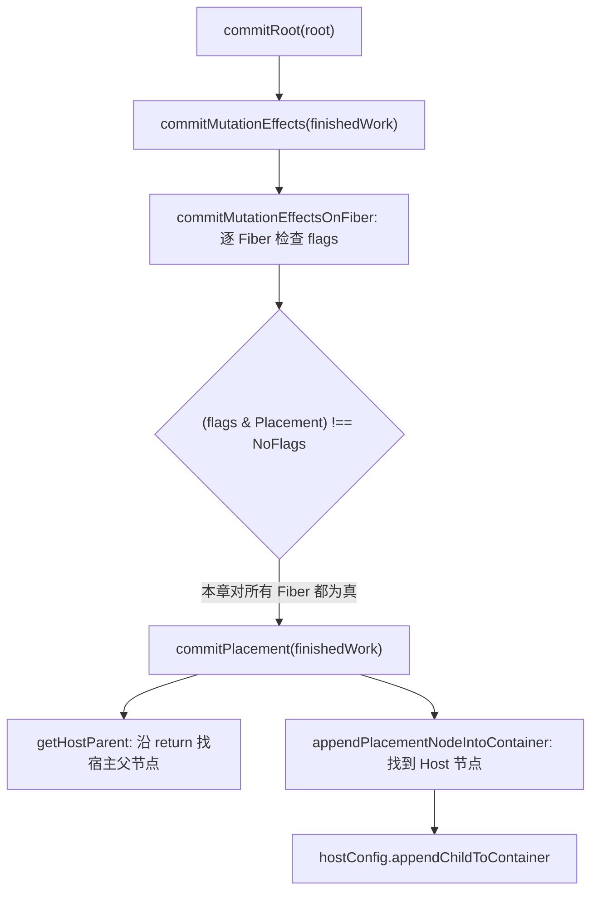

# 第6章：初探 ReactDOM

## 本章要解决的问题

第5章结束时，Fiber 树上已经标好了“这里需要插入”（`Placement`），但页面上什么都没变——container 还是空的。最直接的做法是让 `beginWork` 一遇到 `<div>` 就直接调 `document.createElement` 插进页面，但这样会把两件事焊在一起：一是“什么时候可以让用户看见变化”，二是“reconciler 要不要知道 DOM 长什么样”。本章要建立的正是把这两件事拆开的机制：render 阶段只负责算出“要做什么”，commit 阶段才真正调用浏览器 API 把它做出来，而 reconciler 本身完全不认识 `document`。

## 本章定位

- **数据流定位**：消费 finishedWork 与 Fiber flags → 产出宿主环境操作（DOM 插入与 current 切换）→ 结果成为用户可见 UI，effect/ref 由第 15/20 章接续。
- **难度**：★★★☆☆ —— render/commit 边界与 hostConfig 适配，概念清晰但接口较多。
- **前置依赖**：第 3 章（render/commit 两阶段概念）、第 5 章（beginWork/completeWork、Placement 标记）。自检：知道 Placement 在哪个阶段产生；能说出 finishedWork 与 current 的关系。
- **读后检验**：能画出 `commitRoot → commitMutationEffects → commitPlacement → hostConfig` 的调用链，并解释为什么 commit 必须独立于 render。
- **本章实现边界**：本章只做 mutation 子阶段的 `Placement`，beforeMutation/layout 只是空占位；`hostConfig` 只实现创建和追加，插入/删除/更新要到第 10-12 章才加入。还有一个必须留意的真实 bug：`NoFlags` 被定义成 `1` 而不是 `0`，导致“是否有 Placement”的判断本章恒为真——第 7 章才修正。下文不再逐句重复这条边界。

本章把 reconciler 和浏览器连接起来。前几章已经能生成带 `Placement` 标记的 Fiber 树，但还没有真正把 DOM 插入页面。`react-dom` 的职责就是提供浏览器宿主环境的实现，并在 commit 阶段执行 DOM 操作。本章分四步：6-1 建立 commit 阶段入口，6-2 实现 mutation 子阶段与 Placement 执行，6-3 创建 react-dom 包与打包配置，6-4 用文档中的挂载片段核对公开调用链。

## 整体架构思路：render 记录变化，commit 执行宿主操作

```jsx
root.render(
	<section>
		<span>hello</span>
	</section>
);
```

render 结束时，HostRoot 下已经有完整 WIP Fiber 和离屏宿主实例，但 container 仍是空的。先预测：Placement 应标在哪个 Fiber、commit 怎样找到 container、插入 section 后为什么不需要再单独把 span 插入 container。这个案例贯穿 `commitRoot → commitMutationEffects → commitPlacement → hostConfig`。

render 已经算出“哪些节点需要插入”，但计算结果怎样安全地变成页面变化？核心问题是：**如何让宿主修改既保持 UI 一致性，又不让 reconciler 绑定浏览器实现？**

最直接的方案是在 beginWork 中遇到 `<div>` 就调用 `document.createElement` 并插入页面。它有两个根本缺陷：

- render 尚未完成就暴露 DOM；后续出错、中断或被替换时，页面已经处于半提交状态。具体设想一下：如果一棵树有 `<section><span>A</span><span>B</span></section>`，render 到一半时（比如 `section` 和第一个 `span` 已经插入页面，第二个 `span` 还没算完）恰好抛出异常或被更紧急的更新打断——用户会看到一个只有半截内容的页面，而 React 内部却完全不知道该怎么把这个“半成品”清理干净、退回上一次正确的状态。
- reconciler 直接依赖 DOM，同一算法无法运行在 noop、Native 或其他宿主环境。

React 因此同时建立两个边界：时间上的 render/commit 边界，以及空间上的 reconciler/renderer 边界。这两个边界经常被当成一回事，但它们其实回答的是两个不同的问题——“什么时候能让用户看见”是时间问题，“谁负责真正调用宿主 API”是空间问题。本章接下来的每一步实现，都能归到这两个边界里的某一个。

### React 内部三个阶段

一次更新可以分成三段：

```text
schedule 阶段：决定什么时候执行更新
render 阶段：生成 work-in-progress Fiber 树并标记 flags
commit 阶段：执行 flags 对应的宿主操作
```

本章主要关注 commit 阶段。render 阶段已经把“需要插入什么”标在 Fiber 上，commit 阶段要找到这些 Fiber，并调用宿主环境 API。

## 本章实现：从 createRoot 到首次挂载

本章目标是把 render 算出的 `Placement` 变成真实 DOM 插入。四节的分工是一条链：6-1 建立 `commitRoot` 这个 commit 入口；6-2 遍历 mutation 标记并真正执行 Placement；6-3 创建 `react-dom` 包，用 DOM hostConfig 与 `createRoot` 把这条链接入浏览器；6-4 调试首次挂载，核对整条链路。贯穿全章的设计原则只有一条：**reconciler 不直接碰任何浏览器 API，宿主操作全部通过 hostConfig 注入**——这也是后续能换成 noop renderer 的前提。`Update` 和 `ChildDeletion` 虽已作为 flag 常量存在，但执行逻辑要到第 10 章才加入。

### 6-1 实现 commit 阶段

> **本节数据流**：render 产出的 finishedWork → `commitRoot` 读取 flags → 分发到各提交子阶段 → 完成后切换 `root.current`。

这一步建立 commit 阶段的入口 `commitRoot`（`packages/react-reconciler/src/workLoop.ts`）：render 完成后取出 `finishedWork`，用 `MutationMask`（`Placement | Update | ChildDeletion`）进入 mutation 遍历，再把 `root.current` 切换为 finishedWork。beforeMutation/layout 只保留注释位置。入口顺序已经成立，但内部按位判断尚不正确——这就是本章定位里提到的那个真实 bug，值得单独说清楚：

本章 [fiberFlags.ts](../../packages/react-reconciler/src/fiberFlags.ts)把 `NoFlags` 定义为 `0b0000001`，Placement 是 `0b0000010`。**按位运算的正常预期是：`NoFlags` 应该是全 0，这样`flags & Placement`只有在真的包含 Placement 时才非零。**但本章 `NoFlags` 被写成了 `1`（不是 `0`），于是 `(flags & Placement)` 只可能是 `0` 或 `2`，两者都满足 `!== NoFlags`——这个判断从数学上就已经恒为真，不管这个 Fiber 到底有没有被标记 Placement，`subtreeFlags` 的判断同样失效。第 7 章把 `NoFlags` 改为 `0` 后，这套比较才真正代表“位集合为空”。本章因此还不能验证“flags 剪枝生效”，只能验证“commit 遍历能走到每个 Fiber”。

#### 为什么 commit 必须独立于 render？

render 操作的是内存候选状态，可重做；commit 操作的是外部世界，通常不可逆。二者风险不同：

| 阶段     | 允许中断/重做 | 主要产物            | 是否应运行用户可见副作用 |
| -------- | ---------------- | ---------------------- | ---------------------------- |
| schedule | 可以重新安排  | 任务                | 否                       |
| render   | 可以          | WIP、flags          | 否                       |
| commit   | 通常同步完成  | DOM/ref/layout 状态 | 是                       |

commit 只有在整棵 WIP 已经完成后才开始。这并不意味着所有 DOM 操作在物理上同时发生，而是 React 不在中间把控制权交还给浏览器，让用户观察到逻辑上的半棵新树。

### 6-2 实现 Mutation 子阶段

> **本节数据流**：逐 Fiber 计算 `(flags & Placement) !== NoFlags` → 本章该条件恒为真 → 每个 Fiber 都调用 commitPlacement → DOM append 移动已有节点 → 顶层宿主节点最终进入 container。

这一步在 `packages/react-reconciler/src/commitWork.ts` 实现 mutation 子阶段和 `commitPlacement`，并声明抽象 `hostConfig` 模块。设计上应只进入带 Placement 的 Fiber，当前却会对全树调用；宿主父节点与 append 的实现仍可按实际调用链阅读。

#### commit 阶段的 3 个子阶段

React 的 commit 阶段分为：

1. beforeMutation 阶段
2. mutation 阶段
3. layout 阶段

big-react 本章只进入 mutation 阶段，并且只执行 `Placement`。beforeMutation 与 layout 仍是 `commitRoot` 中的注释位置，没有对应遍历函数。

`commitMutationEffects` 位于 `packages/react-reconciler/src/commitWork.ts`。其他子阶段当前没有实现，本章不展开其内部时序。

#### 执行 Placement

`Placement` 的核心问题是：当前 Fiber 可能不是 HostComponent。比如 FunctionComponent 自己没有 DOM，它的子树里才有 DOM。

commitPlacement 的目标步骤是：

1. 找到宿主父节点。
2. 从当前 Fiber 向下找所有顶层 Host 节点并追加。

“找到插入前的宿主 sibling 并 insertBefore”是第 12 章处理移动时才加入的步骤。

由于前面那个 `NoFlags` 判断恒真的 bug，HostText/HostComponent 即使已经在 completeWork 中追加到离屏父实例，也会再次被 `commitPlacement` 处理一遍；DOM 对已有 child 的 `appendChild` 语义是“移动”而不是“复制”，所以首次挂载常常还是能得到正确的最终结构，只是会多执行一些没必要的宿主操作。HostRoot 也会进入 commitPlacement，只是找不到宿主父节点并直接返回。

##### 找宿主父节点

[getHostParent](../../packages/react-reconciler/src/commitWork.ts)从当前 Fiber 的 `return` 指针向上找：

```ts
function getHostParent(fiber) {
	let parent = fiber.return;

	while (parent) {
		if (parent.tag === HostComponent) return parent.stateNode;
		if (parent.tag === HostRoot) return parent.stateNode.container;
		parent = parent.return;
	}

	return null;
}
```

##### 插入宿主节点

如果当前 Fiber 是 HostComponent 或 HostText，直接插入；否则继续遍历它的子树。本章的 [appendPlacementNodeIntoContainer](../../packages/react-reconciler/src/commitWork.ts)只有追加语义，不查找宿主 sibling；第 12 章实现移动时再增加 insertBefore 分支。

```ts
function appendPlacementNodeIntoContainer(finishedWork, hostParent) {
	if (finishedWork.tag === HostComponent || finishedWork.tag === HostText) {
		appendChildToContainer(hostParent, finishedWork.stateNode);
		return;
	}

	const child = finishedWork.child;
	if (child !== null) {
		appendPlacementNodeIntoContainer(child, hostParent);
		let sibling = child.sibling;
		while (sibling !== null) {
			appendPlacementNodeIntoContainer(sibling, hostParent);
			sibling = sibling.sibling;
		}
	}
}
```

#### Placement 怎样找到插入位置？

本章支持的树节点只有 HostRoot、HostComponent 和 HostText。`getHostParent` 沿 `return` 向上，遇到 HostComponent 就取它的 `stateNode`，遇到 HostRoot 就取根对象的 `container`。随后 `appendPlacementNodeIntoContainer` 找到待插入的 HostComponent/HostText 并调用 hostConfig。

即使当前节点已经是 HostComponent，仍不能把“Fiber 父节点”直接等同于 DOM 父节点：顶层 HostComponent 的 Fiber 父节点是 HostRoot，而实际插入目标是 HostRoot 保存的 container。

#### hostConfig 如何隔离宿主环境？

本章代码可以分成两部分：

```text
宿主无关
  Fiber 遍历、flags 检查、Placement 决策

宿主相关
  创建 DOM、创建文本、追加到 container
```

`hostConfig` 是两者之间的接口：reconciler 只调用抽象函数，`react-dom` 用浏览器 API 实现。本章 Rollup 配置通过 alias 把抽象模块指向 DOM 实现，因此 reconciler 源码不需要 import `document` 或 `react-dom`。

### 6-3 实现 ReactDOM

> **本节数据流**：DOM container 与 ReactElement → `createContainer/updateContainer` 进入 reconciler → DOM hostConfig 消费提交意图 → 浏览器节点发生变化。

这一步创建 `react-dom` 包：DOM 版 hostConfig、`createRoot` 入口与 Rollup 打包配置，把 reconciler 真正接到浏览器。

#### DOM hostConfig 具体实现什么？

DOM hostConfig 把协议中的抽象类型和操作翻译成浏览器概念：

```ts
type Container = Element;
type Instance = Element;
type TextInstance = Text;
```

创建和插入能力对应 DOM API（本章进度下，`packages/react-dom/src/hostConfig.ts`）：

```ts
export const createInstance = (type, props) => {
	// TODO 处理props
	const element = document.createElement(type);
	return element;
};

export const appendInitialChild = (parent, child) => {
	return parent.appendChild(child);
};

export const createTextInstance = (content) => {
	return document.createTextNode(content);
};

export const appendChildToContainer = appendInitialChild;
```

两个细节：`createInstance` 当前只创建元素，还没有应用 props；`appendChildToContainer` 直接复用 `appendInitialChild`，因为本章只有追加语义。更新、删除和移动会在对应章节扩展 hostConfig，本章不提前列出接口终态。

#### createRoot

`react-dom/client` 暴露的入口是 [createRoot](../../packages/react-dom/src/root.ts)：

```ts
export function createRoot(container) {
	const root = createContainer(container);

	return {
		render(element) {
			updateContainer(element, root);
		}
	};
}
```

本章的 `createRoot` 只做 container 与 root 的关联；`listenToAllSupportedEvents(container)` 的事件委托调用在第 11 章接入。

`createContainer` 与 `updateContainer` 在 `packages/react-reconciler/src/fiberReconciler.ts`。这里有两个 root：

- DOM container：浏览器页面中的真实根节点。
- FiberRootNode：React 内部保存更新状态的根对象。

`createRoot` 的工作是把它们关联起来。

#### 打包 ReactDOM

本章新增浏览器包的构建。打包 `react-dom` 时，alias 把 reconciler 中的 `hostConfig` 指向 `packages/react-dom/src/hostConfig.ts`。

Rollup alias 让 reconciler 中可以统一写：

```ts
import { createInstance } from 'hostConfig';
```

但最终打到不同 renderer 时替换成不同实现。

#### 设计边界

`react-dom` 本章做的事：

- 创建 DOM。
- 创建文本节点。
- 把已组装的宿主子树追加到 container。

`react-dom` 不应该做的事：

- 计算 Fiber diff。
- 决定 Hooks 如何运行。
- 决定 update 优先级。

这些仍属于 reconciler。

#### 本章的 renderer 协议

| reconciler 需要的能力    | DOM hostConfig 的实现      |
| -------------------------- | ------------------------------ |
| `createInstance`         | `document.createElement`   |
| `createTextInstance`     | `document.createTextNode`  |
| `appendInitialChild`     | 离屏父实例的 `appendChild` |
| `appendChildToContainer` | container 的 `appendChild` |

这张表就是当前协议的全部范围。它已经足够证明 reconciler 只表达“创建、追加”，renderer 再翻译成 DOM API。

### 6-4 调试 ReactDOM

> **本节数据流**：文档内挂载输入 → 构建后的 ReactDOM 公开入口 → 观察 container 子树 → 验证 root、render、commit、hostConfig 已连成闭环。

这一步补齐 `react-dom/client` 子路径入口并改造 demo，从 `root.render` 到页面 DOM 的调用链第一次接通。最终结构可出现，但中间包含全树误执行 Placement 的额外操作：

```text
root.render(element)
-> updateContainer / scheduleUpdateOnFiber
-> renderRoot
   -> completeWork(HostText)
      -> hostConfig.createTextInstance
   -> completeWork(HostComponent)
      -> hostConfig.createInstance
      -> hostConfig.appendInitialChild
-> 得到 finishedWork
-> commitRoot
-> commitMutationEffects
-> commitPlacement
-> getHostParent
-> appendPlacementNodeIntoContainer
-> hostConfig.appendChildToContainer
```

`commitRoot` 在 `packages/react-reconciler/src/workLoop.ts`；`commitMutationEffects`、`commitPlacement`、`getHostParent`、`appendPlacementNodeIntoContainer` 都在 `packages/react-reconciler/src/commitWork.ts`。commit 阶段的决策路径：



这里有两类宿主操作：

- completeWork 创建和预组装尚未接入页面的 DOM 子树。
- commit 把顶层宿主实例插入当前页面 container。

因此更精确的说法不是“render 绝对不碰 DOM 对象”，而是“render 不应修改当前用户可见的已提交宿主树”。真正使用 `document.createElement`、`appendChild` 的是 DOM hostConfig，但调用时机和目标 Fiber 由 reconciler 决定。

## 与官方 React 的差异

| 能力            | big-react                                                                                             | 官方 React                                   |
| --------------- | ---------------------------------------------------------------------------------------------------------- | -------------------------------------------------- |
| hostConfig 接口 | 本章只实现创建/追加，插入/删除/更新在第 10–12 章加入                                                | 协议更完整，包含上下文对象、可见性切换等 |
| commit 子阶段   | 本章只有 mutation；第 15 章加入 passive effect 收集与调度，第 20 章加入 layout/ref 阶段             | 同样分阶段，另有更多内部回调点           |
| 属性更新        | 第 10 章接入 commitUpdate（只有 HostText 完整）；课程正文未实现 className/style 等普通 DOM 属性更新 | 有完整属性 diff 与事件 props 刷新        |
| flags 判空      | `NoFlags = 1` 导致 Placement/MutationMask 判断恒真；第 7 章改成 0                                   | 空 flags 使用 0，按位 mask 能正确剪枝        |

## 思考题

### Q1: completeWork 已经创建 DOM，为什么还说 render 不修改页面？

因为“创建离屏实例”和“把实例连接到可见 container”是不同副作用边界。completeWork 可以调用 `createInstance/createTextInstance` 并在新实例内部组装 children，但这些节点尚未挂到页面；current 与用户可见 DOM 仍保持不变。commitPlacement 才通过 append/insert 把完成的宿主子树接入 container。这个区分让 render 可以丢弃候选实例，而无需回滚已经展示的界面。

### Q2: flags 和 subtreeFlags 如何把 render 结果交给 commit？

设计上，新 child 的 Placement 写入自身 flags，completeWork 再把它汇总到祖先 subtreeFlags；commit 应用 subtreeFlags 跳过无副作用子树，再用 flags 处理自身。本章字段写入和冒泡已存在，但 `NoFlags = 1` 使两个 `!== NoFlags` 判断恒真，实际不会剪枝，并会对无 Placement 的 Fiber 也调用 commitPlacement。第 7 章把 NoFlags 改为 0 后，表述中的索引语义才与执行结果一致。

### Q3: hostConfig 为什么是 renderer 提供、reconciler 消费？

reconciler 知道“需要创建宿主实例”或“需要把实例追加到 container”，却不应知道具体 DOM API。renderer 实现 `createInstance`、`createTextInstance` 和 append 接口，构建时再注入 reconciler。这样核心流程只依赖抽象操作，不会在协调代码里出现 `document.createElement`。

## 本章小结

第六章接通了 finishedWork、mutation 遍历、hostConfig 与 root.current 切换，页面首次能出现宿主树；同时 `NoFlags` 取值让 Placement 判定失效，提交会做多余工作。这里应分别记住“阶段边界已接通”和“flags 消费尚未正确”，不能用最终 DOM 掩盖中间错误。

不过，这棵树里还不能有「组件」：`beginWork` 只认 HostRoot/HostComponent/HostText，遇到函数直接无路可走。让函数组件进入 Fiber 系统，是第 7 章。
