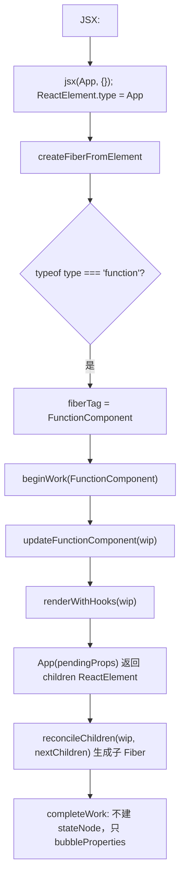

# 第7章：初探 FunctionComponent 与第二种调试方式

## 本章要解决的问题

`<div>` 这样的宿主节点，可以对应一个真实存在的 DOM 元素；但 `function App() {...}` 这样的函数组件呢？函数执行完，局部变量就没了，根本没有一个“实例”能像 DOM 元素那样长期存在。可 React 又必须记住“这里曾经渲染过 App”，以后 App 还要有自己的状态（Hooks，下一章的内容）。本章要解决的就是：没有宿主实例的函数组件，要靠什么被 React 长期追踪？答案仍然是 Fiber——只是这一次，`stateNode` 是空的。

## 本章定位

- **数据流定位**：消费 FunctionComponent 类型 Fiber → 在 beginWork 中产出组件返回的 ReactElement → 交给后续 reconcile；为第 8 章 Hooks 建立执行前提。
- **难度**：★★★☆☆ —— 第一次让 Fiber 处理「没有宿主实例」的组件类型，并为 Hooks 建立执行上下文。
- **前置依赖**：第 3 章（FiberNode/双缓存/工作单元）、第 5 章（beginWork/completeWork 递归与回溯）、第 6 章（ReactDOM 挂载与 commit）。自检：能说出 beginWork 对 HostComponent 做了什么；知道 Fiber 的 tag 字段如何决定 beginWork 的行为；能画出一次 mount 的递归过程。
- **读后检验**：能画出「JSX → ReactElement → FunctionComponent Fiber → 执行组件 → children → 子 Fiber」的调用链；能解释函数组件为什么没有宿主 stateNode 却仍是「组件实例」。
- **本章实现边界**：`renderWithHooks` 本章只做三件事——取组件函数、取 props、调用并返回 children，没有 Hook 链表、没有 Dispatcher，那些要到第 8 章才加入。本章还顺手修了一个第 6 章遗留的 bug：`NoFlags` 从 `1` 改成 `0`。下文不再逐句重复这条边界。

本章支持函数组件。到目前为止，reconciler 只能处理 HostRoot、HostComponent、HostText；但官方 React 应用主要由组件组成。FunctionComponent 的本质是一个函数：输入 props，返回 ReactElement。

## 整体架构思路：函数负责计算，Fiber 保存组件身份

```jsx
function App({ name }) {
	return <div>{name}</div>;
}

root.render(<App name="big-react" />);
```

先区分这里同时出现的四样东西：`App` 函数、`<App />` 产生的 ReactElement、FunctionComponent Fiber，以及 `<div>` 对应的 Host Fiber。App 的局部变量会在函数返回后消失，但组件身份、未来 Hook 状态和树位置都必须继续存在；本章要建立的正是这层 FunctionComponent Fiber。

### 函数组件如何进入 Fiber 系统？

宿主节点可以对应一个 DOM 实例，但函数组件没有可长期持有的 JavaScript 实例。核心问题是：**React 怎样让一个普通函数参与持久化 Fiber 树、产生子结构，并为之后的状态能力提供归属？**

函数组件本身具有值语义：

```ts
const children = Component(props);
```

每次 render 都重新调用函数，局部变量也重新创建。如果只把它当作语法宏，直接用返回值替换组件节点，会丢失几个重要边界：

- DevTools、错误定位和组件级更新需要知道“这是哪个组件”。
- 后续状态能力需要一个跨函数调用保存数据的归属对象。
- 调度和组件级优化也需要逻辑工作单元，而不能依附某个 DOM。
- 一个组件与它返回的宿主节点不是同一种身份。

因此 FunctionComponent 仍然拥有 Fiber，只是 `stateNode` 通常为空：

```text
ReactElement.type = App
-> FunctionComponent Fiber（本章保存组件身份、输入与树位置）
-> 执行 App(props)
-> 返回 children ReactElement
-> reconcileChildren 生成子 Fiber
```

**“函数组件没有实例”是一句容易被误解的话**——它只是说函数组件没有类似 class 组件或 DOM 那种公开的 `stateNode`，不代表 React 完全不记得这个组件曾经存在过。真正持久保存组件身份的，就是这个 FunctionComponent Fiber：它比函数调用本身活得久，跨越多次 render，是后面 Hook 状态、`memo`、`bailout` 全部机制唯一能挂靠的地方。

### 为什么组件在 beginWork 执行？

beginWork 的职责是根据当前输入决定下一层 children。函数组件恰好是 `props -> children` 的计算，所以它自然发生在 begin 阶段；complete 阶段则不再执行组件，只负责等待子树完成并冒泡工作。

这也解释了 render 必须保持纯度的约束：组件函数的职责是根据 props 计算 children，不能把“执行了一次”当作 DOM 已经提交。修改宿主环境不属于本章函数组件执行链。

### 组件、Fiber 与返回节点的关系

```jsx
function App() {
	return <div>hello</div>;
}
```

会同时存在：

| 对象             | 职责                           |
| ---------------- | ------------------------------- |
| `App` 函数       | 定义如何由 props 计算 children |
| App Fiber        | 保存组件身份、输入与树位置     |
| div ReactElement | 本次函数执行产生的声明结果     |
| div Fiber        | 协调 div 的工作记录            |
| HTMLDivElement   | commit 后的宿主实例            |

“函数组件没有实例”只表示没有类似 class/DOM 的公开 `stateNode`，不表示 React 没有保存它。真正持久的内部工作单元就是对应 Fiber。本章实际用到的结构是：

```text
FunctionComponent Fiber
├── type: App
├── pendingProps
├── child / sibling / return
├── flags / subtreeFlags
└── alternate -> 上一次提交的 App Fiber
```

## 本章实现：函数组件如何进入 render？

本章要把函数组件带进 render 阶段，分两步：7-1 在 beginWork 里增加 FunctionComponent 分支，让组件函数在 render 期间被执行、返回的 children 继续参与 Fiber 树构建——从此函数组件与宿主节点走同一条遍历流程；7-2 建立第二种调试方式（Vite alias 直接消费包源码），后续章节的源码改动都能直接在 demo 里验证，不用每次都重新构建。

本章还有一项容易被忽略、但会直接影响案例结果的修正：`fiberFlags.ts` 把 `NoFlags` 从 `1` 改为 `0`。第 6 章遗留的 `(flags & Placement) !== NoFlags` 判断，因为 `NoFlags` 被错误定义为 `1`，从数学上就恒为真——不管有没有 Placement，判断结果都一样。这一改动之后，`NoFlags` 才第一次真正等于“空的位集合”，commit 也就第一次能正确区分“这个 Fiber 有没有 Placement”，不再对每个 Fiber 都误执行插入。这不是函数组件专属字段，却是本章函数组件 mount 能按 flags 正常提交的前提。

### 7-1 实现 FunctionComponent

> **本节数据流**：函数 type 的 ReactElement → FunctionComponent Fiber → beginWork 执行组件并得到 children → child reconciler 写入后代 Fiber。

#### 如何支持 FC？

JSX：

```jsx
function App() {
	return <div>hello</div>;
}

root.render(<App />);
```

经过 JSX runtime 后：

```js
jsx(App, {});
```

此时 `ReactElement.type` 是函数。创建 Fiber 时可以据此判断（示意）：

```ts
if (typeof type === 'function') {
	fiberTag = FunctionComponent;
} else if (typeof type === 'string') {
	fiberTag = HostComponent;
}
```

真实判断在 [createFiberFromElement](../../packages/react-reconciler/src/fiber.ts)：`FunctionComponent` 是默认 tag，`typeof type === 'string'` 时才改为 `HostComponent`，写法上把上面第一个分支折叠成了默认值。

FunctionComponent 的 `beginWork` 逻辑（示意）：

```ts
function updateFunctionComponent(wip) {
	const nextChildren = renderWithHooks(wip);
	reconcileChildren(wip, nextChildren);
	return wip.child;
}
```

真实实现在 [beginWork.ts](../../packages/react-reconciler/src/beginWork.ts)的 `updateFunctionComponent` 与 [fiberHooks.ts](../../packages/react-reconciler/src/fiberHooks.ts)的 `renderWithHooks`：核心仍是「执行组件函数 → 拿到 children → 协调 children」。

这就是函数组件最核心的运行方式：调用函数，拿到 children，再继续协调 children。

#### FunctionComponent 与 HostComponent 的差异

HostComponent：

- 对应真实宿主节点。
- `stateNode` 是 DOM 或 noop instance。
- `completeWork` 会创建宿主实例。
- commit 阶段可能执行 DOM 更新。

FunctionComponent：

- 不对应真实宿主节点。
- `stateNode` 通常为 `null`。
- `completeWork` 只需要冒泡 flags。
- 真正的 DOM 在它的子树里。

因此插入 FunctionComponent 时，commit 不能直接插入它自己，而要向下找到 HostComponent / HostText。

#### 组件执行时机

函数组件在 render 阶段执行，而不是 commit 阶段执行。原因是组件返回的 ReactElement 会影响 Fiber 树结构，必须先完成协调，才能知道 commit 阶段要做什么。反过来想会更清楚：如果组件改成在 commit 阶段才执行，`commitMutationEffects` 遍历到 `App` 这个 Fiber 时才第一次调用 `App(props)`，可它返回的 `<div>hello</div>` 这时候连对应的 Fiber 都还没创建——commit 阶段读的是“已经算好、带 flags 标记”的 Fiber 树，此时临时冒出一个全新的 `div` Fiber，既没有走过 `beginWork` 生成，也没有被标记该不该插入、该不该更新。整套“先算完、标好、再统一执行”的机制会直接失效。

执行顺序可以这样看：

```text
HostRoot beginWork
  App FunctionComponent beginWork -> App(props)
    div HostComponent beginWork
      HostText beginWork
      HostText completeWork
    div completeWork
  App completeWork
HostRoot completeWork
commitRoot
```

#### `renderWithHooks` 本章实际做了什么？

名字里虽然有 Hooks，但本章实现只有三步：从 WIP 取出组件函数，从 WIP 取出 props，调用函数并返回 children。它没有设置全局渲染上下文，也没有读写 `Fiber.memoizedState`。第 8 章会在这个统一入口内加入 mount 阶段的 Hook 保存逻辑。

#### 组件执行与协调是两步

`updateFunctionComponent` 不应把函数返回值直接变成 DOM：

```text
Component(pendingProps)
-> 返回单个 ReactElement / 文本 / null
-> reconcileChildren(wip, children)
-> 生成 child Fiber
```

[reconcileChildren](../../packages/react-reconciler/src/beginWork.ts)在 update 入口走 `reconcileChildFibers`、mount 入口走 `mountChildFibers`（都在 `packages/react-reconciler/src/childFibers.ts`）。本章二者都只会创建单个 element 或文本 Fiber，还没有真正的复用、删除和移动；关键边界是组件函数只产生声明结果，不直接操作 DOM。

#### 本节调用链

```text
createFiberFromElement
-> element.type 是 function
-> tag = FunctionComponent
beginWork(FunctionComponent)
-> renderWithHooks（执行 Component）
-> Component(pendingProps)
-> reconcileChildren
completeWork(FunctionComponent)
-> 不创建 stateNode，只 bubbleProperties
```



### 7-2 实现第二种调试方式

> **本节数据流**：Vite alias 请求包名 → 直接解析 `packages/` 源码 → 浏览器执行本章调用链 → 修改源码后立即观察 Fiber/DOM 结果。

第一种调试方式是构建后在外部项目里引用 `dist`。它能模拟真实 npm 包，但每次改源码都要重新 build。

第二种方式是 Vite 源码调试。

#### 为什么用 Vite？

- 在开发阶段编译速度快于`webpack`
- `vite`的插件体系与`rollup`兼容

需要注意 Vite 的依赖预构建缓存。如果切换官方 React 和 big-react 后行为不对，启动调试页时可加 `--force` 强制刷新。这个参数解决的是缓存问题，不是源码构建问题。

#### Vite 配置

本章 Vite 配置通过 alias 直接消费 `packages/` 下的 `react` 和 `react-dom` 源码，修改源码后能更快看到效果。

```js
export default defineConfig({
	resolve: {
		alias: [
			{ find: 'react', replacement: resolvePkgPath('react') },
			{ find: 'react-dom', replacement: resolvePkgPath('react-dom') },
			{
				find: 'hostConfig',
				replacement: path.resolve(
					resolvePkgPath('react-dom'),
					'./src/hostConfig.ts'
				)
			}
		]
	}
});
```

#### 两种源码调试方式的取舍

- 构建 `dist` 再由外部项目引用，最接近真实包入口，适合验证发布边界。
- Vite alias/workspace 直接联调，反馈快，适合在 beginWork、Hook 等热路径打断点。

当前两种方式解决不同问题：Vite alias 适合快速跟踪源码调用链，构建 dist 适合检查公开包入口是否可被正常解析。源码运行正常但 dist 失败时，应优先检查 Rollup 入口与产物；二者都失败时，再回到共享源码逻辑。

## 与官方 React 的差异

| 能力                    | big-react                                                                                 | 官方 React                                |
| ----------------------- | --------------------------------------------------------------------------------------------- | -------------------------------------------- |
| FC 的 stateNode         | 无宿主实例，`stateNode` 为空                                                              | 同样没有公开实例，stateNode 为空      |
| updateFunctionComponent | 执行 renderWithHooks 后走统一 reconcile；第 22 章接入 Suspense，第 23 章接入 memo/bailout | 逻辑一致，另外还有更完整的开发期检查  |
| 调试配套                | Vite alias 让调试页直接消费源码；讲义案例不依赖独立 demo                                  | 没有教学配套，通常使用 React DevTools |
| dev 期错误              | 少量（如 hook 在组件外调用）                                                              | 有完整的 Hooks 规则检查与警告         |

## 思考题

### Q1: ReactElement.type 是函数时，系统如何把它变成可执行工作？

`createFiberFromElement` 读取 ReactElement.type：字符串对应 HostComponent，函数沿用默认的 FunctionComponent tag，并把函数保存到 Fiber.type、props 保存到 pendingProps。work loop 进入这个 Fiber 的 beginWork 后，`updateFunctionComponent` 调用本章已经存在的 `renderWithHooks(wip)`；它当前只是执行 `Component(pendingProps)`。返回值不会直接变成 DOM，而是交给 `reconcileChildren` 创建下一层单个 element 或文本 Fiber。完整链路是“element → FunctionComponent Fiber → 执行函数 → child 描述 → child Fiber”。

### Q2: 函数组件没有 DOM，为什么仍必须有 Fiber？

Fiber 首先代表逻辑身份和工作，不只代表宿主实例。FunctionComponent Fiber 虽然没有 DOM `stateNode`，仍保存组件函数 `type`、本轮 `pendingProps` 以及 child/sibling/return；beginWork 靠 type 执行组件，work loop 靠树指针继续遍历返回值，completeWork 再把后代 flags 向上冒泡。它产生的 DOM 由后代 Host Fiber 持有并在 commit 中处理。删掉这层 Fiber，就无法在树中保留“App 组件”和“App 返回的 div”这两个不同工作单元。

### Q3: 组件函数为什么在 beginWork 而不是 completeWork 执行？

beginWork 的职责是根据当前 Fiber 的输入计算下一层 children，函数组件的返回值正是这份输入。`updateFunctionComponent` 读取 Fiber.type 与 pendingProps，调用组件后立即把 children 交给 reconcileChildren，work loop 才知道应向下进入哪个 Fiber。completeWork 发生在 children 全部完成之后，只适合处理归阶段信息。把函数调用放到 completeWork 会形成“没有 children 就不能向下、没有向下又等不到 complete”的循环依赖。

### Q4: App Fiber 和 App 返回的 div Fiber 分别代表什么？

App Fiber 是 `FunctionComponent` 工作单元，代表 App 这段组件逻辑的身份、输入和后续状态归属；App 返回的 div Fiber 是 `HostComponent` 工作单元，代表 renderer 要创建的宿主实例。前者的 `stateNode` 为空，后者的 `stateNode` 指向 DOM，但它们通过 child/return 共同处于一棵 Fiber 树。本章只打通函数组件 mount，会为返回描述创建新 child Fiber；第 10 章才根据 key/type 复用已有 Fiber。区分这两个 Fiber，才能避免把“组件执行”误认为“直接创建 DOM”。

### Q5: 怎样判断问题发生在“组件执行”还是“宿主提交”？

先检查 ReactElement.type 是否保存为 Fiber.type、Fiber.tag 是否为 FunctionComponent，再看 `renderWithHooks` 是否收到正确 pendingProps 并返回预期 children。若这些正确，再检查 `reconcileChildren` 是否创建了对应 Host Fiber；最后才检查 Host Fiber 的 stateNode 与 Placement 提交。这样能把“函数没有执行”“函数输出没有变成 Fiber”“Fiber 没有变成 DOM”三类问题分开。本章不需要借助事件、state update 或 bailout 才能完成判断。

### Q6: 为什么项目同时使用 Rollup 和 Vite？能否只用其中一个？

两者在本项目中承担的不是同一种任务：Rollup 根据包入口生成 `dist`，验证公开文件、模块格式和 package.json；Vite 通过 alias 直接加载 `packages/` 源码，提供浏览器开发服务器和快速反馈。因此一次源码修改在 Vite 中可立即观察，但这不能证明构建产物的入口正确；反过来，Rollup 成功也不能替代交互调试。

技术上可以只保留一种工具：Vite 的库模式底层同样使用 Rollup，也能配置库产物；Rollup 配合开发服务器也能联调。但“能做到”不等于职责更清楚。课程把发布边界验证与源码联调分开配置，排错时能先判断问题属于源码逻辑还是消费方式，而不是因为某个工具天然不能完成另一项工作。

## 本章小结

FunctionComponent 的实现非常朴素：创建对应 Fiber，在 `beginWork` 调用函数，协调函数返回的 children。它没有 DOM 实例，却是 Hooks 和性能优化的核心承载点。理解这一点，下一章的 Hooks 链表就很好落位。

不过，函数组件现在只是一次性的纯计算：没有状态，没有记忆，每次执行都从零开始。让函数「记住」东西，是第 8 章的 Hooks。
