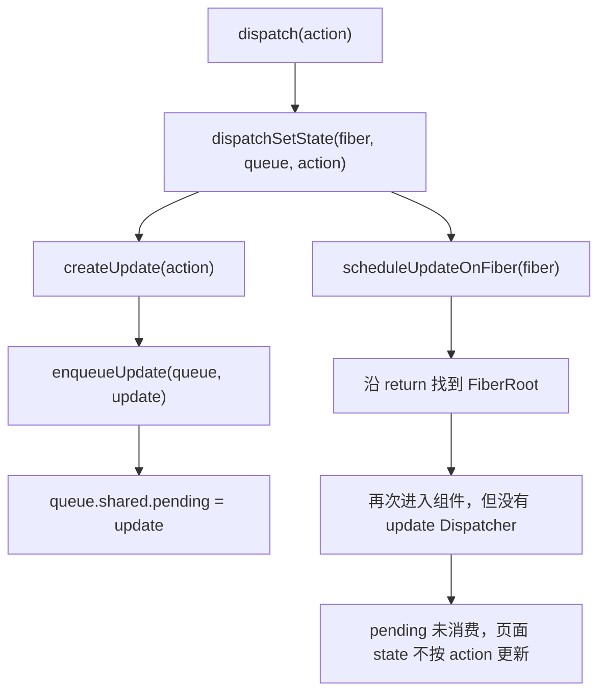

# 第8章：实现 useState

## 本章定位

- **数据流定位**：函数组件调用 `useState` → Dispatcher 选择 mount 实现 → 创建 Hook 与 UpdateQueue → dispatch 将 Update 入队并把更新送往 root。
- **难度**：★★★☆☆ —— 第一个把 Fiber、状态、更新队列和调度连接起来的 Hook。
- **前置依赖**：第 3 章的 Fiber/alternate、第 7 章的 FunctionComponent。自检：能说出函数组件在 `beginWork` 中执行，执行结果是新的 children。
- **读后检验**：能画出 FunctionComponent Fiber 下的 Hook 链；能解释 mount 时多个 Hook 怎样按调用顺序追加；能说清 dispatch 闭包捕获了什么，以及本章为何还不能完成状态更新。

本章只抓住一个核心事实：**state 不保存在函数局部变量里，而是写入该组件 Fiber 的 Hook 链表。** 当前代码只完成首次 mount；跨 render 复用旧 Hook 是第 10 章的内容。

> **本章实现边界**：本章主线只讲 mount 时如何创建 Hook，以及 dispatch 如何把 Update 放入队列。下一轮 render 如何克隆旧 Hook、消费 Update 并算出新 state，在第 10 章展开；多 Update、Lane、baseQueue 与 eagerState 分别在第 14、18、23 章补齐。

## 整体架构思路：状态属于 Fiber，不属于函数调用

先阅读下面的代码，不急着看实现：

```tsx
function App() {
	const [count] = useState(() => 0);
	const [name] = useState('big-react');

	return <p>{name + ': ' + count}</p>;
}
```

这段代码只依赖第 7 章已有的 FunctionComponent mount，不需要事件系统，也不要求 update 流程已经完成。首次渲染应该得到：

```html
<p>big-react: 0</p>
```

带着三个问题继续：

1. 两次 `useState` 调用产生的 state 保存在哪里？
2. React 怎样知道 `0` 和 `"big-react"` 属于两个不同的 Hook？
3. `useState` 没有接收 Fiber 参数，它怎样知道当前状态属于 `App`？

本章会用一条 Hook 链、两个临时游标和 Dispatcher 回答这三个问题。setter 与 UpdateQueue 仍会作为数据结构的一部分建立，但本章不把“调用 setter 后页面更新”作为可运行结果。

先看一个无法成立的 `useState`：

```ts
function useState(initialState) {
	let state = initialState;
	return [state, (nextState) => (state = nextState)];
}
```

局部变量只能活在这次函数执行中。下一轮 render 重新调用组件，新的 `state` 又会从 `initialState` 开始。

把状态放进以组件函数为 key 的 Map 也不行：

```jsx
<>
	<Counter />
	<Counter />
</>
```

这里有两个 `Counter` 实例，却只有一个 `Counter` 函数。组件类型不能唯一表示组件实例；Fiber 表示“这个组件在树中的这个位置”，因此可以承担实例身份：

```text
组件类型 Counter       不能唯一定位 state
树中的 Counter Fiber   可以唯一定位组件实例
Fiber 上第 N 个 Hook   可以定位该实例的第 N 份状态
```

所以状态的归属关系是：

```text
FunctionComponent Fiber
  -> Hook 0
  -> Hook 1
  -> Hook 2
```

## 本章实现：useState 的 mount 调用链

先把本章关键字段放在同一张图里：

```text
Hook.memoizedState   这个 Hook 本轮已经得到的 state
Hook.updateQueue     两次 render 之间到达的更新意图
Hook.next            同一组件的下一个 Hook
Fiber.memoizedState  Hook 链表入口
Fiber.return         dispatch 后从组件 Fiber 找到 root
```

三个不同的 `memoizedState` 很容易混淆：

| 所属对象                                   | 含义                           |
| ------------------------------------------ | ------------------------------ |
| HostRoot Fiber 的 `memoizedState`          | root 当前要渲染的 ReactElement |
| FunctionComponent Fiber 的 `memoizedState` | 第一个 Hook，即 Hook 链表入口  |
| Hook 的 `memoizedState`                    | 这个 Hook 本轮得到的 state     |

Hooks 没有另建一套组件系统，而是把函数组件的状态协议嵌入 Fiber render。下面两节分别建立这张图的两部分：8-1 建立 Hook 链表与 Dispatcher，8-2 建立 state、queue 与 dispatch。

### 8-1 实现 Hooks 架构

#### Hook 链表与调用顺序

FunctionComponent Fiber 的 `memoizedState` 指向第一个 Hook，每个 Hook 通过 `next` 连接：

```text
App Fiber.memoizedState
  |
  v
Hook 0: count
  memoizedState: 0
  updateQueue: Queue 0 ----> setCount
  next
  |
  v
Hook 1: name
  memoizedState: "big-react"
  updateQueue: Queue 1 ----> setName
  next: null
```

React 不使用变量名 `count`、`name` 识别 Hook。变量名经过编译、压缩后并不可靠，运行时真正稳定的是调用顺序：第 N 次 Hook 调用对应链表中的第 N 个 Hook。

这就是 Hooks 不能条件调用的结构原因：

```tsx
if (visible) {
	useState('A');
}
useState('B');
```

第一次 render 执行两个 Hook，第二次 render 若跳过第一个 Hook，`useState('B')` 就会占据第 0 个调用位置，与上次保存 A 的 Hook 对齐。后续所有 Hook 都会错位，不只是少保存了一个值。

#### Dispatcher 为什么必要？

用户始终调用同一个 `useState`，但 mount 和 update 的内部工作不同。先区分当前已有职责与缺失职责：

```text
本章已有：mount 时创建 Hook、初始 state、queue 和 dispatch
本章缺失：update 时找到旧 Hook、消费 queue、计算新 state（第 10 章补齐）
```

公共 [useState](../../packages/react/index.ts)不直接实现任何一种算法，它只读取当前 Dispatcher：

```ts
export const useState = (initialState) => {
	const dispatcher = resolveDispatcher();
	return dispatcher.useState(initialState);
};
```

[renderWithHooks](../../packages/react-reconciler/src/fiberHooks.ts)在执行组件前读取 `wip.alternate`。本章只在 mount 分支安装行为表，实际边界是：

```text
首次 mount                   currentDispatcher.current = HooksDispatcherOnMount
update（wip.alternate 存在） 分支为空，没有安装 update Dispatcher
组件执行结束                 只清 currentlyRenderingFiber，Dispatcher 仍指向 mount 表
```

因此“组件外调用一定抛错”在本章并不成立：第一次组件 mount 前 Dispatcher 为 null，`resolveDispatcher` 会报错；mount 后它没有被清空，再调用 `useState` 可能继续进入 `mountState`。同时 `workInProgressHook` 也没有复位，非法调用甚至可能把新 Hook 接到上一条链上。这些是当前源码缺口，不应被理想 Dispatcher 模型掩盖。

Dispatcher 本质上是一张由 reconciler 注入的“阶段行为表”。它同时解决两个问题：

- 用户不需要给 `useState` 传入当前 Fiber 或 mount/update 标志。
- `react` 包只暴露稳定 API，不需要直接依赖 reconciler 的具体实现。

reconciler 写入 Dispatcher，`react` 包读取 Dispatcher，因此双方必须共享同一个对象引用。[shared/internals.ts](../../packages/shared/internals.ts)就是这层内部共享通道。

#### 对象生命周期账本：两个 Hook 怎样形成？

回到最小案例：

```tsx
const [count] = useState(() => 0);
const [name] = useState('big-react');
```

| 时刻                   | `currentlyRenderingFiber` | `workInProgressHook` | `App Fiber.memoizedState` | 结果                                               |
| ---------------------- | ------------------------- | -------------------- | ------------------------- | -------------------------------------------------- |
| 进入 `renderWithHooks` | App Fiber                 | `null`               | `null`                    | 建立本次 Hooks 执行上下文                          |
| 第一次 `useState` 后   | App Fiber                 | Hook 0               | Hook 0                    | 保存 `count=0` 和 Queue 0                          |
| 第二次 `useState` 后   | App Fiber                 | Hook 1               | Hook 0                    | Hook 0 的 `next` 指向 Hook 1                       |
| App 执行结束           | `null`                    | Hook 1               | Hook 0                    | Hook 链保留；Hook 游标与 mount Dispatcher 都未重置 |

这里存在两类生命周期：

- `currentlyRenderingFiber` 是本次 render 期间使用的临时上下文；本章结束时会清空它。
- Fiber、Hook、queue 是跨 render 保存的数据。

本章源码却没有把另外两个临时值收口：`workInProgressHook` 没有置回 `null`，`currentDispatcher.current` 也没有清空。因此它目前不能正确支撑多个函数组件依次建立各自的 Hook 链，也不能可靠阻止组件执行窗口之外的 Hook 调用。第 10 章接入 update Hook 时会补游标重置与 update Dispatcher；本章只记录当前结果。

#### 本节源码阅读路线

按调用链读源码，不需要从 `fiberHooks.ts` 第一行顺序读到最后一行：

```text
updateFunctionComponent        beginWork.ts
  -> renderWithHooks           fiberHooks.ts
  -> useState                  react/index.ts
  -> resolveDispatcher         react/src/currentDispatcher.ts
  -> mountState                fiberHooks.ts
  -> mountWorkInProgressHook   fiberHooks.ts
  -> dispatchSetState          fiberHooks.ts
```

| 函数                             | 本章只回答什么                          |
| -------------------------------- | --------------------------------------- |
| `renderWithHooks`                | 当前 Fiber 和 Dispatcher 在何时生效     |
| `useState` / `resolveDispatcher` | 公共 API 怎样找到 reconciler 的实现     |
| `mountWorkInProgressHook`        | 新 Hook 怎样接入 Fiber 链表             |
| `mountState`                     | state、queue、dispatch 怎样组成一组     |
| `dispatchSetState`               | setter 调用后怎样保存 Update 并触发调度 |

#### renderWithHooks 建立 Hooks 执行上下文

`renderWithHooks` 在执行组件前设置当前 Fiber 和 Dispatcher：

```ts
function renderWithHooks(wip) {
	currentlyRenderingFiber = wip;
	wip.memoizedState = null;

	const current = wip.alternate;
	if (current !== null) {
		// update：本章为空
	} else {
		currentDispatcher.current = HooksDispatcherOnMount;
	}

	const Component = wip.type;
	const children = Component(wip.pendingProps);

	currentlyRenderingFiber = null;
	// 本章没有重置 workInProgressHook/currentDispatcher.current
	return children;
}
```

> 上面保留的是本章结束时的实际分支。8-1 时 Dispatcher 赋值还是注释态，行为表随 8-2 的 mountState 一起生效。

执行组件前设置 Fiber 上下文，是因为用户写的 `useState(0)` 没有显式传入 Fiber。当前代码只清理 `currentlyRenderingFiber`，所以“组件执行窗口结束后临时上下文全部失效”仍是尚未满足的约束。

### 8-2 实现 useState

#### 第一步：创建并串联 Hook

[mountWorkInProgressHook](../../packages/react-reconciler/src/fiberHooks.ts)每调用一次就创建一个 Hook。第一个 Hook 成为 Fiber 的链表入口，后续 Hook 追加到 `next`：

```ts
if (workInProgressHook === null) {
	workInProgressHook = hook;
	currentlyRenderingFiber.memoizedState = hook;
} else {
	workInProgressHook.next = hook;
	workInProgressHook = hook;
}
```

`workInProgressHook` 始终指向刚创建的 Hook，因此同一个组件内连续调用 `useState` 时，可以沿同一条链顺序追加。本章只有 useState，不提前引入其他 Hook 类型。

#### 第二步：创建 state、queue 与 dispatch

[mountState](../../packages/react-reconciler/src/fiberHooks.ts)完成四件事：

1. 取得本次调用对应的 Hook。
2. 计算初始 state；函数初始值只在 mount 时调用。
3. 为该 Hook 创建独立 UpdateQueue。
4. 创建绑定 Fiber 与 queue 的 dispatch。

```ts
function mountState(initialState) {
	const hook = mountWorkInProgressHook();
	const memoizedState =
		initialState instanceof Function ? initialState() : initialState;

	const queue = createUpdateQueue();
	hook.memoizedState = memoizedState;
	hook.updateQueue = queue;

	const dispatch = dispatchSetState.bind(null, currentlyRenderingFiber, queue);
	queue.dispatch = dispatch;
	return [memoizedState, dispatch];
}
```

> 上面只保留本章已经写入的 state、queue 与 dispatch；队列扩展留到对应章节再讲。

一组 useState 可以记成：

```text
Hook      保存“已经算出的 state”
Queue     保存“尚未处理的更新意图”
Dispatch  负责“把新意图放进这个 Queue，并通知这个 Fiber”
```

#### 第三步：为后续更新建立 dispatch

组件执行结束后，`currentlyRenderingFiber` 会清空。未来调用 setter 时，dispatch 不能再读取这个临时变量，所以 `mountState` 提前把 Fiber 与 queue 绑定进闭包：

```ts
dispatchSetState.bind(null, fiber, queue);
```

setter 被调用后的内部链路如下。第 8 章只负责把这条链搭到调度入口；再次 render 时 `renderWithHooks` 的 update 分支为空，不会消费这条 Hook Update：



本章的队列还是单个 pending 槽，后到的 Update 会覆盖先到的 Update。第 14 章会把它改成环形链表，才能保存同一批次内的多个 action。

#### dispatch 当前写入什么？

`mountState` 创建 dispatch 时绑定本次 FunctionComponent Fiber 与当前 Hook 的 queue：

```ts
const dispatch = dispatchSetState.bind(null, fiber, queue);
queue.dispatch = dispatch;
```

组件结束后调用它，当前代码会创建 `{ action }`、覆盖写入 `queue.shared.pending`，再从绑定的 Fiber 找到 root。它不会直接修改 `hook.memoizedState`。再次 render 时，`updateFunctionComponent` 仍会调用 `renderWithHooks`，但后者的 update 分支没有安装 update Dispatcher，也没有消费旧 Hook queue；因此这里只能验证“Update 被写入正确 queue”，不能验证页面状态变化或 setter 跨 render 的稳定性。

#### 本节边界与常见误解

- 初始 state 最终写在 Hook 上，不保存在 `currentlyRenderingFiber` 这个临时变量中。
- setter 不直接改 `Hook.memoizedState`；它创建 Update、写入 queue、触发调度。
- Hook 使用链表的关键原因是顺序匹配与渐进构造，不是“链表在所有场景都更快”。
- Fiber 的 `memoizedState` 在不同 tag 上含义不同；FunctionComponent 上才是 Hook 链入口。
- 本章只建立 mount 与 dispatch。update 时为什么要克隆 Hook、怎样消费 queue，在第 10 章补齐。
- 单槽 pending 会覆盖更早的 Update，本章不能演示连续更新。
- `workInProgressHook` 与 mount Dispatcher 尚未在组件结束后重置，本章案例应限制为一个函数组件的首次 mount，不能把组件外非法调用保护视为已闭环。

## 与官方 React 的差异

| 能力          | big-react 本章                                     | 官方 React                                       | 后续是否补齐                                                    |
| ------------- | -------------------------------------------------- | ------------------------------------------------ | --------------------------------------------------------------- |
| Dispatcher    | 只建立 mount 侧分发，结束后未清空；update 分支为空 | 覆盖 mount、update、rerender，并限制组件外调用   | 第 10 章补 update Dispatcher 与游标重置；课程未补完整开发期校验 |
| Hook 数据     | 以 `memoizedState/updateQueue/next` 建立最小链表   | 还要保存跳过更新、重放与更多 Hook 类型所需的数据 | 第 18 章补 `baseState/baseQueue`                                |
| UpdateQueue   | 单个 pending 槽，只能保存一个待处理 Update         | 环形队列保存多个 Update，并与优先级模型协作      | 第 14 章补环形队列，第 18 章补优先级跳过与重放                  |
| Update 优先级 | 本章的 Update 尚不区分 Lane                        | 每个 Update 带优先级，render 可选择性处理        | 第 14 章接入 Lane，第 18 章接入并发筛选                         |
| eager state   | setter 统一入队并调度                              | 可提前计算结果，相同 state 时跳过调度            | 第 23 章补 eagerState                                           |
| 开发期检查    | 只覆盖最基本的非法调用或 Hook 数量问题             | 对 Hook 顺序、嵌套调用等提供更全面警告           | big-react 只实现其中一部分                                      |

big-react 本章已经能说明三条设计不变量：初始状态归属 Fiber、同一组件内的 Hook 按调用顺序串联、dispatch 把 action 写入所属 queue。update 消费与执行窗口清理尚未成立，不能从 mount 结构继续推断生产 React 的完整行为。

## 思考题

### Q1: React 为什么靠 Hook 调用顺序匹配，而不是函数名或变量名？

变量名不是可靠的运行时身份：编译、压缩、解构都可能改变它，而且 `useState` 本身也不知道返回值被赋给了哪个变量。Hook 函数名同样不够，因为一个组件可以连续调用多个 `useState`。React 因此使用调用顺序，将第 N 次 Hook 调用与链表中第 N 个 Hook 对齐。这个方案简单且高效，但代价是每次 render 必须保持相同 Hook 顺序，条件调用会让后续状态和 queue 全部错位。

### Q2: dispatch 为什么不依赖调用 setter 时的 `currentlyRenderingFiber`？

`currentlyRenderingFiber` 只在函数组件执行期间有效，setter 通常在组件 render 结束后才被调用，此时它已经被清空，甚至可能正指向另一个组件。mountState 创建 dispatch 时，把当前 Fiber 与该 Hook 的 queue 绑定进闭包，所以调用 setter 时不需要任何全局“当前组件”。dispatch 用 queue 保存 Update，再从绑定的 Fiber 沿 `return` 找到 FiberRoot 并调度。临时上下文只服务 render，闭包中的 Fiber/queue 才服务 render 之间的更新。

### Q3: Hook、UpdateQueue 和 dispatch 分别负责什么？

Hook 保存 mount 得到的 state，并通过 `next` 参与组件的 Hook 链。UpdateQueue 当前只有一个 `shared.pending` 槽，用来保存 dispatch 创建的 Update。dispatch 绑定 Fiber 与 queue，负责创建 Update、覆盖写入 pending 并触发调度。三者分别对应状态记录、待处理意图和触发入口；本章还不能证明 update 后的状态复用。

### Q4: 当前项目使用 shared/internals 作为 react 和 react-reconciler 之间的桥梁来共享 currentDispatcher。如果不使用这个桥梁，还有哪些方案？各自的优缺点是什么？

#### 方案1：Reconciler 直接导入 React 的 Dispatcher

优点：改动最小；React 和 Reconciler 直接共享同一个对象；

缺点：`react-reconciler` 直接依赖 React 的内部文件；React 与 Reconciler 的包边界变紧；未来容易产生循环依赖；如果不同构建入口各自打包，可能产生两份 `currentDispatcher`，导致 Hooks 读到的不是 Reconciler 写入的那一份；无法很好地支持多个 React 实例或多个独立运行时。

#### 方案2：依赖注入

由 reconciler 在创建 renderer 或进入 render 前，把 Dispatcher 接口显式传给公共 Hook 入口。

优点：依赖方向清楚，测试可以注入最小实现，不需要 React 与 reconciler 共享某个模块单例；多个运行时也可以各自持有一份 Dispatcher。

缺点：公共 `useState()` 没有 renderer 参数，Dispatcher 必须经过 root、renderer 或 render 上下文层层传递；所有 Hook 调用点都要能拿到同一份上下文。若注入与恢复不成对，嵌套 render、异常退出或多个 root 交错时就可能读到错误实现。它把“共享一个内部槽位”的问题变成“维护一条显式上下文传递链”，边界更清晰，但实现面更大。

#### 方案3：挂到 `globalThis`

优点：不依赖包之间的导入关系；即使某些包被重复加载，也可能访问到同一个对象； 适合某些插件或跨包运行时场景。
缺点：污染全局环境；不同版本的 React 可能互相覆盖；SSR、测试、热更新时容易残留状态；多个 React 实例无法隔离；类型和调试体验较差。
一般不建议用于项目内部核心状态。

本项目选择 `shared/internals`，本质是在“直接内部导入”和“完整依赖注入”之间取一个较小接口：公共 Hook 只读取 `currentDispatcher.current`，reconciler 负责写入当前阶段的行为表。阅读这段实现时，真正要检查的不是文件放在哪里，而是两条不变量：React 与 reconciler 必须拿到同一个 internals 对象；Dispatcher 的设置与清理必须覆盖组件执行的完整边界。本章满足前一条，却没有在结束时清空 Dispatcher，因此后一条尚未闭环。

## 本章小结

useState 的最小模型可以压缩成三层：Fiber 标识组件实例，Hook 链按调用顺序保存多份初始状态，UpdateQueue 接收 render 之间发生的更新。Dispatcher 让公共 `useState` 转发到 reconciler 的 mount 实现，dispatch 闭包则把之后发生的调用重新连接到 Fiber 与 queue。

本章最值得保留的心智模型不是某个函数名，而是一次状态更新中的数据归属：**已计算 state 在 Hook，待处理 action 在 queue，调度起点在 dispatch 绑定的 Fiber。**

不过，本章只有 mount 侧：Update 已经进入 queue，下一轮 render 却还不知道如何找到旧 Hook、计算新 state，同时又不污染 current。第 10 章将补上 Hook update 与节点 update 的完整路径。
