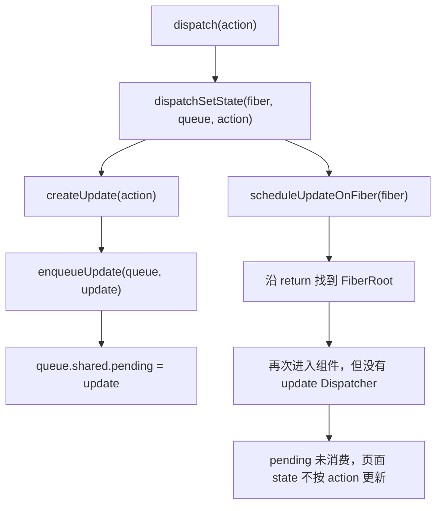

# 第8章：实现 useState

## 本章要解决的问题

`useState` 每次调用都发生在同一个函数体内，那状态是怎么跨越好几次渲染被“记住”的？本章的答案是：状态根本不存在函数调用里，而是写在这个组件对应的 Fiber 节点上，`useState` 只是转发这次读写的一层薄壳。

## 本章定位

- **数据流定位**：函数组件调用 `useState` → Dispatcher 选择 mount 实现 → 创建 Hook 与 UpdateQueue → dispatch 将 Update 入队并把更新送往 root。
- **难度**：★★★☆☆ —— 第一个把 Fiber、状态、更新队列和调度连接起来的 Hook。
- **前置依赖**：第 3 章的 Fiber/alternate、第 7 章的 FunctionComponent。自检：能说出函数组件在 `beginWork` 中执行，执行结果是新的 children。
- **读后检验**：能画出 FunctionComponent Fiber 下的 Hook 链；能解释 mount 时多个 Hook 怎样按调用顺序追加；能说清 dispatch 闭包捕获了什么，以及本章为何还不能完成状态更新。
- **本章实现边界**：本章只讲 mount 时如何创建 Hook、dispatch 如何把 Update 放入队列。下一轮 render 如何找到旧 Hook、消费 Update、算出新 state，在第 10 章展开；多 Update、Lane、baseQueue 与 eagerState 分别在第 14、18、23 章补齐。下文不再逐句重复这条边界，只在必须澄清“这里还不能验证什么”时提醒一次。

## 整体架构思路：状态属于 Fiber，不属于函数调用

先看一段代码，不急着看实现：

```tsx
function App() {
	const [count] = useState(() => 0);
	const [name] = useState('big-react');

	return <p>{name + ': ' + count}</p>;
}
```

首次渲染应该得到 `<p>big-react: 0</p>`。带着三个问题往下看：

1. 两次 `useState` 调用产生的状态，分别保存在哪里？
2. React 怎么知道 `0` 和 `"big-react"` 属于两个不同的 Hook，不会互相覆盖？
3. `useState` 没有接收任何 Fiber 参数，它怎么知道“现在是 `App` 在调用我”？

先看一个直觉上会写、但注定不成立的版本：

```ts
function useState(initialState) {
	let state = initialState;
	return [state, (nextState) => (state = nextState)];
}
```

局部变量 `state` 只活在这一次函数调用里。下一轮 render 重新调用 `App()`，这个函数会从头执行一遍，`state` 又会从 `initialState` 重新开始——局部变量装不下“跨越多次调用还记得住”的状态。

那把状态放进一个以组件函数为 key 的 Map 里呢？也不行，看这个例子：

```jsx
<>
	<Counter />
	<Counter />
</>
```

这里有两个 `Counter` **实例**，但只有一个 `Counter` **函数**。用函数当 key，两个实例的状态会被互相覆盖成同一份。真正能唯一定位“这一个实例”的，是它在树里的位置——也就是它对应的 Fiber：

```text
组件类型 Counter       —— 不能唯一定位状态（两个实例共用一个函数）
树中的某个 Counter Fiber —— 可以唯一定位这一个组件实例
这个 Fiber 上第 N 个 Hook —— 可以定位这个实例的第 N 份状态
```

所以状态的归属链是：

```text
FunctionComponent Fiber
  -> Hook 0（第一次 useState 调用）
  -> Hook 1（第二次 useState 调用）
  -> Hook 2（第三次 useState 调用）
```

本章要搭的，就是这条链怎么建立、以及 `useState` 怎么在“不知道自己被谁调用”的情况下，找到正确的 Fiber 和正确的 Hook。setter 与 UpdateQueue 会作为数据结构建立起来，但“调用 setter 后页面真的更新”本章还做不到——第 10 章补上消费更新的那一半。

## 本章实现：从一次 `useState` 调用，到状态挂在 Fiber 上

先记住这五个字段，它们是本章要建立的全部关系：

```text
Hook.memoizedState   这个 Hook 本轮已经得到的 state
Hook.updateQueue     两次 render 之间到达的更新意图
Hook.next            同一组件的下一个 Hook（组成链表）
Fiber.memoizedState  Hook 链表的入口（第一个 Hook）
Fiber.return         dispatch 触发后，从组件 Fiber 找到 root 的路径
```

有个容易搞混的地方：`memoizedState` 这个名字在三种对象上都出现，但含义完全不同：

| 所属对象                                   | 含义                           |
| ------------------------------------------- | ------------------------------- |
| HostRoot Fiber 的 `memoizedState`          | root 当前要渲染的 ReactElement |
| FunctionComponent Fiber 的 `memoizedState` | Hook 链表的入口（第一个 Hook）  |
| Hook 的 `memoizedState`                    | 这一个 Hook 本轮算出的 state   |

下面分两步建立这套关系：先建 Hook 链表和“怎么知道现在该调用谁”的分发机制，再建 state/queue/dispatch 三件套。

### 第一步：Hook 怎么串成一条链，调用顺序为什么重要

FunctionComponent Fiber 的 `memoizedState` 指向第一个 Hook，每个 Hook 通过 `next` 连到下一个：

```text
App Fiber.memoizedState
  |
  v
Hook 0: count
  memoizedState: 0
  updateQueue: Queue 0 ----> setCount
  next
  |
  v
Hook 1: name
  memoizedState: "big-react"
  updateQueue: Queue 1 ----> setName
  next: null
```

注意这里没有用变量名 `count`、`name` 做任何区分——变量名经过编译、压缩会变，`useState` 本身也根本不知道返回值被赋给了哪个变量名。运行时真正稳定、可以依赖的只有**调用顺序**：第 N 次 Hook 调用，就对应链表中第 N 个 Hook。

这也是“Hooks 不能写在 if 里”这条规则的真正原因，不是语法限制，而是结构性后果：

```tsx
if (visible) {
	useState('A');
}
useState('B');
```

第一次 render，两个 Hook 都执行了，`useState('B')` 占据第 1 个位置。如果第二次 render 时 `visible` 变成 `false`，跳过了第一个 Hook，`useState('B')` 就会占到第 0 个位置——直接对上了上一次为 `'A'` 保存的那个 Hook。不是“少存一个值”这么简单，而是从这里开始，后面所有 Hook 全部错位。

### 第二步：Dispatcher——同一个 `useState`，为什么 mount 和 update 时行为不一样

用户永远调用同一个 `useState(...)`，但 mount（第一次创建 Hook）和 update（复用已有 Hook）内部要做的事完全不同。React 用一张“当前阶段该用哪套实现”的行为表来解决这个问题，这张表就是 Dispatcher。

公共 API [useState](../../packages/react/index.ts) 本身不实现任何算法，只是转发给当前 Dispatcher：

```ts
export const useState = (initialState) => {
	const dispatcher = resolveDispatcher();
	return dispatcher.useState(initialState);
};
```

Dispatcher 解决的是两个耦合问题：

- 用户不需要在调用 `useState` 时手动传入“现在是哪个 Fiber、现在是 mount 还是 update”。
- `react` 包只暴露一份稳定的公共 API，不需要直接依赖 `react-reconciler` 的具体实现——mount 逻辑、update 逻辑全部藏在 reconciler 一侧，写进 Dispatcher 这张表里。

`react-reconciler` 负责写入 Dispatcher，`react` 包负责读取，双方必须共享同一个对象引用——[shared/internals.ts](../../packages/shared/internals.ts) 就是这条内部通道。[renderWithHooks](../../packages/react-reconciler/src/fiberHooks.ts) 在执行组件函数之前，会先把 Dispatcher 指向 mount 那套实现：

```ts
function renderWithHooks(wip) {
	currentlyRenderingFiber = wip;
	wip.memoizedState = null;

	const current = wip.alternate;
	if (current !== null) {
		// update：本章为空，第 10 章补上
	} else {
		currentDispatcher.current = HooksDispatcherOnMount;
	}

	const Component = wip.type;
	const children = Component(wip.pendingProps);

	currentlyRenderingFiber = null;
	return children;
}
```

> **本章的真实状态**：update 分支目前是空的，组件执行完毕后 `workInProgressHook` 和 `currentDispatcher.current` 也没有被复位。也就是说，“组件外调用 `useState` 一定报错”这个你可能从官方文档里知道的保护，本章还不成立——只有第一次组件 mount 前 Dispatcher 是 `null` 才会报错；mount 完成后再调用，代码不会拦截，甚至可能把新 Hook 错误地接到上一条链上。这是当前源码的真实缺口，不是简化后的效果，第 10 章会补上 update Dispatcher 和游标重置。本章的例子应该只覆盖“一个函数组件的首次 mount”，别指望它能演示组件外非法调用的保护。

#### 走一遍两个 `useState` 调用会发生什么

回到最小例子：

```tsx
const [count] = useState(() => 0);
const [name] = useState('big-react');
```

| 时刻                   | `currentlyRenderingFiber` | `workInProgressHook` | `App Fiber.memoizedState` |
| ---------------------- | -------------------------- | ---------------------- | --------------------------- |
| 进入 `renderWithHooks` | App Fiber                  | `null`                  | `null`                       |
| 第一次 `useState` 后   | App Fiber                  | Hook 0                 | Hook 0                       |
| 第二次 `useState` 后   | App Fiber                  | Hook 1                 | Hook 0（`.next` 指向 Hook 1）|
| App 执行结束           | `null`（被清空）            | Hook 1（未清空）        | Hook 0                       |

`currentlyRenderingFiber` 是“这次 render 期间”的临时上下文，用完就该清空；Fiber、Hook、queue 则是要跨越多次 render 长期保存的数据。本章只把 `currentlyRenderingFiber` 收干净了，`workInProgressHook` 和 Dispatcher 还留着上一次的痕迹——这也是上面那条提示的由来。

### 第三步：一次 `useState` 调用具体做了什么

沿调用链读源码会比从头到尾顺序读更直接：

```text
updateFunctionComponent        beginWork.ts
  -> renderWithHooks           fiberHooks.ts
  -> useState                  react/index.ts
  -> resolveDispatcher         react/src/currentDispatcher.ts
  -> mountState                fiberHooks.ts
  -> mountWorkInProgressHook   fiberHooks.ts
  -> dispatchSetState          fiberHooks.ts
```

每个函数只负责回答其中一个具体问题，先对照一下，下面再逐个展开：

| 函数                              | 本章只回答什么                            |
| ---------------------------------- | -------------------------------------------- |
| `renderWithHooks`                 | 当前 Fiber 和 Dispatcher 在何时生效         |
| `useState` / `resolveDispatcher`  | 公共 API 怎样找到 reconciler 的实现         |
| `mountWorkInProgressHook`         | 新 Hook 怎样接入 Fiber 链表                 |
| `mountState`                      | state、queue、dispatch 怎样组成一组         |
| `dispatchSetState`                | setter 调用后怎样保存 Update 并触发调度     |

[mountWorkInProgressHook](../../packages/react-reconciler/src/fiberHooks.ts) 每调用一次就新建一个 Hook 并接到链尾：

```ts
if (workInProgressHook === null) {
	workInProgressHook = hook;
	currentlyRenderingFiber.memoizedState = hook;
} else {
	workInProgressHook.next = hook;
	workInProgressHook = hook;
}
```

`workInProgressHook` 始终指向“刚创建的那个 Hook”，所以同一个组件内连续调用 `useState`，才能顺着这条链依次追加，而不是互相覆盖。

[mountState](../../packages/react-reconciler/src/fiberHooks.ts) 在拿到这个 Hook 之后，接着做三件事——算出初始值、建一个专属的更新队列、创建绑定好的 dispatch 函数：

```ts
function mountState(initialState) {
	const hook = mountWorkInProgressHook();
	const memoizedState =
		initialState instanceof Function ? initialState() : initialState;

	const queue = createUpdateQueue();
	hook.memoizedState = memoizedState;
	hook.updateQueue = queue;

	const dispatch = dispatchSetState.bind(null, currentlyRenderingFiber, queue);
	queue.dispatch = dispatch;
	return [memoizedState, dispatch];
}
```

一组 `useState` 因此可以理解成三个各司其职的角色：

```text
Hook      保存“已经算出的 state”
Queue     保存“还没处理的更新意图”
Dispatch  负责“把新意图放进这个 Queue，并通知这个 Fiber”
```

#### 为什么初始值可以传函数，而不只是传值？

`mountState` 里那一行 `initialState instanceof Function ? initialState() : initialState`，对应两种写法：

```ts
useState(0); // 直接传值
useState(() => computeExpensiveInitial()); // 传一个函数
```

如果初始值本身计算代价很高（比如要遍历一个大数组），直接写 `useState(computeExpensiveInitial())` 会有个隐藏问题：函数调用发生在**调用 `useState` 之前**，也就是说不管这是组件第 1 次还是第 100 次执行，`computeExpensiveInitial()` 都会先被真正跑一遍，即使 Hook 早就有值了、这个结果根本用不上，也照样白白算一次。传一个函数则不同——`mountState` 只在**创建这个 Hook 的这一次**（也就是 mount 时）才会调用它取值；本章的 update 分支虽然还是空的，但按设计，后续 render 根本不会再走到 `mountState` 这段代码，自然也不会重新调用这个函数。这就是“惰性初始化”：把可能很贵的计算，锁定在真正需要它的那一次，而不是每次 render 都先算出来再决定要不要用。

#### 为什么每个 Hook 有自己的 updateQueue，而不是整个组件共用一个？

一个组件里可以连续调用好几个 `useState`，各自独立、状态类型也可能完全不同（数字、字符串、对象……）。如果所有 Hook 共用同一个组件级的更新队列，队列里的每条 Update 就必须额外标记“这条到底是给第几个 Hook 的”，消费时还要先按 Hook 编号筛一遍，才能确认这条更新该应用到哪份 state 上。

`mountState` 让每个 Hook 拥有自己独立的 `updateQueue`，`dispatch` 在创建的那一刻就已经通过闭包绑死了“这次更新只进这一个队列”（见下一节），后续处理时也只需要顺着这一个 Hook 自己的队列走，不需要跟同组件里其他 Hook 的更新混在一起做归属判断。代价是 Fiber 上要多挂几份队列，但换来的是每份队列的语义单纯、只服务一个 Hook。

#### 为什么 dispatch 要用闭包绑定 Fiber，而不是运行时去读“当前组件”？

组件函数执行完毕后，`currentlyRenderingFiber` 会被清空。但 setter（也就是 dispatch）通常是在组件渲染**结束之后**才被用户调用的——可能是点击事件里，这时候 `currentlyRenderingFiber` 早就是 `null`，甚至可能正指向另一个完全不相关的组件。

所以 `mountState` 创建 dispatch 时，直接把这次调用对应的 Fiber 和 queue 提前“焊死”进闭包：

```ts
const dispatch = dispatchSetState.bind(null, fiber, queue);
```

这样以后不管在哪里调用这个 dispatch，它都不需要问“现在正在渲染哪个组件”——它从诞生的那一刻起，就已经知道自己该往哪个 Fiber、哪个 queue 里写。

调用 dispatch 之后的内部链路是这样的：



本章到这里为止，链路走到“Update 被正确写进了 queue、并且找到了 root”就结束了。再次进入这个组件渲染时，`renderWithHooks` 的 update 分支还是空的，不会去消费这条 pending——所以本章能验证的是“Update 被写对了地方”，还验证不了“页面状态真的按这次 action 变了”。另外，本章的 queue 只有一个 `pending` 槽位，后到的 Update 会直接覆盖先到的，还没法保存同一批次里的多次调用——环形队列要等到第 14 章。

### 本节边界与常见误解

- 初始 state 最终写在 Hook 上，不是保存在 `currentlyRenderingFiber` 这个临时变量里。
- setter 不会直接改 `Hook.memoizedState`；它创建一个 Update，写进 queue，再触发调度——“改状态”这件事本身要等到消费 queue 的那一刻才发生。
- Hook 用链表串起来，关键原因是“调用顺序要能对齐”，不是“链表在所有场景都更快”。
- `Fiber.memoizedState` 在不同类型的 Fiber 上含义不同；只有在 FunctionComponent 上，它才是 Hook 链表的入口。

## 与官方 React 的差异

| 能力          | big-react 本章                                     | 官方 React                                       | 后续是否补齐                                                    |
| ------------- | --------------------------------------------------- | -------------------------------------------------- | ------------------------------------------------------------------ |
| Dispatcher    | 只建立 mount 侧分发，结束后未清空；update 分支为空 | 覆盖 mount、update、rerender，并限制组件外调用   | 第 10 章补 update Dispatcher 与游标重置；课程未补完整开发期校验 |
| Hook 数据     | 以 `memoizedState/updateQueue/next` 建立最小链表   | 还要保存跳过更新、重放与更多 Hook 类型所需的数据 | 第 18 章补 `baseState/baseQueue`                                  |
| UpdateQueue   | 单个 pending 槽，只能保存一个待处理 Update         | 环形队列保存多个 Update，并与优先级模型协作      | 第 14 章补环形队列，第 18 章补优先级跳过与重放                    |
| Update 优先级 | 本章的 Update 尚不区分 Lane                        | 每个 Update 带优先级，render 可选择性处理        | 第 14 章接入 Lane，第 18 章接入并发筛选                            |
| eager state   | setter 统一入队并调度                              | 可提前计算结果，相同 state 时跳过调度            | 第 23 章补 eagerState                                              |
| 开发期检查    | 只覆盖最基本的非法调用或 Hook 数量问题             | 对 Hook 顺序、嵌套调用等提供更全面警告           | big-react 只实现其中一部分                                        |

big-react 本章已经能说明三条设计不变量：初始状态归属 Fiber、同一组件内的 Hook 按调用顺序串联、dispatch 把 action 写入所属 queue。update 消费与执行窗口清理尚未成立，不能从 mount 结构继续推断生产 React 的完整行为。

## 思考题

### Q1: React 为什么靠 Hook 调用顺序匹配，而不是函数名或变量名？

变量名不是可靠的运行时身份：编译、压缩、解构都可能改变它，而且 `useState` 本身也不知道返回值被赋给了哪个变量。Hook 函数名同样不够，因为一个组件可以连续调用多个 `useState`。React 因此使用调用顺序，将第 N 次 Hook 调用与链表中第 N 个 Hook 对齐。这个方案简单且高效，但代价是每次 render 必须保持相同 Hook 顺序，条件调用会让后续状态和 queue 全部错位。

### Q2: dispatch 为什么不依赖调用 setter 时的 `currentlyRenderingFiber`？

`currentlyRenderingFiber` 只在函数组件执行期间有效，setter 通常在组件 render 结束后才被调用，此时它已经被清空，甚至可能正指向另一个组件。mountState 创建 dispatch 时，把当前 Fiber 与该 Hook 的 queue 绑定进闭包，所以调用 setter 时不需要任何全局“当前组件”。dispatch 用 queue 保存 Update，再从绑定的 Fiber 沿 `return` 找到 FiberRoot 并调度。临时上下文只服务 render，闭包中的 Fiber/queue 才服务 render 之间的更新。

### Q3: Hook、UpdateQueue 和 dispatch 分别负责什么？

Hook 保存 mount 得到的 state，并通过 `next` 参与组件的 Hook 链。UpdateQueue 当前只有一个 `shared.pending` 槽，用来保存 dispatch 创建的 Update。dispatch 绑定 Fiber 与 queue，负责创建 Update、覆盖写入 pending 并触发调度。三者分别对应状态记录、待处理意图和触发入口；本章还不能证明 update 后的状态复用。

### Q4: 当前项目使用 shared/internals 作为 react 和 react-reconciler 之间的桥梁来共享 currentDispatcher。如果不使用这个桥梁，还有哪些方案？各自的优缺点是什么？

**方案 1：Reconciler 直接导入 React 的 Dispatcher。** 改动最小，两边直接共享同一个对象；但 `react-reconciler` 会直接依赖 React 的内部文件，包边界变紧，容易产生循环依赖；如果不同构建入口各自打包，可能出现两份 `currentDispatcher`，导致 Hooks 读到的不是 Reconciler 写入的那一份，也无法支持多个 React 实例。

**方案 2：依赖注入。** 由 reconciler 在创建 renderer 或进入 render 前，把 Dispatcher 接口显式传给公共 Hook 入口。依赖方向清楚，测试可以注入最小实现，多个运行时也能各自持有一份；但公共 `useState()` 没有 renderer 参数，Dispatcher 必须经过 root、renderer 或 render 上下文层层传递，若某处注入与恢复不成对，嵌套 render、异常退出或多 root 交错时就可能读到错误实现。

**方案 3：挂到 `globalThis`。** 不依赖包之间的导入关系，即使某些包被重复加载也能访问同一个对象；但会污染全局环境，不同版本的 React 可能互相覆盖，SSR、测试、热更新时容易残留状态，多个 React 实例无法隔离，类型和调试体验也差，一般不建议用于核心状态。

本项目选择 `shared/internals`，本质是在“直接内部导入”和“完整依赖注入”之间取一个较小接口：公共 Hook 只读取 `currentDispatcher.current`，reconciler 负责写入当前阶段的行为表。阅读这段实现时，真正要检查的不是文件放在哪里，而是两条不变量：React 与 reconciler 必须拿到同一个 internals 对象；Dispatcher 的设置与清理必须覆盖组件执行的完整边界。本章满足前一条，却没有在结束时清空 Dispatcher，因此后一条尚未闭环。

## 本章小结

useState 的最小模型可以压缩成三层：Fiber 标识组件实例，Hook 链按调用顺序保存多份初始状态，UpdateQueue 接收 render 之间发生的更新。Dispatcher 让公共 `useState` 转发到 reconciler 的 mount 实现，dispatch 闭包则把之后发生的调用重新连接到 Fiber 与 queue。

本章最值得保留的心智模型不是某个函数名，而是一次状态更新中的数据归属：**已计算 state 在 Hook，待处理 action 在 queue，调度起点在 dispatch 绑定的 Fiber。**

本章只搭起了 mount 侧：Update 已经能正确进入 queue，但下一轮 render 还不知道怎么找到旧 Hook、怎么算出新 state，同时又不污染 current。第 10 章会补上 Hook update 与节点 update 的完整路径。
