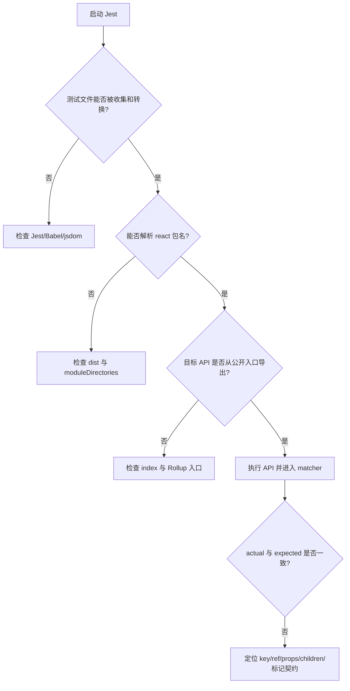

# 第9章：ReactElement 的测试用例

## 本章定位

- **数据流定位**：消费第 2 章定义的 ReactElement 协议 → 通过公开包入口创建元素 → 用 Jest 断言对象结构与边界行为。
- **难度**：★★☆☆☆ —— 不引入新的协调算法，重点是建立可重复验证的测试入口，并学会区分环境问题、包入口问题与源码契约问题。
- **前置依赖**：第 2 章（JSX、ReactElement、`jsx`）、第 6 章（ReactDOM root）。自检：能说出 ReactElement 的 `type/key/ref/props/$$typeof` 各自承担什么职责。
- **读后检验**：能解释测试为什么从 `dist/node_modules` 加载 big-react；能根据失败信息判断问题发生在哪一层。

页面 Demo 适合观察“最终渲染出了什么”，却不擅长验证 ReactElement 的中间对象协议。数字 key 是否被字符串化、ref 是否从 props 中剥离、普通对象是否会被误判为元素，这些行为即使暂时不影响页面，也会在后续 reconciliation、ref 和列表 Diff 中成为正确性前提。

本章引入单元测试，不是为了给源码补一份形式上的覆盖率，而是把 ReactElement 的公开协议变成可执行证据。

## 整体架构思路：从公开入口验证对象协议

测试不应直接导入 `packages/react/src/jsx.ts`，否则只能证明某个内部函数工作，无法证明以下链路已经接通：

```text
React 源码
→ Rollup 构建 react 包
→ dist/node_modules/react
→ Jest 按包名加载 react
→ 调用公开 API
→ matcher 断言 ReactElement 协议
```

这条链路覆盖了两种不同风险：

| 风险层次 | 典型问题                                           | 应检查的位置                       |
| -------- | -------------------------------------------------- | ---------------------------------- |
| 测试环境 | Jest、Babel 或 jsdom 未正确加载                    | Jest/Babel 配置                    |
| 包解析   | `react`、`react-dom/test-utils` 无法从构建产物解析 | Rollup 输出、`moduleDirectories`   |
| 公开入口 | 内部已有实现，但包入口没有导出                     | `index.ts`、Rollup input/output    |
| 源码契约 | 实际对象字段与预期不同                             | `jsx/createElement/isValidElement` |

只有前一层已经通过，后一层的断言才真正获得执行机会。看到测试失败时，不应直接把错误归因于 ReactElement 实现。

### 页面结果不能替代对象协议断言

ReactElement 位于编译器、公共 API 与 reconciler 之间。它必须保持一组稳定不变量：

```text
key 字符串化
→ 不同 runtime 生成的身份值可稳定比较

key/ref 从 props 中剥离
→ reconciler 与 commit 拥有专门的身份、实例通道

props 复制 config 的普通字段
→ 创建 element 不复用调用方的配置对象

$$typeof 使用共享标记
→ isValidElement 不依赖脆弱的对象形状猜测
```

页面最后显示相同文本，并不能证明这些中间协议正确。例如把数字 key `12` 保留成 number，在只有一个节点的 Demo 中通常看不出问题，但会破坏后续 key 身份比较的一致性。

### 三种调试方式各自证明什么

| 方式            | 最适合回答                     | 不擅长回答    |
| --------------- | ------------------------------ | ------------- |
| 构建产物 + Node | 包入口、导出和模块解析是否正确 | UI 与复杂交互 |
| Vite Demo       | 页面结果和一次交互调用链       | 大量边界输入  |
| Jest            | 对象协议、错误输入和执行顺序   | 直观展示页面  |

断点告诉我们“这一次怎样执行”，测试约束“这些输入都必须得到什么结果”。两者承担不同职责。

## 本章实现：建立测试入口并验证 ReactElement

### 本章改动文件

#### 9-1：测试基础设施

- test-utils.ts：提供 `renderIntoDocument`。
- jest.config.js：配置测试根目录、jsdom、包解析与 setup。
- setupJest.js：注册自定义 matcher。
- reactTestMatchers.js：提供 React 输出相关 matcher。
- schedulerTestMatchers.js：提供 Scheduler 日志相关 matcher，为后续章节准备。
- react-dom.config.js：增加 `react-dom/test-utils` 构建入口。

#### 9-2：ReactElement 用例与公开 API

- ReactElement-test.js：ReactElement 契约用例。
- index.ts：导出 `isValidElement`。
- root.ts：让 `render` 返回 `updateContainer` 的返回值，供当前 `renderIntoDocument` 使用。

测试基础设施和 ReactElement 契约是两步工作：9-1 先让公开包可被测试消费，9-2 再给元素对象建立断言。

### 9-1 实现第三种调试方式

#### Jest 从构建产物解析 big-react

[jest.config.js](../../scripts/jest/jest.config.js) 的关键配置是：

```js
const { defaults } = require('jest-config');

module.exports = {
	...defaults,
	rootDir: process.cwd(),
	moduleDirectories: ['dist/node_modules', ...defaults.moduleDirectories],
	testEnvironment: 'jsdom',
	moduleNameMapper: {
		'^scheduler$': '<rootDir>/node_modules/scheduler/unstable_mock.js'
	},
	setupFilesAfterEnv: ['./scripts/jest/setupJest.js']
};
```

`moduleDirectories` 的顺序表达了测试意图：

1. `require('react')`、`require('react-dom/test-utils')` 优先解析到 `dist/node_modules` 中的 big-react 构建产物。
2. `jest`、`scheduler` 等第三方包继续从正常 `node_modules` 查找。

因此执行测试前必须先有对应构建产物。本章快照中的 `test` 脚本只启动 Jest，并不自动构建；若 `dist` 不存在或内容过旧，应先执行构建，再运行测试：

```bash
pnpm build:dev
pnpm exec jest --config scripts/jest/jest.config.js --runInBand
```

这一步的排查重点是构建产物是否存在、内容是否与源码一致，以及 Jest 是否解析到预期包入口。

#### Babel 把测试 JSX 转成 classic runtime

测试文件中包含：

```jsx
expect(element).toEqual(<div />);
```

根目录 `babel.config.js` 使用 `@babel/plugin-transform-react-jsx`。默认 classic runtime 会把 `<div />` 转换为：

```js
React.createElement('div', null);
```

所以测试文件在 `beforeEach` 中执行：

```js
React = require('react');
```

这也解释了为什么本章测试能直接暴露 `createElement` 与 `jsx` 不能完全互换。

#### test-utils 提供最小渲染入口

[test-utils.ts](../../packages/react-dom/test-utils.ts) 只实现：

```ts
export function renderIntoDocument(element: ReactElement) {
	const div = document.createElement('div');
	return createRoot(div).render(element);
}
```

它不是官方 React Test Utilities 的完整替代品，也没有实现 `act`。本章只是借它创建容器并经过公开 ReactDOM root 入口。`root.render` 同时被改为返回 `updateContainer` 的结果，使当前测试能拿回传入的 element。

### 9-2 用测试描述 ReactElement 契约

#### `isValidElement` 只识别共享标记

[index.ts](../../packages/react/index.ts) 新增：

```ts
export function isValidElement(object: any) {
	return (
		typeof object === 'object' &&
		object !== null &&
		object.$$typeof === REACT_ELEMENT_TYPE
	);
}
```

判断分为三层：

1. 必须是 object，排除字符串、布尔值和函数。
2. 必须非 null，因为 `typeof null === 'object'`。
3. `$$typeof` 必须等于共享的 `REACT_ELEMENT_TYPE`。

它不检查对象是否具有完整的 `type/key/ref/props` 字段。`isValidElement` 验证的是 ReactElement 身份标记，不是对任意对象执行完整 schema 校验。

#### `Symbol.for` 与数字 fallback

测试临时移除全局 `Symbol`，验证 `REACT_ELEMENT_TYPE` 会退回数值 `0xeac7`。数值可以经过 JSON 序列化后保留，因此 fallback 环境下：

```text
ReactElement
→ JSON.stringify
→ JSON.parse
→ $$typeof 仍为 0xeac7
→ isValidElement 返回 true
```

测试还注入一个简化的 `Symbol.for`。Symbol 不会被 JSON 序列化，因此支持 Symbol 的环境中，JSON round-trip 后 `$$typeof` 丢失，`isValidElement` 返回 false。

这两组用例不是互相矛盾，而是在验证两种标记实现的可序列化差异。

#### key、ref 与 props

当前 `jsx` 已实现以下行为：

```ts
const element = React.createElement(Component, {
	key: 12,
	ref,
	foo: 'value'
});
```

目标对象是：

```ts
{
	type: Component,
	key: '12',
	ref,
	props: { foo: 'value' }
}
```

关键不变量：

- 非 `undefined` key 会转为字符串。
- key 与 ref 是 element 保留字段，不进入 props。
- 普通自有属性复制到新的 props 对象。
- 修改原 config 不应改变已经创建的 element.props。
- 无原型对象仍能通过 `Object.prototype.hasOwnProperty.call` 安全读取自有属性。

### 测试失败时的定位顺序



不要因为最终目标是测试 ReactElement，就跳过前面的环境与包边界。只有 matcher 已经拿到 actual/expected 差异时，才能把失败直接归因于对象协议。

## 与官方 React 的差异

| 能力             | big-react 本章                            | 官方 React                                    |
| ---------------- | ----------------------------------------- | --------------------------------------------- |
| `isValidElement` | 按非空对象与 `$$typeof` 判断              | 核心判断原则一致                              |
| 开发期校验       | 基本没有 key、非法类型等开发期警告        | 包含更完整的开发期校验与警告                  |
| test-utils       | 只有最小 `renderIntoDocument`             | 具有完整的 `act` 等测试能力                   |
| 测试基础设施     | 从本地构建产物解析课程包                  | 使用更完整的源码转换、Feature Flag 与测试环境 |


## 思考题

### Q1: 为什么 ReactElement 测试要从 `dist` 的公开入口加载，而不是直接导入 `jsx.ts`？

直接导入 `jsx.ts` 只能证明内部对象工厂工作，无法证明 `react` 包是否正确导出 `createElement/isValidElement`，也无法验证 Rollup 是否生成了正确入口。ReactElement 是公共协议，从构建产物按包名加载，可以同时覆盖实现、导出和包解析三层边界。

代价是测试依赖构建结果。若 `dist` 不存在或过期，测试失败不代表对象算法错误。因此排错时要先确认构建产物，再分析 matcher 差异。

### Q2: `isValidElement` 为什么检查 `$$typeof`，而不是检查对象是否具有 `type` 和 `props`？

对象形状容易被普通业务对象偶然满足：`{ type: 'div', props: {} }` 并不一定由 React runtime 创建。共享的 `REACT_ELEMENT_TYPE` 是创建方与消费方约定的身份标记，使判断不依赖字段数量和具体 props 内容。

它仍不是安全边界。任何代码都可以主动伪造相同标记；`isValidElement` 的目标是协议识别，不是防止恶意构造。

### Q3: 为什么数字 key 要在创建 ReactElement 时转成字符串？

key 是同层节点的身份，不参与数学运算。把 `1` 和 `'1'` 统一为字符串，可以避免不同 JSX/runtime 输入路径生成不同类型的身份值，使 reconciler 后续只按一种表示比较 key。

字符串化应发生在 element 创建边界，而不是散落到每次 Diff 比较中。这样 ReactElement 一旦创建，后续消费者就可以依赖稳定协议。

### Q4: config 已经是对象，为什么还要创建新的 props，而不是直接复用 config？

key/ref 需要从普通 props 中剥离，而且 element 创建后不应继续受调用方修改 config 的影响。若直接复用 config，删除保留字段会修改调用方对象；不删除又会让 key/ref 泄漏到组件 props。

复制普通自有属性可以同时满足两个约束：调用方对象不被修改，element.props 只包含组件应该消费的字段。

### Q5: `createElement` 和 `jsx` 有什么区别？

两者最终都创建 ReactElement，可以共享底层的元素构造逻辑，但面向的调用方与入参协议不同：

- `createElement(type, config, ...children)` 是 classic JSX transform 和用户代码可直接调用的公开 API。`key`、`ref` 从 `config` 中提取，第三个及后续参数都是 children；一个 child 直接保存，多个 children 需要组装成数组。
- `jsx(type, config, maybeKey)` 是 automatic JSX transform 使用的编译器入口。children 已经由编译器写入 `config.children`，第三个参数是额外传入的 key，不是 child。因此，它们可以归一化为相同的 ReactElement 输出协议，却不能直接复用同一个外层参数解析函数。

## 本章小结

本章把 ReactElement 从“页面能用的普通对象”提升为“可以从公开入口重复验证的协议”。Jest 负责执行断言，Babel 负责转换测试 JSX，`dist/node_modules` 负责提供真实包入口，`isValidElement` 则用共享标记识别元素身份。

测试还揭示了当前实现的真实边界：key/ref/props 与元素标记已经具备基本协议。下一章进入 update 流程后，ReactElement 的 type、key 和 props 将真正参与 Fiber 复用。
