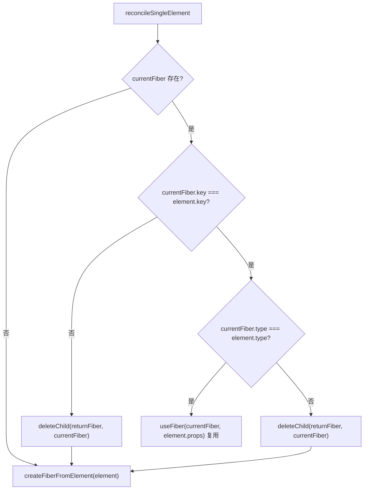

# 第10章：初探 update 流程

## 本章定位

- **数据流定位**：消费 current 树与新 ReactElement → 产出复用/删除/更新的 WIP 与 flags → 被 commit 阶段消费；单节点场景为第 12 章多节点 Diff 打底。
- **难度**：★★★☆☆ —— update 是 mount 之后的第一类新增流程：旧树已存在，必须在「复用身份」和「隔离本轮计算」之间同时成立。
- **前置依赖**：第 3 章（Fiber 双缓存与 `alternate`）、第 4 章（Update/UpdateQueue）、第 5 章（beginWork/completeWork 递归）、第 8 章（useState 的 Hook 链表与 dispatch 闭包）。update 流程把这几章的概念接到同一棵已有树上。自检：能说出 `alternate` 与双缓存的含义；知道 `beginWork`/`completeWork`/`commitWork` 各负责什么；知道 `setState` 的 action 最终进到哪个队列。
- **读后检验**：能画出一张「key/type 判断 → 复用或删除」的决策图；能指出删除信息为什么挂在父 Fiber；能说出文本变化在哪一步被标记成 `Update`。

前面实现的是 mount：没有旧树，直接创建新 Fiber。真实应用更多发生的是 update：旧树已经存在，需要判断哪些节点能复用，哪些节点要删除、插入或更新。本章先处理单节点 update。

## 整体架构思路：身份复用与本轮计算隔离同时成立

第 9 章结束时 mount 链路完整。先预测：把 `setNum` 暴露出去（`window.setNum = setNum`），在控制台调一次 `window.setNum(2)`，页面上会发生什么？

时点实况（第 9 章结束）有两处。`childFibers.ts` 的 `reconcileSingleElement` 打开就是：

```ts
function reconcileSingleElement(
	returnFiber: FiberNode,
	currentFiber: FiberNode | null,
	element: ReactElement
) {
	// 根据element创建fiber
}
```

`currentFiber` 参数传进来了，但函数体里没有任何比较——直接 `createFiberFromElement` 新建。新 Fiber 的 `alternate` 是 `null`，于是 `placeSingleChild` 给它标上 `Placement`；而整个文件里还找不到 `deleteChild`——旧节点没有删除标记。另一处在 `completeWork.ts`，HostComponent 的 update 分支只有一行注释：

```ts
if (current !== null && wip.stateNode) {
	// update
}
```

把两处连起来：`setNum(2)` 触发 render，`<div>{num}</div>` 被当成全新节点——新建 DOM、标 `Placement`、被 `commitPlacement` 插入页面；旧 div 没人负责删除，继续留在原地。结果是页面上新旧两份内容并存，且每个新节点都是换了身份的新 DOM。更深一层：焦点、选区、非受控输入这些「住在 DOM 实例上」的状态随之丢失——update 要回答的「复用谁、删除谁、更新谁」，此刻一个都没有答案。

update 可以复用 current 的组件与宿主身份，但本轮计算必须发生在 WIP 上。只有 render 完成并 commit 后，WIP 才能成为新的 current。

### React 怎样在更新中保持节点身份

声明式更新每次都会产生新的 ReactElement 对象，但页面不应每次销毁重建。核心问题是：**React 如何判断“这还是原来的节点，只是输入变了”，并把计算层复用与宿主层修改分开？**

最简单的策略是每次清空 container，再按新 JSX 重建。视觉结果可能正确，但会造成：

- DOM 实例、焦点、选区、滚动位置和非受控输入状态丢失。
- 子组件 Hook state 全部丢失。
- 无变化的子树也产生大量宿主操作。
- 依附于宿主实例的焦点、选区等状态会反复丢失。

所以 update 的第一任务不是“找差异”，而是判断身份是否连续。对于单 element，React 用 `key + type` 作为核心身份：

```text
key 不同 -> 在同级集合中的身份不同
key 相同、type 不同 -> 组件/宿主类型改变，不能复用
key 相同、type 相同 -> 可基于 current 创建 WIP
```

### 复用不是继续修改 current

复用表示复用逻辑身份、宿主实例和历史状态，同时仍创建/复用另一份 WIP 记录：

```text
current Fiber：上一次提交事实
  <- alternate ->
WIP Fiber：本轮 pendingProps 与计算结果

stateNode：可复用同一个 DOM
memoizedState/updateQueue：作为新计算的历史输入
flags：记录这次真正要修改什么
```

直接改 current 会让 render 失败或中断时无法恢复旧 UI。双缓存让“复用已有资源”和“隔离本轮计算”同时成立。

### 一次 update 在三个阶段回答不同问题

| 阶段         | 比较对象                                | 输出                     |
| ------------ | --------------------------------------- | ------------------------ |
| beginWork    | 旧 child Fiber vs 新 child ReactElement | 复用/创建/删除的子 Fiber |
| completeWork | current 宿主输入 vs WIP 新输入          | Update flag              |
| commit       | flags vs 真实宿主环境                   | 插入、删除、文本修改     |

这三个阶段不能合并：begin 时子树尚未计算完成，render 又不能直接产生宿主副作用；commit 则不应重新做一遍声明式比较。

### 删除为什么挂在父 Fiber？

新树里被删除的 Fiber 不会出现在 WIP child 链中，如果只在旧 Fiber 自身打标，commit 从新树遍历时可能找不到它。因此父 Fiber 保存 `deletions` 列表并标 `ChildDeletion`：父节点既存在于 finishedWork，也知道哪些旧 child 应卸载。

### Hook update 与节点 update 是同一轮 render

useState queue 先计算函数组件的新 state，组件重新执行产生新 children，然后 child reconciler 决定节点复用。状态计算与 DOM diff 不是两条独立流程，而是同一 Fiber render 的前后环节：

```text
Hook UpdateQueue -> 新 state -> 新 ReactElement children
-> reconcile current children -> WIP children + flags
-> commit
```

### update 与 mount 的区别

mount：

```text
current child: null
new child:    ReactElement
result:       create new Fiber
```

update：

```text
current child: FiberNode
new child:    ReactElement
result:       reuse or replace current Fiber
```

update 需要额外处理：

- `beginWork`：判断 child 是否能复用，标记删除。
- `completeWork`：判断 HostText 内容是否变化，标记 Update（HostComponent 的 props 判断本章还是空占位）。
- `commitWork`：执行删除和更新。
- `useState`：从旧 Hook queue 计算新 state。

## 本章实现：update 流程的三个阶段

### 单节点 update 生命周期账本

| 阶段         | 输入                             | 写入对象/字段                                                     | 消费者              | 结果                            |
| ------------ | -------------------------------- | ----------------------------------------------------------------- | ------------------- | ------------------------------- |
| Hook update  | current Hook 与 pending action   | WIP Hook 的 `memoizedState`                                       | 组件函数            | 新 state 变成新 children 的输入 |
| beginWork    | current child 与新 ReactElement  | 复用 Fiber 的 `pendingProps/alternate`，或父 Fiber 的 `deletions` | completeWork        | 身份连续或替换关系被确定        |
| completeWork | current/WIP 宿主输入             | Host Fiber 的 `Update` flag                                       | commitWork          | render 只记录需要修改的宿主节点 |
| commit       | Update、ChildDeletion、Placement | DOM 实例与 `root.current`                                         | 用户与下一次 render | 页面和 current 同步进入新快照   |

“状态更新”和“DOM 更新”不是两个并列功能：前者生成新声明，后者比较声明并提交宿主变化。下面三节分别消费上一节写出的对象，形成一条不能跳步的数据链。

beginWork、completeWork、commitWork 对单节点更新的处理。

### 10-1 update 流程 render 阶段

> **本节数据流**：current child 与新 ReactElement → key/type 匹配 → 写入复用 WIP 或父 Fiber.deletions → completeWork 接手宿主差异。

本步实现 update 的 render 阶段：childFibers 按 key/type 复用单节点并收集删除，completeWork 比较文本与 props 标记 Update。

#### beginWork 流程

本章先处理单一节点：

- single element
- single text node

##### 单 element 复用规则

判断顺序：

1. 比较 `key`。
2. key 相同再比较 `type`。
3. key 和 type 都相同，可以复用。
4. 否则删除旧 Fiber，创建新 Fiber。

示例：

```text
old: <div key="a" />
new: <div key="a" />
=> 复用

old: <div key="a" />
new: <span key="a" />
=> key 相同但 type 不同，删除 div，创建 span

old: <div key="a" />
new: <div key="b" />
=> key 不同，不能复用
```

单 element 的完整判断在 [reconcileSingleElement](../../packages/react-reconciler/src/childFibers.ts)。本章只处理单个 child，所以没有多节点循环，判断是一条直线：



注意本章的两个边界：key 相同但 type 不同时只删这一个旧节点（单 child 场景没有剩余兄弟）；「沿 sibling 链继续找匹配、`deleteRemainingChildren` 删光剩余兄弟」是多节点形态，第 12 章多节点 diff 才引入。

复用不是直接修改 current，而是通过 `createWorkInProgress` 创建或复用 alternate。[useFiber](../../packages/react-reconciler/src/childFibers.ts)内部调用 [createWorkInProgress](../../packages/react-reconciler/src/fiber.ts)生成 WIP：

```ts
const existing = useFiber(currentFiber, element.props);
existing.return = returnFiber;
```

这样 current 树仍然保持稳定，wip 树用于本次计算。

##### 单 text 复用规则

文本节点没有 key 和 type 的概念，只需要判断旧 Fiber 是否是 `HostText`。这段逻辑在 [reconcileSingleTextNode](../../packages/react-reconciler/src/childFibers.ts)里：

```ts
if (currentFiber.tag === HostText) {
	return useFiber(currentFiber, { content });
}
```

如果旧节点不是文本，就删除旧节点并创建新的 HostText Fiber。

#### completeWork 流程

[completeWork](../../packages/react-reconciler/src/completeWork.ts)在 update 阶段主要标记 `Update`，标记动作由 `markUpdate` 完成——它只是 `fiber.flags |= Update`，真正的宿主修改留给 commit。

##### HostText

比较文本内容：

```ts
const oldText = current.memoizedProps?.content;
const newText = newProps.content;

if (oldText !== newText) {
	markUpdate(wip);
}
```

只有新旧文本不同才标记 `Update`，否则这次更新对宿主层无操作。

##### HostComponent

本章进度下 HostComponent 的 update 分支还是空占位：

```ts
if (current !== null && wip.stateNode) {
	// update
}
```

也就是说，本章 props 变化不会标 `Update`，宿主层只有文本更新是完整链路。即使 `className`、`style` 或普通属性变化，当前 HostComponent 仍复用旧 DOM 且不会应用新属性；这就是本章必须明确保留的能力边界。

### 10-2 update 流程 commit 阶段

> **本节数据流**：finishedWork 上的 Update/ChildDeletion → commit 遍历定位 Host 实例 → hostConfig 修改或删除 → 页面进入新快照。

本步实现 update 的 commit 阶段：ChildDeletion 执行删除，Update 落到宿主环境的更新接口。

#### commitWork 流程

commit 阶段新增两类操作，都从 [commitMutationEffectsOnFiber](../../packages/react-reconciler/src/commitWork.ts)按 flags 分发。

##### ChildDeletion

删除一个 Fiber 子树时，不能只删除根 Fiber。[commitDeletion](../../packages/react-reconciler/src/commitWork.ts)通过 `commitNestedComponent` 遍历整棵待删除子树，按 tag 分发卸载动作：

- HostComponent：记录第一个遇到的宿主节点作为 `rootHostNode`。
- HostText：同样记录为候选 `rootHostNode`。
- FunctionComponent：自身没有宿主节点，继续遍历其子树。

最后找到宿主父节点，执行 `removeChild(rootHostNode.stateNode, hostParent)`，并把被删 Fiber 的 `return`/`child` 置空。被删除的 Fiber 不在新 WIP 树里，所以这一整段信息都来自父 Fiber 的 `deletions` 列表。

##### Update

[commitUpdate](../../packages/react-dom/src/hostConfig.ts)按 tag 分发，本章只实现了 HostText 一支：

```ts
export function commitUpdate(fiber: FiberNode) {
	switch (fiber.tag) {
		case HostText: {
			const text = fiber.memoizedProps.content;
			return commitTextUpdate(fiber.stateNode, text);
		}
		default: {
			if (__DEV__) {
				console.warn('未实现的Update类型', fiber.tag);
			}
		}
	}
}

function commitTextUpdate(textInstance: TextInstance, content: string) {
	textInstance.textContent = content;
}
```

HostComponent 的 props 应用本章还没实现：completeWork 的 update 分支不比较普通 props，也不标对应宿主更新。因此当前 `commitUpdate(fiber)` 即使已有入口，也不会因 className/style 等变化被调用。

### 10-3 update 流程处理 useState

> **本节数据流**：current Hook 与 pending action → WIP Hook 写入新 state → 组件返回新 children → 同一轮节点 update 继续消费。

本步接上 Hook 一环：`updateState` 消费 UpdateQueue，state 变化从此能驱动整条 update 流程。

> **贯穿对象：一次更新（Update）**。本章它被 `updateState` 消费：processUpdateQueue 遍历队列，把 action 累计成新 state。

#### 对于 useState

`mountState` 创建 Hook 和 queue；[updateState](../../packages/react-reconciler/src/fiberHooks.ts)先通过 `updateWorkInProgressHook` 从 current Hook 克隆出 WIP Hook，再处理 pending update：

```ts
const queue = hook.updateQueue as UpdateQueue<State>;
const pending = queue.shared.pending;

if (pending !== null) {
	const { memoizedState } = processUpdateQueue(hook.memoizedState, pending);
	hook.memoizedState = memoizedState;
}

return [hook.memoizedState, queue.dispatch as Dispatch<State>];
```

本章是两参 `processUpdateQueue(baseState, pending)` 的同步形态：有 pending 就一次性归约完，没有按优先级筛选或保留部分 Update 的能力。

### 10-4 用对象复用回看 update 三阶段

10-1 已经把 current 身份写进 WIP.alternate 并把删除写到父 Fiber，10-2 消费 flags 修改宿主，10-3 则让 Hook state 产生新声明。下面集中解释这些对象为什么必须分层复用，避免把“组件复用”“Fiber 复用”“DOM 复用”和 bailout 混成同一件事。

#### 双缓存复用

同一个逻辑节点最多有两个 Fiber：

```text
current <-> workInProgress
```

每次更新结束后：

```ts
root.current = finishedWork;
```

旧的 current 变成下一轮的 alternate。这样 React 不需要每次都重新创建整棵 Fiber 树。

#### “复用”究竟复用了什么？

复用不是把 current Fiber 原样拿来继续写，而是通过 `useFiber`/`createWorkInProgress` 得到对应 WIP：

```text
current Fiber：已提交快照，不能污染
        ⇅ alternate
WIP Fiber：复用 type/stateNode/updateQueue，接收新 pendingProps
```

满足 key/type 相同只证明“逻辑身份相同”。它仍可能需要：

- 执行 FunctionComponent 计算新 children。
- 处理 Hook queue 得到新 state。
- 比较 HostComponent 新旧 props 并标 Update。
- 删除不再存在的旧 children。

所以“Fiber 复用”不等于“组件不再执行”。本章只复用身份和历史数据，每轮仍会进入 beginWork 并重新计算；跳过计算不属于本章能力。

#### 单节点匹配为何先 key 后 type？

身份由父节点下的 key 与元素类型共同决定：

1. key 不同：即使 type 相同，也代表另一个同级实体。
2. key 相同而 type 不同：位置身份相同但组件种类变化，旧状态不能沿用。
3. key/type 都相同：可复用 Fiber 和状态，再更新 props。

例如把 `<Counter key="a" />` 改成 `<Counter key="b" />` 会重置 state，不是因为 DOM 必须重建，而是开发者明确更换了组件身份。这是用 key 主动重置组件状态的原理。

#### render 与 commit 的差异对象

这一章将 diff 结果编码成 flags：

| render 发现        | Fiber 记录                       | commit 动作                  |
| ------------------ | -------------------------------- | ---------------------------- |
| 无法复用的旧 child | parent.deletions + ChildDeletion | 删除宿主后代、解绑资源       |
| 新 child           | Placement                        | 插入宿主节点                 |
| 文本变化           | Update                           | 调用 hostConfig.commitUpdate |
| props 变化         | 本章还不产生 flag                | 当前没有消费者               |
| 可复用且无宿主变化 | 无 mutation flag                 | 不操作 DOM                   |

重要的是删除信息放在父 Fiber 上。被删除节点已不在新 WIP child 链中，如果只给它自己打 flag，commit 遍历新树时根本找不到它。

#### HostComponent update 为什么仍是空链路？

`useFiber` 会把新 props 写入 HostComponent WIP，但 completeWork 的 HostComponent update 分支没有比较它们，也没有标记 Update；commitUpdate 也只处理 HostText。因此“Fiber 已复用且 pendingProps 已变化”不等于“DOM 属性已变化”。本章应把这条空链路当作明确结果，而不是从 ReactElement 变化推断页面属性已经同步。

#### useState update 路径如何接入？

首次 mount 与 update 的差异集中在 Hook 克隆：

```text
current Fiber.memoizedState -> current Hook
WIP render
-> updateWorkInProgressHook 克隆 current Hook
-> 消费 queue.shared.pending
-> processUpdateQueue(hook.memoizedState, pending)
-> 写入 WIP Hook.memoizedState
```

再次强调：计算发生在 WIP Hook，queue 在 current/WIP 间共享。render 失败可以丢弃 WIP，但已入队的更新意图不能凭空丢失。

## 与官方 React 的差异

| 能力               | big-react                                                                                                                           | 官方 React                                                                                   |
| ------------------ | ----------------------------------------------------------------------------------------------------------------------------------- | -------------------------------------------------------------------------------------------- |
| 单节点复用         | `reconcileSingleElement` 按 key/type 判断，复用 `useFiber`                                                                          | 官方 `reconcileSingleElement` 思路一致；但会额外处理 lazy、portal 等元素类型                 |
| HostComponent 更新 | 本章 update 分支还是空占位，props 变化不产生宿主操作；第 11 章只加入事件 props 缓存，课程正文未实现普通 DOM 属性更新                | 官方在 `completeWork` 对 props 做 diff（`diffProperties`），只把变化属性放进 `updatePayload` |
| 文本更新           | `oldText !== newText` 才标 `Update`                                                                                                 | 官方同样比较，行为一致                                                                       |
| 删除子树           | `commitDeletion` 递归收集最外层 Host 节点并 `removeChild`；第 15 章补 effect destroy，第 20 章补 ref detach，第 22 章加入 Offscreen | 官方还覆盖更多隐藏树与错误处理分支                                                           |

big-react 本章把宿主更新压缩到最小：只有文本链路完整，HostComponent 的 props 链路逐步补齐。官方 React 在 completeWork 就做 props diff，减少 commit 阶段无谓的属性写入。

## 思考题

### Q1: 从 `<Counter value={1} />` 更新到 `<Counter value={2} />`，哪些对象是新的，哪些可以复用？

新的 JSX 求值会创建新 ReactElement，新一轮 render 也会写入一份 WIP Fiber；只要同级位置上的 key 与 type 匹配，WIP 可以通过 `useFiber` 复用旧 Fiber 的身份、alternate、Hook 状态与 updateQueue。Counter 返回的 Host Fiber 也要独立比较，匹配后才能复用其 stateNode。commit 切换后 WIP 成为新 current，而不是继续把旧 current 原地改到一半。所谓“组件复用”首先是 Fiber 身份连续，DOM 复用只是 Host Fiber 匹配后的宿主结果。

### Q2: 为什么不能直接修改 current Fiber？

current 是用户正在看到的已提交快照，本轮计算可能报错，也可能尚未走到 commit。`createWorkInProgress` 创建或复用 alternate，并把 pendingProps 等本轮输入写到 WIP，让候选结果与 current 隔离。只有 finishedWork 完整后，commitRoot 才切换 root.current。若直接修改 current，尚未提交的 props、child、flags 会提前成为下一轮基准，render/commit 的边界和双缓存都失去意义。

### Q3: `key` 相同但 `type` 不同，为什么不能保留旧组件 state？

key 只说明“开发者希望在同级位置追踪哪个身份”，type 决定这个身份是否仍属于同一种组件或宿主节点。把 A 组件的 Hook 状态交给 B 组件，会让 Hook 顺序与状态语义错位；把 div 的 stateNode 交给 span 也不满足宿主类型。reconciler 因此先匹配 key，再校验 type，两者都满足才调用 `useFiber`。type 改变时旧 Fiber 进入 deletions，新 Fiber 从 mount 语义开始。

### Q4: 被删除节点已不在新树里，commit 如何找到它？

删除目标被保存在仍属于 finishedWork 的父 Fiber.deletions 中，父 Fiber 同时带上 ChildDeletion flag。commit 遍历新树时能到达父节点，再从 deletions 找回已经脱离新 child 链的旧 Fiber，向下找到最外层宿主节点并执行 removeChild。若只在旧节点上标记 Deletion，新树完成后根本没有路径再访问它。把删除记录放在父节点，本质上是在可达的新树上保留一条指向旧子树的提交入口。

### Q5: 一次 useState 更新怎样变成文本 DOM 更新？

Hook queue 先计算出新 state，函数组件重新执行并返回包含新文本的 ReactElement；child reconciler 用 key/type 复用 HostText Fiber，并把新文本写入 pendingProps；completeWork 比较 current.memoizedProps 与新文本，标记 Update；commit 再调用 `commitTextUpdate` 修改宿主实例。Hook Update 与 DOM Update 不是同一个对象，中间经过“状态快照 → 声明结果 → Fiber 差异 → 宿主操作”四次转换。若组件新输出与旧输出相同，state 变化也可能不产生任何 Host Update。

## 本章小结

update 流程的核心是“复用或替换”。`beginWork` 判断结构是否复用，`completeWork` 标记属性/文本更新，`commitWork` 执行删除和更新。这个流程先从单节点开始，下一章事件系统接入 DOM props，第十二章再扩展到多节点 diff。

不过，demo 里的按钮还是点不动：`onClick` 挂在 props 上，没有任何机制消费它、调用 dispatch。让点击真正触发更新，是第 11 章的事件系统。
