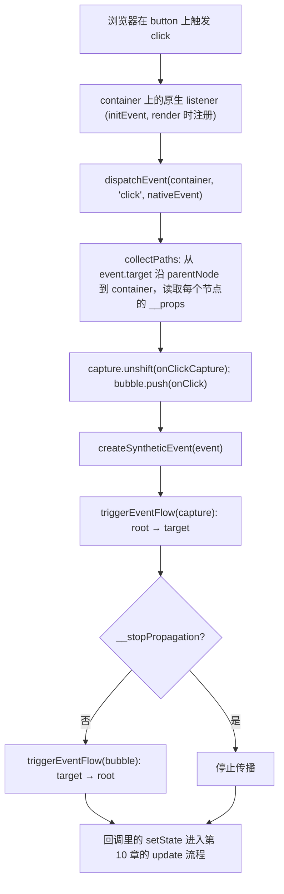

# 第11章：实现事件系统

## 本章定位

- **数据流定位**：消费 root 上的原生事件 → 产出 SyntheticEvent、回调执行与 dispatch 调用 → 优先级入口被第 18 章接入。
- **难度**：★★★☆☆ —— 事件系统是一层独立的「浏览器语义 → React 调度语义」翻译层，接口不多，但传播顺序与 props 缓存需要串成一条线。
- **前置依赖**：第 6 章（ReactDOM 与 hostConfig、`createRoot`）、第 10 章（update 流程与 HostComponent update 占位）。事件系统挂在 root container 上，读取的是渲染时写入的 `__props`。自检：能说出 `createRoot` 时渲染器做了什么；能说出 `onClick` 这个 props 最终存在哪、什么时候被刷新。
- **读后检验**：能画出一张「一次 click 从浏览器到回调执行」的调用链，标出收集与执行两个分离的阶段；能解释为什么 root listener 不变却总能读到最新闭包。

事件系统属于 `react-dom`，不属于 `react-reconciler`。Reconciler 只负责把 `onClick` 这样的 props 保存到 HostComponent 上；真正监听浏览器事件、模拟捕获冒泡、设置事件优先级，都应该由浏览器 renderer 处理。

## 整体架构思路：root listener 读取节点上的最新 props

```jsx
<div onClickCapture={parentCapture} onClick={parentBubble}>
	<button onClickCapture={childCapture} onClick={childBubble}>
		click
	</button>
</div>
```

点击 button 时，预期顺序是 `parentCapture → childCapture → childBubble → parentBubble`。这里没有四个独立的 React DOM listener；本章要解释 root 上的一次原生 click 如何收集这条路径、读取最新 props，并按两种方向执行。

JSX 中的 `onClick` 是声明式 props，浏览器需要的却是命令式 listener。核心问题是：**React 怎样把大量组件声明的事件统一接入宿主环境，同时始终调用最新回调，并为批处理和优先级建立一个公共入口？**

最直接的方案是在每个 DOM mount/update 时分别 `addEventListener`：

```text
每个节点拥有原生 listener
-> props 变化时移除旧 listener、添加新 listener
-> React 很难统一包裹一次事件传播
```

这不只增加 listener 管理成本，更重要的是失去统一控制边界。React 需要在回调执行前后设置事件优先级、批处理上下文和错误处理，还要模拟一致的 capture/bubble 顺序。因此 renderer 在 root container 注册少量原生 listener，再自行收集并执行路径。

JSX props 保存用户声明的回调，root 上的原生 listener 负责捕获浏览器事件；事件系统在两者之间读取最新 props、收集传播路径并统一执行。

### root 事件委托的整体方案

事件系统需要满足：

1. 每个 DOM 节点不各自注册原生 listener，组件回调作为 props 缓存。
2. 一次事件发生后，按 capture 父到子、bubble 子到父执行。
3. `stopPropagation` 同时影响本次 React 管理的后续回调。
4. 设计目标是读取当前已提交 props，而不是 mount 时的旧闭包。
5. 每个 root 形成独立传播与调度边界。
6. reconciler 不需要理解浏览器的 click/scroll 字符串。

由此得到两层映射：

```text
DOM 节点.__props -> big-react 最近一次 completeWork 写入的 props
root 原生 listener -> 从 event.target 沿 DOM 父链收集回调
```

本章在 HostComponent completeWork 时刷新 `__props`。同步 render 不会在写入与 commit 之间把控制权交给浏览器，因此下一次事件能找到新闭包；第 18 章加入并发让出后，这个写入时机可能提前暴露尚未提交的 props，课程正文没有修正这一点。

### 为什么要先收集路径再执行？

如果边向上遍历 DOM 边调用回调，capture 顺序难以表达，而且前一个回调引起的同步提交可能改变后续节点 props。先收集本次传播快照，再执行两条队列，可以保证本次事件的参与者与顺序稳定：

```text
target -> root 收集
capture.unshift -> root 到 target
bubble.push -> target 到 root
```

这与 state 的 render 快照有相似思想：一次操作先确定输入集合，再执行，不让执行过程随意改变本次语义。

### SyntheticEvent 的架构价值

合成事件不只是抹平浏览器差异。它让 React 拥有一个可以控制传播、设置 Scheduler priority、建立批处理边界和统一错误处理的执行对象。事件系统把浏览器语义翻译成 React 调度语义：

```text
浏览器事件类型 -> React 事件优先级 -> 更新优先级
```

本章只完成 click 传播，没有任何优先级代码。第 18 章会在同一个回调执行入口加入事件优先级上下文，再让 reconciler 选择 Lane。

## 本章实现：一次 click 如何被 React 处理？

### click 事件生命周期账本

| 时刻              | 输入                              | 写入/读取对象              | 消费者                | 结果                               |
| ----------------- | --------------------------------- | -------------------------- | --------------------- | ---------------------------------- |
| Host completeWork | 新 `onClick/onClickCapture` props | DOM 节点的内部 props 缓存  | root listener         | 同步 render 结束后的事件读到新闭包 |
| 原生事件到达 root | `nativeEvent.target`              | capture 与 bubble 回调路径 | SyntheticEvent 执行器 | 本次传播参与者形成稳定快照         |
| 执行 capture      | root → target 队列                | SyntheticEvent 的停止标记  | 用户回调              | 捕获阶段按声明顺序运行             |
| 执行 bubble       | target → root 队列                | 同一 SyntheticEvent        | 用户回调/dispatch     | 冒泡结束后更新进入既有调度入口     |

实现的主线是“最新 props 写到 DOM → root listener 读取 → 收集路径 → 执行队列”。事件委托、SyntheticEvent 和 props 缓存分别服务这条链上的不同交接点，不能拆成互不相关的功能列表。

从 DOM 事件到合成事件，再到事件优先级的入口。

### ReactDOM 与 Reconciler 对接

> **本节数据流**：HostComponent 的新 props → completeWork 写入 DOM 内部缓存 → root listener 在事件发生时读取 → handler 无需重新注册原生 listener。

`elementPropsKey` 与 [updateFiberProps](../../packages/react-dom/src/SyntheticEvent.ts)定义在新建的 `SyntheticEvent.ts`：

```ts
export const elementPropsKey = '__props';

export function updateFiberProps(node: DOMElement, props: Props) {
	node[elementPropsKey] = props;
}
```

这样事件发生时，可以从真实 DOM 节点一路向上读取每个节点的 props，找到对应回调。

写入时机有两个：mount 时 [createInstance](../../packages/react-dom/src/hostConfig.ts)首次写入；update 时 [completeWork](../../packages/react-reconciler/src/completeWork.ts)的 HostComponent update 分支调用 `updateFiberProps(wip.stateNode, newProps)`。也就是说 big-react 在 render 阶段直接修改 current 与 WIP 共用 DOM 实例上的缓存。本章仍是同步 render，所以事件只能在整段 JavaScript 结束后到达；但这不等价于完整 React 的“只暴露已提交 props”保证。

### 事件委托

> **本节数据流**：root container 与支持的事件类型 → 注册稳定原生 listener → nativeEvent 到达统一入口 → React 获得整次传播的控制边界。

React 不会给每个 DOM 节点都绑定原生事件，而是在 root container 上统一监听。对比逐节点直接 `addEventListener`：节点增删不用同步绑解；更重要的是统一入口——所有事件先流经 `dispatchEvent`，再收集捕获与冒泡路径。本章的入口是 [initEvent](../../packages/react-dom/src/SyntheticEvent.ts)，在 `root.render` 时调用：

```ts
export function initEvent(container: Container, eventType: string) {
	if (!validEventTypeList.includes(eventType)) {
		console.warn(`当前不支持${eventType}事件`);
		return;
	}

	container.addEventListener(eventType, (event) => {
		dispatchEvent(container, eventType, event);
	});
}
```

big-react 本章只支持：

```ts
const validEventTypeList = ['click'];
```

注意一个实际缺陷：`initEvent` 写在 `render` 里，每次 render 都会重复 `addEventListener`，所以一次 click 可能触发多份相同分发流程。课程正文没有加入注册去重。

### 模拟浏览器事件流程

> **本节数据流**：event.target → 沿 DOM 父链读取缓存 props → 写 capture/bubble 回调数组 → 分别按 root→target、target→root 执行。

浏览器事件有两个主要阶段：

```text
capture: root -> target
bubble:  target -> root
```

React props 中对应：

- `onClickCapture`
- `onClick`

事件触发时，`dispatchEvent` 先调用 [collectPaths](../../packages/react-dom/src/SyntheticEvent.ts)收集路径：

```ts
function collectPaths(
	targetElement: DOMElement,
	container: Container,
	eventType: string
) {
	const paths: Paths = {
		capture: [],
		bubble: []
	};

	while (targetElement && targetElement !== container) {
		// 收集
		const elementProps = targetElement[elementPropsKey];
		if (elementProps) {
			const callbackNameList = getEventCallbackNameFromEventType(eventType);
			callbackNameList?.forEach((callbackName, index) => {
				const eventCallback = elementProps[callbackName];
				if (eventCallback) {
					if (index === 0) {
						paths.capture.unshift(eventCallback);
					} else {
						paths.bubble.push(eventCallback);
					}
				}
			});
		}
		targetElement = targetElement.parentNode as DOMElement;
	}

	return paths;
}
```

`capture.unshift` 是为了让父节点捕获回调排在子节点前面；`bubble.push` 则自然从 target 往 root 执行。回调名由 `getEventCallbackNameFromEventType`（`SyntheticEvent.ts`）映射：`click -> ['onClickCapture', 'onClick']`，列表第 0 项进 capture、其余进 bubble。

### SyntheticEvent

> **本节数据流**：nativeEvent → SyntheticEvent 包装传播状态与 currentTarget → 回调执行器读取/更新这些字段 → stopPropagation 能停止剩余合成队列。

本章的 SyntheticEvent 没有创建新对象，而是把原生 Event 断言为扩展类型，并改写它的 `stopPropagation`。目的只是增加一个 React 队列可读取的停止标记。实现位于 [createSyntheticEvent](../../packages/react-dom/src/SyntheticEvent.ts)：

```ts
interface SyntheticEvent extends Event {
	__stopPropagation: boolean;
}
```

实现 `stopPropagation`：

```ts
function createSyntheticEvent(event: Event) {
	const syntheticEvent = event as SyntheticEvent;
	syntheticEvent.__stopPropagation = false;
	const originStopPropagation = event.stopPropagation;
	syntheticEvent.stopPropagation = () => {
		syntheticEvent.__stopPropagation = true;
		if (originStopPropagation) {
			originStopPropagation.call(event);
		}
	};
	return syntheticEvent;
}
```

执行回调时，[triggerEventFlow](../../packages/react-dom/src/SyntheticEvent.ts)逐个执行路径上的回调，如果发现 `__stopPropagation`，就停止后续回调。

### 本章边界：回调直接执行

本章的 `triggerEventFlow` 直接调用 `callback(se)`，没有 Scheduler 上下文，也没有事件类型到更新优先级的映射。因此当前 click 只是触发已有 dispatch；第 18 章才会在这个入口增加优先级转换。

#### 易错点

- 更新 props 后必须刷新 DOM 上缓存的 props，否则事件回调会闭包过期。
- 捕获阶段顺序是父到子，冒泡阶段顺序是子到父。
- `stopPropagation` 应该阻止后续合成事件回调。
- 事件系统应留在 `react-dom`，不要侵入 reconciler。

#### 为什么委托在 root 而不是 document？

现代 root API 允许页面存在多个 React root。把监听器挂在各自 container 上可让事件边界与 root 边界一致，避免一个 root 的合成传播无条件穿过另一个 root，也便于卸载和多版本共存。big-react 目前只支持 click，但数据流已按 root 委托建立。

#### 一次 click 的完整路径



收集与执行分开有两个好处：传播顺序明确；执行过程中 DOM 或 props 变化不会改变本次已确定的路径。

#### 为什么在 DOM 上缓存 props？

事件委托不会为每个 DOM 节点绑定其 React 回调。因此事件触发时必须能从目标 DOM 找回最新 JSX props。`updateFiberProps(node, newProps)` 就建立了这个映射。本章仍会在每次 `root.render` 重复调用 `initEvent`，这是注册层的已知缺陷，不影响“listener 执行时读取缓存”这条数据链。

不能只在 mount 缓存：

```jsx
<button onClick={() => console.log(count)} />
```

每次 render 都产生捕获新 count 的回调。DOM listener 没变，但 `__props` 必须更新，否则合成事件一直读旧闭包。

#### SyntheticEvent 本章只控制传播

本章没有实现跨浏览器字段规范化，只借用原生 Event 增加 React 可控制的传播状态：

- 包装 stopPropagation 并停止后续 React 回调。
- capture 队列停止后，不再进入 bubble 队列。

big-react 直接改写原生事件；它不会在执行每个回调时把 `currentTarget` 设置成对应 DOM 节点。官方 React 的事件插件、支持类型和字段规范化逻辑更复杂。

## 与官方 React 的差异

| 能力           | big-react                                                                         | 官方 React                                                                                                 |
| -------------- | --------------------------------------------------------------------------------- | ---------------------------------------------------------------------------------------------------------- |
| 委托位置       | 只支持 click，且每次 `root.render` 都会重复注册 listener                          | 官方在 root container 注册全部「all native events」，并对注册去重                                          |
| 合成事件       | 直接复用原生 Event，只改写 `stopPropagation` 并增加停止标记                       | 官方用事件插件（SyntheticMouseEvent 等）规范化 `currentTarget`、`preventDefault`、`nativeEvent` 等大量字段 |
| 收集路径       | 沿 DOM `parentNode` 逐级读 `__props`                                              | 官方维护独立的 fiber -> DOM 映射，用 `getClosestInstanceFromNode` 从 target 找 fiber 再向上收集            |
| 优先级入口     | 本章无任何优先级代码，`eventTypeToSchedulePriority` 与 Scheduler 包裹第 18 章加入 | 官方完整接入 Lane 体系与连续/离散事件分类                                                                  |
| props 缓存时机 | update 的 completeWork 直接写共享 DOM；第 18 章并发让出后可能暴露未提交 handler   | 官方在提交相关路径更新节点 props 缓存，事件读取与 current 树保持一致                                       |

big-react 保留了两条最重要的架构决策：**root 委托**与**执行时读最新缓存**。插件化的跨浏览器抹平、事件池等属于工程细节，不影响主线。

## 思考题

### Q1: `<button onClick={handleClick}>` 为什么不等于给 button 直接调用 `addEventListener`？

JSX 中的 onClick 先作为 props 写入 ReactElement，HostComponent mount/update 时把最新 props 缓存在对应 DOM 节点上；真正的原生 listener 注册在 root container。事件发生后，root listener 根据 event.target 沿 DOM 向上收集缓存中的回调，再由 React 模拟捕获和冒泡执行。这样 onClick 是声明数据，而不是组件 render 时立即产生的浏览器订阅。本章由此获得一处统一的路径收集和回调执行入口；优先级尚未接入。

### Q2: root listener 为什么能在组件更新后读到新闭包？

root listener 没有闭包捕获某个组件的初始 handler，它在每次事件到来时动态读取目标路径上的 DOM props 缓存。HostComponent 的 completeWork update 分支调用 `updateFiberProps`，所以本章同步 render 返回后会读到新 onClick；若缓存不刷新，复用的 DOM 会长期读取旧 state。本章还存在重复注册 listener 和写入时机过早两个缺口，不能把“执行时查缓存”进一步等同于“并发下必然只读已提交 handler”。

### Q3: 为什么事件委托挂在 root 而不是全局 document？

一个页面可以有多个独立 createRoot。把 listener 挂在各自 container 后，`collectPaths` 遍历到本 root 就停止，不会继续收集 container 之外的 props；这让事件收集边界与渲染根边界一致。若统一挂到 document，本章算法就需要额外判断目标属于哪个 root，多个应用也更容易互相进入对方的收集路径。当前 big-react 还没有 root 卸载与 listener 清理，不能把“挂在 container”进一步等同于完整生命周期管理。

### Q4: 为什么先收集 capture/bubble 路径，再执行回调？

收集阶段从 target 向 root 读取每层最新 props，同时分别构造 capture 与 bubble 队列；执行阶段再按 root→target 和 target→root 顺序调用。这样遍历 DOM、决定顺序和响应 `stopPropagation` 是三个可分离步骤。若边向上找节点边执行，capture 顺序天然相反，某个回调修改 DOM 后还可能改变尚未收集的路径。先收集相当于为本次事件建立一份稳定的回调快照；本章没有为每个回调设置对应的 `currentTarget`。

### Q5: `stopPropagation` 在 big-react 中阻止的是原生传播还是合成队列？

本章直接改写原生事件的 `stopPropagation`：调用时先把 `__stopPropagation` 设为 true，再调用原生方法。`triggerEventFlow` 每执行一个回调后检查这个字段，因此既能停止当前 capture/bubble 数组的剩余回调，也能阻止 capture 停止后继续进入 bubble。原生方法负责浏览器传播，额外字段负责已经收集好的 React 队列；二者解决的不是同一层问题。

## 本章小结

本章先用 root 委托、DOM props 缓存与合成传播打通 click 事件；第 18 章再让事件回调建立 Scheduler priority 上下文，并映射到 SyncLane、InputContinuousLane 等更新优先级。

不过，子节点协调只覆盖单节点：组件返回一个列表时，增删、排序、key 匹配的复用与移动规则还不存在。多节点 diff，是第 12 章。
