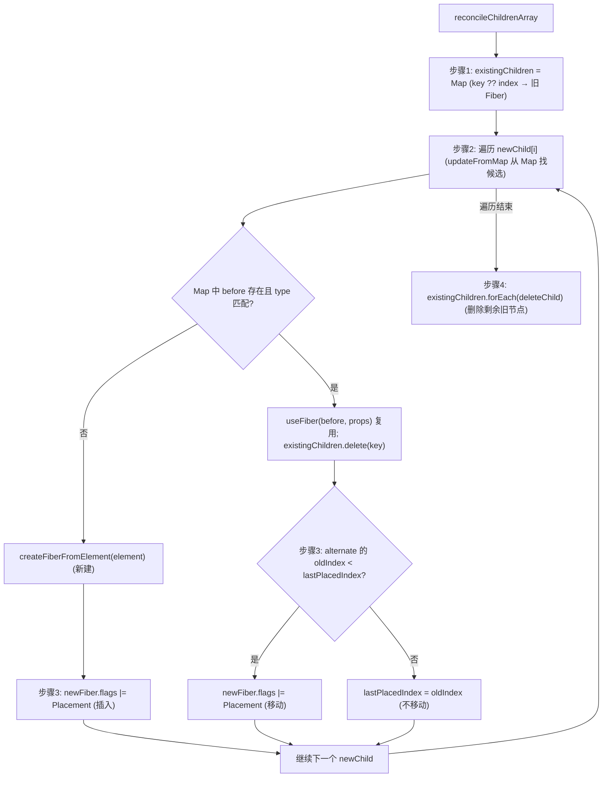

# 第12章：实现 Diff 算法

## 本章定位

- **数据流定位**：消费旧 children Fiber 与新 ReactElement 数组 → 产出 Placement/ChildDeletion 等标记 → 被 commit 的插入与删除消费。
- **难度**：★★★★☆ —— 多节点 diff 把「key 匹配 + 移动判定 + 删除收集」三条线叠在一起，还要理解 commit 阶段 `Placement` 如何落到宿主锚点。
- **前置依赖**：第 3 章（Fiber 双缓存与 alternate、`index`/`sibling` 链）、第 10 章（单节点复用与 `deletions`）。多节点 diff 是单节点复用规则的数组形态。自检：能说出单节点复用的 key/type 判断；知道 `Placement`/`ChildDeletion` 两个 flag 的语义；知道父 Fiber 的 `deletions` 列表为什么存在。
- **读后检验**：能画出一张多节点 diff 的四步决策图（建 Map → 遍历匹配 → `lastPlacedIndex` 判定移动 → 删除剩余）；能手算一个重排例子的每个新节点该不该标 `Placement`。

前面只处理了“更新后是单个节点”的情况。本章实现同级多节点 diff，例如列表新增、删除、移动。React diff 的核心前提是：只比较同级节点，跨层级移动会被视为删除加新增。

## 整体架构思路：用稳定身份换取线性协调

两棵任意树求理论最小编辑序列代价很高，而 UI 每次更新都要及时响应。React 面临的是：**怎样在可接受的 O(n) 成本内，尽量复用拥有相同业务身份的同级节点，并生成足够少且正确的插入、移动和删除？**

如果按数组下标逐项比较：

```text
old: A B C
new: X A B C
```

会把 A 当成 X、B 当成 A、C 当成 B，最后再创建 C。DOM 也许能被改成正确文本，但每个节点绑定的组件 state 会整体错位。这说明 diff 首先保护的是节点身份，DOM 操作数量只是结果之一。

Diff 必须先回答“新旧节点是不是同一个”，再判断这个身份是否需要移动。key/type 决定复用资格，oldIndex 与 lastPlacedIndex 只处理已经匹配节点的位置关系。

### React 为线性复杂度采用的假设

React 不搜索跨层级的任意移动，而采用两条启发：

1. 不同 type 通常代表不同子树，直接重建。
2. 开发者用 key 声明同级节点的稳定身份。

于是问题从“任意树编辑距离”缩小为“当前 parent 下的旧 children 与新 children 如何匹配”。旧节点可按 `key ?? index` 建立 Map，新数组只需线性扫描。

### key 保护的是状态身份

正确 key 应回答“数据项还是不是同一个”，而不是“它现在排第几位”：

```jsx
items.map((item) => <Row key={item.id} item={item} />);
```

复用条件仍是 `key + type`。相同 key 但 type 改变，组件语义不同，不能保留旧 state；相同 type 但 key 改变，则是开发者明确声明了新身份。

### `lastPlacedIndex` 如何判断移动？

扫描新 children 时，已匹配旧 Fiber 带有旧 `index`。`lastPlacedIndex` 保存目前为止无需移动节点的最大旧位置：

```text
oldIndex >= lastPlacedIndex
-> 仍在已确认节点之后，不必向前移动

oldIndex < lastPlacedIndex
-> 它在旧树中过早出现，如今必须移动到当前位置之后
```

这个算法不保证全局最少移动，但以 O(n) 得到稳定且正确的结果。理解目标函数非常重要：React 选择的是响应时间、实现复杂度与宿主操作之间的工程折中。

### render 只表达结构意图

reconcile 阶段输出的是：

```text
复用 -> createWorkInProgress
新增/移动 -> Placement
旧节点剩余 -> ChildDeletion
```

commit 阶段再用 `getHostSibling` 找稳定锚点并执行 insertBefore/appendChild。逻辑 Fiber 可能没有 DOM，因此查找锚点必须跳过待 Placement 的节点并穿过组件/Fragment。

## 本章实现：单节点到多节点的 Diff 改造

### 多节点 Diff 对象变化账本

| 轮次       | 输入                            | 写入对象/字段                             | 消费者           | 结果                                  |
| ---------- | ------------------------------- | ----------------------------------------- | ---------------- | ------------------------------------- |
| 建立候选集 | 旧 sibling Fiber 链             | `existingChildren: Map<key/index, Fiber>` | 新 children 扫描 | 旧节点可按稳定身份查询                |
| 匹配新节点 | 新 ReactElement 与候选 Fiber    | 新/WIP Fiber 的 `alternate/index/return`  | `placeChild`     | key 与 type 决定复用或创建            |
| 判断位置   | `oldIndex` 与 `lastPlacedIndex` | Fiber 的 `Placement` flag                 | commitPlacement  | 新增或需要向前移动的节点被标记        |
| 收集删除   | Map 中未被复用的旧 Fiber        | 父 Fiber 的 `deletions/ChildDeletion`     | commitDeletion   | 已离开新 sibling 链的节点仍可达       |
| 宿主落位   | Placement Fiber                 | Host sibling 锚点                         | hostConfig       | insertBefore/appendChild 得到正确顺序 |

手算 Diff 时只按表中五轮更新字段，不要一开始就猜 DOM 操作。render 先确定身份与结构意图，commit 才把 flags 翻译为宿主位置。

reconcile 的单节点改动与同级多节点 diff。

### 12-1 实现单节点 Diff

> **本节数据流**：旧单 child Fiber 与新 element/text → key/type 判断 → 复用 WIP 或记录删除 → 返回唯一的新 child。

本步给单节点复用补上 current 一侧：`reconcileSingleElement` 与 `reconcileSingleTextNode` 比较 currentFiber，能复用则复用，不能复用的旧节点收集删除。

#### 对 reconcileSingleElement 的改动

单节点更新时，需要处理旧 children 可能是多个节点的情况：

```text
old: A B C
new: A
```

如果 A 可复用，那么 B、C 都应该删除。

判断规则就是 [reconcileSingleElement](../../packages/react-reconciler/src/childFibers.ts)里的 while 循环：

1. `key` 相同，`type` 相同：复用当前节点，删除剩余旧 sibling。
2. `key` 相同，`type` 不同：后续旧节点都不可能复用，删除所有旧节点。
3. `key` 不同：当前旧节点不能复用，删除当前旧节点，继续看下一个 sibling。

伪代码：

```ts
while (currentFiber !== null) {
	if (currentFiber.key === key) {
		if (currentFiber.type === element.type) {
			const existing = useFiber(currentFiber, element.props);
			existing.return = returnFiber;
			// 当前节点可复用，标记剩下的节点删除
			deleteRemainingChildren(returnFiber, currentFiber.sibling);
			return existing;
		}
		// key相同，type不同，删掉所有旧的
		deleteRemainingChildren(returnFiber, currentFiber);
		break;
	} else {
		deleteChild(returnFiber, currentFiber);
		currentFiber = currentFiber.sibling;
	}
}
```

`deleteChild` 把单个旧 Fiber 追加到父 Fiber 的 `deletions`；`deleteRemainingChildren` 则是连续调用 `deleteChild` 直到某个 sibling 为止。两者都在 `childFibers.ts`。

#### 对 reconcileSingleTextNode 的改动

文本节点没有 key。[reconcileSingleTextNode](../../packages/react-reconciler/src/childFibers.ts)同样改成了 while 循环：只要旧节点是 HostText 就复用并删除剩余 sibling，否则删掉当前旧节点继续看下一个：

```ts
while (currentFiber !== null) {
	if (currentFiber.tag === HostText) {
		// 类型没变，可以复用
		const existing = useFiber(currentFiber, { content });
		existing.return = returnFiber;
		deleteRemainingChildren(returnFiber, currentFiber.sibling);
		return existing;
	}
	deleteChild(returnFiber, currentFiber);
	currentFiber = currentFiber.sibling;
}
```

### 12-2 实现多节点 Diff

> **本节数据流**：旧 sibling 链与新数组 → Map 匹配并写入 index/alternate → `lastPlacedIndex` 标记移动 → 剩余旧 Fiber 进入 deletions。

本步支持同级多节点：旧 sibling 放进 Map、遍历新 children 判断复用、判定插入或移动、删除 Map 中剩余旧节点。

#### 对同级多节点 Diff 的支持

多节点 diff 的入口是 [reconcileChildrenArray](../../packages/react-reconciler/src/childFibers.ts)，它处理三类副作用：

- 插入：新节点没有可复用旧 Fiber，标记 `Placement`。
- 删除：旧 Fiber 没被新 children 消费，标记 `ChildDeletion`。
- 移动：旧 Fiber 可复用，但它在旧列表中的位置相对落后，标记 `Placement`。

整体流程分四步，决策树如下（图中只画了 ReactElement 分支，HostText 走同一套 Map 查找，只是按 index 匹配）：



##### 步骤 1：把旧 sibling 放进 Map

在 [reconcileChildrenArray](../../packages/react-reconciler/src/childFibers.ts)里：

```ts
const existingChildren: ExistingChildren = new Map();
let current = currentFirstChild;

while (current !== null) {
	const keyToUse = current.key !== null ? current.key : current.index;
	existingChildren.set(keyToUse, current);
	current = current.sibling;
}
```

`ExistingChildren` 是同文件里定义的类型别名：`Map<string | number, FiberNode>`。

如果有 key，用 key；没有 key，用 index。key 的价值就在这里：它给节点一个跨位置变化仍然稳定的身份。

##### 步骤 2：遍历新 children，判断是否复用

for 循环里先用 `updateFromMap` 拿新 Fiber，再维护三个变量：`lastPlacedIndex`（移动判定，见步骤 3）、`firstNewFiber`/`lastNewFiber`（把新 Fiber 逐个串成 sibling 链，循环结束返回 `firstNewFiber`）。

[updateFromMap](../../packages/react-reconciler/src/childFibers.ts)负责从 Map 中找候选并校验类型：

1. 就地计算 key：`element.key !== null ? element.key : index`（没有独立的提取函数）。
2. 从 Map 中找到候选旧 Fiber。
3. 字符串/数字按 HostText 处理：候选 tag 是 HostText 就 `useFiber` 复用，否则新建。
4. ReactElement 分支判断 type 是否匹配，匹配则 `useFiber` 复用并从 Map 删除。
5. 不匹配则创建新 Fiber。

ReactElement 分支的核心逻辑：

```ts
const keyToUse = element.key !== null ? element.key : index;
const before = existingChildren.get(keyToUse);

// ...
if (before) {
	if (before.type === element.type) {
		existingChildren.delete(keyToUse);
		return useFiber(before, element.props);
	}
}
return createFiberFromElement(element);
```

本章的 `updateFromMap` 只有 HostText 与 ReactElement 两个分支；数组类型的 child 只留了 `__DEV__` 下的 warn 占位。

##### 步骤 3：判断插入或移动

使用 `lastPlacedIndex` 记录“已经确认不需要移动的旧节点最大 index”。

```ts
const current = newFiber.alternate;

if (current !== null) {
	const oldIndex = current.index;
	if (oldIndex < lastPlacedIndex) {
		// 移动
		newFiber.flags |= Placement;
		continue;
	} else {
		// 不移动
		lastPlacedIndex = oldIndex;
	}
} else {
	// mount
	newFiber.flags |= Placement;
}
```

这段判定之前还有一个 `if (!shouldTrackEffects) continue;`——mount 阶段（`mountChildFibers`）不追踪副作用，不需要打任何标记。

例子：

```text
old: A(0) B(1) C(2)
new: C A B
```

遍历新列表：

- C oldIndex=2，`lastPlacedIndex=0`，不移动，更新为 2。
- A oldIndex=0，小于 2，标记移动。
- B oldIndex=1，小于 2，标记移动。

这表示以 C 为锚点，A/B 需要移动到 C 后面。

##### 步骤 4：删除 Map 中剩余旧节点

遍历结束后，Map 中没被消费的旧 Fiber 都不存在于新 children 中，`deleteChild` 把它们记入父 Fiber 的 `deletions`：

```ts
existingChildren.forEach((fiber) => {
	deleteChild(returnFiber, fiber);
});
```

### 12-3 Diff 算法处理 commit 阶段

> **本节数据流**：Placement Fiber → `getHostSibling` 找稳定锚点 → hostConfig insert/append → 新宿主顺序与 WIP sibling 顺序一致。

本步处理 Diff 的 commit 阶段：Placement 与 ChildDeletion 在多节点场景下的执行，重点是移动操作——render 阶段的标记到这里才真正改变 DOM 结构。

#### 移动操作的执行

移动和插入都使用 `Placement`，commit 阶段 [commitPlacement](../../packages/react-reconciler/src/commitWork.ts)先拿宿主父节点和稳定锚点，再交给递归函数执行：

```ts
// parent DOM
const hostParent = getHostParent(finishedWork);

// host sibling
const sibling = getHostSibling(finishedWork);

// finishedWork ~~ DOM
if (hostParent !== null) {
	insertOrAppendPlacementNodeIntoContainer(finishedWork, hostParent, sibling);
}
```

`insertOrAppendPlacementNodeIntoContainer` 遇到 HostComponent/HostText 时：有 `before` 锚点就插入到它前面，否则 append 到父节点末尾；遇到组件类 Fiber 则递归处理它的 child 与 sibling：

```ts
if (finishedWork.tag === HostComponent || finishedWork.tag === HostText) {
	if (before) {
		insertInstanceToContainer(finishedWork.stateNode, hostParent, before);
	} else {
		appendChildToContainer(hostParent, finishedWork.stateNode);
	}
	return;
}
```

`getHostParent` 沿 return 向上找最近的 HostComponent/HostRoot 拿到容器；`getHostSibling`（两者都在 `commitWork.ts`）则要在 Fiber 树里跳过带 `Placement` 的节点、穿过函数组件与 Fragment，找到第一个稳定宿主兄弟。

宿主侧，react-dom 的 hostConfig 在本章新增 [insertChildToContainer](../../packages/react-dom/src/hostConfig.ts)，内部就是 `container.insertBefore(child, before)`。DOM 的 `insertBefore` 对已经存在的节点有移动语义，所以插入和移动可以复用同一套提交逻辑。

> 注意本章进度下的一个已知缺陷：上面递归函数里调用的是 `insertInstanceToContainer`，但 hostConfig 导出的名字是 `insertChildToContainer`，两者在本章还没接上（这个调用甚至没有对应导入）。要到第 14 章（14-4）才统一为 `insertChildToContainer`。在此之前，demo 里的重排只能验证到标记与锚点逻辑的层面。

#### 易错点

- key 只在同级之间有意义。
- 没有 key 时使用 index，会导致列表重排时复用不稳定。
- `Placement` 同时表示插入和移动。
- 删除旧节点要挂到父 Fiber 的 `deletions` 上，而不是挂到被删除 Fiber 自己身上。

#### Diff 的目标函数不是“DOM 操作绝对最少”

任意树编辑距离代价很高。React 采用两个工程假设把问题降维：只比较同层；开发者用 key 表达跨 render 的稳定身份。big-react 再用 Map 将旧 siblings 按 `key ?? index` 索引，使常见列表协调近似 O(n)。

因此 diff 优先保证的是状态身份正确与线性性能，而不是在所有输入下生成理论最少 DOM 操作。

#### `lastPlacedIndex` 为什么能识别移动？

遍历新列表时，记录目前已经复用节点中最大的旧 index：

```text
old: A(0) B(1) C(2) D(3)
new: B    A    D    C

B oldIndex=1，lastPlacedIndex=1，不移动
A oldIndex=0 < 1，需要 Placement
D oldIndex=3，lastPlacedIndex=3，不移动
C oldIndex=2 < 3，需要 Placement
```

直觉是：新列表从左向右形成一条“无需向左搬动”的旧索引单调序列。落在最大索引左侧的复用节点，必须移动到当前新位置。新建 Fiber 没有旧 index，也标 Placement。

这个算法不一定移动次数最少，但判定简单、稳定，并与按新顺序提交配合。

#### key 实际保护的是状态身份

把输入框列表首部插入一项：如果没有 key，React 只能按 index 尝试复用，旧第 0 个 Fiber 可能被当成新第 0 项，内部 state 或 DOM 输入状态就跟错数据。稳定 key 使数据实体与 Fiber/Hook 状态一一对应。

所以“key 是为了提高 diff 性能”只说对一半。更重要的是告诉 React 哪个旧状态属于哪个新元素。使用随机 key 会让每次 render 全部失去身份；使用 index 在仅尾部追加、永不重排的静态列表中才相对安全。

#### getHostSibling 为何复杂？

Placement 需要找到“新节点之后第一个稳定、已存在的宿主兄弟”。Fiber sibling 可能：

- 是函数组件或 Fragment，需要向下找 Host 节点。
- 自己也带 Placement，尚未处于最终 DOM 位置，不能当锚点。
- 没有 sibling，需要沿 return 向上找叔叔节点。

因此它是在 Fiber 树中搜索一个不带 Placement 的宿主边界，而不是简单读取 `fiber.sibling.stateNode`。

#### 删除与移动为何分开表达？

移动的 Fiber 仍保留 stateNode、state 和 Hook queue，只用 Placement 调整宿主位置；删除则意味着身份消失，本章会遍历旧子树并移除最外层宿主节点。把移动实现成“删除再新建”会错误重置已有状态和宿主实例。

## 与官方 React 的差异

| 能力                      | big-react                                                                              | 官方 React                                                                                |
| ------------------------- | -------------------------------------------------------------------------------------- | ----------------------------------------------------------------------------------------- |
| 多节点 diff 入口          | 直接把所有旧 sibling 放进 Map 再线性扫描                                               | 先从左往右顺序比较，再处理一侧遍历完的边界，乱序剩余部分才建立 Map                        |
| key 处理                  | `key ?? index` 进 Map，key 计算就地内联                                                | 官方对 key 为 null 的节点用 index，思路一致；且区分 `key === null` 与 `key === undefined` |
| 移动判定                  | `lastPlacedIndex` 思路与官方一致                                                       | 同名同思路，官方把这段放在 `placeChild` 里                                                |
| 删除/移动表达             | 删除进父 Fiber `deletions`，移动复用 Fiber 只加 `Placement`                            | 官方一致，移动绝不销毁重建                                                                |
| 文本/数组/Fragment 子节点 | 本章 `updateFromMap` 只有 HostText 与普通 ReactElement；第 13 章补数组与 Fragment 分支 | 官方还处理 Portal、lazy、迭代器（`reconcileChildrenIterator`）等                          |

### 官方 React 为什么不一开始就建立 Map？

big-react 当前实现先把所有旧 children 建成 Map，再遍历新 children 查找，结构简单且接近 O(n)。官方 React 在相同启发式目标上增加三段快速路径：

1. 从左到右逐对比较 key/type，连续匹配就直接复用。
2. 新 children 先结束时，删除剩余旧节点。
3. 旧 children 先结束时，为剩余新节点创建 Fiber。
4. 只有两边都还有未匹配项时，才为剩余旧节点建立 Map。

例如 `A B C → A B C D`，官方 React 顺序复用 A/B/C 后直接创建 D，不需要建 Map；big-react 仍会索引全部旧节点。乱序 `A B C D → C A B E` 才是 Map 路径真正有价值的场景：C/A/B 按 key 复用并由 `lastPlacedIndex` 判断移动，E 新建，Map 中剩余 D 删除。两者保护身份和生成 flags 的原则相同，差距在常见顺序场景的常数开销。

## 思考题

### Q1: React 为什么不求理论最小树编辑距离？

首要目标是以可接受复杂度得到正确身份和顺序，不是求通用树编辑的理论最优解。React 假设不同层级通常不是同一节点，并要求开发者用稳定 key 描述同级身份，把问题限制在线性扫描与 Map 查找。跨层移动会被视为删除加创建，某些序列也可能产生并非最少的移动，但算法能稳定运行在交互预算内。没有这两个假设，通用树编辑距离的成本不适合频繁 UI 更新。

### Q2: diff 的 Placement 为什么不能直接等价为 appendChild？

Placement 只表达“这个 Fiber 的宿主结果需要进入新位置”，没有说明它一定排在父节点末尾。以旧序列 `A B C`、新序列 `C A B` 为例，C 被复用但需要移动到 A 前；若一律 appendChild，C 只会被放到末尾，仍得不到目标顺序。commit 因而调用 `getHostSibling` 向后寻找第一个不带 Placement 的稳定宿主节点：找到就 insertBefore，找不到才 append。查找还必须穿过没有 DOM 的 FunctionComponent/Fragment，同时跳过自身也待移动的节点，否则会选择一个尚未稳定的锚点。

### Q3: key 为什么不能简单使用数组下标？

下标描述当前位置，不描述数据身份；在头部插入或重排后，同一个下标对应了不同业务项。reconciler 会按下标命中错误的旧 Fiber，于是该 Fiber 已保存的 Hook state 和宿主 stateNode 会跟到另一条数据上，而不仅是多做几次 DOM 操作。只有列表完全静态、永不插入删除且子项没有独立状态时，下标才近似稳定 key。已有业务 id 时应让 key 跟随数据，使 Fiber 身份与状态跨位置移动。

### Q4: `key + type` 各自决定身份的哪一部分？

key 解决同级候选中的“找谁”，type 决定找到的旧 Fiber 是否仍代表同一种组件或宿主节点。相同 key 从 `UserRow` 变成 `AdminRow` 时，两种组件函数与 Hook 状态含义不同，不能共享旧工作记录；宿主节点从 div 变 span 也不能复用同一个 DOM 实例。两者都匹配才调用 useFiber，key 匹配但 type 不同则删除旧 Fiber 并创建新 Fiber。key 的作用域只在同一父节点的 children 内，不是全局对象标识。

### Q5: `lastPlacedIndex` 如何判断一个旧节点需要移动？

它记录已经按新顺序处理过、且可以留在原相对位置的旧节点最右索引。新匹配节点的 oldIndex 不小于它，说明相对前序稳定节点无需左移；oldIndex 更小，说明该节点必须移动到前面，因此标 Placement。它只负责 render 阶段的移动判定，不知道具体 DOM 应插到谁前面。commit 还要通过 `getHostSibling` 找到不带 Placement 的稳定宿主锚点，决定 insertBefore 还是 append。

## 本章小结

多节点 diff 的目标不是“找最短编辑距离”，而是在性能和正确性之间做工程折中。React 借助 key、Fiber 复用和 flags，把列表变化转成插入、删除、移动三类提交操作。

不过，「不产生 DOM 的透明节点」还无法表达：组件想返回多个兄弟节点，又不想给 DOM 加多余的包裹，还没有对应的 Fiber 类型。第 13 章的 Fragment 补上这块。
