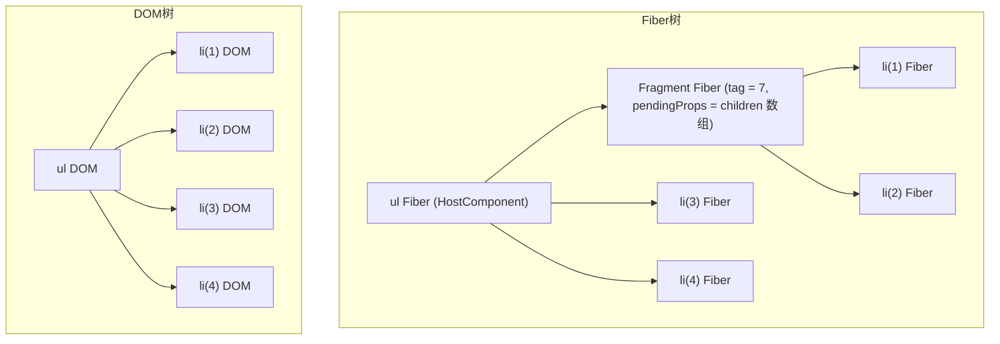
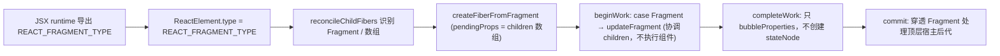

# 第13章：实现 Fragment

## 本章定位

- **数据流定位**：消费 Fragment ReactElement → 产出无 stateNode 的透明 Fiber → 被 reconcile 与 commit 的宿主后代遍历消费。
- **难度**：★★☆☆☆ —— 概念不多，但牵动 child reconciler 与 commit 两个阶段，是理解「Fiber 树与宿主树不同构」的第一个实证。
- **前置依赖**：第 3 章（Fiber 双缓存）、第 5 章（beginWork/completeWork）、第 12 章（多节点 diff）。自检：能说出 `child/sibling/return` 与 `alternate` 的含义；知道 `beginWork`/`completeWork` 各负责什么；知道 `Placement`/`ChildDeletion` 是什么。
- **读后检验**：能画出一棵含 Fragment 的 Fiber 树和对应宿主树；能指出删除 Fragment 时 commit 如何找到所有顶层宿主后代。

Fragment 解决的是“组件结构需要多个子节点，但不想额外创建 DOM”的问题。它在 Fiber 树中存在，但在宿主环境中没有实例。这个特点会影响 child reconciliation、commit 插入、删除和数组 children 的处理。

## 整体架构思路：Fragment 只对宿主树透明

组件经常需要返回多个兄弟，但额外包一层 DOM 会改变布局、CSS 选择器和语义结构。核心问题是：**如何让一组 children 在协调层拥有明确边界和身份，却不在宿主树中制造节点？**

把 Fragment 完全当作语法糖、编译后直接展开 children，看似简单，却不足以覆盖带 key 的 Fragment：

```jsx
items.map((item) => (
	<Fragment key={item.id}>
		<td>{item.name}</td>
		<td>{item.value}</td>
	</Fragment>
));
```

这里每两个 `<td>` 必须作为一个同级身份单元一起复用和移动。如果彻底删除 Fragment 记录，key 就没有可归属的节点，组件组边界也会丢失。因此 Fragment 在 Fiber 树中必须存在，只是在宿主树中透明。

只看下面这段 JSX：

```jsx
<ul>
	<>
		<li>1</li>
		<li>2</li>
	</>
	<li>3</li>
	<li>4</li>
</ul>
```

Fiber 树与宿主树不是同构关系。Fiber 树表达组件身份、协调边界和工作关系；宿主树只表达最终可见实例：



注意三个关键字段：

| 对象           | `tag`              | `stateNode`   | 说明       |
| -------------- | ------------------ | ------------- | ---------- |
| `ul` Fiber     | `HostComponent`(5) | 真实 `ul` DOM | 有宿主实例 |
| Fragment Fiber | `Fragment`(7)      | `null`        | 无宿主实例 |
| `li` Fiber     | `HostComponent`(5) | 真实 `li` DOM | 有宿主实例 |

一个 Fiber 可能没有 `stateNode`，一次 Placement/Deletion 却对应多个宿主后代。commit 必须遍历逻辑子树，找到最外层 HostComponent/HostText；找到宿主节点后又应停止向下重复收集，因为其 DOM 子树已经随父节点移动。

## 本章实现：Fragment 如何进入系统？

### Fragment 生命周期账本

| 阶段               | 输入                              | 写入对象/字段                                | 消费者                | 结果                          |
| ------------------ | --------------------------------- | -------------------------------------------- | --------------------- | ----------------------------- |
| child 归一化       | Fragment element 或 children 数组 | `Fragment` Fiber 的 `key/pendingProps`       | beginWork             | 多个 child 获得可选的分组身份 |
| beginWork          | `pendingProps` 中的 children      | `fragmentFiber.child`                        | work loop             | Fragment 参与逻辑树遍历       |
| completeWork       | 已完成的 Fragment 子树            | 只冒泡 `subtreeFlags`，`stateNode` 保持 null | commit                | 不创建额外宿主实例            |
| Placement/Deletion | Fragment Fiber                    | 向下遍历最外层 Host 后代                     | hostConfig 与卸载流程 | 一次逻辑操作覆盖整组真实节点  |

Fragment 的原理深挖应紧跟这四次交接：为什么需要 Fiber，由 key 的写入解释；为什么没有 DOM，由 completeWork 解释；为什么 commit 必须穿透，由 `stateNode = null` 的结果解释。

JSX runtime 生成的 ReactElement 大致是：

```js
jsxs(Fragment, {
	children: [jsx('div', { children: '1' }), jsx('div', { children: '2' })]
});
```

`type` 是 `REACT_FRAGMENT_TYPE`（[ReactSymbols.ts](../../packages/shared/ReactSymbols.ts)：`Symbol.for('react.fragment')`，无 Symbol 环境退回 `0xeacb`）。`react` 包在 [jsx.ts](../../packages/react/src/jsx.ts) 里导出 `Fragment`（就是 `export const Fragment = REACT_FRAGMENT_TYPE;`），jsx-runtime.ts 与 jsx-dev-runtime.ts 两个入口文件也各自转发，这样 Babel automatic runtime 才能 `import { Fragment, jsx, jsxs } from 'react/jsx-runtime'`。本章的 index.ts 没有导出 `Fragment`，因此 `React.Fragment` 这一 classic runtime 写法不可用；课程正文没有补上这个公开导出。

创建 Fiber 时不能把它当 HostComponent，也不能当 FunctionComponent，而要创建 `Fragment` tag（`Fragment = 7`，`packages/react-reconciler/src/workTags.ts`）：

```ts
// packages/react-reconciler/src/fiber.ts
export function createFiberFromFragment(elements, key) {
	const fiber = new FiberNode(Fragment, elements, key);
	return fiber;
}
```

Fragment 的 `pendingProps` **直接保存 children 数组**，而不是 `{ children: [...] }`。这个数据结构约定贯穿整章。

完整进入链路：



### child reconciler 的三个入口

> **本节数据流**：Fragment element、数组或普通 child → 归一化为 Fragment/子 Fiber → 写入 key、pendingProps 与 sibling 关系 → beginWork 获得统一输入。

[reconcileChildFibers](../../packages/react-reconciler/src/childFibers.ts)里 Fragment 出现在三个位置：

**1. 顶层无 key Fragment 透明化**

```ts
const isUnKeyedTopLevelFragment =
	typeof newChild === 'object' &&
	newChild !== null &&
	(newChild as ReactElement).type === REACT_FRAGMENT_TYPE &&
	(newChild as ReactElement).key === null;
if (isUnKeyedTopLevelFragment) {
	newChild = (newChild as ReactElement)?.props.children;
}
```

当组件只返回一个无 key Fragment 时，它不提供可用于同级 diff 的独立身份，children 可以直接作为本层 reconcile 输入，减少一层 Fiber。注意这只适用于顶层无 key Fragment；同级列表里的 Fragment 仍然需要 Fiber 来参与 diff。

**2. 单元素 reconcile 时的 Fragment 复用**

`reconcileSingleElement`（`childFibers.ts`）中，key 与 type 匹配到旧 Fragment Fiber 时，要把 `props.children` 解包作为新 pendingProps：

```ts
if (currentFiber.type === element.type) {
	let props = element.props;
	if (element.type === REACT_FRAGMENT_TYPE) {
		props = element.props.children;
	}
	const existing = useFiber(currentFiber, props);
	...
}
```

**3. 数组与嵌套 Fragment**

`updateFromMap`（`childFibers.ts`）里，React 支持组件直接返回数组，数组本身也被视为一种 Fragment；数组中若遇到 Fragment element 也走同一入口：

```ts
case REACT_ELEMENT_TYPE: {
	if (element.type === REACT_FRAGMENT_TYPE) {
		return updateFragment(returnFiber, before, element, keyToUse, existingChildren);
	}
	...
}
...
if (Array.isArray(element)) {
	return updateFragment(returnFiber, before, element, keyToUse, existingChildren);
}
```

```ts
// childFibers.ts 的 updateFragment
function updateFragment(returnFiber, current, elements, key, existingChildren) {
	let fiber;
	if (!current || current.tag !== Fragment) {
		fiber = createFiberFromFragment(elements, key);
	} else {
		existingChildren.delete(key);
		fiber = useFiber(current, elements);
	}
	fiber.return = returnFiber;
	return fiber;
}
```

这样数组 children 能进入统一的 Fiber 流程，keyed Fragment 也能在 `existingChildren` 中按 key 匹配复用。

### beginWork 只协调 children

> **本节数据流**：Fragment.pendingProps → reconcileChildren → 写 Fragment.child → work loop 进入实际子节点，期间不创建宿主实例。

[beginWork](../../packages/react-reconciler/src/beginWork.ts)对 Fragment 不执行组件、不创建实例：

```ts
case Fragment:
	return updateFragment(wip);
```

```ts
function updateFragment(wip: FiberNode) {
	const nextChildren = wip.pendingProps;
	reconcileChildren(wip, nextChildren as ReactElement);
	return wip.child;
}
```

### completeWork 只冒泡

> **本节数据流**：已完成的 Fragment 子树 → 汇总 subtreeFlags → 父 Fiber/commit 消费 → Fragment.stateNode 仍为 null。

[completeWork](../../packages/react-reconciler/src/completeWork.ts)把 Fragment 与 HostRoot、FunctionComponent 一起归入「只冒泡」分支，不创建宿主对象：

```ts
case HostRoot:
case FunctionComponent:
case Fragment:
	bubbleProperties(wip);
	return null;
```

### commit 穿透 Fragment 处理宿主后代

> **本节数据流**：Fragment 上的 Placement/Deletion → 深度查找最外层 Host 后代 → hostConfig 插入/删除 → 逻辑分组映射为多个宿主操作。

**插入**：[commitPlacement](../../packages/react-reconciler/src/commitWork.ts)对没有宿主实例的 Fiber，递归找子树的顶层 Host 节点插入。`insertOrAppendPlacementNodeIntoContainer` 遇到 Fragment 会继续向下，且要遍历**所有 sibling**，因为一个 Fragment 可能展开出多个并列宿主后代：

本章沿用第 12 章的一个缺口：有稳定 `before` 锚点时仍调用未定义的 `insertInstanceToContainer`，而 hostConfig 实际导出 `insertChildToContainer`。因此首次 mount 走 append 分支可以插入 Fragment，涉及 `insertBefore` 的 Fragment 重排仍会失败；第 14 章统一函数名后才接通该分支。

```ts
if (finishedWork.tag === HostComponent || finishedWork.tag === HostText) {
	...
	return;
}
const child = finishedWork.child;
if (child !== null) {
	insertOrAppendPlacementNodeIntoContainer(child, hostParent, before);
	let sibling = child.sibling;
	while (sibling !== null) {
		insertOrAppendPlacementNodeIntoContainer(sibling, hostParent, before);
		sibling = sibling.sibling;
	}
}
```

**删除**：删除 Fragment 时，不能直接对 Fragment 执行 `removeChild`，因为它没有 DOM。`commitDeletion` 通过 `commitNestedComponent` 递归遍历整棵逻辑子树，遇到 HostComponent/HostText 时用 `recordHostChildrenToDelete` 收集「需要直接从同一个宿主父节点移除的最外层 Host children」：

```text
delete Fragment
  -> commitNestedComponent 递归
  -> 遇到 li(1)、li(2)：recordHostChildrenToDelete 收集
  -> removeChild(ul, li(1))、removeChild(ul, li(2))
```

`recordHostChildrenToDelete` 的职责是收集需要直接从同一个宿主父节点移除的最外层 Host children，避免既删父 DOM 又重复删它的后代。Fragment 自身没有 DOM，但它不能阻断对子树的遍历；本章删除链只处理宿主结构。

#### Fragment 对通用算法提出的要求

- child reconciler 必须接受数组作为 Fragment 的 pendingProps。
- beginWork 只协调其 children，不执行组件，也不创建实例。
- completeWork 不创建宿主对象，但要冒泡 subtreeFlags。
- Placement 要插入所有顶层宿主后代。
- Deletion 要删除所有顶层宿主后代并执行整棵逻辑子树的卸载副作用。

## 与官方 React 的差异

| 能力                  | big-react                                                                                  | 官方 React                                         |
| --------------------- | ------------------------------------------------------------------------------------------ | -------------------------------------------------- |
| 顶层无 key Fragment   | `reconcileChildFibers` 里 `isUnKeyedTopLevelFragment` 解包                                 | 同样做法，官方 `ReactChildFiber.js` 也有这一段判断 |
| Fragment Fiber        | `tag = 7`，`pendingProps` 存 children 数组                                                 | 同样；官方还有 `Mode` 等额外字段                   |
| 删除收集              | `recordHostChildrenToDelete` 基本形态；第 22 章加入 `Offscreen`、`Suspense` 后扩展边界处理 | 同名且职责一致，官方覆盖的边界与异常分支更多       |
| `React.Fragment` 导出 | 只有 jsx-runtime 两个入口导出；index.ts 未导出，课程正文不支持 `React.Fragment`            | 官方两个 runtime 入口与 `React.Fragment` 同时可用  |

## 思考题

### Q1: Fragment 没有 DOM，为什么不能总在编译时删除？

DOM 透明不等于协调透明。带 key Fragment 能把多个 children 作为一个同级身份单元参与复用、移动和删除，Fragment Fiber 正是 key 的归属节点与组边界。它还让 beginWork/completeWork/commit 能在逻辑树中保留明确层级，即使 stateNode 为 null。若编译器无条件展开 Fragment，`items.map(item => <Fragment key={item.id}>...</Fragment>)` 中每组 children 的整体身份会消失。

### Q2: 一个 Fragment 在 Fiber 树和宿主树中分别长什么样？

Fiber 树保留 `Fragment(tag=7)`，它的 pendingProps 直接是 children，child/sibling/return 把它接入逻辑结构；宿主树没有对应节点，只包含 Fragment 展开的 HostComponent/HostText。beginWork 对它只协调 children，completeWork 只冒泡 flags，不创建 stateNode。commit 遇到 Fragment 的 Placement 或 Deletion 时必须向下找到最外层 Host 后代。两棵树的差异说明 Fiber 还表达身份、状态和工作边界，不只是 DOM 的镜像。

### Q3: 带 key Fragment 的 key 保护了什么身份？

首先保护整组 Fragment Fiber 的身份：同级 Diff 用 key 找到旧 Fragment，再复用它的逻辑边界；随后组内 children 才在这个边界下继续各自协调。这样成对的表格单元格或一组列表节点能共同跟随业务项移动，组内组件 state 也不会仅因外层位置变化而绑定到别组。若 key 改变，旧组进入删除，新组按 mount 处理。key 并不会自动替代组内 children 自己需要的稳定 key。

### Q4: 插入或删除 Fragment 时，怎样避免漏节点或重复操作？

从 Fragment.child 开始深度遍历，遇到 HostComponent 或 HostText 就执行插入并停止进入它的 child，因为该宿主节点的 DOM 子树已经在 completeWork 组装好；随后继续 sibling，覆盖 Fragment 展开的所有并列宿主后代。若遇到 FunctionComponent 或嵌套 Fragment，则继续向下穿透。只处理第一个 Host 会漏节点，找到 Host 后仍继续深入则会把嵌套 DOM 重复插入。删除时同样只收集相对于同一宿主父节点的最外层 Host 后代，避免父 DOM 与内部 DOM 被重复移除。

### Q5: 顶层无 key Fragment 为什么可以被透明化？

组件返回的唯一顶层无 key Fragment 不参与同级身份竞争，也不提供可观察宿主节点，把它直接解包成 children 不改变匹配语义。keyed Fragment 明确承担一组 children 的身份，删除 Fiber 会使 key 无处归属；列表中的 Fragment 还可能影响同级位置与分组边界。透明化判断因此必须同时限制“顶层”和“无 key”，不能仅看 Fragment 没有 DOM。它是有条件的实现优化，不是 Fragment 的普遍语义。

### Q6: 组件直接返回数组与返回 Fragment 有什么共同点和差异？

二者都表示一个组件结果中包含多个 sibling，child reconciler 可以把数组包装进 Fragment Fiber 以复用统一遍历。显式 Fragment element 还能携带 key，在父级同级 Diff 中形成稳定分组身份；裸数组本身没有这样的 element key 边界，数组中的每个 child 仍需各自 key。实现上二者最终都调用 `updateFragment`，pendingProps 保存 elements 数组。理解这个统一入口后，就不会把 Fragment 当成仅由 JSX 编译器处理的语法符号。

## 本章小结

Fragment 是“有 Fiber、无宿主实例”的节点。它让组件能返回多个子节点，同时保持 DOM 结构干净。实现 Fragment 后，reconciler 和 commit 阶段都必须习惯：不是每个 Fiber 都有对应的 DOM。
