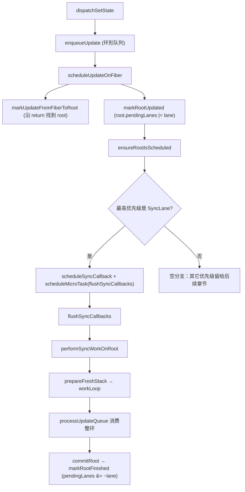

# 第14章：实现同步调度流程

## 本章要解决的问题

一次点击里如果连续调用三次 `setState`，React 不会傻乎乎地做三轮 render——它会先把三次更新意图都记下来，等这轮事件处理完，再一次性算出最终结果、提交一次。本章要做的，就是在“触发更新”和“真正执行更新”之间，插入这样一层“先记账、再统一结算”的调度机制，并用二进制位（Lane）来表达“这次更新有多急”。

## 本章定位

- **数据流定位**：消费 Update 与 lane → 产出批处理后的 render 时机（pendingLanes/finishedLane/syncQueue）→ 被 render/commit 与第 17/18 章并发扩展消费。
- **难度**：★★★★☆ —— 第一次引入「触发更新」与「执行更新」之间的 schedule 阶段，并建立 Lane 位图模型。后续并发（17/18 章）都在这个地基上扩展。
- **前置依赖**：第 4 章（Update/UpdateQueue）、第 8 章（useState/dispatch）、第 13 章（Fiber 树结构）。自检：能说出 dispatch 后更新如何进入队列；知道 `root.current.alternate` 是什么。
- **读后检验**：能画出一张「一次点击内三次 setState → 微任务 flush → 一次 render/commit」的调用链；能指出批处理合并的是什么、不合并的是什么。
- **本章实现边界**：本章只有 `SyncLane` 一种优先级，InputContinuous/Default/Idle 第 18 章加入，TransitionLane 第 19 章加入；时间切片本章也没有，第 17、18 章才接入。下文不再逐句重复这条边界。

## 为什么需要批处理？

本章开始前，big-react 的更新链路是完全同步的：`dispatch → Update 入队 → render → commit`，一步接一步，中间没有任何停顿或合并的机会。这意味着连续调用三次 setter，就会老老实实跑三轮完整的 render/commit——即使这三次更新最终只是把同一个 state 从 1 变到 4，中间 2、3 这两个中间态其实没有必要真的渲染出来。

**改进方向**：把“多次触发”和“一次生效”分开，让多次更新合并成一次有效的 render/commit（Batched Updates，批处理）。这个想法和防抖、节流是同一类思路，关键问题是：**合并的时机应该选在哪里？**候选有两个：当前同步代码执行完之后的微任务，或者更晚的宏任务。

### 三款框架的实际选择

与其猜测，不如实测。下面这段代码在一次事件里连续更新三次，然后分别在“同步代码里”、“Promise 微任务里”、“setTimeout 宏任务里”各读一次 DOM，看界面最迟在哪个检查点完成刷新。

#### [Svelte](https://svelte.dev/repl/1e4e4e44b9ca4e0ebba98ef314cfda54?version=3.44.1)

```svelte
<script>
	let count = 0;
	let dom;
	const onClick = () => {
		count++;
		count++;
		count++;
		console.log("同步结果：", dom.innerText);
		Promise.resolve().then(() => {
			console.log("微任务结果：", dom.innerText);
		});
		setTimeout(() => {
			console.log("宏任务结果：", dom.innerText);
		});
	}
</script>

<h1 bind:this={dom} on:click={onClick}>{count}</h1>
```

打印结果

```text
同步结果： 0
微任务结果： 3
宏任务结果： 3
```

#### [Vue 3](https://codesandbox.io/p/sandbox/crazy-rosalind-wqj0c?file=%2Fsrc%2FApp.vue%3A8%2C11)

```vue
<template>
	<h3 ref="dom" @click="onClick">{{ count }}</h3>
</template>

<script>
export default {
	name: 'App',
	data() {
		return {
			count: 0,
			dom: null
		};
	},
	methods: {
		onClick() {
			this.count++;
			this.count++;
			this.count++;
			console.log('同步结果：', this.$refs.dom.innerText);
			Promise.resolve().then(() => {
				console.log('微任务结果：', this.$refs.dom.innerText);
			});
			setTimeout(() => {
				console.log('宏任务结果：', this.$refs.dom.innerText);
			});
		}
	}
};
</script>
```

打印结果

```text
同步结果： 0
微任务结果： 3
宏任务结果： 3
```

两者的结果一致：同步代码里看不到更新，微任务里就已经生效了。

#### [React](https://codesandbox.io/p/sandbox/react-concurrent-mode-demo-forked-t8mil?file=%2Fsrc%2Findex.js)

下面的示例只用于观察官方 React 中不同优先级的提交时机。`useTransition` 和 `useRef` 分别到第 19、20 章才会进入 big-react，不属于第 14 章的代码实现。

```jsx
import React, { useRef, useState, useTransition } from 'react';
import { createRoot } from 'react-dom/client';

const App = () => {
	const [count, updateCount] = useState(0);
	const [isPending, startTransition] = useTransition();

	const domRef = useRef(null);

	const onClick = () => {
		// 试试不作为 startTransition 回调执行
		startTransition(() => {
			updateCount((count) => count + 1);
			updateCount((count) => count + 1);
			updateCount((count) => count + 1);

			console.log('同步的结果：', domRef.current.innerText);
			Promise.resolve().then(() => {
				console.log('微任务的结果：', domRef.current.innerText);
			});
			setTimeout(() => {
				console.log('宏任务的结果：', domRef.current.innerText);
			});
		});
	};

	return (
		<h3 ref={domRef} onClick={onClick}>
			{count}
		</h3>
	);
};

const rootElement = document.getElementById('root');

createRoot(rootElement).render(<App />);
```

使用 `startTransition` 时打印：

```text
同步结果： 0
微任务结果： 0
宏任务结果： 3
```

去掉 `startTransition` 时打印：

```text
同步结果： 0
微任务结果： 3
宏任务结果： 3
```

普通更新和 Svelte、Vue 的结果一样——微任务时已经生效。但包在 `startTransition` 里的更新，连微任务都还没生效，要等到宏任务才行。这说明 React 的批处理不是只有一个时机，而是“不同优先级、不同时机”：**本章只实现其中最基础的一种——在微任务里批处理 SyncLane。**

### 本章选择：在微任务中批处理 SyncLane

本章还没有 TransitionLane 和时间切片，只处理 SyncLane。它采用的策略可以拆成三段：

| 阶段          | 本章行为                                                                           |
| ------------- | ------------------------------------------------------------------------------------ |
| 触发与入队    | 同步。Update 写入 Hook 队列，SyncLane 登记到 root。                                |
| 安排执行      | 延后。同步 callback 写入 `syncQueue`，`scheduleMicroTask` 安排 flush。             |
| render/commit | 同步。flush 开始后不做时间切片，一次有效 render 消费本批 Update，然后立即 commit。 |

所以本章准确的结论不是“更新是异步的”，而是：**更新意图同步记录，更新流程在微任务中统一启动，启动后的 render/commit 依然同步、不可中断。**

## 整体架构思路：从三次触发到一次有效消费

用本章已经具备的事件系统和 `useState` 构造一个最小案例：

```jsx
function App() {
	const [num, setNum] = useState(1);

	return (
		<button
			onClick={() => {
				setNum((n) => n + 1);
				setNum((n) => n + 1);
				setNum((n) => n + 1);
			}}
		>
			{num}
		</button>
	);
}
```

本章之前，每个 setter 都会沿这条路径立即完成一轮工作：

```text
dispatch
→ Update 入队
→ scheduleUpdateOnFiber
→ render
→ commit
```

三次 setter 对应三轮 render/commit。本章加入调度层之后，行为变成：

```text
事件回调
  U1/U2/U3 依次进入 Hook 环形队列
  root.pendingLanes 记录 SyncLane
  三个同步 callback 进入 syncQueue，并各自安排 flush 微任务
事件回调结束，页面仍显示 1

第一个 flush 微任务
  第一个 callback 消费 U1/U2/U3，state 从 1 归约到 4
  commit 更新页面并清除 SyncLane
  后续 callback 发现没有 SyncLane，不再 render
  flush 结束时清空 syncQueue

后续 flush 微任务
  发现 syncQueue 已为空，直接结束
```

这里要区分“登记了几个 callback”和“发生了几次有效 render”：本章实现仍会为三次 setter 登记三个 callback，但只有第一个 callback 真正消费 Update 并完成 render/commit。这个结果不是一步到位的——下面会看到，光是“把执行推迟到微任务”（14-3）还不够，必须同时补上“一次 render 吃掉整个队列”（14-4）和“用完的 callback 要清空”，三处一起接通才能得到这个结果。

第 17 章会用独立 Demo 解释 Scheduler 时间切片，第 18 章接入多优先级并发调度，第 19 章再实现 Transition。本章只建立同步 Lane 的最小调度模型。

## 本章实现：同步批处理的完整调用链

### 本章改动文件

- fiberLanes.ts：定义 Lane 集合运算与 SyncLane。
- fiber.ts：为 FiberRoot 增加 pendingLanes、finishedLane。
- fiberHooks.ts：为 Hook Update 分配 Lane，并把 renderLane 传给状态计算。
- updateQueue.ts：让 Update 携带 Lane，并遍历完整环形队列。
- workLoop.ts：建立 root 调度入口、同步 render 与 finishedLane 交接。
- syncTaskQueue.ts：保存并 flush 同步 callback。
- hostConfig.ts：向 reconciler 提供微任务能力。
- beginWork.ts：把 renderLane 传给 HostRoot 与 FunctionComponent 的状态计算。

这些文件合起来完成的是一条生命周期，不是互相独立的功能点：Update 记录工作，root 记录待办，调度层安排执行，render 消费 Update，commit 结清 Lane。下面按这条生命周期展开，而不是按文件顺序展开——展开之前，先看一眼这条生命周期的完整地图。

### 先看整体链路，再逐段拆开

一次 `dispatch` 到最终 `commit`，要满足这样一条约束：

```text
每个 action 都入队
-> 登记的回调统一在微任务 flush
-> 事件回调全部结束后才 render
-> 只有一轮有效 render 消费整个队列
-> 一次 commit
```

`scheduleUpdateOnFiber` 因此不再直接执行 render，而是先把更新合并到 root 的 pending 集合，再调用 `ensureRootIsScheduled`——后者是本章所有调度策略汇合的**统一决策点**：接下来到底要不要调度、调度成什么，全部由它决定。完整链路画出来是这样的：



下面各节会逐段填充这张图里的每一步。先看图里最前面两个函数——它们本章的实现都很薄：

`scheduleUpdateOnFiber` 的入口（`packages/react-reconciler/src/workLoop.ts`）：

```ts
export function scheduleUpdateOnFiber(fiber: FiberNode, lane: Lane) {
	// TODO 调度功能
	const root = markUpdateFromFiberToRoot(fiber);
	markRootUpdated(root, lane);
	ensureRootIsScheduled(root);
}
```

（源码里这行 `// TODO 调度功能` 注释本章还留着，没有清理——它确实还有别的调度能力没做，比如按优先级去重，但不影响本章已经接通的这条路径。）`markUpdateFromFiberToRoot` 本章只沿 `return` 链找到 HostRoot 并返回它的 `stateNode`，没有其它写入职责。`markRootUpdated` 把 lane 合并进 root 的待处理集合：

```ts
export function markRootUpdated(root: FiberRootNode, lane: Lane) {
	root.pendingLanes = mergeLanes(root.pendingLanes, lane);
}
```

也可以把整条链路的「谁在什么时候写了什么」压缩成一张表，方便之后回来查：

| 时刻       | 输入               | 写入对象/字段                                              | 消费者                   | 结果                                          |
| ---------- | ------------------- | ------------------------------------------------------------ | -------------------------- | ------------------------------------------------ |
| dispatch   | action              | Update 的 `lane = SyncLane`，环形 `queue.shared.pending`   | 调度入口与 render          | 多条同步意图都被保存                             |
| 标记 root  | Update.lane         | `root.pendingLanes` 按位合并 `lane`                         | `ensureRootIsScheduled`  | root 知道还有同步工作                            |
| 安排微任务 | 最高优先级 Lane     | callback 依次加入 syncQueue                                  | `flushSyncCallbacks`     | 第一个有效 callback 完成更新，后续任务失效       |
| render     | 环形 pending queue  | 新 `memoizedState` 与 WIP                                   | commit                     | action 按入队顺序归约                            |
| commit     | finishedLane        | 从 `root.pendingLanes` 清除该 Lane                          | 后续更新入口                | 本轮同步工作被清除                               |

批处理不是把三条 action 合成一条，而是先把每条 Update 都稳稳地存进队列，再决定什么时候、消费几条。当前实现并没有在登记阶段就去重 callback——它依靠第一次有效 commit 清除 SyncLane，让后续的 callback 在 render 入口处发现「没活干了」而自己失效。Lane、环形队列和微任务，必须放在同一条对象链上一起理解，拆开看任何一个都不完整。

### 14-1：先解决「记不住」的问题——环形队列

批处理会把 render 推迟到多个 setter 触发之后。但调度一旦推迟，一个更基础的问题就先暴露出来了：本章之前，UpdateQueue 只有一个 `pending` 槽位——

```ts
updateQueue.shared.pending = update;
```

如果依次触发 U1、U2、U3，这个单槽最终只留得下 U3，U1、U2 会被直接覆盖丢失。即使后面成功做到“只 render 一次”，也只是把 U3 单独 render 了一次，用户连续点击三次的意图，有两次凭空消失了。**所以批处理的第一个前提不是调度，而是“容器要先能装得下”。**

#### 第一步：Update 增加 next

```ts
export interface Update<State> {
	action: Action<State>;
	next: Update<State> | null;
}

export const createUpdate = <State>(action: Action<State>): Update<State> => {
	return {
		action,
		next: null
	};
};
```

`action` 保存“状态要怎样变化”，`next` 保存“下一条更新在哪里”。队列仍只需要一个 `pending` 字段，但它的含义从“唯一待处理 Update”变成“环形队列的尾节点”——环头可以通过 `pending.next` 在 O(1) 内取得。

#### 第二步：入队时维护环头与环尾

```ts
export const enqueueUpdate = <State>(
	updateQueue: UpdateQueue<State>,
	update: Update<State>
) => {
	const pending = updateQueue.shared.pending;

	if (pending === null) {
		update.next = update;
	} else {
		update.next = pending.next;
		pending.next = update;
	}

	updateQueue.shared.pending = update;
};
```

分两种情况手算一遍会更直观：

1. 空队列加入 U1：`U1.next = U1`，U1 同时是环头也是环尾。
2. 已有 U1，再加入 U2：U2 先指向旧环头 U1，旧环尾 U1 再指向 U2，最后 `pending = U2`。

连续加入三条 Update 后，对象关系是一个闭合的环：

```text
queue.shared.pending = U3
queue.shared.pending.next = U1

U1 -> U2 -> U3
^           |
|___________|
```

`pending` 永远指向最新入队的那个节点（环尾），而 `pending.next` 永远指向最早入队的那个节点（环头）——这就是为什么只存一个指针，也能同时找到队列两端。

#### 14-1 为什么还不算完成批处理？

本节结束时，[scheduleUpdateOnFiber](../../packages/react-reconciler/src/workLoop.ts) 仍然直接调用同步 `renderRoot`，所以三个 setter 仍会触发三轮 render；[processUpdateQueue](../../packages/react-reconciler/src/updateQueue.ts) 也仍只计算 `pendingUpdate.action`，不会遍历整环。本节能确认的只有一件事：**U1、U2、U3 已经可以同时存在于同一个队列里了，不会再被覆盖丢失。**

批处理成立需要三步都到位，缺一不可：

```text
14-1：队列能保留多条 Update（本节）
14-3：调度把 render 推迟到微任务
14-4：一次 render 从环头开始遍历并消费整环
```

如果只做 14-3 而没有 14-1，前面的 action 会在入队阶段就被覆盖；如果只有环形入队而没有 14-4，批处理后的 render 又只会计算队尾的 U3，U1、U2 照样白存了。批处理不是“加一个微任务”这一个动作，而是保存、调度、消费三段同时闭环的结果。

### 14-2：Lane——一个数字不够用，为什么要用二进制位表示优先级

有了环形队列之后，下一个问题是：多个更新如果优先级不同，React 怎么知道该先处理哪个、这一轮该处理哪些？

先看一个直觉上会想到、但很快会碰壁的方案：**用一个数字表示优先级，数字越小越紧急。**

```ts
let priority = 1; // 数字越小，优先级越高
```

这能回答“当前最紧急的是几级”，但回答不了另一个同样重要的问题：**root 上同时挂着哪几种优先级的待办工作？** 一个数字只能表示“一个”级别，没法表示“目前 Sync、Transition、Idle 这三类工作都在排队”这种**集合**信息。而 React 恰恰需要这种集合信息——因为一次 commit 完成后，只应该清掉“这次处理掉的那一类”，其余仍在排队的类别不能被误删。

**Lane 的解法不是「换一种排队方式」，而是换一种表示方式：把每一种优先级分配到一个独立的二进制位上。**

打个比方：Lane 模型有点像一条有多条车道的高速公路——不同类型的更新被分到不同车道上，调度器决定谁先走，也允许更紧急的「救护车」随时插队。具体到 big-react 的实现，一个 Lane 用一个 31 位的二进制整数表示，**位数越小、优先级越高**：

```text
SyncLane       0001   （第 0 位，优先级最高）
InputLane      0010   （第 1 位）
TransitionLane 0100   （第 2 位）
```

这样，“当前有哪些待办工作”就不再是一个数字，而是一堆位同时为 1 的组合，比如 `0101` 表示“第 0 位和第 2 位对应的两类工作同时在排队”。合并、判断、清除，全部变成廉价的位运算：

```text
合并一类新工作：       pendingLanes |= lane
判断是否包含某类工作：  (pendingLanes & lane) === lane
只清除某一类工作：      pendingLanes &= ~lane
```

**一句话记住它**：Lane 不是“这个更新有多快”的速度刻度，而是“这个更新属于哪一类、root 上同时有哪几类工作在排队”的分类与集合系统。本章只定义了一个 Lane（`SyncLane`），这个优势暂时还看不出来；等第 18、19 章加入更多 Lane，`pendingLanes` 才会真正表现出“同时装着好几类工作”的样子。

#### Lane 在本章的最小实现

源码位置：`packages/react-reconciler/src/fiberLanes.ts`。本章还是最小形态，只定义了 `SyncLane`：

```ts
export const NoLane = 0b0000;
export const NoLanes = 0b0000;
export const SyncLane = 0b0001;
```

配套的集合操作本章只有两个：

```ts
export function mergeLanes(laneA: Lane, laneB: Lane) {
	return laneA | laneB;
}

export function getHighestPriorityLane(lanes: Lane): Lane {
	return lanes & -lanes; // 取最低有效位，即最高优先级
}
```

`lanes & -lanes` 这个位运算技巧能取出一个数字二进制表示里“最低的那个 1”。因为前面约定了“位数越小、优先级越高”，“最低位的 1”和“优先级最高的 Lane”就是同一件事——不需要遍历、不需要比较大小，一次位运算就能从一堆同时 pending 的 Lane 里挑出最紧急的那一个。

`requestUpdateLane`（`fiberLanes.ts`）本章固定返回 `SyncLane`——为不同触发场景分配不同 Lane 是第 18、19 章的事，本章先把“每条 Update 都带着一个 Lane”这条协议立起来：

```ts
export function requestUpdateLane() {
	return SyncLane;
}
```

`dispatchSetState` 用它创建 Update：

```ts
function dispatchSetState<State>(fiber, updateQueue, action) {
	const lane = requestUpdateLane();
	const update = createUpdate(action, lane);
	enqueueUpdate(updateQueue, update);
	scheduleUpdateOnFiber(fiber, lane);
}
```

本章的调度重点全部落在 `SyncLane` 一种 Lane 上，它由微任务统一 flush——具体怎么 flush，是下一节的内容。

### 14-3：调度阶段——把 render 从 dispatch 里挪出去

有了 Lane 之后，还需要一层东西把“记录了优先级”和“真正执行 render”连起来。这一节要做两件事：

- 从 `root.pendingLanes` 里选出接下来要处理的 Lane。
- 把 root 的工作包装成一个 callback，交给宿主环境的微任务机制去启动。

#### 14-3-1：renderer 提供微任务能力

调度逻辑发生在 reconciler 里，但“怎样安排一个微任务”是运行环境（浏览器）才有的能力，reconciler 不应该直接依赖 `Promise` 或 `queueMicrotask` 这些全局 API。因此 [react-dom hostConfig](../../packages/react-dom/src/hostConfig.ts) 新增了 `scheduleMicroTask`，reconciler 只依赖这一个统一入口：

```ts
export const scheduleMicroTask =
	typeof queueMicrotask === 'function'
		? queueMicrotask
		: typeof Promise === 'function'
			? (callback: (...args: any) => void) =>
					Promise.resolve(null).then(callback)
			: setTimeout;
```

三个候选按顺序尝试：`queueMicrotask → Promise.then → setTimeout`。最后一项严格说其实是宏任务兜底，但它照样通过同一个函数签名暴露出去——reconciler 不需要关心当前环境到底支持哪一种，只管调用 `scheduleMicroTask(callback)`。

#### 14-3-2：建立同步 callback 队列

本节新增 [syncTaskQueue.ts](../../packages/react-reconciler/src/syncTaskQueue.ts)。这里的 `syncQueue` 容易和 Hook 的 UpdateQueue 搞混，但它们保存的是完全不同的东西：UpdateQueue 保存“状态要变成什么”的 action，`syncQueue` 保存的是“要对哪个 root 执行一次工作”的函数。

```ts
let syncQueue: ((...args: unknown[]) => void)[] | null = null;
let isFlushingSyncQueue = false;

export function scheduleSyncCallback(callback: (...args: unknown[]) => void) {
	if (syncQueue === null) {
		syncQueue = [callback];
	} else {
		syncQueue.push(callback);
	}
}

export function flushSyncCallbacks() {
	if (!isFlushingSyncQueue && syncQueue) {
		isFlushingSyncQueue = true;

		try {
			syncQueue.forEach((callback) => callback());
		} catch (error) {
			if (__DEV__) {
				console.error('flushSyncCallbacks报错', error);
			}
		} finally {
			isFlushingSyncQueue = false;
		}
	}
}
```

`isFlushingSyncQueue` 这个标记只做一件事：阻止 flush 执行**期间**发生同步重入。它既不负责给 callback 去重，也不会阻止浏览器稍后再执行一次已经排好队的 flush 微任务。

这里要留意一个源码里真实存在的阶段性缺口：`finally` 只把 `isFlushingSyncQueue` 恢复为 `false`，**没有把 `syncQueue` 清空**。也就是说 flush 跑完一轮之后，旧的 callback 仍然留在数组里，没人清理——清空这一步要到 14-4 才补上。先记住这个缺口，下面推演三次点击的实际结果时会用到。

#### 14-3-3：`ensureRootIsScheduled` 取代立即 render

14-2 的 `scheduleUpdateOnFiber` 在写入 `root.pendingLanes` 之后，还是直接调用了 `renderRoot(root)`——相当于 Lane 记录了、但完全没用上，render 照样立刻执行。14-3 把这最后一步换成统一的调度入口：

```ts
export function scheduleUpdateOnFiber(fiber: FiberNode, lane: Lane) {
	const root = markUpdateFromFiberToRoot(fiber);
	markRootUpdated(root, lane);
	ensureRootIsScheduled(root);
}
```

[ensureRootIsScheduled](../../packages/react-reconciler/src/workLoop.ts) 读取 root 上已经登记的 Lane，决定接下来怎么办：

```ts
function ensureRootIsScheduled(root: FiberRootNode) {
	const updateLane = getHighestPriorityLane(root.pendingLanes);

	if (updateLane === NoLane) {
		return;
	}

	if (updateLane === SyncLane) {
		if (__DEV__) {
			console.log('在微任务中调度，优先级：', updateLane);
		}

		scheduleSyncCallback(performSyncWorkOnRoot.bind(null, root, updateLane));
		scheduleMicroTask(flushSyncCallbacks);
	} else {
		// 其它优先级分支尚未实现
	}
}
```

本节只有 SyncLane 一条分支，所以每次 dispatch 实际上会发生两次写入：向 `syncQueue` 追加一个“对这个 root 执行工作”的 callback，再向宿主的微任务队列追加一个 flush callback。**源码里没有“这个 root 是不是已经安排过了”的判断**，所以这一步不能理解成调度去重或防抖——它现在还是“来一次 dispatch，就登记一次”。

原来的 `renderRoot(root)` 顺带改名为 `performSyncWorkOnRoot(root, lane)`，成为同步 callback 真正执行时调用的入口：

```ts
function performSyncWorkOnRoot(root: FiberRootNode, lane: Lane) {
	const nextLane = getHighestPriorityLane(root.pendingLanes);

	if (nextLane !== SyncLane) {
		ensureRootIsScheduled(root);
		return;
	}

	prepareFreshStack(root);
	// workLoop 与构建 WIP 的逻辑没有改变

	const finishedWork = root.current.alternate;
	root.finishedWork = finishedWork;
	commitRoot(root);
}
```

这里新增的只是入口处的检查，内部仍然调用原来的 `prepareFreshStack → workLoop → commitRoot`。注意传进来的 `lane` 参数在 14-3 这一步的函数体内还完全没被用到——它还没被传进 `beginWork`，也没被传进 UpdateQueue。把 Lane 真正用起来，是 14-4 要做的事。

#### 14-3 的真实运行结果：还没到“批处理”

用一次点击连续调用三次 `setNum(n => n + 1)` 推演。事件回调结束时，现场是这样的：

```text
Hook 环形队列：U1 -> U2 -> U3 -> U1，pending 指向 U3
root.pendingLanes：SyncLane
syncQueue：[work(root), work(root), work(root)]
宿主微任务队列：[flush, flush, flush]
```

三个 setter，登记了三份一模一样的工作。接下来会发生什么？

1. 第一个 flush 会遍历 `syncQueue` 里全部三个 root callback，也就是执行三轮 render。
2. 14-3 的 `processUpdateQueue` 仍只读取队尾 `U3.action`，不会遍历 U1、U2、U3——每一轮 render 读到的都是同一个 `n => n + 1`。
3. commit 之后 `root.pendingLanes` 仍然是 SyncLane（还没人清理它），所以第二、第三个 root callback 并不会因为“工作已经做完了”而跳过。
4. 第一个 flush 结束后 `syncQueue` 也没有清空（前面提过的那个缺口），后面两个 flush 微任务还会再遍历同一组三个 callback。

所以在没有其它更新干扰的情况下，这次点击会执行 3 × 3 = 9 轮 render，每一轮都再执行一次 `n => n + 1`，state 会从 1 一路涨到 10——而不是我们期望的 4。以后再点一次，旧 callback 还会继续在 `syncQueue` 里累积。

**14-3 真正完成的是“触发更新和执行 render 之间出现了一层调度”，不是“批处理已经正确”。** 14-4 还需要同时补齐三处消费者：render 要遍历环形 UpdateQueue 而不是只看队尾，commit 要清除已完成的 Lane，flush 结束后要清空 `syncQueue`。这三处接通之后，多个 callback 里只有第一个真正做事，其余的会在入口处看到 `NoLane` 后直接返回。

### 14-4：把三处消费者一起接通

14-3 已经能用微任务触发 render，但还留着三个缺口：Lane 只停在 root 上、render 不知道这一轮该消费哪组 Update；render 完成后 commit 不会清除 Lane；flush 结束后旧 callback 也没有清理。14-4 把这三处一起接通，让“多次触发、一次生效”真正成立。

#### 14-4-1：render 阶段——把 Lane 传到 UpdateQueue

`performSyncWorkOnRoot` 先把本轮的 Lane 交给 `prepareFreshStack` 保存下来，render 完成后再把同一个 Lane 写回 root：

```ts
let wipRootRenderLane: Lane = NoLane;

function prepareFreshStack(root: FiberRootNode, lane: Lane) {
	workInProgress = createWorkInProgress(root.current, {});
	wipRootRenderLane = lane;
}

function performSyncWorkOnRoot(root: FiberRootNode, lane: Lane) {
	// 省略入口检查与 workLoop
	prepareFreshStack(root, lane);

	const finishedWork = root.current.alternate;
	root.finishedWork = finishedWork;
	root.finishedLane = lane;
	wipRootRenderLane = NoLane;
	commitRoot(root);
}
```

`performUnitOfWork` 随后把这个模块级的 `wipRootRenderLane` 传入 `beginWork`：

```ts
function performUnitOfWork(fiber: FiberNode) {
	const next = beginWork(fiber, wipRootRenderLane);
	// 其余递归流程不变
}
```

`beginWork` 继续把它转手传给两个真正消费状态队列的入口：

- HostRoot：`updateHostRoot(wip, renderLane)`。
- FunctionComponent：`updateFunctionComponent(wip, renderLane)`，再进入 `renderWithHooks(wip, renderLane)`。

Hooks 侧用一个模块级的 `renderLane` 保存“当前组件执行期间用的是哪个 Lane”，并在组件执行结束后恢复成 `NoLane`。`updateState` 取出 pending 环之后立刻把共享入口清空，再把本轮 Lane 交给状态计算：

```ts
const pending = queue.shared.pending;
queue.shared.pending = null;

if (pending !== null) {
	const { memoizedState } = processUpdateQueue(
		hook.memoizedState,
		pending,
		renderLane
	);
	hook.memoizedState = memoizedState;
}
```

[processUpdateQueue](../../packages/react-reconciler/src/updateQueue.ts) 在 14-4 才终于从 `pending.next` 取得环头，走完整个环，而不再只看队尾：

```ts
const first = pendingUpdate.next;
let pending = pendingUpdate.next!;

do {
	const updateLane = pending.lane;

	if (updateLane === renderLane) {
		const action = pending.action;
		baseState = action instanceof Function ? action(baseState) : action;
	} else if (__DEV__) {
		console.error('不应该进入updateLane!==renderLane这个逻辑');
	}

	pending = pending.next!;
} while (pending !== first);
```

本章只有 SyncLane 一种，所以这里用最简单的 `updateLane === renderLane` 相等判断就够了；“跳过低优先级 Update、之后再重放”的能力本章还没有。这一步真正关键的是：函数式 action 必须基于**累计的** `baseState` 继续计算，而不是每次都从最初的 state 重新算。这样 `1 → U1(+1) → U2(+1) → U3(+1)` 才能在一轮 render 里正确得到 4，而不是前面推演的那个错误结果 10。

#### 14-4-2：commit 阶段——清除已经完成的 Lane

render 结束时写入了 `root.finishedLane = lane`，表示“这份 finishedWork 是按哪个 Lane 算出来的”。`commitRoot` 读取这个字段，在执行 mutation 判断之前先重置完成记录：

```ts
const lane = root.finishedLane;

if (lane === NoLane && __DEV__) {
	console.error('commit阶段finishedLane不应该是NoLane');
}

root.finishedWork = null;
root.finishedLane = NoLane;
markRootFinished(root, lane);
```

```ts
// packages/react-reconciler/src/fiberLanes.ts
export function markRootFinished(root: FiberRootNode, lane: Lane) {
	root.pendingLanes &= ~lane;
}
```

第一次 callback 提交完成后，`root.pendingLanes` 就从 SyncLane 变成了 NoLane。`syncQueue` 里剩下的 callback 再次进入 `performSyncWorkOnRoot` 时，重新读取 root 只会拿到 NoLane，于是只调用一次 `ensureRootIsScheduled` 后直接返回，**不会再触发一次 render**——这就是前面推演里“9 轮变 1 轮”的关键一步。

#### 14-4-3：调度收尾——flush 之后清空 callback

14-3 遗留的那个缺口在这里补上：`flushSyncCallbacks` 的 `finally` 之前只恢复了 `isFlushingSyncQueue`，现在加上清空 `syncQueue`：

```ts
finally {
	isFlushingSyncQueue = false;
	syncQueue = null;
}
```

再走一遍完整流程：一次点击触发三个 setter，依然会登记三个 root callback 和三个 flush 微任务，但这次真正执行起来是这样的：

```text
第一个 flush：
  callback 1 -> 遍历 U1/U2/U3 -> state = 4 -> commit 清除 SyncLane
  callback 2 -> 读取到 NoLane，直接返回
  callback 3 -> 读取到 NoLane，直接返回
  finally -> syncQueue = null

后面两个 flush 微任务：syncQueue 已是 null，什么也不做
```

**这里没有在登记 callback 的阶段做去重**——三个 callback 照样都被创建、都被排进队列。真正让批处理生效的，是“过期的 callback 在执行时自己发现没活干了”（靠 commit 清除 Lane），加上“用过的 callback 数组随手清空”（靠 flush 收尾）。三条更新，最终只有一轮真正生效的 render/commit。

#### 14-4-4：同一次改造中的其它修正

这次变更还顺带包含三处不属于调度主线、但会影响本章示例能否正常跑起来的修正：

- `childFibers.ts` 新增 `getElementKeyToUse`：数组、文本和数字使用 index，ReactElement 才读取 `element.key`，避免把文本的 key 误算成 `undefined`。
- `commitWork.ts` 把不存在的 `insertInstanceToContainer` 改为 hostConfig 已导出的 `insertChildToContainer`，第 12、13 章生成的 `before` 插入路径至此才能真正执行。
- `completeWork.ts` 把局部变量 `subtreeFlag` 统一改名为 `subtreeFlags`，只是命名整理，不改变 flags 冒泡逻辑。

### 为什么“同步 Lane”仍然要经过调度？

这里容易有个误解：既然叫“同步”，是不是就应该在 `dispatch` 调用的那一行代码里立刻 render？

**不是。**“同步”描述的是这批工作的执行约束——不能被时间切片打断、要尽快做完——而不是“必须在调用栈原地立刻执行”。恰恰相反，把 SyncLane 的回调放进微任务，才能把同一段同步代码里连续发生的多个 dispatch 合并到一起：

```text
事件回调开始
setState A -> root.pendingLanes |= SyncLane，登记 callback + 安排微任务
setState B -> 入队；再登记一个 callback
setState C -> 同上
事件回调结束
微任务 -> flushSyncCallbacks -> 第一个回调完成 render/commit，
          pendingLanes 归零，后两个回调在入口处直接返回
```

这样处理，既保证了“尽快响应，不故意拖延”，又避免了“每调一次 setter 就跑一次完整 render”的浪费。

## 与官方 React 的差异

| 能力                    | big-react                                                                                               | 官方 React                                                                       |
| ----------------------- | ---------------------------------------------------------------------------------------------------------- | ------------------------------------------------------------------------------------ |
| Lane 数量               | 本章只有 `SyncLane`；第 18 章增加 InputContinuous/Default/Idle，第 19 章增加 TransitionLane             | 数十个 Lane，且按事件类型动态分配；`getNextLanes` 还考虑过期时间、batched 状态等 |
| lane 推断               | `requestUpdateLane` 固定返回 SyncLane；第 18 章接入 Scheduler 优先级，第 19 章接入 transition 上下文    | 从 Scheduler 优先级与 transition 上下文推断                                      |
| 同步 flush              | `scheduleSyncCallback` + 微任务 `flushSyncCallbacks`                                                     | 同样的结构，但 `flushSyncCallbacks` 还有嵌套保护与更完整的错误处理               |
| `ensureRootIsScheduled` | 无回调去重，靠 `performSyncWorkOnRoot` 入口 lane 检查保底；第 18 章加入 `callbackNode/callbackPriority` | 同名，用回调身份和优先级去重、取消，并额外处理饥饿与延迟任务                     |
| 队列跳过                | `updateLane === renderLane` 等值比较；第 18 章改为集合判定并建立 baseQueue 重放                         | `isSubsetOfLanes` 集合判定 + 跳过低优先级并重建 baseQueue                        |
| 离散事件                | 本章无事件优先级概念；第 18 章把事件优先级映射到 Lane                                                    | 还有更完整的离散/连续事件专门路径                                             |

big-react 把 Lane 压缩到只有 `SyncLane`、同步路径固定走微任务，是为了让“批处理”和“优先级集合”这两个概念先在最小模型里讲清楚。第 17 章解释并发原理，第 18 章补多优先级与 Scheduler 协作，第 19 章再加入 TransitionLane。

## 思考题

### Q1: 为什么 Lane 用二进制表示优先级，而不是用数字大小、数组表示？

Lane 不只要表达“谁更紧急”，还要表达“root 上同时有哪些工作”。单个数字大小只能保存一个等级，无法让 `pendingLanes` 同时记录多种待处理优先级；数组虽然可以做到，但合并、去重、包含判断和删除都要遍历或维护额外结构，成本高很多。

位模型把每个 Lane 分配为一个独立的 bit，于是几种核心操作都有直接对应的位运算：

```ts
pendingLanes |= lane; // 合并一类工作
(lanes & lane) === lane; // 判断集合是否包含 lane
lanes & -lanes; // 取最低位，也就是最高优先级 lane
pendingLanes &= ~finishedLane; // 只清除已完成 lane
```

所以二进制的价值不只是“位运算更快”，而是同一个数字同时具备了“优先级顺序”和“集合代数”两种能力。本章只有 SyncLane，这个优势还看不太出来；第 18、19 章加入多种 Lane 后，`pendingLanes` 才会真正表现为一个装着好几类工作的集合。

### Q2: SyncLane 更新一定会立刻同步执行吗？

不一定在调用 setter 的同一个 JavaScript 调用栈里立刻 render。本章的 `ensureRootIsScheduled` 会把 `performSyncWorkOnRoot` 放进内部的同步队列，再通过 `scheduleMicroTask(flushSyncCallbacks)` 安排一个微任务。setter 调用返回之后，本轮同步代码还会继续往下执行；要等当前调用栈彻底结束，微任务才会统一 flush。

“Sync”描述的是“这批工作不能被时间切片拆开、应该尽快完成”，不等于“dispatch 内联调用 render”。把入口推到微任务，反而正是形成批处理的关键：同一个宏任务里的多次 setter 先把 Update 都加入队列，随后第一个有效的 callback 一次性消费；其余已经登记的 callback 进入 `performSyncWorkOnRoot` 时会发现 SyncLane 已经被清除，直接返回。

这回答的是本章 big-react 的执行路径，不能直接外推成“官方 React 所有 SyncLane 都必然通过 `queueMicrotask`”——官方 React 还会根据更新边界、`flushSync` 等入口决定具体什么时候 flush。

### Q3: FiberRootNode 中添加了 finishedLane 字段，在 commitRoot 中使用后清除。为什么要单独记录 finishedLane，而不是直接使用 pendingLanes？

`pendingLanes` 是 root 的动态待办集合，render 期间随时可能有新 Update 并入；`finishedLane` 则是这一份 `finishedWork` 的“计算身份”，表示“这棵候选树是按哪个 Lane 算出来的”。两者的生命周期不一样，不能互相替代。

render 完成时会成对写入：

```ts
root.finishedWork = finishedWork;
root.finishedLane = renderLane;
```

commit 消费的是同一对快照：先保存 lane，再清空 finished 字段，最后调用 `markRootFinished(root, lane)`。假设未来某个时刻 `pendingLanes` 同时包含 SyncLane 与 DefaultLane，而这一次 finishedWork 只计算了 SyncLane 部分——如果直接清空整个 `pendingLanes`，DefaultLane 那部分还没做完的工作就会被误删；如果改成“直接读取当前最高 Lane”，又可能被 render 期间刚并入的新更新干扰。`finishedLane` 让 commit 能精确地只清除“和这份 finishedWork 对应的那一位”，其余 Lane 原样保留、之后再调度。

本章只有 SyncLane，这个字段看起来像是提前预留的冗余设计；它实际上是在单 Lane 阶段就先把“渲染产物必须携带自己的计算范围”这条协议立起来，等第 18 章多个 Lane 同时存在时，它才从“看起来多余”变成“正确性所必需”。

### Q4: 14-3 已经把 render 放进微任务，为什么仍不算正确批处理？14-4 必须补齐哪几处消费？

批处理不等于“把 render 延后一点调用”。14-3 只是加了一层调度，却没有让后面的消费者真正理解“这是一批工作”：

1. 每次 setter 都会向 `syncQueue` 追加一个 root callback，也各自安排一个 flush 微任务——三次 setter 就是三份重复的工作。
2. `processUpdateQueue` 仍然只读取队尾的 action，不会遍历 U1/U2/U3。
3. commit 之后 `root.pendingLanes` 仍然保留着 SyncLane，后续的 callback 会误以为 root 还有工作要做。
4. flush 结束后 `syncQueue` 没有清空，后续的微任务会再次遍历同一批旧 callback。

正文推演过：state 初始为 1 时，第一个 flush 里有三个 callback、再乘以三个 flush 微任务，一共形成 9 轮 render，最终 state 会变成 10——而不是期望的 4。所以 14-3 的“三次 setter”并不是“一轮计算三条 Update”，而是让旧 callback 和旧 Lane 反复重复执行。

14-4 必须同时修复三个阶段，缺一处都不行：

| 阶段       | 新增消费/清理                                          | 缺少时的结果                                |
| ---------- | -------------------------------------------------------- | --------------------------------------------- |
| render     | 把 renderLane 传到 HostRoot/Hooks，遍历完整 Update 环   | 多条 action 仍不能在一轮中累计计算            |
| commit     | 用 finishedLane 调用 `markRootFinished`                 | 过期 callback 仍然能看到 SyncLane，继续 render |
| flush 收尾 | `syncQueue = null`                                       | 后续微任务、后续更新会继续带着旧 callback      |

这三处组成的是同一条生命周期：Update 被 render 消费掉，Lane 被 commit 结清，承载任务的 callback 被 flush 回收干净。只做通其中一处，都得不到稳定的批处理结果。

## 本章小结

第 14 章把“更新立刻执行”改成了“更新先记账、再统一执行”。SyncLane 依然是同步语义——不能被打断、要尽快完成——但借助微任务，它实现了同一个事件里多次更新只结算一次的批处理效果。Lane 模型也从这里开始正式进入主线：本章只有一个 Lane，看起来像个没必要的抽象，但“用二进制位表达一组待办工作”这个设计，是后面并发调度能够展开的地基。

不过，组件目前还没有“提交之后该做点什么”的通道：数据获取、订阅、清理这些副作用没有归宿，写进 render 函数体又会违反纯度约定（render 期间不能有副作用）。给副作用一个正确的执行时机，是第 15 章 `useEffect` 要解决的问题。
