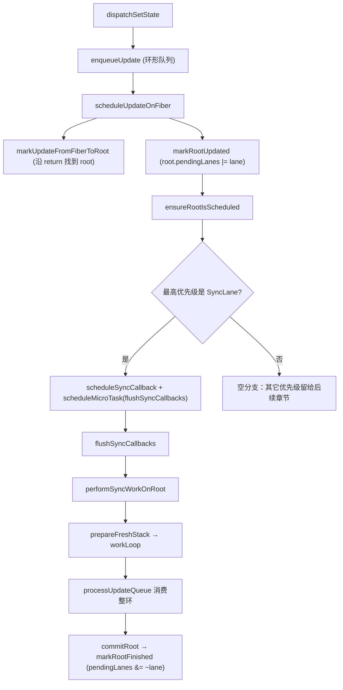

# 第14章：实现同步调度流程

## 本章定位

- **数据流定位**：消费 Update 与 lane → 产出批处理后的 render 时机（pendingLanes/finishedLane/syncQueue）→ 被 render/commit 与第 17/18 章并发扩展消费。
- **难度**：★★★★☆ —— 第一次引入「触发更新」与「执行更新」之间的 schedule 阶段，并建立 Lane 位图模型。后续并发（17/18 章）都在这个地基上扩展。
- **前置依赖**：第 4 章（Update/UpdateQueue）、第 8 章（useState/dispatch）、第 13 章（Fiber 树结构）。自检：能说出 dispatch 后更新如何进入队列；知道 `root.current.alternate` 是什么。
- **读后检验**：能画出一张「一次点击内三次 setState → 微任务 flush → 一次 render/commit」的调用链；能指出批处理合并的是什么、不合并的是什么。

前面的更新从触发到 render 再到 commit 基本是同步执行的。官方 React 会把“触发更新”和“执行更新”分成两个阶段，中间加入 schedule 阶段。本章先实现同步更新的批处理：多次触发更新，最终只执行一次有效 render/commit。

## 更新到底是同步还是异步？

本章开始前：

- 从触发更新到 render，再到 commit 都是同步的
- 多次触发更新会重复多次更新流程

可以改进的地方：多次触发更新，只进行一次更新流程（Batched Updates，批处理）。

将多次更新合并为一次，理念上有点类似防抖、节流，我们需要考虑合并的时机是：

- 宏任务
- 微任务？

### 三款框架实现 Batched Updates 更新时机对比

在一次事件中连续更新三次，然后分别在当前同步代码、Promise 微任务和 `setTimeout` 宏任务中读取宿主节点。三个读数可以帮助判断界面最迟在哪个检查点完成刷新。

#### [Svelte](https://svelte.dev/repl/1e4e4e44b9ca4e0ebba98ef314cfda54?version=3.44.1)

```svelte
<script>
	let count = 0;
	let dom;
	const onClick = () => {
		count++;
		count++;
		count++;
		console.log("同步结果：", dom.innerText);
		Promise.resolve().then(() => {
			console.log("微任务结果：", dom.innerText);
		});
		setTimeout(() => {
			console.log("宏任务结果：", dom.innerText);
		});
	}
</script>

<h1 bind:this={dom} on:click={onClick}>{count}</h1>
```

打印结果

```text
同步结果： 0
微任务结果： 3
宏任务结果： 3
```

#### [Vue 3](https://codesandbox.io/p/sandbox/crazy-rosalind-wqj0c?file=%2Fsrc%2FApp.vue%3A8%2C11)

```vue
<template>
	<h3 ref="dom" @click="onClick">{{ count }}</h3>
</template>

<script>
export default {
	name: 'App',
	data() {
		return {
			count: 0,
			dom: null
		};
	},
	methods: {
		onClick() {
			this.count++;
			this.count++;
			this.count++;
			console.log('同步结果：', this.$refs.dom.innerText);
			Promise.resolve().then(() => {
				console.log('微任务结果：', this.$refs.dom.innerText);
			});
			setTimeout(() => {
				console.log('宏任务结果：', this.$refs.dom.innerText);
			});
		}
	}
};
</script>
```

打印结果

```text
同步结果： 0
微任务结果： 3
宏任务结果： 3
```

#### [React](https://codesandbox.io/p/sandbox/react-concurrent-mode-demo-forked-t8mil?file=%2Fsrc%2Findex.js)

下面的示例只用于观察官方 React 中不同优先级的提交时机。`useTransition` 和 `useRef` 分别到第 19、20 章才会进入 big-react，不属于第 14 章的代码实现。

```jsx
import React, { useRef, useState, useTransition } from 'react';
import { createRoot } from 'react-dom/client';

const App = () => {
	const [count, updateCount] = useState(0);
	const [isPending, startTransition] = useTransition();

	const domRef = useRef(null);

	const onClick = () => {
		// 试试不作为 startTransition 回调执行
		startTransition(() => {
			updateCount((count) => count + 1);
			updateCount((count) => count + 1);
			updateCount((count) => count + 1);

			console.log('同步的结果：', domRef.current.innerText);
			Promise.resolve().then(() => {
				console.log('微任务的结果：', domRef.current.innerText);
			});
			setTimeout(() => {
				console.log('宏任务的结果：', domRef.current.innerText);
			});
		});
	};

	return (
		<h3 ref={domRef} onClick={onClick}>
			{count}
		</h3>
	);
};

const rootElement = document.getElementById('root');

createRoot(rootElement).render(<App />);
```

使用 `startTransition` 时打印：

```text
同步结果： 0
微任务结果： 0
宏任务结果： 3
```

去掉 `startTransition` 时打印：

```text
同步结果： 0
微任务结果： 3
宏任务结果： 3
```

**结论：**React 批处理的时机既有宏任务，也有微任务。本节课我们来实现「微任务的批处理」。

### 本章选择：在微任务中批处理 SyncLane

本章还没有 TransitionLane 和时间切片，只处理 SyncLane。它采用的策略是：setter 同步记录更新，调度层把执行延后到微任务，微任务开始后再同步完成整轮 render/commit。

| 阶段          | 本章行为                                                                           |
| ------------- | ---------------------------------------------------------------------------------- |
| 触发与入队    | 同步。Update 写入 Hook 队列，SyncLane 登记到 root。                                |
| 安排执行      | 延后。同步 callback 写入 `syncQueue`，`scheduleMicroTask` 安排 flush。             |
| render/commit | 同步。flush 开始后不做时间切片，一次有效 render 消费本批 Update，然后立即 commit。 |

所以，本章的准确结论不是“更新是异步的”，而是：**更新意图同步记录，更新流程在微任务中统一启动，启动后的 render/commit 同步且不可中断。**

## 整体架构思路：从三次触发到一次有效消费

用本章已经具备的事件系统和 `useState` 构造一个最小案例：

```jsx
function App() {
	const [num, setNum] = useState(1);

	return (
		<button
			onClick={() => {
				setNum((n) => n + 1);
				setNum((n) => n + 1);
				setNum((n) => n + 1);
			}}
		>
			{num}
		</button>
	);
}
```

本章之前，每个 setter 都会沿下面的路径立即完成一轮工作：

```text
dispatch
→ Update 入队
→ scheduleUpdateOnFiber
→ render
→ commit
```

三次 setter 因而对应三轮 render/commit。本章增加调度层后，最终行为变为：

```text
事件回调
  U1/U2/U3 依次进入 Hook 环形队列
  root.pendingLanes 记录 SyncLane
  三个同步 callback 进入 syncQueue，并各自安排 flush 微任务
事件回调结束，页面仍显示 1

第一个 flush 微任务
  第一个 callback 消费 U1/U2/U3，state 从 1 归约到 4
  commit 更新页面并清除 SyncLane
  后续 callback 发现没有 SyncLane，不再 render
  flush 结束时清空 syncQueue

后续 flush 微任务
  发现 syncQueue 已为空，直接结束
```

这里必须区分“登记了几个 callback”和“发生了几次有效 render”：本章实现仍会为三次 setter 登记三个 callback，但只有第一个 callback 消费 Update 并完成 render/commit。14-3 只是把工作移入微任务，还会重复执行；直到 14-4 补齐 UpdateQueue 消费、Lane 清理和 callback 队列清理，批处理才形成闭环。

第 17 章会用独立 Demo 解释 Scheduler 时间切片，第 18 章接入多优先级并发调度，第 19 章再实现 Transition。本章只建立同步 Lane 的最小调度模型。

## 本章实现：同步批处理的完整调用链

### 本章改动文件

- fiberLanes.ts：定义 Lane 集合运算与 SyncLane。
- fiber.ts：为 FiberRoot 增加 pendingLanes、finishedLane。
- fiberHooks.ts：为 Hook Update 分配 Lane，并把 renderLane 传给状态计算。
- updateQueue.ts：让 Update 携带 Lane，并遍历完整环形队列。
- workLoop.ts：建立 root 调度入口、同步 render 与 finishedLane 交接。
- syncTaskQueue.ts：保存并 flush 同步 callback。
- hostConfig.ts：向 reconciler 提供微任务能力。
- beginWork.ts：把 renderLane 传给 HostRoot 与 FunctionComponent 的状态计算。

这些文件共同完成的是一条生命周期，而不是彼此独立的功能点：Update 记录工作，root 记录待办，调度层安排执行，render 消费 Update，commit 结清 Lane。

### 同步更新调度账本

| 时刻       | 输入               | 写入对象/字段                                            | 消费者                  | 结果                                       |
| ---------- | ------------------ | -------------------------------------------------------- | ----------------------- | ------------------------------------------ |
| dispatch   | action             | Update 的 `lane = SyncLane`，环形 `queue.shared.pending` | 调度入口与 render       | 多条同步意图都被保存                       |
| 标记 root  | Update.lane        | `root.pendingLanes` 按位合并 `lane`                      | `ensureRootIsScheduled` | root 知道还有同步工作                      |
| 安排微任务 | 最高优先级 Lane    | callback 依次加入 syncQueue                              | `flushSyncCallbacks`    | 第一个有效 callback 完成更新，后续任务失效 |
| render     | 环形 pending queue | 新 `memoizedState` 与 WIP                                | commit                  | action 按入队顺序归约                      |
| commit     | finishedLane       | 从 `root.pendingLanes` 清除该 Lane                       | 后续更新入口            | 本轮同步工作被清除                         |

批处理不是把 action 合成一条，而是先把每条 Update 写入队列。当前实现并没有在登记阶段去重 callback；它依靠第一次有效 commit 清除 SyncLane，使后续 callback 在 render 入口失效。Lane、环形队列和微任务必须放在同一条对象链上理解。

### 调度层如何完成一次批处理？

一次 click 中的多个 dispatch 应满足：

```text
每个 action 都入队
-> 登记的回调统一在微任务 flush
-> 事件回调全部结束后才 render
-> 只有一轮有效 render 消费整个队列
-> 一次 commit
```

因此 `scheduleUpdateOnFiber` 不再直接执行 render，而是先把更新合并到 root 的 pending 集合，再调用 `ensureRootIsScheduled`。后者成为所有调度策略的统一决策点。

### 实现路线：从 Lane、调度到 commit



`scheduleUpdateOnFiber` 的入口（`packages/react-reconciler/src/workLoop.ts`）：

```ts
export function scheduleUpdateOnFiber(fiber: FiberNode, lane: Lane) {
	// TODO 调度功能
	const root = markUpdateFromFiberToRoot(fiber);
	markRootUpdated(root, lane);
	ensureRootIsScheduled(root);
}
```

注意 `markUpdateFromFiberToRoot` 本章只沿 return 链找到 HostRoot 并返回它的 `stateNode`，没有其他写入职责。

`markRootUpdated` 把 lane 合并进 root 的待处理集合（`workLoop.ts`）：

```ts
export function markRootUpdated(root: FiberRootNode, lane: Lane) {
	root.pendingLanes = mergeLanes(root.pendingLanes, lane);
}
```

### 14-1 批处理的概念

> **本节数据流**：连续 action → 创建多个 Update → 用 `next` 串成环 → `queue.shared.pending` 始终指向环尾 → 为后续一次 render 消费多条 Update 保存完整输入。

批处理会把 render 推迟到多个 setter 之后。调度时机一旦推迟，原来的单槽队列就会先暴露问题：

```ts
updateQueue.shared.pending = update;
```

如果依次触发 U1、U2、U3，单槽最终只剩 U3。即使后面成功做到“一次 render”，前两条业务意图也已经在入队阶段丢失。因此 14-1 先解决容量问题，不急着引入 Lane 或微任务。

#### 第一步：Update 增加 next

```ts
export interface Update<State> {
	action: Action<State>;
	next: Update<State> | null;
}

export const createUpdate = <State>(action: Action<State>): Update<State> => {
	return {
		action,
		next: null
	};
};
```

`action` 保存“状态要怎样变化”，`next` 保存“下一条更新在哪里”。队列仍只需要一个 `pending` 字段，但它的含义从“唯一待处理 Update”变成“环形队列的尾节点”。环头可以通过 `pending.next` O(1) 取得。

#### 第二步：入队时维护环头与环尾

```ts
export const enqueueUpdate = <State>(
	updateQueue: UpdateQueue<State>,
	update: Update<State>
) => {
	const pending = updateQueue.shared.pending;

	if (pending === null) {
		update.next = update;
	} else {
		update.next = pending.next;
		pending.next = update;
	}

	updateQueue.shared.pending = update;
};
```

分两种情况手算：

1. 空队列加入 U1：`U1.next = U1`，U1 同时是环头和环尾。
2. 已有 U1，再加入 U2：U2 先指向旧环头 U1，旧环尾 U1 再指向 U2，最后 `pending = U2`。

连续加入三条 Update 后，对象关系是：

```text
queue.shared.pending = U3
queue.shared.pending.next = U1

U1 -> U2 -> U3
^           |
|___________|
```

| 入队时刻 | 输入 | 写入对象/字段                                  | 14-1 时的当前消费者         | 当时的实际结果                    |
| -------- | ---- | ---------------------------------------------- | --------------------------- | --------------------------------- |
| 第一次   | U1   | `U1.next = U1`，`pending = U1`                 | 同步 render 读取 U1         | render 一次，state 从 1 变为 2    |
| 第二次   | U2   | `U2.next = U1`，`U1.next = U2`，`pending = U2` | 同步 render 仍只读取队尾 U2 | 再 render 一次，state 从 2 变为 3 |
| 第三次   | U3   | U3 插到环尾，`pending = U3`                    | 同步 render 仍只读取队尾 U3 | 再 render 一次，state 从 3 变为 4 |

#### 14-1 为什么还不算完成批处理？

本节结束时，[scheduleUpdateOnFiber](../../packages/react-reconciler/src/workLoop.ts)仍然直接调用同步 `renderRoot`，所以三个 setter 仍会触发三轮 render；[processUpdateQueue](../../packages/react-reconciler/src/updateQueue.ts)也仍只计算 `pendingUpdate.action`，不会遍历整环。当前能确认的只有“U1、U2、U3 已经可以同时存在于同一个队列”。

这三步必须分开理解：

```text
14-1：队列能保留多条 Update
14-3：调度把 render 推迟到微任务
14-4：一次 render 从环头开始遍历并消费整环
```

如果只做 14-3 而没有 14-1，前面的 action 会在入队时被覆盖；如果只有环形入队而没有 14-4，批处理后的 render 又只会计算队尾 U3。批处理成立的条件不是“加一个微任务”，而是保存、调度、消费三段同时闭环。

### 14-2 实现 Lane 模型

#### Lane 的产生

在 React 并发渲染架构中，采用 Lane 模型标识更新的优先级。简单来说，Lane 模型就像一条拥有多条车道的高速公路，不同类型的更新任务被分配到不同的车道上，调度器会根据优先级决定哪辆车先走，或者允许高优先级的“救护车”随时插队。

#### 核心设计：基于位运算

- Lane 模型使用 31 位的二进制整数表示，每一个二进制位（bit）代表一条车道（Lane），位数越小的车道优先级越高
- 可以用一个 31 位的整数表达多种优先级组合（Lanes），其中有多个位被同时置为 1
- 通过位运算（如按位或 |、按位与 &）来合并、判断和移除优先级

#### Lane 的定义

包括：

- lane: 二进制位，代表优先级
- lanes：二进制位，代表 lane 的集合

源码位置：`packages/react-reconciler/src/fiberLanes.ts`。本章还是最小形态，只定义了 `SyncLane`：

```ts
export const NoLane = 0b0000;
export const NoLanes = 0b0000;
export const SyncLane = 0b0001;
```

#### Lane 的操作

集合操作本章只有两个：

```ts
export function mergeLanes(laneA: Lane, laneB: Lane) {
	return laneA | laneB;
}

export function getHighestPriorityLane(lanes: Lane): Lane {
	return lanes & -lanes; // 取最低有效位，即最高优先级
}
```

##### lane 的产生

对于不同情况触发的更新，产生 lane，为后续不同事件产生不同的优先级更新做准备。

`requestUpdateLane`（`fiberLanes.ts`）本章固定返回 `SyncLane`：

```ts
export function requestUpdateLane() {
	return SyncLane;
}
```

`dispatchSetState` 里拿它创建 Update：

```ts
function dispatchSetState<State>(fiber, updateQueue, action) {
	const lane = requestUpdateLane();
	const update = createUpdate(action, lane);
	enqueueUpdate(updateQueue, update);
	scheduleUpdateOnFiber(fiber, lane);
}
```

本章的调度重点全部落在 `SyncLane`：它由微任务统一 flush。

### 14-3 实现调度阶段

需要完成两件事：

- 从 `root.pendingLanes` 选出接下来要处理的 Lane。
- 把 root 的工作包装成 callback，交给宿主微任务启动。

#### 14-3-1 renderer 提供微任务能力

调度发生在 reconciler，怎样安排微任务却属于运行环境能力。因此 [react-dom hostConfig](../../packages/react-dom/src/hostConfig.ts)新增 `scheduleMicroTask`，reconciler 只依赖这个端口：

```ts
export const scheduleMicroTask =
	typeof queueMicrotask === 'function'
		? queueMicrotask
		: typeof Promise === 'function'
			? (callback: (...args: any) => void) =>
					Promise.resolve(null).then(callback)
			: setTimeout;
```

选择顺序是 `queueMicrotask → Promise.then → setTimeout`。最后一项严格说是宏任务兜底，但它保持了同一个接口：reconciler 只提交 callback，不读取 `window` 或直接选择浏览器 API。

#### 14-3-2 建立同步 callback 队列

本节新增 [syncTaskQueue.ts](../../packages/react-reconciler/src/syncTaskQueue.ts)。这里的 `syncQueue` 不是 Hook 的 UpdateQueue：UpdateQueue 保存状态 action，`syncQueue` 保存“对哪个 root 执行工作”的函数。

```ts
let syncQueue: ((...args: unknown[]) => void)[] | null = null;
let isFlushingSyncQueue = false;

export function scheduleSyncCallback(callback: (...args: unknown[]) => void) {
	if (syncQueue === null) {
		syncQueue = [callback];
	} else {
		syncQueue.push(callback);
	}
}

export function flushSyncCallbacks() {
	if (!isFlushingSyncQueue && syncQueue) {
		isFlushingSyncQueue = true;

		try {
			syncQueue.forEach((callback) => callback());
		} catch (error) {
			if (__DEV__) {
				console.error('flushSyncCallbacks报错', error);
			}
		} finally {
			isFlushingSyncQueue = false;
		}
	}
}
```

`isFlushingSyncQueue` 只阻止 flush 执行期间的同步重入。它既不负责 callback 去重，也不阻止浏览器稍后执行另一个已经排队的 flush 微任务。

这里必须保留源码中的阶段性缺口：finally 只把 `isFlushingSyncQueue` 恢复为 false，**没有执行 `syncQueue = null`**。所以 flush 完成后，旧 callback 仍留在数组里；清空语句是 14-4 才加入的。

#### 14-3-3 `ensureRootIsScheduled` 取代立即 render

14-2 的 `scheduleUpdateOnFiber` 在写入 `root.pendingLanes` 后仍直接调用 `renderRoot(root)`。14-3 把最后一步替换成统一调度入口：

```ts
export function scheduleUpdateOnFiber(fiber: FiberNode, lane: Lane) {
	const root = markUpdateFromFiberToRoot(fiber);
	markRootUpdated(root, lane);
	ensureRootIsScheduled(root);
}
```

[ensureRootIsScheduled](../../packages/react-reconciler/src/workLoop.ts)读取 root 上已经登记的 Lane：

```ts
function ensureRootIsScheduled(root: FiberRootNode) {
	const updateLane = getHighestPriorityLane(root.pendingLanes);

	if (updateLane === NoLane) {
		return;
	}

	if (updateLane === SyncLane) {
		if (__DEV__) {
			console.log('在微任务中调度，优先级：', updateLane);
		}

		scheduleSyncCallback(performSyncWorkOnRoot.bind(null, root, updateLane));
		scheduleMicroTask(flushSyncCallbacks);
	} else {
		// 其它优先级分支尚未实现
	}
}
```

本节只有 SyncLane，所以每次 dispatch 都发生两次写入：向 `syncQueue` 追加一个 root callback，再向宿主微任务队列追加一个 flush callback。源码没有“相同 root 已经安排过”的判断，不能把这一步描述为调度去重或防抖。

最高优先级选择也在 `workLoop.ts` 中首次出现：

```ts
export function getHighestPriorityLane(lanes: Lanes): Lane {
	return lanes & -lanes;
}
```

原来的 `renderRoot(root)` 同时改名为 `performSyncWorkOnRoot(root, lane)`，成为同步 callback 的执行入口：

```ts
function performSyncWorkOnRoot(root: FiberRootNode, lane: Lane) {
	const nextLane = getHighestPriorityLane(root.pendingLanes);

	if (nextLane !== SyncLane) {
		ensureRootIsScheduled(root);
		return;
	}

	prepareFreshStack(root);
	// workLoop 与构建 WIP 的逻辑没有改变

	const finishedWork = root.current.alternate;
	root.finishedWork = finishedWork;
	commitRoot(root);
}
```

这里新增的是调度入口检查，内部仍调用原来的 `prepareFreshStack → workLoop → commitRoot`。传入的 `lane` 在 14-3 函数体内还没有被使用，render 也没有收到这个 Lane；把 Lane 传进 `beginWork` 和 UpdateQueue 是 14-4 的改造。

#### 14-3 的真实运行结果

仍用一次点击连续调用三次 `setNum(n => n + 1)` 推演。事件回调结束时：

```text
Hook 环形队列：U1 -> U2 -> U3 -> U1，pending 指向 U3
root.pendingLanes：SyncLane
syncQueue：[work(root), work(root), work(root)]
宿主微任务队列：[flush, flush, flush]
```

此时批处理尚未闭环：

1. 第一个 flush 会遍历三个 root callback，执行三轮 render。
2. 14-3 的 `processUpdateQueue` 仍只读取队尾 `U3.action`，不会遍历 U1、U2、U3。
3. commit 后 `root.pendingLanes` 仍是 SyncLane，所以第二、第三个 root callback 不会跳过。
4. 第一个 flush 结束后 `syncQueue` 没有清空；后面两个 flush 微任务会再次遍历同一组三个 callback。

因此在没有其它更新干扰时，这次点击会执行 3 × 3 = 9 轮 render；每轮都再次执行队尾的 `n => n + 1`，状态会从 1 递增到 10。以后再次点击时，旧 callback 还会继续留在 `syncQueue`，问题会进一步累积。

14-3 真正完成的是“触发更新与执行 render 之间出现了调度层”，不是“批处理已经正确”。14-4 还需要同时补上三处消费者：render 遍历环形 UpdateQueue、commit 清除完成 Lane、flush 后清空 `syncQueue`。只有这三处接通后，多次 callback 才能由第一个 callback 消费工作，其余 callback 在入口看到 NoLane 后返回。

### 14-4 改造更新流程

14-3 已经能用微任务进入 render，但 Lane 只停在 root 上，render 不知道本轮应该消费哪组 Update；render 完成后，commit 也不会清除 Lane；flush 结束后，旧 callback 还留在 `syncQueue`。因此 14-4 不是单独的 commit 改造，而是把 render、commit 与调度收尾接成闭环。

#### 14-4-1 render 阶段：把 Lane 传到 UpdateQueue

`performSyncWorkOnRoot` 先把本轮 Lane 交给 `prepareFreshStack`，render 完成后再把同一个 Lane 写进 root：

```ts
let wipRootRenderLane: Lane = NoLane;

function prepareFreshStack(root: FiberRootNode, lane: Lane) {
	workInProgress = createWorkInProgress(root.current, {});
	wipRootRenderLane = lane;
}

function performSyncWorkOnRoot(root: FiberRootNode, lane: Lane) {
	// 省略入口检查与 workLoop
	prepareFreshStack(root, lane);

	const finishedWork = root.current.alternate;
	root.finishedWork = finishedWork;
	root.finishedLane = lane;
	wipRootRenderLane = NoLane;
	commitRoot(root);
}
```

`performUnitOfWork` 随后把 `wipRootRenderLane` 传入 `beginWork`：

```ts
function performUnitOfWork(fiber: FiberNode) {
	const next = beginWork(fiber, wipRootRenderLane);
	// 其余递归流程不变
}
```

`beginWork` 继续把它传给两个真正消费状态队列的入口：

- HostRoot：`updateHostRoot(wip, renderLane)`。
- FunctionComponent：`updateFunctionComponent(wip, renderLane)`，再进入 `renderWithHooks(wip, renderLane)`。

Hooks 侧用模块级 `renderLane` 保存当前组件执行期间的 Lane，并在组件执行结束后恢复为 `NoLane`。`updateState` 取出 pending 环后立即把共享入口清空，再把本轮 Lane 交给状态计算：

```ts
const pending = queue.shared.pending;
queue.shared.pending = null;

if (pending !== null) {
	const { memoizedState } = processUpdateQueue(
		hook.memoizedState,
		pending,
		renderLane
	);
	hook.memoizedState = memoizedState;
}
```

14-4 的 [processUpdateQueue](../../packages/react-reconciler/src/updateQueue.ts)终于从 `pending.next` 取得环头，并走完整个环：

```ts
const first = pendingUpdate.next;
let pending = pendingUpdate.next!;

do {
	const updateLane = pending.lane;

	if (updateLane === renderLane) {
		const action = pending.action;
		baseState = action instanceof Function ? action(baseState) : action;
	} else if (__DEV__) {
		console.error('不应该进入updateLane!==renderLane这个逻辑');
	}

	pending = pending.next!;
} while (pending !== first);
```

本章只有 SyncLane，所以这里使用简单的 `updateLane === renderLane`。它还没有“跳过低优先级 Update 后保留并重放”的能力；当前关键是函数 action 必须基于累计的 `baseState` 继续计算。因此 `1 → U1(+1) → U2(+1) → U3(+1)` 会在一轮 render 中得到 4。

#### 14-4-2 commit 阶段：清除已经完成的 Lane

render 结束时写入 `root.finishedLane = lane`，表示 finishedWork 属于哪组工作。`commitRoot` 读取该字段，在执行 mutation 判断前重置完成记录：

```ts
const lane = root.finishedLane;

if (lane === NoLane && __DEV__) {
	console.error('commit阶段finishedLane不应该是NoLane');
}

root.finishedWork = null;
root.finishedLane = NoLane;
markRootFinished(root, lane);
```

```ts
// packages/react-reconciler/src/fiberLanes.ts
export function markRootFinished(root: FiberRootNode, lane: Lane) {
	root.pendingLanes &= ~lane;
}
```

第一次 callback 提交后，`root.pendingLanes` 从 SyncLane 变成 NoLane。`syncQueue` 中后续 callback 再进入 `performSyncWorkOnRoot` 时，重新读取 root 只会得到 NoLane，于是调用一次 `ensureRootIsScheduled` 后直接返回，不再重复 render。

本章 `markRootFinished` 只清除本轮 Lane，commit 结束后不会主动调用 `ensureRootIsScheduled`。在当前只有 SyncLane、所有 action 已于 render 前入队的范围内，这条闭环成立。

#### 14-4-3 调度收尾：flush 后清空 callback

14-3 的 `flushSyncCallbacks` 只恢复 `isFlushingSyncQueue`，旧 callback 会一直残留。14-4 在 finally 中补上清空：

```ts
finally {
	isFlushingSyncQueue = false;
	syncQueue = null;
}
```

一次点击触发三个 setter 时，仍会登记三个 root callback 和三个 flush 微任务，但最终执行过程变成：

```text
第一个 flush：
  callback 1 -> 遍历 U1/U2/U3 -> state = 4 -> commit 清除 SyncLane
  callback 2 -> 读取到 NoLane，直接返回
  callback 3 -> 读取到 NoLane，直接返回
  finally -> syncQueue = null

后面两个 flush 微任务：syncQueue 已是 null，什么也不做
```

所以本章最终实现“保存三条 Update，只进行一轮有效 render/commit”。这里没有在登记 callback 时去重，而是依靠 commit 清除 Lane 让过期 callback 失效，再在 flush 末尾清空 callback 数组。

#### 14-4-4 同一次改造中的其它修正

这次变更还包含三处不属于调度主线、但会影响章节示例的修正：

- `childFibers.ts` 新增 `getElementKeyToUse`：数组、文本和数字使用 index，ReactElement 才读取 element.key，避免把文本的 key 误算成 undefined。
- `commitWork.ts` 把不存在的 `insertInstanceToContainer` 改为 hostConfig 已导出的 `insertChildToContainer`，第 12、13 章生成的 `before` 插入路径至此才能执行。
- `completeWork.ts` 把局部变量 `subtreeFlag` 统一为 `subtreeFlags`，只是命名整理，不改变 flags 冒泡逻辑。

#### 为什么“同步 Lane”仍经过调度？

同步描述的是优先级和执行约束，不等于 dispatch 调用栈内立刻 render。把 SyncLane 回调放进微任务，可以把同一轮同步代码中的多个 dispatch 合并：

```text
事件回调开始
setState A -> root.pendingLanes |= SyncLane，登记 callback + 安排微任务
setState B -> 入队；再登记一个 callback
setState C -> 同上
事件回调结束
微任务 -> flushSyncCallbacks -> 第一个回调完成 render/commit，
          pendingLanes 归零，后两个回调在入口处直接返回
```

这样既快速响应，又避免每个 setter 触发一次完整 render。

## 与官方 React 的差异

| 能力                    | big-react                                                                                               | 官方 React                                                                       |
| ----------------------- | ------------------------------------------------------------------------------------------------------- | -------------------------------------------------------------------------------- |
| Lane 数量               | 本章只有 `SyncLane`；第 18 章增加 InputContinuous/Default/Idle，第 19 章增加 TransitionLane             | 数十个 Lane，且按事件类型动态分配；`getNextLanes` 还考虑过期时间、batched 状态等 |
| lane 推断               | `requestUpdateLane` 固定返回 SyncLane；第 18 章接入 Scheduler 优先级，第 19 章接入 transition 上下文    | 从 Scheduler 优先级与 transition 上下文推断                                      |
| 同步 flush              | `scheduleSyncCallback` + 微任务 `flushSyncCallbacks`                                                    | 同样的结构，但 `flushSyncCallbacks` 还有嵌套保护与更完整的错误处理               |
| `ensureRootIsScheduled` | 无回调去重，靠 `performSyncWorkOnRoot` 入口 lane 检查保底；第 18 章加入 `callbackNode/callbackPriority` | 同名，用回调身份和优先级去重、取消，并额外处理饥饿与延迟任务                     |
| 队列跳过                | `updateLane === renderLane` 等值比较；第 18 章改为集合判定并建立 baseQueue 重放                         | `isSubsetOfLanes` 集合判定 + 跳过低优先级并重建 baseQueue                        |
| 离散事件                | 本章无事件优先级概念；第 18 章把事件优先级映射到 Lane                                                   | 官方还有更完整的离散/连续事件专门路径                                            |

big-react 把 Lane 压缩到只有 `SyncLane`、同步路径固定走微任务，是为了让「批处理」和「优先级集合」在最小模型里讲清楚。第 17 章解释并发原理，第 18 章补多优先级与 Scheduler 协作，第 19 章再加入 TransitionLane。

## 思考题

### Q1: 为什么 Lane 用二进制表示优先级，而不是用数字大小、数组表示？

Lane 不只要表达“谁更紧急”，还要表达“root 上同时有哪些工作”。单个数字大小只能保存一个等级，无法让 `pendingLanes` 同时记录多种待处理优先级；数组虽然可以，但合并、去重、包含判断和删除都要遍历或维护额外结构。

位模型把每个 Lane 分配为一个独立 bit，于是几种核心操作都有直接对应：

```ts
pendingLanes |= lane; // 合并一类工作
(lanes & lane) === lane; // 判断集合是否包含 lane
lanes & -lanes; // 取最低位，也就是最高优先级 lane
pendingLanes &= ~finishedLane; // 只清除已完成 lane
```

因此二进制的价值不仅是“位运算更快”，而是同一个数同时具备优先级顺序和集合代数。本章只有 SyncLane，优势还不明显；第 18、19 章加入多种 Lane 后，`pendingLanes` 才真正表现为集合。

### Q2: SyncLane 更新一定会立刻同步执行吗？

不一定在调用 setter 的同一 JavaScript 栈里立刻 render。本章的 `ensureRootIsScheduled` 会把 `performSyncWorkOnRoot` 放进内部同步队列，再通过 `scheduleMicroTask(flushSyncCallbacks)` 安排微任务。setter 返回后，本轮同步代码可以继续执行；当前调用栈结束，微任务才统一 flush。

“Sync”描述的是这批工作不能被时间切片拆开、应尽快完成，不等于“dispatch 内联调用 render”。把入口推到微任务还能形成批处理：同一宏任务中的多次 setter 先把 Update 加入队列，随后第一次有效 callback 一次消费；其余已登记 callback 进入 `performSyncWorkOnRoot` 时发现 SyncLane 已清除，直接返回。

这回答的是本章 big-react 的执行路径，不能外推成“官方 React 所有 SyncLane 都必然通过 `queueMicrotask`”。官方 React 还会根据更新边界、`flushSync` 等入口决定何时 flush。

### Q3: FiberRootNode 中添加了 finishedLane 字段，在 commitRoot 中使用后清除。为什么要单独记录 finishedLane，而不是直接使用 pendingLanes？

`pendingLanes` 是 root 的动态待办集合，render 期间仍可能有新 Update 并入；`finishedLane` 是这份 `finishedWork` 的计算身份，表示“这棵候选树按哪个 Lane 完成”。两者生命周期不同，不能互相替代。

render 完成时会成对写入：

```ts
root.finishedWork = finishedWork;
root.finishedLane = renderLane;
```

commit 消费同一对快照，先保存 lane，再清空 finished 字段，最后执行 `markRootFinished(root, lane)`。假设未来 `pendingLanes` 同时包含 SyncLane 与 DefaultLane，而本次 finishedWork 只计算了 SyncLane；直接清空 pendingLanes 会误删 DefaultLane，直接读取“当前最高 Lane”也可能受到 render 期间新更新影响。`finishedLane` 让 commit 精确清除与 finishedWork 对应的那一位，其余 Lane 保留并再次调度。

本章只有 SyncLane，这个字段看起来像冗余；它是在单 Lane 阶段提前建立“渲染产物必须携带其计算范围”的协议，第 18 章多优先级并存后才成为正确性条件。

### Q4: 14-3 已经把 render 放进微任务，为什么仍不算正确批处理？14-4 必须补齐哪几处消费？

批处理不等于“晚一点调用 render”。14-3 只增加了调度层，却没有让后面的消费者理解这批工作：

1. 每次 setter 都向 `syncQueue` 追加一个 root callback，也各自安排一个 flush 微任务。
2. `processUpdateQueue` 仍只读取队尾 action，没有遍历 U1/U2/U3。
3. commit 后 `root.pendingLanes` 仍保留 SyncLane，后续 callback 认为 root 还有工作。
4. flush 结束后 `syncQueue` 没有清空，后续微任务会再次遍历旧 callback。

所以 14-3 的三次 setter 不是“一轮计算三条 Update”，而会让旧 callback 和旧 Lane 不断重复执行。正文以 state 初始为 1 推演时，第一个 flush 中三个 callback、再乘三个 flush 微任务，共形成 9 轮 render，状态会变成 10。

14-4 必须同时修复三个阶段：

| 阶段       | 新增消费/清理                                         | 缺少时的结果                               |
| ---------- | ----------------------------------------------------- | ------------------------------------------ |
| render     | 把 renderLane 传到 HostRoot/Hooks，遍历完整 Update 环 | 多条 action 仍不能在一轮中累计             |
| commit     | 用 finishedLane 调用 `markRootFinished`               | 过期 callback 仍看到 SyncLane，继续 render |
| flush 收尾 | `syncQueue = null`                                    | 后续微任务和未来更新继续带上旧 callback    |

三处形成的是同一生命周期：Update 被 render 消费，Lane 被 commit 结清，承载任务的 callback 被 flush 回收。只完成其中一处，都不能得到稳定的批处理结果。

## 本章小结

第十四章把“更新立刻执行”改成“更新先调度”。SyncLane 仍然是同步语义，但借助微任务实现了同一事件内的批处理。Lane 模型从这里开始进入主线，后续并发更新会继续扩展它。

不过，组件还没有「提交之后做点什么」的通道：数据获取、订阅、清理这些副作用没有归宿，写进 render 又违反纯度约定。给副作用正确的时机，是第 15 章的 `useEffect`。
