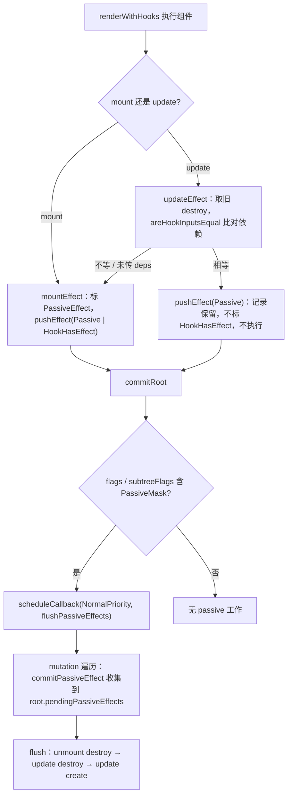
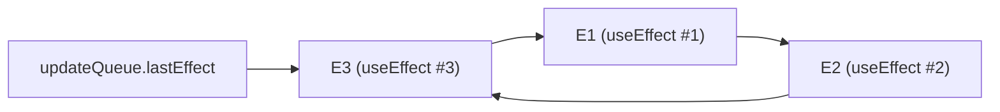

# 第15章：实现 useEffect

## 本章定位

- **数据流定位**：消费组件 render 结果 → 产出 effect 环形链表与两级标记 → 被 commit 收集、Scheduler 回调 flush 消费。
- **难度**：★★★☆☆ —— 第一个需要跨 render 与 commit 协作的 Hook。数据结构（effect 环形链表）和两级标记（Fiber flag 与 Hook effect tag）是核心。
- **前置依赖**：第 8 章（Hook 链表、Dispatcher）、第 14 章（调度与 Lane）、第 5/6 章（render 与 commit 分离）。自检：能说出 Hook 链表如何按调用顺序复用；知道 render 阶段和 commit 阶段各自能做什么；知道 commit 里 mutation/layout 的先后。
- **读后检验**：能画出 effect 环形链表与 fiber/commit 各阶段的关系；能说出依赖相等时为什么 effect 记录保留但不再执行。

`useEffect` 是第一个需要跨 render 和 commit 协作的 Hook。render 阶段负责收集 effect，commit 阶段负责在 DOM 更新后异步执行 destroy/create。本章按 effect 的生命周期组织：创建（15-1）→ 依赖比对（15-1）→ 收集与调度（15-2）→ 执行与清理（15-2）。

## 整体架构思路：Effect 跨越 render 与 commit

函数组件的 render 应是纯计算，但应用必须订阅网络、定时器和外部系统。核心问题是：**如何声明一段与某次提交结果关联的外部同步逻辑，同时保证 render 可重做、旧资源会清理、无变化依赖不会重复执行？**

若在组件函数中直接订阅：

```jsx
function App() {
	subscribe();
	return <div />;
}
```

render 被重做或放弃时也会订阅，而对应 UI 可能从未提交；每次 render 还会重复创建资源。若在 render 中先 cleanup 旧 effect，又可能把当前仍在屏幕上的 committed tree 资源提前销毁。

所以 effect 必须服从提交语义：render 只登记意图，只有该 WIP 真正成为 current 后才允许执行。这决定了 effect 的整个生命周期横跨两个阶段：render 登记，commit 后执行。

### Effect 生命周期全景：创建 → 比对 → 收集 → 执行

本章所有机制都挂在下面四个阶段上，后续两节按此顺序展开：

| 阶段       | 发生位置                                        | 写入的数据                                                                         | 消费者                   |
| ---------- | ----------------------------------------------- | ---------------------------------------------------------------------------------- | ------------------------ |
| 创建       | render：mountEffect / updateEffect → pushEffect | Effect 记录入环；Hook 节点 memoizedState 指向它；Fiber 标 PassiveEffect            | 后续比对与 commit 收集   |
| 依赖比对   | render：updateEffect 内 areHookInputsEqual      | 相等：tag 只标 Passive；变化或未传：tag 加 HookHasEffect                           | flush 时按 tag 过滤      |
| 收集       | commit mutation 遍历：commitPassiveEffect       | root.pendingPassiveEffects 的 update / unmount 两数组                              | Scheduler 回调           |
| 执行与清理 | flushPassiveEffects                             | unmount destroy → update destroy → update create；create 返回值存回 effect.destroy | 下一轮 update 与 unmount |

两条 render 路径与两级标记的分叉：



## 本章实现：从 render 收集到 commit 执行

本章两步实现对应生命周期的四个阶段：15-1 完成创建与依赖比对（数据结构与 mount/update 路径），15-2 完成收集与执行（调度、收集、flush）。

### 15-1 实现 useEffect 数据结构

> **本节数据流**：render 调用 useEffect → Hook 节点与 Effect 记录同时落位（创建）→ 依赖比对决定 tag（比对）→ 两级标记让 commit 能快速定位到需要执行的 effect。

本节建立 effect 的全部数据结构：Effect 与 FCUpdateQueue、两级标记常量，以及 mount/update 两侧的 `mountEffect`/`updateEffect`。

#### Effect 记录需要保存什么？

一个 effect 至少要保存：

```text
create：本次提交后要建立什么同步
destroy：上一次已提交同步如何清理
deps：本次输入是否与上次等价
tag：这是 passive effect，以及本次是否需要执行
next：同一组件多个 effect 的顺序关系
```

对应 `packages/react-reconciler/src/fiberHooks.ts` 的接口：

```ts
export interface Effect {
	tag: Flags;
	create: EffectCallback;
	destroy: EffectDestroy;
	deps?: DependencyList;
	next: Effect | null;
}
```

Hook 节点负责按调用顺序找到“同一个 effect”，Effect 对象负责描述一次提交动作。两者不能合并成一个回调字段，否则难以同时保存旧 destroy、新 create、依赖和提交顺序。

对应 15-1 新增的 `FCUpdateQueue`：它在第 4 章的 `UpdateQueue` 上多了一个 `lastEffect` 字段，指向该组件 effect 环的环尾。

#### 两级标记：树级索引与组件内索引

两级标记分别定义在两个文件：`fiberFlags.ts` 新增 `PassiveEffect = 0b001000` 与 `PassiveMask = PassiveEffect | ChildDeletion`；新文件 `hookEffectTags.ts` 定义 `Passive = 0b0010` 与 `HookHasEffect = 0b0001`。

```text
Fiber.flags 的 PassiveEffect
-> 这棵 Fiber 是否有本轮需要处理的 passive 工作？

Effect.tag 的 HookHasEffect
-> 该 Fiber 的 effect 环中，具体哪一项需要 destroy/create？
```

第一层让 commit 快速跳过没有 effect 的子树，第二层让同一组件中依赖未变的 effect 保持记录但不执行。它们分别是树级索引和组件内索引：只留 Fiber flag，无法区分组件内哪些 effect 依赖未变；只留 Effect tag，commit 必须扫描所有组件才能找到入口。

#### 创建（render 阶段）：mountEffect 与 pushEffect

mount 时 effect 必须执行。[mountEffect](../../packages/react-reconciler/src/fiberHooks.ts)：

```ts
function mountEffect(create: EffectCallback, deps?: DependencyList) {
	const hook = mountWorkInProgressHook();
	currentlyRenderingFiber!.flags |= PassiveEffect;
	hook.memoizedState = pushEffect(
		Passive | HookHasEffect,
		create,
		undefined,
		deps
	);
}
```

mount 没有旧依赖可比，create 首次一定执行，所以 tag 必带 `HookHasEffect`；Fiber 无条件标 `PassiveEffect`，让 commit 能找到这个组件。`mountEffect` 做完三件事：登记 Hook 节点（`mountWorkInProgressHook`）、标 Fiber flag、把 Effect 记录接入环。`pushEffect` 返回的 effect 被赋给 `hook.memoizedState`——同一个 Effect 对象从这里同时进入两条链。

[pushEffect](../../packages/react-reconciler/src/fiberHooks.ts) 把 effect 插入当前 Fiber 的 effect 环形链表，并返回这个 effect：

```ts
function pushEffect(hookFlags, create, destroy, deps) {
	const effect: Effect = { tag: hookFlags, create, destroy, deps, next: null };
	const fiber = currentlyRenderingFiber!;
	const updateQueue = fiber.updateQueue as FCUpdateQueue<any>;
	if (updateQueue === null) {
		const updateQueue = createFCUpdateQueue();
		fiber.updateQueue = updateQueue;
		effect.next = effect;
		updateQueue.lastEffect = effect;
	} else {
		const lastEffect = updateQueue.lastEffect;
		if (lastEffect === null) {
			effect.next = effect;
			updateQueue.lastEffect = effect;
		} else {
			const firstEffect = lastEffect.next;
			lastEffect.next = effect;
			effect.next = firstEffect;
			updateQueue.lastEffect = effect;
		}
	}
	return effect;
}
```

插入后，`fiber.updateQueue.lastEffect` 指向环尾，`lastEffect.next` 是环头（第一个 effect）。为什么不存成数组？effect 每轮 render 全量重建，环形让「找头找尾」都是 O(1)：`lastEffect` 即尾、`lastEffect.next` 即头，push 与遍历都不需要长度管理；且它与第 4 章 UpdateQueue 的环形形态同构，commit 阶段「从任一点出发走一整圈」可以复用同一套心智。`FCUpdateQueue` 在第 4 章的 `UpdateQueue` 上多了一个 `lastEffect` 字段，由 `createFCUpdateQueue` 创建。与之配套，`renderWithHooks` 开头除了重置 `wip.memoizedState`，还新增了 `wip.updateQueue = null`，保证每次 render 都重建 effect 环而不是在旧环上追加。

push 的指针演变（尾插法，新 effect 接在旧尾之后、环头之前）：

```text
push E1 后（首个 effect，自环）:   push E3 后（三元环，环头 E1 不变）:

lastEffect = E1                     lastEffect = E3
     E1 ─┐                             E3 ──► E1 ──► E2 ──┐
     ▲   │                             ▲                  │
     └───┘                             └──────────────────┘
 E1.next 指向自己                  新 effect 成为新尾，next 指回环头 E1
```

多次调用 useEffect 按调用顺序连成环（最终态）：



#### 依赖比对（render 阶段）：updateEffect 与 areHookInputsEqual

update 时要比较依赖数组。[updateEffect](../../packages/react-reconciler/src/fiberHooks.ts)：

```ts
function updateEffect(create: EffectCallback, nextDeps?: DependencyList) {
	const hook = updateWorkInProgressHook();
	let destroy: EffectDestroy;

	if (currentHook !== null) {
		const prevEffect = currentHook.memoizedState as Effect;
		destroy = prevEffect.destroy;

		if (nextDeps !== undefined) {
			// 浅比较依赖
			const prevDeps = prevEffect.deps;
			if (areHookInputsEqual(prevDeps, nextDeps)) {
				hook.memoizedState = pushEffect(Passive, create, destroy, nextDeps);
				return;
			}
		}
		// 浅比较不相等
		currentlyRenderingFiber!.flags |= PassiveEffect;
		hook.memoizedState = pushEffect(
			Passive | HookHasEffect,
			create,
			destroy,
			nextDeps
		);
	}
}
```

**依赖相等**：effect 记录照常入环（`tag = Passive`），但 Fiber 不标 `PassiveEffect`、effect 不标 `HookHasEffect`，所以 commit 时不会执行。**依赖变化（或未传 deps）**：Fiber 标 `PassiveEffect`，effect 标 `Passive | HookHasEffect`，commit 后执行。

依赖相等时为什么不能把这条记录从环里删掉？下一次 update 仍要按 Hook 顺序找到对应 effect，并取上一次已提交 create 返回的 destroy；组件卸载时也要清理这份资源。所以记录保留、携带旧 destroy，只是不打执行标记。注意 destroy 永远从 prevEffect 复制而来：此刻新 create 还未执行，render 中也绝不允许执行它。

依赖比较使用 `Object.is`（[areHookInputsEqual](../../packages/react-reconciler/src/fiberHooks.ts)）。本章进度下的实现如下：

```ts
function areHookInputsEqual(
	prevDeps?: DependencyList,
	nextDeps?: DependencyList
) {
	if (prevDeps === undefined || nextDeps === undefined) {
		return false;
	}
	for (let i = 0; i < prevDeps.length && i < nextDeps.length; i++) {
		if (Object.is(prevDeps[i], nextDeps[i])) {
			continue;
		}
		return false;
	}
	return true;
}
```

注意这个实现只循环到两数组**较短**的长度，不单独比较 length：`[a]` 与 `[a, b]` 会被判为相等，依赖实际变化时 effect 不重跑。这与官方 React 的比较语义一致——官方同样按共同长度逐项比较，长度变化本身不判不等，只在开发环境对长度变化发出警告（big-react 未加这个警告）。这个例子很适合用来理解为什么“看起来每项都相同”还不足以证明依赖列表相等。

#### 两条链的分工：Hook 链与 effect 环

至此，Effect 记录同时挂在两处：Hook 节点的 `memoizedState` 字段，以及 `updateQueue.lastEffect` 的环。两者在 render 时由 `pushEffect` 一次创建、两处落位。

```text
fiber.memoizedState -> Hook1 -> Hook2 -> Hook3
                             （按调用顺序保存所有 Hook 状态）

fiber.updateQueue.lastEffect -> E3 -> E1 -> E2 -> E3
                             （集中遍历需要提交的 effect）
```

分工的原因：Hook 链节点是所有 Hook（useState 也在），render 复用时按调用顺序找身份；effect 环的节点只有 Effect，commit 执行时只遍历环，不需要扫描所有 Hook。useEffect 的 `hook.memoizedState` 指向的正是环上那个节点——render 与 commit 通过同一批 Effect 对象交接。

### 15-2 实现 useEffect 工作流程

> **本节数据流**：finishedWork 的 PassiveEffect → 收集到 root.pendingPassiveEffects → Scheduler 触发 flush → destroy/create 更新 Effect 生命周期。

本步打通执行链路的后半程：调度（commitRoot 安排异步 flush）、收集（mutation 遍历时登记到 root）、执行与清理（flush 时按序 destroy/create）。

#### 调度：commitRoot 安排异步 flush

[commitRoot](../../packages/react-reconciler/src/workLoop.ts)里，如果 finishedWork 或其子树含 `PassiveMask`（`PassiveEffect | ChildDeletion`），就安排一个 Scheduler NormalPriority 回调：

```ts
if (
	(finishedWork.flags & PassiveMask) !== NoFlags ||
	(finishedWork.subtreeFlags & PassiveMask) !== NoFlags
) {
	if (!rootDoesHavePassiveEffects) {
		rootDoesHavePassiveEffects = true;
		// 调度副作用
		scheduleCallback(NormalPriority, () => {
			// 执行副作用
			flushPassiveEffects(root.pendingPassiveEffects);
			return;
		});
	}
}
```

这里的 `scheduleCallback`/`NormalPriority` 直接来自 `scheduler` npm 包（对应 `unstable_scheduleCallback`/`unstable_NormalPriority`）。

passive effect 不阻塞 DOM mutation。另有一个本章的小变化：`commitRoot` 末尾调用 `ensureRootIsScheduled(root)`，提交结束后重新检查 root 是否仍有待处理工作。

#### 收集：mutation 遍历时登记到 root

mutation 阶段遍历 Fiber 树时，遇到带 `PassiveEffect` 的 FunctionComponent，就把 `lastEffect` 放进 root。为此 `commitMutationEffects` 的遍历条件从 `MutationMask` 扩展为 `MutationMask | PassiveMask`，`commitWork.ts` 的入口函数也增加了 `root` 参数。[commitPassiveEffect](../../packages/react-reconciler/src/commitWork.ts)：

```ts
function commitPassiveEffect(
	fiber: FiberNode,
	root: FiberRootNode,
	type: keyof PendingPassiveEffects
) {
	// update unmount
	if (
		fiber.tag !== FunctionComponent ||
		(type === 'update' && (fiber.flags & PassiveEffect) === NoFlags)
	) {
		return;
	}
	const updateQueue = fiber.updateQueue as FCUpdateQueue<any>;
	if (updateQueue !== null) {
		if (updateQueue.lastEffect === null && __DEV__) {
			console.error('当 FC 存在 PassiveEffect flag 时，不应该不存在 effect');
		}
		root.pendingPassiveEffects[type].push(updateQueue.lastEffect!);
	}
}
```

`type` 为 `'update'` 或 `'unmount'`；卸载时（`commitDeletion` 递归子树）也调用它，把卸载组件的 effect 放进 `pendingPassiveEffects.unmount`。`pendingPassiveEffects` 是 15-2 加在 `FiberRootNode` 上的新字段（`{ unmount: Effect[], update: Effect[] }`）。

#### 执行与清理：flushPassiveEffects

`flushPassiveEffects`（`workLoop.ts`）按固定顺序执行：

```ts
pendingPassiveEffects.unmount.forEach((effect) => {
	commitHookEffectListUnmount(Passive, effect);
});
pendingPassiveEffects.unmount = [];

pendingPassiveEffects.update.forEach((effect) => {
	commitHookEffectListDestroy(Passive | HookHasEffect, effect);
});
pendingPassiveEffects.update.forEach((effect) => {
	commitHookEffectListCreate(Passive | HookHasEffect, effect);
});
pendingPassiveEffects.update = [];

flushSyncCallbacks();
```

对应 `commitWork.ts` 的三个导出函数，它们都建立在同一个私有遍历器 `commitHookEffectList(flags, lastEffect, callback)` 上：环遍历 + `(effect.tag & flags) === flags` 过滤，差异只在回调里做什么：

```ts
export function commitHookEffectListUnmount(flags: Flags, lastEffect: Effect) {
	commitHookEffectList(flags, lastEffect, (effect) => {
		const destroy = effect.destroy;
		if (typeof destroy === 'function') {
			destroy();
		}
		effect.tag &= ~HookHasEffect;
	});
}

export function commitHookEffectListDestroy(flags: Flags, lastEffect: Effect) {
	commitHookEffectList(flags, lastEffect, (effect) => {
		const destroy = effect.destroy;
		if (typeof destroy === 'function') {
			destroy();
		}
	});
}

export function commitHookEffectListCreate(flags: Flags, lastEffect: Effect) {
	commitHookEffectList(flags, lastEffect, (effect) => {
		const create = effect.create;
		if (typeof create === 'function') {
			effect.destroy = create();
		}
	});
}
```

三个遍历器都从 `lastEffect.next`（环头）出发，用 `(effect.tag & flags) === flags` 过滤只处理标了对应 tag 的项。Unmount 与 Destroy 的区别在于前者执行后顺手清除 `HookHasEffect`；Create 把 `create()` 的返回值存回 `effect.destroy`，供下一轮使用。这样保证依赖变化时，**旧 effect 清理先于新 effect 创建**；卸载时所有 passive 的 destroy 都会被调用。

#### 生命周期回顾：一个 effect 从创建到清理

把四个阶段串起来，跟踪同一个 useEffect 跨多轮 render 的状态流转：

```text
mount render：pushEffect(Passive | HookHasEffect, create, undefined, deps)
mount commit 后：create() -> 返回值存入 effect.destroy

update，deps 相同：pushEffect(Passive, create, 旧 destroy, deps)
                 记录照常入环，但不标 HookHasEffect，flush 遍历时被过滤，不执行

update，deps 变化：pushEffect(Passive | HookHasEffect, create, 旧 destroy, deps)
commit 后：旧 destroy() -> 新 create() -> 新返回值存入 effect.destroy

unmount：commitDeletion 把 effect 收集进 pendingPassiveEffects.unmount，
        flush 时执行最后保存的 destroy
```

这条链路里有两个不变量：**destroy 永远是上一次已执行 create 的返回值**，render 阶段只做复制、绝不执行；**每轮 render 全量重建 effect 环**，依赖是否变化只决定 tag 里有没有 `HookHasEffect`，不决定记录是否入环。

#### 常见误解

- `useEffect(() => {})` 没有依赖数组，每次 update 都应执行。
- `useEffect(() => {}, [])` 只在 mount 执行 create，unmount 执行 destroy。
- 依赖数组长度变化在 big-react 里不会被视为依赖变化（与官方比较语义一致；官方仅开发环境警告）。
- destroy 是上一次 create 的返回值，不是当前 create 的返回值。

## 与官方 React 的差异

| 能力             | big-react                                                                         | 官方 React                                                                                      |
| ---------------- | --------------------------------------------------------------------------------- | ----------------------------------------------------------------------------------------------- |
| passive 执行时机 | 统一在 Scheduler NormalPriority 回调里 flush                                      | 基本一致，但官方对离散事件（如点击）会同步 flush passive effects，避免两次点击之间残留旧 effect |
| layout effect    | 未实现 `useLayoutEffect`                                                          | 官方有 layout effect，在 DOM mutation 后、绘制前同步执行                                        |
| 隐藏树           | 本章不处理；第 22 章加入简化 Offscreen 显隐，但没有补齐 passive effect 挂起语义   | 官方对 Offscreen/隐藏树会挂起 passive effects，直到可见                                         |
| 依赖比较         | `areHookInputsEqual` 按共同长度逐项比较，长度变化不判 false（与官方比较语义一致） | 比较循环同样按共同长度；额外在开发环境对长度变化发警告                                          |
| Scheduler        | 直接依赖 npm `scheduler` 包                                                       | 官方 React 也把 Scheduler 作为独立包维护，但实现与发布流程更完整                                |

big-react 聚焦基本顺序：render 登记、commit 收集、flush 时先 destroy 后 create。官方 React 对离散事件、同步 flush、隐藏树等场景有更多策略，不能简单背成“useEffect 永远在 paint 后”。稳定结论是：它不在 render 执行，并由 commit/调度系统管理。

## 思考题

### Q1: fiber.memoizedState 与 fiber.updateQueue 两个链表有什么区别？

#### 先看区别

**fiber.memoizedState（Hook 链）**

- 节点是 Hook 对象，靠 Hook.next 串联，装载组件的**所有** Hook（useState、useEffect 都在）。
- 每个 Hook 节点的 memoizedState 存各自私有状态：useState 存状态值，useEffect 指向 Effect 对象。
- 职责：让 render 按调用顺序找到“同一个 Hook”进行复用。

**fiber.updateQueue（effect 环）**

- 函数组件的 updateQueue 只挂 lastEffect 指针，lastEffect.next 即环头。
- 节点是 Effect 对象，靠 Effect.next 串成环形链表。
- 职责：让 commit 从任一点出发走一圈，直接拿到组件的全部 effect，不必扫描 Hook 链。

**关键区分**：Hook 链装载的是“全量 Hook”，effect 只是其中 useEffect Hook 间接引用的成员，想取全量 effect 需要遍历所有 Hook 再二次筛选；effect 环才是为 commit 专建的“effect 全量索引”。

#### 再看联系：两条链引用同一批 Effect 对象

pushEffect 每创建一个 Effect 对象，会同时把它送往两处：写进对应 useEffect 的 Hook 节点的 memoizedState，并尾插进 effect 环。所以环上节点与各 useEffect Hook 指向的是内存中同一批对象。

两个易混点：

- 不是“同一份数据结构”：链体各自独立（节点类型、串联指针都不同），只是共享实体对象
- 环不是子集：无论依赖是否变化，Effect 记录都留在环里；HookHasEffect 只在 flush 时过滤“哪些执行”，不会把节点移出环。

#### 最后看协作：两个阶段各用一条链

- render 阶段：React 遍历 memoizedState 链表，进行依赖比对，计算出哪些 Effect 需要更新，哪些需要销毁。这个过程纯粹是计算，不产生任何副作用。
- commit 阶段：只遍历 updateQueue 链表，集中执行那些被标记为需要运行的 Effect（按 unmount destroy → update destroy → update create 的顺序执行）。

#### 一句话记忆

memoizedState 链保存身份与状态，供 render 复用；updateQueue 的 effect 环保存待执行动作，供 commit 遍历；两者共享同一批 Effect 对象。

### Q2: 本章同时出现了 `PassiveEffect` 和 `Passive` 两个概念。一个是 `fiberFlags.ts` 中的 Flags，另一个是 `hookEffectTags.ts` 中的 tag。它们各自的作用是什么？为什么需要两个不同的常量？

**PassiveEffect（Fiber 标志）**：

- 位置：挂在 `fiber.flags` 上
- 作用：表示这个节点包含 useEffect（异步/被动副作用）
- 在 commit 阶段，通过 `fiber.flags & PassiveEffect` 判断是否需要处理该节点的 effect

**Passive（Effect 标志）**：

- 位置：挂在 `effect.tag` 上
- 作用：标记 Effect 的类型和状态
- 在遍历 effect 链表时，通过 `effect.tag & Passive` 判断这个 effect 是否属于 passive effect（useEffect）

**扩展：什么是被动 effect和主动 effect？**

**定义**

- **被动 effect（Passive Effect）** 指的是 `useEffect` 的副作用，它在浏览器完成绘制后**异步执行**，不阻塞渲染。
- **主动 effect（Layout Effect）** 指的是 `useLayoutEffect` 的副作用，它在 DOM 更新后**同步执行**，会阻塞渲染。

**"被动"的含义**：

- React 不急于执行 effect
- 把执行权交给浏览器调度器
- 浏览器完成绘制后，再执行 effect
- 对 React 来说是"被动"的，因为它不控制执行时机

**"主动"的含义**：

- React 必须等待 effect 执行完毕
- 在 DOM 更新后、浏览器绘制前执行
- 可以同步读取 DOM 状态
- 对 React 来说是"主动"的，因为它需要等待完成

### Q3: 本章使用环形链表管理组件内的 Effect，每个 Effect 有 `next` 指针指向链表中下一个 Effect。`updateQueue.lastEffect` 指向最后一个 Effect，通过 `lastEffect.next` 可访问第一个。为什么要用环形链表？插入新 Effect 时如何维护这个链表？

**为什么用环形链表**：

- 同一个组件可能调用多个 `useEffect`
- 所有 Effect 形成一个环，遍历时不需要 `null` 判断
- `lastEffect` 指向最后一个，`lastEffect.next` 指向第一个
- 插入效率高，O(1)

**插入逻辑**：
pushEffect 用尾插法把它们连成环：第一个 effect 的 next 指向自己形成自环；之后每个新 effect 接在旧尾之后——旧尾的 next 指向新 effect、新 effect 的 next 指回环头（lastEffect.next），最后 updateQueue.lastEffect 更新为新 effect。

### Q4: 本章在 effect 的 tag 中使用了 `HookHasEffect` 标志。mount 时 `tag = Passive | HookHasEffect`，update 时如果依赖不变则 `tag = Passive`。`HookHasEffect` 标志有什么作用？为什么 update 时依赖不变要去掉它？

HookHasEffect 表示“这个 effect 本次需要执行”：只有 tag 含 HookHasEffect 的记录`effect.tag` 包含 `HookHasEffect` 时才会执行 destroy/create 函数

依赖不变时，`useEffect` 的回调不应该执行。`commitHookEffectListCreate` 会判断 `effect.tag & (Passive | HookHasEffect)`，如果 tag 只有 Passive，则不会执行 create。

### Q5: areHookInputsEqual 如何比较 effect 的依赖数组？为什么用 Object.is 而不是 ===？

依赖数组每次 render 都是新建的，两个数组直接 `===` 恒为 false，即使内容相同，所以要按两数组共同长度逐项比较。

逐项比较用 Object.is 而非 ===：

- `Object.is` 能正确判断 `NaN === NaN`
- `Object.is` 能区分 `+0` 和 `-0`
- 官方 React 使用 `Object.is` 确保行为一致

### Q6: 本章在 `FiberRootNode` 中添加了 `pendingPassiveEffects` 字段，包含 `unmount` 和 `update` 两个数组。为什么在 commit 阶段收集 effect，然后异步执行？直接在 commit 时执行有什么不好？

- **useEffect 是异步的**：不应该阻塞渲染
- **避免阻塞 UI**：effect 可能有耗时操作
- **保证 DOM 更新完成**：commit 完成后 DOM 已经更新，此时执行 effect 才能获取最新 DOM
- **避免在 render 阶段执行副作用**：render 阶段应该是纯函数

### Q7: 为什么把 PassiveEffect 和 ChildDeletion 合并成 PassiveMask 判断？

PassiveMask 的定义：

```ts
export const PassiveEffect = 0b0001000;
export const ChildDeletion = 0b0000100;
export const PassiveMask = PassiveEffect | ChildDeletion;
```

子节点卸载时不会在自己身上标 PassiveEffect：删除标记以 ChildDeletion 打在父节点上，但被卸载子组件的 passive destroy 仍要本轮执行（commitDeletion 时会把它们的 effect 收集进 pendingPassiveEffects.unmount）。所以 commitRoot 判断是否调度 flush 时要覆盖两种情况：节点自身有 PassiveEffect，或子树存在 ChildDeletion。合并成 PassiveMask 后，一次 `(flags & PassiveMask) !== NoFlags` 判断即可同时覆盖。

### Q8: `commitRoot` 中 `rootDoesHasPassiveEffects` 标志的作用是什么？

防止重复调度 flushPassiveEffects：一次 commit 的遍历可能多次命中 PassiveMask 条件，若没有这个标志，会注册多个 Scheduler 回调，passive effects 被 flush 多次。当前实现是仅当标志为 false 时置 true 并调度，一次 commit 至多调度一次，commitRoot 结尾再重置为 false。它没有在 flush 执行完毕后立刻重置，而是依赖 commitRoot 结尾重置，当前进度下仍然安全。

### Q9: mountEffect 与 updateEffect 在设置 effect 标记时有哪些不同？

mount 时 create 一定执行：无条件给 Fiber 标 `PassiveEffect`，tag 为 `Passive | HookHasEffect`。

update 时要先从 prevEffect 取旧 destroy，再比较依赖：相等时只 pushEffect 一条标 `Passive` 的记录，Fiber 不标 flag、不打 HookHasEffect；不相等（或未传 deps）才标 PassiveEffect 与 HookHasEffect。

差异的根源是 mount 没有旧依赖可比、首次必须执行；update 要实现“依赖不变不重执行”，是否打标完全由比较结果决定。两种路径都会把旧 destroy 原样带进新记录，供下一轮清理。

### Q10: 如果要实现 useLayoutEffect，需要在当前代码基础上做哪些修改？

**核心区别**：

| 特性     | useEffect          | useLayoutEffect         |
| -------- | ------------------ | ----------------------- |
| 执行时机 | 渲染完成后异步执行 | 渲染完成后同步执行      |
| 阻塞渲染 | 不阻塞             | 阻塞                    |
| 使用场景 | 大部分副作用       | DOM 测量、同步 DOM 操作 |
| 标志     | PassiveEffect      | Update 或 Placement     |

**需要修改的地方**

- hookEffectTags.ts 新增与 Passive 并列的 Layout tag；
- render 阶段新增 mountLayoutEffect/updateLayoutEffect，push 同样结构的 effect 并给 Fiber 打 layout 相关 flag；
- commit 阶段在 mutation 之后、passive 调度之前新增 commitLayoutEffects，同步遍历 effect 环，对标了 `Layout | HookHasEffect` 的记录执行 destroy/create。destroy/create 的生命周期协议与 passive 完全一致，差别只在时机与调度方式。

## 本章小结

`useEffect` 把 Hooks 从“render 阶段状态计算”扩展到“commit 后副作用执行”。它的关键是两层标记：Fiber 上标记这棵树有 passive effect，Hook effect 上标记具体哪个 effect 需要执行。

不过，验证 effect 只能开着浏览器手动观察：没有 DOM 就没有 big-react，reconciler 的行为无法变成纯数据断言。第 16 章的 noop renderer 把宿主环境换成普通对象。
