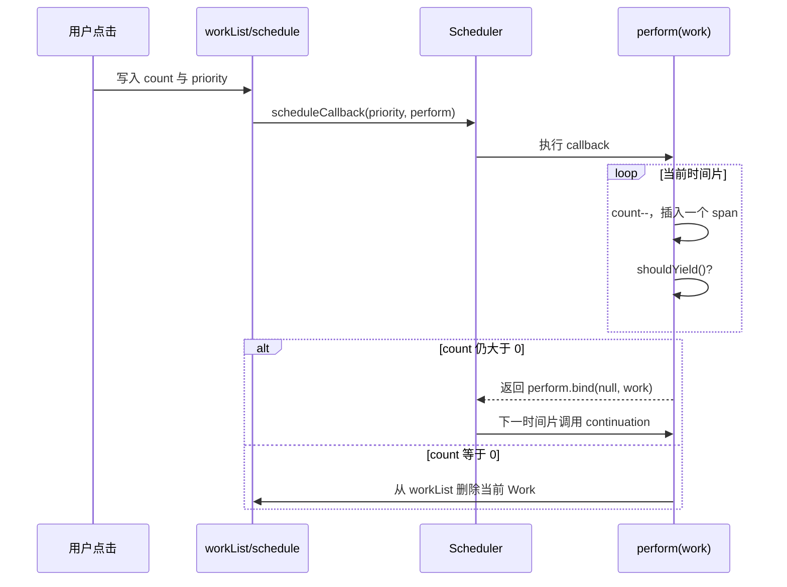

# 第17章：并发更新的原理

## 本章定位

- **数据流定位**：把 `{count, priority}` Demo Work 交给 Scheduler → 在 Work.count 上观察同步执行、让出与 continuation → 第 18 章再把同样机制接入 Fiber/Lane。
- **难度**：★★★★☆ —— 概念密集但源码量少。难点在建立「时间切片、优先级、可恢复工作」的完整心智模型，而不是记住某个函数。
- **前置依赖**：第 3 章（Fiber 工作单元与双缓存）、第 14 章（Lane 与同步调度）。本章讨论「为什么 render 可中断」，需要先知道同步 render 是怎么跑的、Lane 长什么样。自检：能说出同步 render 为什么会阻塞主线程；知道 Fiber 如何把递归拆成工作单元；能区分 Scheduler priority 与 Lane 是两个优先级系统。
- **读后检验**：能画出 Demo callback 让出与恢复的时序图；能解释 Work.count 怎样保存进度、为什么单个 10ms 工作仍不能被切开，以及为什么这些结论还不等于 reconciler 已经并发化。

本章先不改 reconciler，而是理解并发更新为什么存在。同步更新的问题是：一旦 render 工作量太大，主线程会长时间被占用，浏览器无法及时响应输入、动画和绘制。本章用 `main9-schedule.ts` 的一个 Demo 对比 ImmediatePriority 的同步分支与其他优先级的时间切片分支，并用 `mini-react-schedule.ts` 展开 Scheduler 的宿主循环；第 18 章才改 reconciler。

## 整体架构思路：时间片只能切在工作单元之间

```text
同步： [----------- render 12ms -----------][commit]
输入：              ^ 第 4ms 到达，只能等约 8ms

并发： [render 5ms][让出并处理输入][render 5ms][render 2ms][commit]
输入：              ^ 在第一个让出点得到响应
```

两条时间线完成的 React 计算量接近，第二条甚至多了调度开销；差异是输入等待时间。本章所有概念都服务于一个问题：怎样在不提交半成品的前提下，把长 render 拆出浏览器可用的让出点。

JavaScript 在浏览器主线程上执行，React 的 render、用户输入、动画和绘制竞争同一段时间。核心问题是：**在不能把普通组件 render 真正并行化的前提下，React 怎样让长计算不持续垄断主线程，并让更重要的交互先完成？**

把所有更新都放进微任务并不能解决问题。微任务会在浏览器进入下一次渲染前持续清空；一个很长的 render 即使从微任务开始，仍会阻塞输入和绘制。把整个 render 放进 `setTimeout` 也只是推迟阻塞。

并发需要的是合作式调度：

```text
执行一小段 render
-> 检查当前时间片是否用尽
-> 必要时保存进度并归还主线程
-> 浏览器处理输入/绘制
-> 以后继续，或先处理更高优先级工作
```

### 并发成立的四个前提

1. **工作可分片**：Fiber 把递归拆为单节点工作单元。
2. **render 无外部副作用**：暂停或丢弃 WIP 不会污染当前 UI。
3. **进度可保存或重建**：`workInProgress`、alternate 和 UpdateQueue 保留计算依据。
4. **工作有优先级**：系统能判断继续旧任务还是先执行新任务。

缺任何一个都不能只靠 Scheduler 补救。Scheduler 能提供时间片和任务队列，却不了解 Fiber 树、state 队列或 DOM 一致性。

### 并发不是并行，也不保证更快

并发 render 仍在同一个 JavaScript 线程上执行，总计算量甚至可能因为中断和重做增加。它优化的是用户感知延迟：把紧急反馈提前，把可推迟计算切成片段。吞吐量与响应性是不同目标。

- 同步：一个任务更早开始并一口气结束，但期间无法响应
- 并发：任务可能更晚完成，却能在中途处理输入和绘制

### Scheduler、Lane 与 Fiber 的责任边界

| 模块            | 决策问题                         | 不理解什么             |
| --------------- | -------------------------------- | ---------------------- |
| Scheduler       | 哪个 callback 先运行、是否应让出 | 组件 state、Fiber 语义 |
| Lane            | 哪些 React updates 属于本轮工作  | 浏览器帧调度细节       |
| Fiber work loop | 怎样推进、暂停或重建树计算       | 事件类型的业务名字     |
| commit          | 怎样原子地暴露完成结果           | 时间切片               |

## 本章实现：用调度 Demo 观察同步与时间切片

### 本章改动文件

- main8-sync-update.ts：建立不可让出的同步工作基线。
- main9-schedule.ts：把 Demo Work 交给 Scheduler，观察优先级、取消和 continuation。
- mini-react-schedule.ts：用 MessageChannel 展示简化的任务队列与时间片驱动。
- main.tsx：提供调度 Demo 的交互入口。

这几个文件只操作 Demo 的 Work 和 DOM span，不修改 reconciler。阅读时要始终区分“用普通对象模拟可恢复工作”和“第 18 章让 Fiber work loop 真正可中断”。

### 时间切片执行账本

| 时刻         | 输入                   | 写入/保留状态                   | 消费者     | 结果                            |
| ------------ | ---------------------- | ------------------------------- | ---------- | ------------------------------- |
| 点击按钮     | `{ count, priority }`  | `workList`                      | `schedule` | Demo 记录一项待执行工作         |
| 选择工作     | `workList`             | `curWork`、`curCallback`        | Scheduler  | 当前最高优先级工作获得 callback |
| 执行一个单位 | `work.count`           | `count--` 并插入一个 span       | 下一次循环 | 工作进度保存在普通 Work 对象中  |
| 时间片耗尽   | `shouldYield() = true` | 返回 `perform.bind(null, work)` | Scheduler  | callback 成为 continuation      |
| 再次获得时间 | continuation           | 继续读取同一个 `work.count`     | `perform`  | Demo 从剩余数量继续             |

本章操作的是 Demo 自己的 `Work` 对象和 DOM span，不是 reconciler 的 Fiber/WIP。第 18 章才把相同调度思想接入真实 work loop。

### 一项 Work 如何跨时间片继续

假设一项 NormalPriority Work 初始 `count = 3`，第一个时间片只能完成一个单位：

```text
点击
→ workList = [W(count: 3)]
→ schedule 选择 W，保存 curWork
→ Scheduler 执行 perform(W)
→ 完成一个单位，W.count = 2
→ shouldYield() 为 true
→ perform 返回绑定同一 W 的 continuation

下一时间片
→ Scheduler 调用 continuation
→ perform 再次读取同一对象，W.count 仍为 2
→ 继续消费，直到 count = 0
→ 从 workList 删除 W，并调度下一项工作
```

这里没有保存 JavaScript 调用栈。真正跨时间片保存的是普通对象中的剩余数据，以及 Scheduler 持有的 continuation。映射到 React 后，剩余树工作由 Fiber/WIP 保存，callback 重新进入 work loop。

### 17-1 观察 Demo 的同步分支

> **本节数据流**：ImmediatePriority Work → `needSync = true` → while 忽略 shouldYield → count 归零后才结束 callback。

本节先建立同步更新的行为基线：一次交互开始后，render 必须完整跑完才能把主线程交还给浏览器。

#### 同步示例

Demo 的 `perform` 先判断当前 Work 是否必须同步完成：

```ts
const needSync = work.priority === ImmediatePriority || didTimeout;

while ((needSync || !shouldYield()) && work.count > 0) {
	work.count--;
	insertSpan(work.priority + '');
}
```

ImmediatePriority 会让 `needSync` 为 true，因此循环不会读取 `shouldYield()` 的结果，要等 `work.count` 归零才退出。阻塞时间由两部分共同决定：

- work 数量太多。
- 单个 work 太重。

只要 JS 任务一直不结束，浏览器就不能处理新的输入或绘制。用户看到的就是卡顿。

### 17-2 观察 Demo 的时间切片分支

> **本节数据流**：Scheduler callback → Demo 的 `perform` 逐次减少 `work.count` → `shouldYield` 决定返回 continuation → 下一时间片继续同一个 Work。

本节把同一批 Demo 工作交给 Scheduler，不改 reconciler 源码。读者可以直接观察不同优先级 Work 的插队与分片。

#### 并发更新的理论基础

并发更新不是多线程。浏览器主线程仍然一次只能执行一段 JS。React 的并发是“协作式调度”：

1. 把 render 工作拆成很多 Fiber 单元。
2. 每处理一个单元后检查是否应该让出主线程。
3. 如果时间片用完，暂停 render，把剩余工作留到下次 Scheduler 回调。
4. 如果出现更高优先级更新，丢弃或暂停低优先级工作，先处理高优先级。

关键 API：

```ts
unstable_scheduleCallback(priority, callback);
unstable_shouldYield();
```

这两个 API 由 `scheduler` 包提供，并在本章的 Demo 中直接使用。`shouldYield` 返回 true 时，Demo 停止当前 while 循环，让浏览器先处理其他任务；它还没有进入 reconciler。

#### 设计权衡：为什么用 MessageChannel 而不是 setTimeout/rAF？

仓库里的 `mini-react-schedule.ts` 用 `MessageChannel` 驱动简化任务循环：一次消息建立一个时间片，未完成时再次 `postMessage`。它用于理解 Scheduler 的宿主驱动，不代表 big-react 本章自己实现了生产 Scheduler。

#### Scheduler 的优先级

并发 Demo 直接使用 Scheduler 的 Immediate、UserBlocking、Normal 与 Low 四档 priority。按钮点击时把 priority 写入 `Work`，`schedule` 按数值排序选出最紧急的一项。本章没有 Lane 与 Scheduler priority 的转换函数；它们在第 18 章接入 reconciler 时实现。

#### 工作过程仅有一个 work

如果一个 Scheduler callback 返回函数，Scheduler 会把返回的函数作为 continuation 继续调度：

```ts
return perform.bind(null, work);
```

这里返回的是本章 Demo 的 `perform`。它重新绑定同一个 Work 对象，所以 Scheduler 下次调用 continuation 时，读取的是上个时间片剩余的 `work.count`。

#### 工作过程中产生相同优先级的 work

Demo 用 `prevPriority` 记录正在处理的 Work 优先级。新 Work 入队后，若排序得到的最高优先级仍等于 `prevPriority`，`schedule` 不重复注册 callback：

```ts
if (curPriority === prevPriority) {
	// 不需要调度
	return;
}
```

这只是 Demo 的去重规则，不涉及 FiberRoot 字段。

#### 工作过程中产生更高或更低优先级的 work

核心原则：每次从 `workList` 选出 priority 数值最小的 Work。

- 新任务优先级更低：排序后当前 Work 仍排在前面，不替换 callback。
- 新任务优先级更高：取得当前 callback，先取消，再为新 Work 注册 callback。

本章 Demo 的代码是：

```ts
if (cbNode) {
	cancelCallback(cbNode);
}
curCallback = scheduleCallback(curPriority, perform.bind(null, curWork));
```

#### Demo 的分片时序



同一个 Demo 中，不同优先级 Work 最终都要减少相同次数的 `count` 并创建相同数量的 span。区别是 ImmediatePriority 一次做完，其他优先级在 `shouldYield()` 为 true 时退出循环并通过 continuation 再进入。这里每个 `insertSpan` 还故意空转约 10ms，所以单个工作单位本身仍会阻塞；Scheduler 只能在两个单位之间让出，不能切开 `doSomeBusyWork`。

#### 从 Demo 推导到 React 的边界

本章只能得到三条原理结论：

- 并发是单线程上的分段执行，不是多线程并行。
- continuation 必须能重新找到尚未完成的工作；Demo 把进度保存在 `Work.count`。
- 可让出代码必须主动检查 `shouldYield`，一个不可拆分的长函数内部不会被自动抢占。

Fiber 怎样保存树遍历现场、Lane 怎样选择 Update、旧 callback 怎样失效，都属于第 18 章的真实接入，不在本章 Demo 中推演。

## 与官方 React 的差异

| 能力       | big-react 本章 Demo                                      | 官方 React                                                    |
| ---------- | -------------------------------------------------------- | ------------------------------------------------------------- |
| 工作表示   | 一个 `{count, priority}` 对象保存剩余循环次数            | Fiber 树与 Update 队列共同保存组件计算和状态更新              |
| 任务管理   | 数组保存 Work，按 priority 排序；Scheduler 驱动回调      | reconciler 根据根上的待处理优先级安排 Scheduler callback      |
| 让出检查   | `perform` 每轮检查 `shouldYield()`                       | 在可拆分的 Fiber 工作单元之间检查是否需要让出                 |
| 恢复方式   | 返回绑定同一 Work 的 continuation，继续减少 `work.count` | continuation 重新进入 reconciler，并继续或重建未完成的 render |
| React 接入 | 尚未接入 Fiber、Lane、UpdateQueue                        | 优先级产生、状态筛选、可中断遍历和提交共同组成完整闭环        |

本章只用 Demo 证明时间切片与 continuation 的工作方式，没有实现 big-react reconciler 的并发更新。第 18 章才把同样的调度思想接入 Lane、Fiber work loop 和状态队列。

## 思考题

### Q1: 微任务批处理为什么不能解决长 render 卡顿？

批处理减少的是任务启动次数，不会缩短这一轮任务自身的计算量。如果 ImmediatePriority 分支的循环需要连续执行 30ms，循环开始后仍会一直占用主线程，浏览器在它结束前无法处理输入和绘制。其他优先级分支的 `perform` 把相同工作拆成多次执行，并在每轮后检查 `shouldYield()`；时间片用尽时返回 continuation，才真正给浏览器留下响应窗口。

### Q2: React 并发是多线程并行吗？

Demo 的 Work、Scheduler callback 和浏览器事件仍在同一个 JavaScript 主线程上，任意时刻只有一段代码执行。所谓并发是多个任务在时间上交错推进：低优先级 Work 做一段后让出，浏览器处理输入，更高优先级 Work 可以先获得执行机会，未完成工作以后再继续。它优化的是用户感知响应时间，不保证总计算更少。一个没有主动检查 `shouldYield()` 的 200ms 函数仍不可抢占；映射到 React 后，让出点会放在可拆分的 Fiber 工作单元之间，第 18 章再实现这一步。

### Q3: Scheduler、Lane 和 Fiber 各自提供哪一个并发前提？

Scheduler 决定 callback 何时获得主线程，以及当前时间片是否应该让出；本章 Demo 已经直接观察到这一层。Lane 描述 Update 的优先级，Fiber 把树遍历拆成工作单元，这两种结构在前文已经建立，但本章尚未把它们接入 Demo。完整并发需要三者合作：Scheduler 不理解组件 state，Lane 不执行浏览器任务，Fiber 也不会自行决定谁更紧急。第 18 章会完成这条连接。

### Q4: render 为什么必须保持可重做，commit 为什么不做时间切片？

可中断 render 可能暂停后继续，也可能因更重要的工作到来而放弃，所以计算阶段不能提前修改 current 树或 DOM。只有这样，尚未完成的候选结果才可以安全地重做。commit 会执行本课程已经实现的 Placement 等宿主变更；如果插入一部分 DOM 后让出，浏览器可能展示新旧混合的界面。因此 React 把可拆分计算放在 render，把最终可见切换集中到短而同步的 commit。第 18 章会把本章 Demo 的让出机制接到 render，commit 仍保持同步。

### Q5: continuation 保存的是调用栈吗？Demo 为什么能够从上次剩余位置继续？

不是。`perform` 返回后，这次 JavaScript 调用栈已经结束。continuation 只是一个重新进入 `perform` 的函数，它通过闭包绑定同一个 Work 对象；上个时间片已经把 `work.count` 从 3 改为 2，所以下次调用读取到的自然是剩余值 2。

这种设计把执行现场从调用栈转移到可持久对象。第 18 章采用同一原则：Scheduler callback 重新进入 reconciler，Fiber/WIP 和模块级游标保存树遍历现场，而不是冻结并恢复一段 JavaScript 栈。

## 本章小结

本章通过调度 Demo 的同步/分片两个分支验证了三个事实：并发仍运行在单线程上；让出必须发生在主动设置的边界；continuation 必须带着剩余工作重新进入调度。`mini-react-schedule.ts` 则展示 MessageChannel 怎样重复驱动任务循环。此时这些机制只作用于 Demo 的 `Work.count`，big-react 的 Fiber work loop 仍是同步的；第 18 章才把时间切片、Lane 选择和状态队列接成真实链路。
