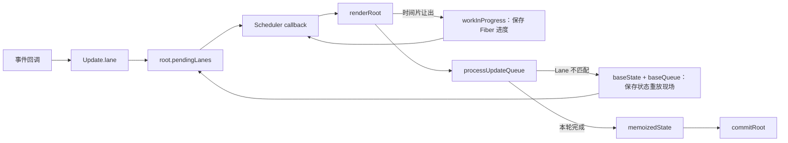

# 第18章：实现并发更新

## 本章定位

- **数据流定位**：事件优先级 → Update.lane → root.pendingLanes → Scheduler callback → 可中断 render → baseQueue 跳过与重放。
- **难度**：★★★★★ —— 第一次让优先级贯穿交互、root 调度、Fiber work loop 和状态队列，同时需要区分两种完全不同的暂停现场。
- **前置依赖**：第 14 章（Lane 与微任务调度）、第 15 章（passive effect）、第 17 章（Scheduler continuation）。自检：能解释 root.pendingLanes 如何记录工作；知道 continuation 怎样重新进入未完成任务。
- **读后检验**：能区分“Fiber 遍历被时间片暂停”和“Update 因 Lane 不匹配被跳过”；能手算 `baseState`、`baseQueue`、`memoizedState`；能沿事件、Lane、root、Scheduler、render 和 UpdateQueue 追踪一次并发更新。

并发更新不是把同步循环换成 Scheduler 就完成了。一次更新从产生到提交，至少经过四层：

```text
事件优先级
  -> Update.lane
  -> FiberRoot.pendingLanes
  -> Scheduler callback
  -> renderLane
  -> processUpdateQueue
```

如果只有 Scheduler 知道优先级，状态队列仍会把低优先级 Update 一起算掉；如果只给 Update 加 Lane，root 又不知道该先调度哪一批工作。优先级必须贯穿整条链。

## 整体架构思路：保存两种不同的“现场”

并发 render 会遇到两类暂停，它们不能用同一套字段解决。

| 场景        | 为什么暂停                        | 现场保存在哪里                                                | 恢复方式                                             |
| ----------- | --------------------------------- | ------------------------------------------------------------- | ---------------------------------------------------- |
| 时间片让出  | `shouldYield()` 为 true           | 模块级 `workInProgress`、已构建的 WIP 树、`wipRootRenderLane` | Scheduler 再次调用 continuation，从下一个 Fiber 继续 |
| Update 跳过 | `Update.lane` 不属于 `renderLane` | Hook 的 `baseState`、`baseQueue`                              | 后续 Lane render 时按原顺序重放                      |

第一类回答“Fiber 树走到哪里了”，第二类回答“state 应该从哪里重新计算”。只实现其中一类，并发更新都会丢工作。

### 优先级在对象之间如何交接

| 对象或字段                 | 保存什么                       | 谁写入                           | 谁消费                               |
| -------------------------- | ------------------------------ | -------------------------------- | ------------------------------------ |
| `Update.lane`              | 单条状态更新所属的优先级       | dispatch                         | `processUpdateQueue`                 |
| `root.pendingLanes`        | root 尚未完成的全部 Lane       | `markRootUpdated`                | `ensureRootIsScheduled`              |
| `root.callbackNode`        | 已注册的 Scheduler 任务句柄    | `ensureRootIsScheduled`          | 取消任务、判断 continuation 是否失效 |
| `root.callbackPriority`    | callback 代表的最高 Lane       | `ensureRootIsScheduled`          | 同优先级任务去重                     |
| `wipRootRenderLane`        | 本轮 render 正在处理的 Lane    | `prepareFreshStack`              | beginWork、Hook 队列计算             |
| `Hook.baseState/baseQueue` | 被跳过 Update 的重放基线和日志 | `updateState/processUpdateQueue` | 下一轮 state 计算                    |

这张表是本章的主线：每一层只做自己的决策，同时把下一层需要的信息写到稳定对象上。



图中两条回边分别对应两种恢复：`workInProgress` 让同一 Lane 的 Fiber 遍历续跑，`baseQueue` 让被跳过的 Update 在后续 Lane 中重放。

## 本章实现：让优先级贯穿交互、调度与状态计算

### 本章改动文件

- SyntheticEvent.ts：在事件回调外建立 Scheduler priority 上下文。
- fiberLanes.ts：增加多种 Lane、优先级转换和集合判断。
- fiber.ts：在 FiberRoot 上保存 callbackNode 与 callbackPriority。
- workLoop.ts：实现任务复用/取消、并发 work loop、continuation 与失效检查。
- fiberHooks.ts：把 renderLane 交给 Hook UpdateQueue，并保存 baseState/baseQueue。
- updateQueue.ts：按 Lane 跳过 Update、克隆重放日志并计算新状态。

这些文件按“优先级产生 → root 选择任务 → Fiber 分片 → state 筛选 → commit 结清”组成一条链。只阅读 Scheduler 或 UpdateQueue，都无法单独解释并发更新为什么不丢工作。

### 18-1 实现并发更新的交互部分

本节把“浏览器事件有多紧急”转换为 reconciler 能识别的 Lane。

#### 事件回调建立 Scheduler 优先级上下文

[SyntheticEvent.ts](../../packages/react-dom/src/SyntheticEvent.ts) 在执行事件回调时使用 `unstable_runWithPriority`：

```ts
unstable_runWithPriority(eventTypeToSchedulePriority(se.type), () => {
	callback(se);
});
```

本节支持的映射是：

| 事件                        | Scheduler priority     |
| --------------------------- | ---------------------- |
| `click`、`keydown`、`keyup` | `ImmediatePriority`    |
| `scroll`                    | `UserBlockingPriority` |
| 其他事件                    | `NormalPriority`       |

`unstable_runWithPriority` 不会异步执行 callback。它只是临时修改 Scheduler 的“当前优先级”，callback 返回后再恢复。

#### requestUpdateLane 读取上下文

[fiberLanes.ts](../../packages/react-reconciler/src/fiberLanes.ts) 新增双向映射：

```ts
export function requestUpdateLane() {
	const schedulerPriority = unstable_getCurrentPriorityLevel();
	return schedulerPriorityToLane(schedulerPriority);
}
```

| Scheduler priority     | Lane                  |
| ---------------------- | --------------------- |
| `ImmediatePriority`    | `SyncLane`            |
| `UserBlockingPriority` | `InputContinuousLane` |
| `NormalPriority`       | `DefaultLane`         |

反向的 `lanesToSchedulerPriority` 用于 root 调度：React 先在自己的 Lane 模型中选择工作，再把选中的 Lane 翻译成 Scheduler priority。

这里必须区分两个层次：

- Lane 属于 reconciler，用于标识 Update、组合 `pendingLanes`、筛选 state。
- Scheduler priority 属于任务调度器，只决定 callback 何时获得主线程。

它们可以映射，但不是同一个概念。

#### 事件优先级在本章的实现边界

18-3 又在 `dispatchSetState` 内部包了一层 `NormalPriority`。内层上下文会覆盖事件系统建立的优先级，因此本章结束时普通 Hook setter 实际总是拿到 `DefaultLane`，click 并不会得到 `SyncLane`。

此外，`schedulerPriorityToLane` 没有处理 `IdlePriority`，会返回 `NoLane`。这两点都是本章代码的真实边界。课程后面的 23-5 会移除 dispatch 内部的 NormalPriority 包装，让 setter 再次直接读取外部上下文。

### 18-2 实现并发更新的策略逻辑

本节让 root 根据 `pendingLanes` 复用、取消或创建任务，并让非同步 render 可以按时间片暂停。

#### root 为什么需要 callbackNode 和 callbackPriority

`FiberRootNode` 新增：

```ts
callbackNode: CallbackNode | null;
callbackPriority: Lane;
```

两者职责不同：

- `callbackNode` 是 Scheduler 返回的任务句柄，用来取消旧任务，也用对象身份判断当前 callback 是否还拥有调度权。
- `callbackPriority` 是 React 对该任务的摘要，用来判断“当前最高 Lane 没变，是否可以复用已有任务”。

只有 callbackNode，React 每次都要取消再注册；只有 callbackPriority，React 又无法真正取消 Scheduler 中的旧任务。

#### ensureRootIsScheduled 的三条分支

[workLoop.ts](../../packages/react-reconciler/src/workLoop.ts) 的调度入口先取最高优先级 Lane：

```ts
const updateLane = getHighestPriorityLane(root.pendingLanes);
const existingCallback = root.callbackNode;
```

随后分三种情况：

1. `NoLane`：取消旧 callback，清空 callback 记录。
2. 最高 Lane 与 `callbackPriority` 相同：复用现有任务，不重复调度。
3. 优先级变化：取消旧 callback，再按新 Lane 建立任务。

SyncLane 仍进入同步队列，并由微任务统一 flush；其他 Lane 通过 `lanesToSchedulerPriority` 注册 Scheduler callback。

```ts
if (updateLane === SyncLane) {
	scheduleSyncCallback(performSyncWorkOnRoot.bind(null, root));
	scheduleMicroTask(flushSyncCallbacks);
} else {
	const schedulerPriority = lanesToSchedulerPriority(updateLane);
	newCallbackNode = scheduleCallback(
		schedulerPriority,
		performConcurrentWorkOnRoot.bind(null, root)
	);
}
```

同一宏任务里连续产生相同 Lane 的 Update 时，队列继续累积 Update，但 root callback 只保留一个。这就是本章批处理在调度层的来源。

#### renderRoot 选择同步还是并发循环

`renderRoot(root, lane, shouldTimeSlice)` 统一两个入口：

```ts
if (shouldTimeSlice) {
	workLoopConcurrent();
} else {
	workLoopSync();
}
```

两个循环只差一个让出条件：

```ts
function workLoopSync() {
	while (workInProgress !== null) {
		performUnitOfWork(workInProgress);
	}
}

function workLoopConcurrent() {
	while (workInProgress !== null && !unstable_shouldYield()) {
		performUnitOfWork(workInProgress);
	}
}
```

若时间片结束时 `workInProgress !== null`，`renderRoot` 返回 `RootInComplete`。`performConcurrentWorkOnRoot` 再返回一个绑定后的自身函数，Scheduler 会把它当作 continuation，在后续时间片继续执行。

这里没有保存 JavaScript 调用栈。能够续跑，是因为“下一个工作单元”已经对象化为 `workInProgress` 指针，已完成部分保存在 WIP Fiber 上。

#### Lane 变化时不是续跑，而是重建

`renderRoot` 只有在 `wipRootRenderLane === lane` 时才沿用现有 WIP：

```ts
if (wipRootRenderLane !== lane) {
	prepareFreshStack(root, lane);
}
```

更高优先级 Lane 到来后，本轮 lane 变化，旧 WIP 不能直接继续；`prepareFreshStack` 从 `root.current` 创建新的 WIP，从头计算。current 仍是已提交树，因此丢弃候选工作不会影响页面。

#### callback 身份为什么要比较

`performConcurrentWorkOnRoot` 开始时保存当前 callbackNode。render 或 passive effect flush 期间可能产生更高优先级更新，`ensureRootIsScheduled` 会取消旧任务并写入新的 callbackNode。

如果旧 callback 结束一个时间片后发现引用已变化，就不能再返回 continuation：

```ts
if (root.callbackNode !== currentCallbackNode) {
	return;
}
return performConcurrentWorkOnRoot.bind(null, root);
```

这个对象身份比较传递的是“调度权是否仍属于当前任务”，不是在比较任务内容。

#### didTimeout 防止低优任务永久饥饿

Scheduler callback 的第二个参数 `didTimeout` 表示任务已过期：

```ts
const needSync = lane === SyncLane || didTimeout;
const exitStatus = renderRoot(root, lane, !needSync);
```

低优任务反复被打断后，一旦过期，本轮不再检查 `shouldYield`，而是同步完成 render。这样优先级影响先后顺序，却不会让低优任务永远没有完成机会。

### 18-3 实现并发更新的状态计算

时间切片只解决 Fiber 遍历的暂停。状态队列还必须做到：本轮不处理的 Update 可以跳过，但不能丢；后续重放时仍保持原触发顺序。

本节沿着 U0、U1、U2 三条更新的流转过程展开。先通过优先级跳过说明为什么需要 baseQueue，再观察新更新如何进入 pending、render 如何生成下一版 baseQueue，最后分析 render 被打断后，React 如何找回尚未提交的更新。

#### pending 与 baseQueue 分别保存什么

`Hook` 增加：

```ts
baseState: any;
baseQueue: Update<any> | null;
```

四个容易混淆的字段分别承担“新输入、重放输入、重放起点、本轮结果”：

| 字段                   | 所在对象    | 准确含义                                                       |
| ---------------------- | ----------- | -------------------------------------------------------------- |
| `queue.shared.pending` | UpdateQueue | 自上次合并以来新入队、尚未并入 Hook 重放队列的 Update          |
| `baseQueue`            | Hook        | 从第一个被跳过 Update 开始，未来恢复原始更新顺序所需的完整日志 |
| `baseState`            | Hook        | 下一次执行 `baseQueue` 前的状态快照                            |
| `memoizedState`        | Hook        | 本轮 Lane 筛选和计算后，组件在这次 render 中读取到的 state     |

`baseQueue` 不只保存低优先级 Update。第一个跳过项之后已经执行的 Update 也要克隆进去，否则恢复时无法保持原始触发顺序。

big-react 的 pending 字段是 `queue.shared.pending`；官方 React Hooks 的对应字段直接是 `queue.pending`。字段位置不同，但“pending 接收新更新、baseQueue 保存重放现场”的核心分工一致。

#### 跳过 Update 需要考虑的问题

优先级允许 React 暂时跳过一部分 Update，但不能改变它们最终的计算顺序。考虑下面三条更新：

```js
// 初始state = 0

// u0
{
  action: num => num + 1,
  lane: DefaultLane
}
// u1
{
  action: 3,
  lane: SyncLane
}
// u2
{
  action: num => num + 10,
  lane: DefaultLane
}
```

现在先处理 SyncLane。U0 和 U2 都不属于本轮，但 React 不能简单地把它们从队列中删掉；U1 虽然本轮可以执行，未来也不能脱离 U0、U2 的原始位置。队列算法需要同时回答：

1. 被跳过的 U0、U2 保存在哪里？
2. 下一轮应该从哪个 state 开始重新计算？
3. 已经执行过的 U1，未来是否还需要参与重放？

`baseState` 和 `baseQueue` 就是这三个问题的答案。它们需要满足五条原则：

1. `baseState` 是重放 `baseQueue` 的初始 state，`memoizedState` 是本轮 render 得到的可见 state。
2. 本轮没有 Update 被跳过时，`baseState` 最终应与 `memoizedState` 相同，`baseQueue` 为空。
3. 本轮有 Update 被跳过时，`baseState` 保存第一个跳过项之前已经得到的 state。
4. 第一个被跳过的 Update，以及它之后的所有 Update，都要进入 `baseQueue`，供下一轮按原顺序重放。
5. 第一个跳过项之后已经执行的 Update，要以 `NoLane` 克隆进 `baseQueue`，表示重放时无条件执行。

按这五条规则手算本轮 SyncLane：

| Update      | 本轮动作                                  | `newState` | 新 `baseQueue`                              |
| ----------- | ----------------------------------------- | ---------- | ------------------------------------------- |
| U0(Default) | 跳过；第一次跳过，记录 `newBaseState = 0` | 0          | U0'(Default)                                |
| U1(Sync)    | 执行得到 3；前面有跳过项，以 NoLane 克隆  | 3          | U0'(Default) -> U1'(NoLane)                 |
| U2(Default) | 跳过，保留原 Lane 克隆                    | 3          | U0'(Default) -> U1'(NoLane) -> U2'(Default) |

本轮得到：

```text
memoizedState = 3
baseState = 0
baseQueue = U0'(Default) -> U1'(NoLane) -> U2'(Default)
```

以后处理 DefaultLane 时，从 `baseState=0` 重放三条记录：

```text
0 -> U0' 得到 1 -> U1' 得到 3 -> U2' 得到 13
```

U1 已经在高优先级 render 中执行过，但仍必须保留。否则第二轮只执行 U0、U2，会得到 11，破坏原始更新顺序。`NoLane` 表示“这条记录重放时不能再被优先级跳过”，不是“这条 Update 可以删除”。

这一推导描述的是官方 React 要满足的队列语义。本章代码还存在 `baseState` 未初始化、无 pending 时不处理旧 baseQueue、函数 action 使用固定 baseState 三处缺口，因此暂时不能直接跑出上述完整结果。

#### pending 与 baseQueue 在一轮 render 中如何交接

先记住一句话：

```text
pending 保存刚到达的更新；baseQueue 保存以后还要重放的更新。
```

dispatch 只把 U0、U1、U2 追加到共享 pending：

```text
queue.shared.pending:
U0(Default) -> U1(Sync) -> U2(Default)

current.baseQueue:
null
```

当 render 执行到这个 Hook 的 `updateState` 时，才把 pending 与旧 `current.baseQueue` 合并；不是 root render 一开始就统一处理所有 Hook。两者都是“尾指针指向队尾、尾节点 next 指向队首”的环形链表：

```text
旧 baseQueue: A -> B
新 pending:   C -> D

合并结果:     A -> B -> C -> D
```

对应代码只改变链表连接关系，不计算 state：

```ts
if (pending !== null) {
	if (baseQueue !== null) {
		const baseFirst = baseQueue.next;
		const pendingFirst = pending.next;
		baseQueue.next = pendingFirst;
		pending.next = baseFirst;
	}

	baseQueue = pending;
	current.baseQueue = pending;
	queue.shared.pending = null;
}
```

合并之后，pending 被清空，但不代表 Update 已经提交。它只表示：这些新 Update 已经进入本轮可计算、也可在失败后重新计算的输入队列。

接下来 [updateQueue.ts](../../packages/react-reconciler/src/updateQueue.ts) 的 `processUpdateQueue` 遍历合并后的队列，并生成下一版 baseQueue：

```text
Lane 不匹配
  -> 跳过
  -> 保留原 Lane 克隆进 newBaseQueue
  -> 第一次跳过时记录 newBaseState

Lane 匹配
  -> 执行 action
  -> 如果前面已有跳过项，以 NoLane 克隆进 newBaseQueue
```

因此一条 Update 的位置变化不是“从 pending 原样搬到 baseQueue”这么简单：

```text
dispatch：进入 pending
render：pending 与旧 baseQueue 合并，成为本轮输入
计算：根据 renderLane 决定是否克隆进 newBaseQueue
commit：WIP Hook 成为 current，newBaseQueue 成为下一轮的 baseQueue
```

用刚才的 U0、U1、U2 表示这条时间线：

| 时刻                  | pending        | baseQueue                                    |
| --------------------- | -------------- | -------------------------------------------- |
| 三次 dispatch 后      | U0 -> U1 -> U2 | null                                         |
| Sync render 开始计算  | null           | 输入仍按 U0 -> U1 -> U2 排列                 |
| Sync render 提交后    | null           | U0'(Default) -> U1'(NoLane) -> U2'(Default)  |
| Default render 提交后 | null           | null，三条记录已按顺序重放，最终 state 为 13 |

最后一行是目标算法的完整结果。本章实现因为只在 `pending !== null` 时调用 `processUpdateQueue`，暂时无法在 pending 为空时重放旧 baseQueue；第 19 章 19-2 才补上这条消费路径。

#### render 被中断时，baseQueue 怎么办

“被中断”有两种不同情况：

| 情况                        | 是否保留旧 WIP | baseQueue 如何处理                         |
| --------------------------- | -------------- | ------------------------------------------ |
| 同一 Lane 用完时间片        | 保留           | 下个时间片继续，不因 yield 重新生成        |
| 更高 Lane 到来，旧 WIP 作废 | 不保留         | 从 current 保存的输入和新 pending 重新计算 |

第二种情况中，旧 WIP 算出的候选 baseQueue 还没有 commit，会随旧 WIP 一起丢弃。React 之所以仍能重新计算，是因为合并 pending 时执行了：

```ts
current.baseQueue = pending;
queue.shared.pending = null;
```

也就是说，先把已经接收的完整更新序列保存到 current，再清空共享入口。新的高优先级 render 从 current 创建 WIP，把此后新到达的 pending 再接到队尾，然后按新的 renderLane 重新生成 baseQueue。

所以 baseQueue 不是在“中断发生的瞬间”生成的；它是在新 render 再次执行 `processUpdateQueue` 时生成的。若旧 render 还没有执行到这个 Hook，旧 Update 根本没有离开 pending，新 render 同样可以找到它们。

#### 状态重放在本章的实现边界

参考算法必须和本章实际代码分开看：

| 缺口                                                 | 本章实际结果                                 | 后续变化                                               |
| ---------------------------------------------------- | -------------------------------------------- | ------------------------------------------------------ |
| mount 未执行 `hook.baseState = memoizedState`        | 首次 update 的 baseState 仍是 null           | 第 19 章 19-2 初始化 baseState                         |
| `processUpdateQueue` 位于 `if (pending !== null)` 内 | 只剩 baseQueue、没有新 pending 时不会重放    | 第 19 章 19-2 把计算移到分支外                         |
| 函数 action 使用 `action(baseState)`                 | 同一轮多条函数 Update 不会基于前一条结果累加 | 课程章节内没有完全修正；不要把理想手算当作当前运行结果 |

18-3 还在 dispatch 内强制使用 NormalPriority，使普通 Hook Update 成为 DefaultLane。它让 demo 更容易进入并发分支，却切断了 18-1 的事件优先级传递；第 23 章 23-5 才移除这层包装。

因此，本章真正完成的是“并发状态计算所需的数据结构和决策骨架”，不是与官方 React 等价的可运行语义。

## 一次更新的完整链路

```text
事件回调
-> unstable_runWithPriority
-> dispatchSetState
-> requestUpdateLane
-> createUpdate(action, lane)
-> enqueueUpdate
-> markRootUpdated: pendingLanes |= lane
-> ensureRootIsScheduled
-> performConcurrentWorkOnRoot
-> renderRoot(root, lane, shouldTimeSlice)
-> beginWork / processUpdateQueue
-> 时间片不足：返回 continuation
-> render 完成：finishedWork + finishedLane
-> commitRoot
-> markRootFinished
-> 再调度剩余 Lane
```

这条链上有三个“不丢工作”的保证：

1. 时间片让出时，`workInProgress` 保存树进度。
2. Lane 跳过时，`baseState/baseQueue` 保存状态重放依据。
3. commit 只清除 `finishedLane`，`pendingLanes` 中其他 Lane 会再次调度。

## 与官方 React 的差异

| 能力         | big-react 本章                                | 官方 React 的设计                                       |
| ------------ | --------------------------------------------- | ------------------------------------------------------- |
| render 范围  | 一次选择单个 `renderLane`                     | 使用 `renderLanes` 集合，可组合处理多条 Lane            |
| 时间片       | Fiber 工作单元之间检查 `shouldYield`          | 同样以可中断 render、同步 commit 为核心，但退出状态更多 |
| Update 跳过  | 已有 baseState/baseQueue 与 NoLane clone 骨架 | 队列初始化、归约与重放语义完整                          |
| 函数 Update  | 错误地始终读取固定 baseState                  | 每条 action 基于当前累计 state 继续归约                 |
| pending 字段 | Hook 队列使用 `queue.shared.pending`          | Hook 队列直接使用 `queue.pending`                       |
| 事件优先级   | 18-3 的 NormalPriority 包装覆盖事件上下文     | 事件优先级能传到 Update Lane                            |
| Lane 选择    | pendingLanes 取最低位                         | 还会综合 suspended、pinged、entangled、expired 等状态   |
| 并发安全     | 模块级单份 WIP 现场，覆盖教学路径             | 处理更多 root、错误、挂起与重入边界                     |

## 思考题

### Q1: Lane 和 Scheduler priority 为什么不能合并成一个字段？

先看职责：Lane 附着在 Update 和 FiberRoot 上，必须参与集合运算、跳过和重放；Scheduler priority 只附着在 callback 上，决定任务何时获得时间片。一次 root render 可以处理一组 Lane，却只注册一个 Scheduler callback，所以两者不是一一对应。

再看生命周期：Update 即使暂时被跳过，它的 Lane 仍要留在 baseQueue 中；Scheduler callback 可以被取消并重新创建。若把两者合并，取消 callback 可能误删更新身份，状态队列也无法表达“同一个任务里有哪些待处理 Lane”。

因此 React 先用 Lane 决定“做哪批工作”，再映射为 Scheduler priority 决定“什么时候做”。这是 reconciler 策略与宿主任务调度的边界。

### Q2: 同一事件里连续多次 setState，为什么通常只注册一个 root callback？

每次 dispatch 都会创建独立 Update 并进入 Hook 的环形队列，所以更新意图没有合并丢失；但 `root.pendingLanes |= lane` 后，同 Lane 的集合值不再变化。第一次 dispatch 已写入 `callbackPriority` 并注册任务，后续 dispatch 发现最高 Lane 与旧 callbackPriority 优先级相同，直接返回，不重新调度。

真正执行 callback 时，render 读取的是此刻完整的 UpdateQueue，因此一个 callback 可以消费多条 Update。批处理的组合条件是“UpdateQueue 负责累积意图，root 调度按最高 Lane 去重”，不是把多个 setState 改写成一条 Update。

本章函数 action 累加仍有实现缺陷，所以这里只能断言调度次数被合并，不能据此断言多条函数 Update 的最终 state 已完全正确。

### Q3: 高优先级更新如何让正在执行的低优先级任务失去续跑资格？

高优 Lane 并入 pendingLanes 后，`ensureRootIsScheduled` 发现最高 Lane 与 `callbackPriority` 不同，先取消旧 callbackNode，再注册新 callback 并覆盖 root 上的记录。

旧 callback 可能已经进入执行，取消并不能回滚当前 JavaScript 调用栈。因此它在 passive effect flush 后、以及时间片结束准备返回 continuation 时，都要比较“执行前保存的 callbackNode”与“root 当前 callbackNode”。引用不同表示调度权已经转移，旧函数直接返回，不再提交自己的 continuation。

新 callback render 时 Lane 改变，`prepareFreshStack` 会从 current 重建 WIP。抢占依赖三件事共同成立：旧任务可失效、render 没改 DOM、Update 意图仍保存在队列中。

### Q4: 时间片中断和低优先级 Update 被跳过，最容易混淆的区别是什么？

时间片中断发生在 Fiber 工作单元之间：本轮 Lane 没变，只是主线程时间不够。恢复时继续使用现有 WIP 和 `workInProgress`，不需要重新计算已经完成的 Fiber。

Update 跳过发生在某个 Hook 的状态归约内部：本轮明确不处理该 Update.lane。即使整棵 Fiber 树一次完成，这条 Update 也要进入 baseQueue，等另一个 Lane render 时从 baseState 重放。

前者是“同一批工作稍后继续”，后者是“这批 render 暂不包含某些状态意图”。一个保存遍历位置，一个保存状态时间线。

### Q5: 为什么第一次跳过 Update 时，要把当时的 newState 保存为 newBaseState？

baseQueue 只保存从第一个被跳过项开始、未来必须重放的日志。因此重放起点必须是“第一个跳过项之前，所有不需要重放的 Update 已经计算完后的状态”。

如果总从本轮最终 memoizedState 重放，后面本轮已经执行过的 Update 会被重复叠加；如果总从组件初始 state 重放，第一个跳过项之前已经稳定生效的 Update 又会丢失。`newBaseState = newState` 恰好截取了状态时间线的正确断点。

### Q6: 已执行过的 Update 为什么还要以 NoLane 克隆进 baseQueue？

因为优先级允许“先显示高优结果”，但不能改变 Update 的原始触发顺序。只要前面有一条低优 Update 被跳过，后续高优 Update 的最终语义就可能依赖那条低优 Update 的结果；未来必须从 baseState 按原顺序重算整段。

克隆时使用 NoLane，表示这条 Update 已不再等待某个优先级，未来重放时无条件执行。它不是重复的待调度工作，而是恢复状态顺序所需的计算日志。删除它会得到“本轮看起来正确、后续最终 state 错误”的隐蔽 bug。

### Q7: didTimeout 为什么会把并发 render 改为同步 render？

时间切片保证高优交互有机会插队，但持续插队可能让低优任务长期完不成（饥饿问题）。Scheduler 根据任务优先级设置过期时间，过期后以 `didTimeout=true` 调用 callback。React 此时关闭时间切片，使用同步 work loop 把当前 Lane 一次做完。

这不是把低优 Update 提升为 SyncLane：Update 的 Lane 没变，状态筛选范围也没变；改变的只是这次 callback 是否继续主动让出。Lane 决定处理哪批更新，didTimeout 决定这批工作是否必须完成。

### Q8: 为什么 performConcurrentWorkOnRoot 开头要先 flush passive effects，并在之后再次检查 callbackNode？

上一轮 commit 收集的 passive effect 应在下一轮 render 前执行，否则 effect 会跨多轮积压，cleanup/create 看到的状态时序也会错乱。`flushPassiveEffects` 末尾还会 flush 同步回调，而 effect 本身也可能调用 setState。

这些更新可能改变 root 的最高 Lane，取消当前 callback 并注册新 callback。因此 flush 前保存 callbackNode，flush 后若引用已变，当前任务已经过期，必须退出。这个检查说明 passive effect 虽然在 commit 后异步执行，却能反过来影响下一轮调度。

### Q9: `queue.shared.pending` 被清空，是否表示其中的 Update 已经执行并提交？U0、U1、U2 分别去了哪里？

不是。pending 被清空只表示 Update 已经进入 render 的计算输入，不表示 action 已全部执行，更不表示结果已经 commit。

下面按官方 React 的正确队列语义推导；本章代码的三处阶段性缺口不改变 pending、执行和 commit 是三个不同动作，但会影响示例在本章代码中的实际数值和后续重放。

三次 dispatch 后：

```text
pending = U0(Default) -> U1(Sync) -> U2(Default)
baseQueue = null
```

Sync render 执行到这个 Hook 时，先把 pending 交给本轮队列并清空共享入口：

```text
pending = null
本轮输入 = U0(Default) -> U1(Sync) -> U2(Default)
```

此时三条 Update 的结果并不相同：

- U0 优先级不匹配，没有执行，以 DefaultLane 克隆进新 baseQueue。
- U1 优先级匹配，本轮执行得到 state 3；因为前面跳过了 U0，又以 NoLane 克隆进新 baseQueue。
- U2 优先级不匹配，没有执行，以 DefaultLane 克隆进新 baseQueue。

Sync render 提交后：

```text
memoizedState = 3
baseState = 0
baseQueue = U0'(Default) -> U1'(NoLane) -> U2'(Default)
pending = null
```

所以要分清三个动作：

```text
pending 清空：Update 已被 render 接收
action 执行：Update 属于本轮 renderLane
commit 完成：本轮计算结果才成为页面可见状态
```

### Q10: 初始 state 为 0，Default 更新 U0 已经算出 WIP state 1、但还没 commit；此时又触发 `U1(Sync): 3`。高优先级 render 如何找回 U0，并得到新的 baseQueue？

下面按官方 React 的正确队列语义推导。本章尚未初始化 `baseState`，因此当前章节代码不能直接复现所有数值；这里考察的是本章新增的队列保存与重建机制。

先还原 U0 被处理时发生的事情。U0 最初位于 pending：

```text
pending = U0(Default): n => n + 1
```

Default render 执行到这个 Hook 后，会先把 U0 合入并写到 `current.baseQueue`，再清空 pending。随后旧 WIP 算出 state 1：

```text
current.baseState = 0
current.baseQueue = U0(Default) // 保存原始输入

旧 WIP.memoizedState = 1
旧 WIP.baseQueue = null        // 本轮没有跳过 Update

pending = null
```

注意旧 WIP 还没 commit，因此页面上的 current state 仍是 0。此时 U1 到来，只追加到共享 pending：

```text
current.baseQueue = U0(Default)
pending = U1(Sync): 3
```

SyncLane 优先级更高，旧 WIP 作废。新 render 从 current 创建 WIP，执行到这个 Hook 时先合并：

```text
本轮输入 = U0(Default) -> U1(Sync)
pending = null
```

再按 SyncLane 计算：

| Update      | 本轮动作                                 | 新 baseQueue                |
| ----------- | ---------------------------------------- | --------------------------- |
| U0(Default) | 跳过，记录 `newBaseState = 0`            | U0'(Default)                |
| U1(Sync)    | 执行得到 3；前面有跳过项，以 NoLane 克隆 | U0'(Default) -> U1'(NoLane) |

高优先级 render 得到：

```text
memoizedState = 3
baseState = 0
baseQueue = U0'(Default) -> U1'(NoLane)
```

U0 没有随旧 WIP 丢失，是因为旧 render 清空 pending 前已把 U0 保存到 `current.baseQueue`。新的 baseQueue 也不是在中断瞬间自动生成，而是新 render 合并 `current.baseQueue + pending` 后，再次执行 `processUpdateQueue` 得到的。

如果旧 render 只是用完时间片、没有被更高 Lane 取代，React 会保留旧 WIP 并在下个时间片续跑，不会走这次“从 current 重新计算”的流程。

## 本章小结

本章把优先级接进事件、root 调度、可中断 work loop 和 Hook UpdateQueue。理解重点不是记函数名，而是认清两套现场：WIP 指针保证 Fiber 遍历可继续，baseState/baseQueue 保证被跳过的状态可重放。

同时要保留代码边界：18-3 只建立了算法骨架，baseState 初始化、无 pending 时重放和函数 action 累加仍有缺口。第 19 章补上前两处，再用 TransitionLane 让开发者主动声明非紧急更新。
