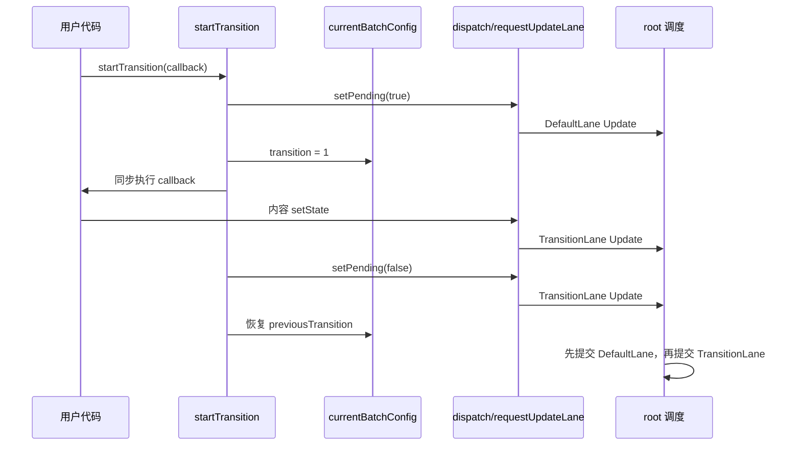

# 第19章：实现 useTransition

## 本章定位

- **数据流定位**：startTransition 动态上下文 → requestUpdateLane 选择 TransitionLane → UpdateQueue 跳过与重放 → 高低优先级分两次提交。
- **难度**：★★★★☆ —— API 很小，但要同时理解动态上下文、两个 Hook 节点、三条不同 Lane 的 Update，以及 pending 为什么跨两次提交变化。
- **前置依赖**：第 18 章（root 调度、可中断 render、Update 跳过与重放）。自检：能手算 baseState/baseQueue；知道 Scheduler priority 与 Lane 的职责不同。
- **读后检验**：能逐行推导 `startTransition` 中三次更新分别拿到什么 Lane；能解释 `useTransition` 为什么占两个 Hook 节点；能说明动态上下文、pending 状态和 baseQueue 怎样共同完成两阶段提交。

React 能根据 click、scroll 等事件给出默认优先级，却不知道业务语义。一次输入事件里，输入框自身的 value 必须及时更新，依据 value 计算的巨大列表却可以延后。两次调用都只是 setState，React 无法仅凭 setter 自动判断哪一个可以让路。

`useTransition` 就是把这项分类权交给开发者：

```tsx
const [input, setInput] = useState('');
const [query, setQuery] = useState('');
const [isPending, startTransition] = useTransition();

function onChange(nextValue) {
	setInput(nextValue);
	startTransition(() => {
		setQuery(nextValue);
	});
}
```

callback 会立刻执行；延后的不是 JavaScript 函数，而是 callback 中创建的 React Update。

## 整体架构思路：用动态上下文改变 Update.lane

本章没有为 transition 创建第二套队列或第二套 work loop。它只在 callback 执行期间设置一个模块级标记，让已有的 `requestUpdateLane` 返回 TransitionLane。

```text
startTransition(scope)
-> 临时设置 currentBatchConfig.transition
-> 同步执行 scope
-> scope 内 setter 创建 TransitionLane Update
-> 恢复 transition 上下文
-> 原有 UpdateQueue、root 调度、render、commit 继续工作
```

这是一种“动态上下文”设计：调用链中的 setter 不需要增加 `lane` 参数，只要在创建 Update 时读取当前上下文。



这张图只描述本章代码的时序：callback 同步执行，真正分开的，是三条 Update 所属的 Lane 与后续两次提交。

### 为什么需要 isPending

只降低内容更新的优先级还不够。用户需要先看到“系统已接受操作”，再等待非紧急内容完成：

| 更新                  | Lane           | 目的                           |
| --------------------- | -------------- | ------------------------------ |
| `setPending(true)`    | DefaultLane    | 尽快显示 pending 反馈          |
| callback 中的内容更新 | TransitionLane | 昂贵 render 可以让路           |
| `setPending(false)`   | TransitionLane | 与新内容一起提交，结束 pending |

本章普通 setter 仍受第 18 章的 NormalPriority 包装影响，所以这里的“较高优先级”实际是 DefaultLane，不是 SyncLane。

### 为什么旧 UI 可以继续显示

TransitionLane render 只修改 WIP Fiber。current Fiber 和已提交 DOM 在 commit 前都不变；时间片让出或更高优先级更新到来时，React 可以暂停或重建 WIP，而无需回滚页面。

因此“保留旧 UI”不是 `useTransition` 额外缓存了一份 DOM，而是以下基础能力共同产生的结果：

1. current/WIP 双缓存隔离已提交结果与候选结果。
2. render 只计算，不修改可见宿主树。
3. Lane 允许紧急更新先提交。
4. commit 在整棵候选树完成后一次执行。

## 本章实现：把 Transition 语义接入既有并发管线

### 本章改动文件

- currentBatchConfig.ts：保存当前 transition 动态上下文。
- currentDispatcher.ts：在 Dispatcher 中声明 `useTransition`。
- react/index.ts：导出公共 Hook，并通过 internals 共享 transition 上下文。
- fiberLanes.ts：定义 TransitionLane，并让 `requestUpdateLane` 优先读取 transition。
- fiberHooks.ts：实现 mount/update transition、pending 更新与 baseQueue 接线。
- workLoop.ts：调度并提交 TransitionLane 工作。
- transition/main.tsx：展示高优反馈与低优内容更新的分离。

本章没有建立新的渲染器或工作循环。新增代码的作用是把业务语义写进 Update.lane，再复用第 18 章已有的调度、跳过、重放和提交管线。

### 19-1 useTransition 的作用

Transition 适合“结果可以晚一点出现，但用户操作必须马上有反馈”的 render：

```tsx
function selectTab(nextTab) {
	setSelected(nextTab);
	startTransition(() => {
		setContentTab(nextTab);
	});
}
```

`selected` 驱动按钮选中态，`contentTab` 驱动较重的内容区。高优更新到来时，未完成的 content render 可以被打断；新内容准备完成后才进入 commit。

它不等同于 debounce：

- debounce 改变“函数是否执行、何时执行”，中间调用可能被取消。
- transition 立即执行 callback 并记录 Update，只改变这些 Update 的调度优先级。
- debounce 常用于减少请求或业务动作；transition 用于协调 React render 的响应性。

受控输入框本身通常不应放进 transition，否则 DOM value 会落后于用户输入。可以延后的通常是由输入派生出的结果列表。

### 19-2 实现 useTransition

#### 1. 建立共享的 transition 上下文

[currentBatchConfig.ts](../../packages/react/src/currentBatchConfig.ts) 新增：

```ts
const currentBatchConfig = {
	transition: null
};
```

[react/index.ts](../../packages/react/index.ts) 把它与 currentDispatcher 一起放入内部共享对象。reconciler 通过 `shared/internals` 读取同一实例。

这里的关键不是属性名，而是对象必须只有一份：`startTransition` 写入的对象和 `requestUpdateLane` 读取的对象若不是同一实例，transition 标记永远不会生效。

#### 2. requestUpdateLane 优先识别 Transition

[fiberLanes.ts](../../packages/react-reconciler/src/fiberLanes.ts) 新增 TransitionLane：

```ts
export const SyncLane = 0b00001;
export const InputContinuousLane = 0b00010;
export const DefaultLane = 0b00100;
export const TransitionLane = 0b01000;
export const IdleLane = 0b10000;
```

分配 Lane 时先判断 transition 上下文：

```ts
export function requestUpdateLane() {
	if (currentBatchConfig.transition !== null) {
		return TransitionLane;
	}

	const schedulerPriority = unstable_getCurrentPriorityLevel();
	return schedulerPriorityToLane(schedulerPriority);
}
```

判断必须在 Scheduler priority 之前。callback 通常由 click 等事件触发，如果先返回事件对应 Lane，transition 声明就无法覆盖事件上下文。

#### 3. useTransition 为什么占两个 Hook 节点

[fiberHooks.ts](../../packages/react-reconciler/src/fiberHooks.ts) 的 mount 实现：

```ts
function mountTransition() {
	const [isPending, setPending] = mountState(false);
	const hook = mountWorkInProgressHook();

	const start = startTransition.bind(null, setPending);
	hook.memoizedState = start;

	return [isPending, start];
}
```

`mountState(false)` 内部已经调用一次 `mountWorkInProgressHook`，用于保存 pending state 和 UpdateQueue。随后再创建一个 Hook 节点，用来保存稳定的 start 函数。

Hook 链形态是：

```text
useTransition
  -> Hook #1：isPending + UpdateQueue
  -> Hook #2：start 函数
```

update 时必须以相同顺序消费：

```ts
function updateTransition() {
	const [isPending] = updateState();
	const hook = updateWorkInProgressHook();
	const start = hook.memoizedState;
	return [isPending, start];
}
```

isPending 可能有新 Update，必须走完整状态计算；start 只在 mount 时 bind 一次，update 直接复用，保持函数引用稳定。

#### 4. startTransition 的三次更新

本章实现：

```ts
function startTransition(setPending, callback) {
	setPending(true);

	const prevTransition = currentBatchConfig.transition;
	currentBatchConfig.transition = 1;

	callback();
	setPending(false);

	currentBatchConfig.transition = prevTransition;
}
```

以普通 click 场景推导：

| 顺序 | 语句                 | transition 标记 | 本章实际 Lane  |
| ---- | -------------------- | --------------- | -------------- |
| 1    | `setPending(true)`   | null            | DefaultLane    |
| 2    | callback 中的 setter | 1               | TransitionLane |
| 3    | `setPending(false)`  | 1               | TransitionLane |
| 4    | 恢复上下文           | prevTransition  | 不创建 Update  |

同步 JavaScript 执行结束后，root 上同时有 DefaultLane 与 TransitionLane。调度器先选择 DefaultLane：

1. pending state 队列执行 true、跳过 false。
2. 内容队列跳过 TransitionLane Update。
3. commit 后界面显示旧内容和 `isPending=true`。
4. root 清除 DefaultLane，再调度 TransitionLane。
5. Transition render 重放内容更新与 false，二者一起提交。

如果 `setPending(true)` 也放在 transition 标记内部，pending 反馈本身会被延后；如果 `setPending(false)` 放到恢复标记之后，它会与 true 同属 DefaultLane，第一次 render 就可能把 pending 重新算回 false。

#### 5. 第 18 章 baseQueue 的两处接线在这里补齐

Transition 场景会稳定地产生“高优 render 跳过低优 Update、下一轮没有新 pending 但必须重放 baseQueue”的情况，因此本节补了两处代码：

第一处，mount 时建立正确基线：

```ts
hook.memoizedState = memoizedState;
hook.baseState = memoizedState;
```

第二处，把 baseQueue 计算移出 `if (pending !== null)`：

```ts
if (pending !== null) {
	// 只负责合并 pending 与 baseQueue
}

if (baseQueue !== null) {
	// 即使没有新 pending，也要处理上次留下的 baseQueue
	processUpdateQueue(baseState, baseQueue, renderLane);
}
```

这两处不是 `useTransition` 的 API 细节，而是低优 Update 能最终生效的底层前提。

第 18 章 `processUpdateQueue` 中函数 action 仍使用固定 baseState，组合函数 Update 的累计结果仍可能错误；本节没有修复它。当前 demo 多使用直接值 Update，因此不等于队列算法已经完整。

#### 6. 核对 TransitionLane 到 Scheduler 的实际映射

本节扩展了 Lane 常量和 `requestUpdateLane`，却没有给 `lanesToSchedulerPriority` 增加 TransitionLane 分支：

```ts
if (lane === SyncLane) return ImmediatePriority;
if (lane === InputContinuousLane) return UserBlockingPriority;
if (lane === DefaultLane) return NormalPriority;
return IdlePriority;
```

TransitionLane 会落入最后的 IdlePriority。也就是说，本章代码不是“普通低优先级并发任务”，而是接近永不过期的空闲任务，可能等待很久。

阅读源码时必须分开：

- Lane 位次表达 Transition 低于 Default、高于 Idle。
- 但实际 Scheduler 映射漏掉了 TransitionLane，最终仍按 IdlePriority 注册 callback。

#### 7. 动态上下文的异常恢复边界

`startTransition` 执行用户 callback 后才恢复 `currentBatchConfig.transition`，却没有 `try/finally`。callback 抛错时：

1. `setPending(false)` 不会执行。
2. transition 标记不会恢复。
3. 后续普通 setter 也会误拿 TransitionLane。

这是模块级动态上下文的通用风险：凡是“保存旧值 → 执行用户代码 → 恢复旧值”，恢复都必须放在 finally 中。本章代码尚未做到。

## 与官方 React 的差异

| 能力            | big-react 本章                                                     | 官方 React 的设计                                |
| --------------- | ------------------------------------------------------------------ | ------------------------------------------------ |
| Transition Lane | 只有一条 TransitionLane                                            | 使用多条 Transition Lane，并处理批次、纠缠和重试 |
| Scheduler 映射  | TransitionLane 漏掉分支，落入 IdlePriority                         | Transition 工作不会简单等同于 Idle 工作          |
| pending         | 一个内部 useState，通过 true/false 两条 Update 表达                | 还要覆盖多个并行 transition、异步 Action 等边界  |
| 上下文恢复      | 顺序恢复，没有 try/finally                                         | 用户代码抛错也不能污染全局 transition 上下文     |
| 队列正确性      | 补齐 baseState 初始化与无 pending 时重放；函数 action 累加仍有缺口 | Update 按累计 state 正确归约                     |
| 公共 API        | 实现 `useTransition`                                               | 还提供顶层 `startTransition` 等完整能力          |

## 思考题

### Q1: `requestUpdateLane` 怎么知道“这个更新来自 startTransition 内部”？为什么 transition 判断要放在读取 Scheduler priority 之前？

```ts
export function requestUpdateLane(): Lane {
	const isTransition = currentBatchConfig.transition !== null;
	if (isTransition) {
		return TransitionLane;
	}

	const currentSchedulerPriority = unstable_getCurrentPriorityLevel();
	return schedulerPriorityToLane(currentSchedulerPriority);
}
```

transition 不通过参数传递（`setTab(nextTab)` 的调用方完全无感），而是靠**全局开关 + 作用域包裹**：`startTransition` 在执行 callback 前把 `currentBatchConfig.transition` 置为 `1`，callback 里所有的 setState 走到 `requestUpdateLane` 时都能读到这个标记，执行完再还原。这和第 18 章 `runWithPriority` 的“隐式上下文”是同一个设计模式，区别是 Scheduler 的上下文由 Scheduler 包维护，transition 的上下文由 React 包维护。

transition 判断必须放在前面，因为**标记要覆盖事件上下文**：只要用户主动声明这是 transition，事件带来的默认优先级就应让位。如果先读取 Scheduler priority 并返回，callback 内的更新就无法得到 TransitionLane，transition 会失去意义。

对原答案需要补一处本章边界：第 18-3 节在 `dispatchSetState` 内又包了一层 NormalPriority，所以本章结束时 transition 外的普通 Hook setter 实际得到 DefaultLane，而不是 click 对应的 SyncLane；transition 分支位于这层读取之前，因此 callback 内仍能正确得到 TransitionLane。

### Q2: `startTransition` 中 `setPending(true)`、`callback()`、`setPending(false)` 各自拿到什么 Lane？顺序换一下会怎样？

```ts
function startTransition(setPending, callback) {
	setPending(true); // ① transition 上下文之外

	const prevTransition = currentBatchConfig.transition;
	currentBatchConfig.transition = 1; // ② 打开标记

	callback(); // ③ callback 内更新
	setPending(false); // ④ 标记仍然开启

	currentBatchConfig.transition = prevTransition;
}
```

本章最终代码中的实际结果是：

| 语句                       | transition 标记 | Lane           |
| -------------------------- | --------------- | -------------- |
| ① `setPending(true)`       | null            | DefaultLane    |
| ③ callback 内的内容 setter | 1               | TransitionLane |
| ④ `setPending(false)`      | 1               | TransitionLane |

这个顺序制造两次提交：

1. DefaultLane render 执行 true，跳过内容更新和 false，先显示 `isPending=true` 与旧内容。
2. TransitionLane render 重放内容更新和 false，新内容出现时 pending 同时结束。

如果 true 放在标记内部，它也会被延后，用户无法及时看到反馈；如果 false 放到恢复标记之后，它会回到 DefaultLane，可能与 true 在第一轮一起被消费，pending 状态失去可见窗口。

第一次 render 跳过的 TransitionLane Update 不会丢失，前提是 baseQueue 能在下一轮重放；本章同时补齐了第 18 章的两处相关接线。

### Q3: `mountTransition` 为什么先调用 `mountState`，再调用 `mountWorkInProgressHook`？这两个调用如何推进 Hook 指针？

```ts
function mountTransition(): [boolean, (callback: () => void) => void] {
	const [isPending, setPending] = mountState(false);
	const hook = mountWorkInProgressHook();

	const start = startTransition.bind(null, setPending);
	hook.memoizedState = start;
	return [isPending, start];
}
```

一个复合 Hook 可以占多个 Hook 位置。Hooks 链表的推进完全由调用顺序驱动。

`mountState` 内部第一行就是 `mountWorkInProgressHook()`——它创建并“消费”了链表上的一个节点（isPending 的状态就存在那个节点的 memoizedState 里）。所以 `mountTransition` 里再调一次 `mountWorkInProgressHook()`，拿到的才是**属于 useTransition 本身**的 Hook 节点，`start` 函数存在这里。

所以一个 `useTransition` 调用在内部占两个 Hook 位置：

```text
Hook #1：isPending + UpdateQueue
Hook #2：start 函数
```

如果写反——先拿 Hook 再调用 mountState——`start` 会被写进 isPending 的 Hook 节点，`memoizedState` 里既要有状态又要有函数，直接互相覆盖。

### Q4: `updateTransition` 中 isPending 要经过 `updateState()`，start 却直接从 `memoizedState` 读取，为什么？

```ts
function updateTransition(): [boolean, (callback: () => void) => void] {
	const [isPending] = updateState();
	const hook = updateWorkInProgressHook();
	const start = hook.memoizedState;
	return [isPending as boolean, start];
}
```

- **isPending 是状态**：每次渲染都可能有新的 Update 挂在队列上（startTransition 每次调用都会加入 true/false 两个），必须走 `updateState → processUpdateQueue` 按 renderLane 消费，才能得到当前渲染应该看到的值。
- **start 是能力，不是状态**：它是 `startTransition.bind(null, setPending)` 的产物，`setPending` 在 mount 时就绑定到了该 Fiber 的 UpdateQueue，之后仍然有效。每次渲染重新 bind 会产生新的函数引用，破坏引用稳定性——例如把 start 放进 useEffect deps 时，引用变化会使 effect 反复执行。

把 start 存进第二个 Hook 的 `memoizedState`，让它只在 mount 时创建一次、update 时直接复用，正是这个节点存在的理由。

### Q5: Transition render 未完成时，为什么页面还能继续显示旧 UI，而不是半棵新树？

render 修改的是 WIP 树，`root.current` 与宿主 DOM 始终代表上一次完整提交。时间片让出时只保存 `workInProgress`；更高优 Lane 抢占时可以丢弃 WIP，从 current 重新计算。两种情况都没有执行 DOM mutation。

只有整棵 WIP 完成后，commit 才同步应用 flags 并切换 current。因此页面观察到的是旧 UI 或完整的新 UI，不会看到 render 的中间状态。这项能力来自 Fiber 双缓存、纯 render 和同步 commit，`useTransition` 只是通过 Lane 使用它。

### Q6: 本章只有一条 TransitionLane，官方 React 使用多条 Transition Lane；单 Lane 会损失什么能力？

本章所有 startTransition 共享同一位，root 只能知道“存在 transition 工作”，不能进一步区分不同 transition 批次。多个组件或多次交互发起的 transition 更容易合并在一起，pending、重试和调度也缺少独立身份。

官方 React 使用一组 Transition Lane，并配合轮转分配、entanglement 等机制表达哪些 transition 应独立推进、哪些相关更新必须一起完成。具体 Lane 数量会随版本调整，所以不把某个固定数字写进讲义。

一条 Lane 足以展示本章核心链路：

```text
transition 上下文
-> TransitionLane Update
-> 可被 Default/Sync 工作抢占
-> isPending 先显示、后复位
```

但它不能代表官方 React 对多条并发 transition 的隔离、合并和重试策略；再叠加本章 IdlePriority 映射缺口，执行时机也比真实实现更粗糙。

### Q7: useTransition 为什么会迫使本章补上 `baseState` 初始化和“没有 pending 也处理 baseQueue”这两处逻辑？

因为一次 `startTransition` 会稳定制造两轮不同 Lane 的 render。第一轮 DefaultLane 先处理 `setPending(true)`；内容 state 的 TransitionLane Update 与 pending state 的 `setPending(false)` 会分别在各自 Hook 中被跳过，并保存到各自的 baseQueue。第二轮 TransitionLane 开始时，两条共享 pending 很可能都已经为空，但上轮遗留的 baseQueue 仍必须被重放。

第一处修正发生在 mount：

```ts
hook.memoizedState = memoizedState;
hook.baseState = memoizedState;
```

`baseState` 是重放队列开始前的状态。如果只初始化 memoizedState，第一次进入 updateState 时重放会从 null 而不是初始状态开始。

第二处修正是把计算 baseQueue 移到 `if (pending !== null)` 外面：

```ts
if (pending !== null) {
	// 只把新 pending 合并进 baseQueue
}

if (baseQueue !== null) {
	processUpdateQueue(baseState, baseQueue, renderLane);
}
```

否则第二轮虽然没有新 pending，却会因为不进入第一个 if 而完全跳过旧 baseQueue，Transition 内容永远不会出现，`isPending=false` 也无法生效。第 18 章已经建立“跳过并克隆”的算法，本章这两处改动才把 Hook 的保存入口和下一轮消费入口接完整。

这仍不代表 UpdateQueue 已完全正确：本章的函数 action 仍可能错误地基于固定 baseState 计算，而不是基于累计的 newState。这里补齐的是 baseQueue 能否进入下一轮，不是所有组合更新的归约问题。

### Q8: `TransitionLane` 的位次高于 `IdleLane`，为什么本章实际调度时却会落到 IdlePriority？

Lane 选择和 Scheduler priority 映射是两个连续但独立的决策。`requestUpdateLane` 能正确返回 `TransitionLane = 0b01000`，`getHighestPriorityLane` 也会在它与 `IdleLane = 0b10000` 并存时先选 TransitionLane；但随后 `lanesToSchedulerPriority` 只显式处理了 Sync、InputContinuous 和 Default：

```ts
if (lane === SyncLane) return ImmediatePriority;
if (lane === InputContinuousLane) return UserBlockingPriority;
if (lane === DefaultLane) return NormalPriority;
return IdlePriority;
```

TransitionLane 没有自己的分支，于是落入最后的 IdlePriority。位模型表达的相对顺序没有错，错误发生在“Lane → 宿主调度优先级”的翻译层。这会让 transition callback 更容易长期等待空闲时机，执行时机比设计上的普通低优并发工作更靠后。

这个缺口也说明不能只检查 `update.lane` 就断言调度语义正确。至少还要沿 `ensureRootIsScheduled → lanesToSchedulerPriority → scheduleCallback` 看一遍，确认该 Lane 最终以什么 Scheduler priority 注册。

### Q9: `startTransition` 执行用户 callback 时为什么必须考虑 `try/finally`？本章代码抛错后会留下什么状态？

本章实现遵循“保存旧上下文 → 打开 transition 标记 → 执行用户代码 → 恢复旧上下文”的动态作用域模式，但恢复语句只写在 callback 之后：

```ts
const prevTransition = currentBatchConfig.transition;
currentBatchConfig.transition = 1;

callback();
setPending(false);
currentBatchConfig.transition = prevTransition;
```

如果 callback 抛错，JavaScript 会直接跳过后两行，因此同时产生两个后果：

- `setPending(false)` 没有入队，已经提交的 pending 状态可能无法结束。
- 模块级 `currentBatchConfig.transition` 保持为 1，之后与这次操作无关的普通 setter 也会误拿 TransitionLane。

第二个后果更危险，因为它把一次局部异常扩散成全局优先级污染。至少应把上下文恢复放进 finally：

```ts
try {
	callback();
	setPending(false);
} finally {
	currentBatchConfig.transition = prevTransition;
}
```

这样能保证 transition 标记恢复；若还要求 callback 失败时也必须结束 pending，则需要进一步定义错误传播与 `setPending(false)` 的执行时机。本章没有实现这些保护，讲义只能指出缺口，不能把上面的示意当作当前源码行为。

### Q10: useTransition 和 debounce 都能减少“重计算影响交互”的感觉，它们的机制为什么不同？

debounce 用计时器推迟**触发更新**：在等待窗口内反复调用时，旧计时器通常被取消，只有停止输入一段时间后才真正执行回调。它关心的是调用频率。

useTransition 不设置等待时间，也不自动取消 callback。callback 在 `startTransition` 的同步调用栈中立即执行，其中的 setter 立即创建 Update，只是这些 Update 被标为 TransitionLane：

```text
startTransition(callback)
-> 立即执行 callback
-> TransitionLane Update 立即入队
-> 高优 Lane 可以先 render/commit
-> TransitionLane 稍后由并发管线处理
```

因此 transition 调整的是**已经产生的更新如何被调度**。它允许 urgent 更新先显示、低优 render 被中断或重做，并通过两条 pending Update 表达过渡状态；debounce 则是在时间窗口结束前根本不产生那次业务更新。

二者可以组合，但不能互相替代：搜索框可能用 debounce 减少请求次数，再用 transition 降低结果列表 render 的优先级。对本章 big-react 还要保留两个限制：所有 transition 共用一条 Lane，而且这条 Lane 实际映射到 IdlePriority，所以它只展示优先级分流骨架，不具备官方 React 完整的 transition 批次管理。

## 本章小结

`useTransition` 的核心不是异步函数，而是“动态上下文 → TransitionLane → 既有并发管线”。isPending 通过一高一低两条 state Update 把开始与完成拆成两次提交；baseQueue 则保证第一次被跳过的低优更新还能回来。

本章代码仍有三项实现边界：TransitionLane 实际落到 IdlePriority；callback 抛错时 transition 上下文不能可靠恢复；函数 action 的累计归约仍不完整。它们不改变 `useTransition` 的设计主线，但会影响当前课程实现的调度时机与异常正确性。
