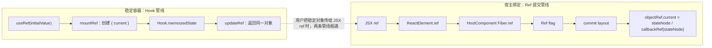

# 第20章：实现 useRef

## 本章定位

- **数据流定位**：useRef → Hook.memoizedState 保存稳定对象；JSX ref → Fiber.ref → Ref flag → mutation/layout 阶段解绑与绑定宿主实例。
- **难度**：★★★☆☆ —— API 看似简单，但源码中包含“稳定容器”和“宿主绑定”两条独立管线，并跨越 render、mutation 与 layout。
- **前置依赖**：第 8 章（Hook 链）、第 10 章（Fiber 复用）、第 15 章（flags 与 commit 遍历）。自检：能区分 Hook 数据与 ReactElement 字段；知道 current/WIP 在 commit 前后的切换时机。
- **读后检验**：能把 `useRef` 与 `<div ref={...}>` 两条链分开；能解释 ref 为什么在 layout 阶段 attach；能推导 mount、替换与删除时 object/callback ref 应发生什么。

“ref”在 API 上看起来像一个概念，源码里却是两套机制：

```text
useRef(initialValue)
-> Hook.memoizedState
-> 返回稳定 { current }
-> 修改 current 不调度

<div ref={ref}>
-> ReactElement.ref
-> HostComponent Fiber.ref
-> Ref flag
-> commit layout
-> ref.current = DOM instance
```

它们经常连在一起使用，但互不依赖。`useRef` 可以保存定时器、第三方实例或上一次值，不一定指向 DOM；callback ref 也完全不需要 `useRef`。



左侧回答“对象为什么跨 render 稳定”，右侧回答“真实实例何时交给用户”。把两条线拆开，是理解本章的第一步。

## 整体架构思路：稳定容器与宿主绑定分属 render、commit

### useRef 解决“跨 render 保存什么”

函数组件每次 render 都重新执行，普通局部变量也会重新创建。`useRef` 在 Hook 链上保存一个对象：

```ts
{
	current: initialValue;
}
```

mount 创建一次，update 复用同一对象。React 不监听 `current` 属性赋值，因此它不会产生 Update、Lane 或新 render。

### Host ref 解决“何时把实例交给用户”

HostComponent 的真实实例由 completeWork 创建，但 WIP render 可能被打断、放弃或重做。用户 callback ref 又可以执行任意副作用，所以 render 期间不能调用它。

正确边界是 commit：

```text
render：比较 ref 身份，只记录 Ref flag
mutation：删除节点时解绑旧 ref
切换 root.current
layout：把已提交的 stateNode 交给新 ref
```

ref attach 位于 layout，是因为 DOM mutation 已完成、current 已指向新树，用户拿到的是已提交实例。

### 两条生命周期账本

| 机制              | mount                             | update                              | unmount                        |
| ----------------- | --------------------------------- | ----------------------------------- | ------------------------------ |
| `useRef`          | 创建对象并存到 Hook.memoizedState | 返回同一对象；忽略新的 initialValue | 随 Fiber/Hooks 失去引用        |
| Host object ref   | layout 写入 `current = stateNode` | 旧 ref 清 null，再给新 ref 绑定实例 | mutation 写入 `current = null` |
| Host callback ref | layout 调用 `ref(stateNode)`      | 旧回调收 null，新回调收实例         | mutation 调用 `ref(null)`      |

表格描述的是 ref 应满足的生命周期协议。本章代码已经完成 mount attach 与删除 detach；同类型节点只替换 ref 时还有两处断点，在实现部分集中核对。

## 本章实现：稳定容器与宿主实例绑定

### 本章改动文件

- currentDispatcher.ts、react/index.ts：声明并导出 `useRef`。
- fiberHooks.ts：实现 `mountRef/updateRef`。
- ReactTypes.ts：把 Ref 收窄为 object ref、callback ref 或 null。
- fiber.ts：让 ref 进入 Fiber，并在 current/WIP 之间复制。
- fiberFlags.ts：定义 Ref、MutationMask 与 LayoutMask。
- beginWork.ts、completeWork.ts：比较 ref 身份并标记 Ref。
- commitWork.ts、workLoop.ts：在 mutation/layout 阶段 detach、attach。
- ref/main.tsx：验证 object ref 与 callback ref。

前两组文件属于“稳定容器”管线，后几组文件属于“宿主实例交付”管线。它们只在用户把 `useRef` 返回值传给 JSX ref 时相遇。

### 1. useRef：Hook 上的稳定对象

[fiberHooks.ts](../../packages/react-reconciler/src/fiberHooks.ts) 在 mount/update dispatcher 中接入 `useRef`。

mount：

```ts
function mountRef<T>(initialValue: T): { current: T } {
	const hook = mountWorkInProgressHook();
	const ref = { current: initialValue };
	hook.memoizedState = ref;
	return ref;
}
```

update：

```ts
function updateRef<T>(): { current: T } {
	const hook = updateWorkInProgressHook();
	return hook.memoizedState;
}
```

对象只在 mount 创建一次。update 即使传入不同的 initialValue，也不会覆盖 `current`：

```tsx
function App({ value }) {
	const ref = useRef(value);
	// 后续 value 变化不会重新初始化 ref.current
}
```

注意，调用表达式 `useRef(expensive())` 中的 `expensive()` 仍会在每次组件执行时由 JavaScript 求值，只是 updateRef 不使用这个新值。若初始化本身昂贵，应由用户代码显式惰性处理。

### 2. ref 从 ReactElement 进入 Fiber

JSX runtime 已经把 `ref` 作为保留字段从 config 中取出，不放进 props。本章进一步让 Fiber 保存它：

```ts
export type Ref = null | { current: any } | ((instance: any) => void);

export function createFiberFromElement(element) {
	const { type, key, props, ref } = element;
	const fiber = new FiberNode(fiberTag, props, key);
	fiber.type = type;
	fiber.ref = ref;
	return fiber;
}
```

创建 WIP 时也复制 current.ref：

```ts
wip.ref = current.ref;
```

这一步只保证 mount Fiber 能拿到 ref、WIP 有一个默认旧值。update 时还需要 child reconciler 把新 element.ref 写到复用 Fiber；本章遗漏了这一步，后面会单独分析。

### 3. render 阶段只标记 Ref

[beginWork.ts](../../packages/react-reconciler/src/beginWork.ts) 为 HostComponent 调用 `markRef`：

```ts
function markRef(current, workInProgress) {
	const ref = workInProgress.ref;

	if (
		(current === null && ref !== null) ||
		(current !== null && ref !== current.ref)
	) {
		workInProgress.flags |= Ref;
	}
}
```

判断表达两种意图：

1. mount 时存在 ref，需要在 commit 后绑定。
2. update 时 ref 引用变化，需要执行替换协议。

[completeWork.ts](../../packages/react-reconciler/src/completeWork.ts) 又做了一次相同标记：mount 有 ref 或 current.ref 与 wip.ref 不同，就写 Ref flag。两处写同一个 bit 不会重复产生两个 effect，但属于重复逻辑；保留任意一处即可表达标记语义。

### 4. commitEffects 把 mutation 与 layout 复用为同一种遍历

本章把原来的 mutation DFS 抽成高阶函数：

```ts
const commitEffects = (phase, mask, callback) => {
	return (finishedWork, root) => {
		// 根据 subtreeFlags & mask 深度优先遍历
		// 对命中的 Fiber 调用 callback
	};
};
```

由它生成两次遍历：

```ts
export const commitMutationEffects = commitEffects(
	'mutation',
	MutationMask | PassiveMask,
	commitMutationEffectsOnFiber
);

export const commitLayoutEffects = commitEffects(
	'layout',
	LayoutMask,
	commitLayoutEffectsOnFiber
);
```

`phase` 参数在本章没有被函数体使用，真正决定遍历范围的是 mask，决定单节点行为的是 callback。

### 5. Ref 为什么同时出现在 MutationMask 和 LayoutMask

[fiberFlags.ts](../../packages/react-reconciler/src/fiberFlags.ts) 定义：

```ts
export const Ref = 0b0010000;
export const MutationMask = Placement | Update | ChildDeletion | Ref;
export const LayoutMask = Ref;
```

layout 遍历用 LayoutMask 找到需要 attach 的 Fiber。Ref 同时并入 MutationMask，并不代表 mutation callback 已经处理 ref 更新；本章 `commitRoot` 判断“是否进入有副作用的提交分支”时只检查 MutationMask。若 Ref 不在其中，一个只有 ref 的提交可能走到无 effect 分支，从而根本不执行 layout traversal。

这是当前控制流下的接线方式。更清晰的实现可以在 commitRoot 分别检查 mutation/layout mask，不必让 Ref 借用 MutationMask 触发整个分支。

### 6. mount：layout 阶段绑定 ref

`commitRoot` 的顺序是：

```ts
commitMutationEffects(finishedWork, root);
root.current = finishedWork;
commitLayoutEffects(finishedWork, root);
```

layout 单节点处理：

```ts
if ((flags & Ref) !== NoFlags && tag === HostComponent) {
	safelyAttachRef(finishedWork);
	finishedWork.flags &= ~Ref;
}
```

attach 区分两种 ref：

```ts
if (typeof ref === 'function') {
	ref(instance);
} else {
	ref.current = instance;
}
```

函数名中的 `safely` 只表示先检查 null；本章没有 try/catch，也没有把 callback ref 抛出的错误交给错误边界。

### 7. 删除：mutation 阶段解绑整棵子树的 ref

删除子树时，`commitDeletion` 会深度遍历每个卸载 Fiber。遇到 HostComponent：

```ts
recordHostChildrenToDelete(rootChildrenToDelete, unmountFiber);
safelyDetachRef(unmountFiber);
```

detach 行为：

```ts
if (typeof ref === 'function') {
	ref(null);
} else {
	ref.current = null;
}
```

解绑必须发生在宿主节点被移除的 mutation 流程中，避免 ref 在 DOM 已不可用后仍指向旧实例。遍历不会只处理最外层 HostComponent；嵌套 Host 节点的 ref 也会分别清理。

### 8. 核对同类型节点替换 ref 的实际路径

理想协议是：

```text
render：发现 oldRef !== newRef，标 Ref
mutation：oldRef 接收 null
切换 current
layout：newRef 接收 stateNode
```

目标协议已经明确，但本章代码有两处断点。

#### 断点一：复用 Fiber 时丢失 new ref

child reconciler 在 key/type 匹配后调用：

```ts
const existing = useFiber(currentFiber, element.props);
```

`useFiber` 只传入新 props；`createWorkInProgress` 又执行 `wip.ref = current.ref`。源码没有 `existing.ref = element.ref`，所以 WIP 继续拿旧 ref，`markRef` 看见两者相等，根本不会标记 Ref。

结果是：同类型 HostComponent 只替换 ref 时，新 ref 不会绑定，旧 ref 也保持原值。

#### 断点二：mutation 中旧 ref 解绑代码被注释

`commitMutationEffectsOnFiber` 中有一段注释代码，尝试在 Ref flag 命中时 detach，但它调用的是 `safelyDetachRef(finishedWork)`。finishedWork 应保存新 ref，真正需要清理的是 `finishedWork.alternate` 上的旧 ref。

因此，即使先补上 child reconciler 的 ref 传递，还要实现：

```ts
const current = finishedWork.alternate;
if (current !== null) {
	safelyDetachRef(current);
}
```

这两处修复不属于本章提交。讲义只把它们作为代码审查结论，不能把“ref 更新替换”列为本章已实现能力。

## 与官方 React 的差异

| 能力            | big-react 本章                                          | 官方 React 的设计                                |
| --------------- | ------------------------------------------------------- | ------------------------------------------------ |
| `useRef`        | mount 创建稳定对象，update 复用                         | 核心语义一致                                     |
| Host ref mount  | layout attach 已接通                                    | 同样在提交后绑定                                 |
| Host ref 删除   | mutation 遍历删除子树并 detach                          | 还会覆盖更多 Fiber 类型和错误处理                |
| 同类型 ref 替换 | 新 element.ref 没写入复用 Fiber；旧 ref detach 也未接通 | 先 detach 旧 ref，再 attach 新 ref               |
| 支持对象        | 仅 HostComponent 的 function/object ref                 | 还覆盖 Class、ForwardRef、useImperativeHandle 等 |
| callback 错误   | 直接执行用户函数                                        | 会进入完整的提交期错误处理                       |
| API 形态        | ref 是保留字段，函数组件不消费它                        | 新版 React 对 ref 作为 prop 等规则更完整         |

## 思考题

### Q1: useRef 和 useState 都保存在 Hook 上，为什么修改 ref.current 不会调度？

`useState` 的 Hook 保存 state 与 UpdateQueue，setter 会创建带 Lane 的 Update，并从 Fiber 找到 root；状态变化因此进入 render。`useRef` 的 Hook.memoizedState 只保存一个普通对象，公开 API 也没有为 `current` 属性提供 setter。

执行 `ref.current = value` 只是 JavaScript 对象赋值，没有 createUpdate、enqueueUpdate、scheduleUpdateOnFiber。React 不知道它何时变化，也不会用它决定 UI 是否过期。需要显示到页面的数据应使用 state；只需跨 render 保存、但不驱动声明输出的数据适合 ref。

### Q2: useRef 与 `<div ref={ref}>` 是同一条内部流程吗？

不是。`useRef` 经过 dispatcher 和 Hook 链，目标是返回稳定容器；`<div ref={ref}>` 经过 ReactElement.ref、Host Fiber.ref、Ref flag 和 commit，目标是绑定宿主实例。

当用户把 useRef 返回的对象传给 JSX ref 时，两条链才在 commitLayoutEffects 相遇：attach 把 Host Fiber.stateNode 写进对象的 current。任何一条都可独立使用——useRef 可以保存计时器，callback ref 可以直接接收 DOM。

### Q3: useRef(initialValue) 的 initialValue 为什么只在 mount 生效？

mountRef 创建对象并写入 Hook.memoizedState；updateRef 只从当前 Hook 复制 memoizedState，不读取新的参数。这样调用方在每次 render 都得到相同对象，自己写入的 current 不会被下一次组件执行重置。

“只在 mount 生效”不等于参数表达式只计算一次。`useRef(createThing())` 中的 `createThing()` 仍由 JavaScript 每次执行组件时调用，只是 updateRef 丢弃结果。需要避免昂贵重复计算时，可先以 null 初始化，再在 `ref.current === null` 时显式创建。

### Q4: 为什么 callback ref 不能在 render 或 completeWork 中执行？

render 产生的是候选 WIP，可能因时间片让出、高优先级抢占或错误而被放弃。callback ref 可以写外部变量、读取 DOM、触发用户代码；若在 render 中调用，未提交实例会泄露到外部，丢弃 WIP 后也无法可靠回滚这些副作用。

layout 阶段执行时，DOM mutation 已完成，root.current 已切换到 finishedWork。此时 callback 收到的实例与用户可见树一致，所以 attach 属于 commit，而不是纯计算的 render。

### Q5: Ref flag 记录的是“有 ref”，还是“本次需要执行 ref 操作”？

它记录的是本次提交需要处理 ref，而不是 Fiber 永久拥有 ref。mount 时 ref 非空需要 attach；update 时只有 ref 身份变化才需要替换；ref 没变时不应重复调用 callback 或重复赋值对象 ref。

layout 处理完成后会清除 Ref bit。Fiber.ref 保存持久的引用值，Ref flag 保存本轮一次性的工作意图；把两者混为一个字段，会让每次 commit 都重复执行 ref 副作用。

### Q6: Ref 为什么同时加入 MutationMask 和 LayoutMask？

LayoutMask 用于真正找到并 attach ref。MutationMask 中的 Ref 则服务于本章 `commitRoot` 的总开关：它只检查 MutationMask 来决定是否进入“mutation → 切换 current → layout”分支。

因此 Ref 加入 MutationMask 是控制流接线，不表示 mutation callback 已完成 ref 替换。事实上本章更新 detach 仍被注释。更完整的实现应分别判断各阶段 mask，并在 mutation 中明确处理旧 ref，在 layout 中处理新 ref。

### Q7: 把 object ref 从 oldRef 换成 newRef，本章代码实际会怎样？

若 HostComponent 的 key/type 不变，child reconciler 调用 useFiber 复用旧 Fiber，却没有把 element.ref 写到 WIP；createWorkInProgress 又复制 current.ref。因此 markRef 看不到变化，oldRef.current 继续指向 DOM，newRef.current 仍为空。

即使手工补上 `existing.ref = element.ref`，本章 mutation 中 detach 代码仍被注释，而且注释版本读取 finishedWork 的新 ref，而非 alternate 的旧 ref。完整修复需要同时接通“新 ref 进入 WIP”和“mutation 清理 current.ref”两段。

### Q8: object ref 与 callback ref 的 attach/detach 有什么共同点和差异？

共同点是生命周期一致：attach 获得 Host instance，detach 获得 null；都必须由 commit 控制。差异在执行形式：object ref 是属性赋值，callback ref 会执行用户代码，可能抛错或产生外部副作用。

因此内联 callback ref 的身份每次 render 都变化，完整 React 会先调用旧函数传 null，再调用新函数传 instance；稳定对象 ref 没有函数重建问题。本章同类型 ref 变化尚未接通，所以两种形式的替换语义都不完整。

### Q9: root.current 为什么要在 mutation 之后、layout ref 之前切换？

mutation 负责把旧宿主树改成 finishedWork 描述的新宿主树；执行期间 current 仍代表上一次提交，便于读取旧 Fiber 和旧 ref。mutation 完成后切换 current，表示新 Fiber 树正式成为已提交快照。

layout 中的 callback ref 可能立即读取组件状态、DOM 或触发更新。若此时 current 仍指向旧树，外部看见的新 DOM 与内部已提交 Fiber 会不一致。这个顺序形成提交原子边界：先改宿主环境，再公布新 current，最后运行需要观察新结果的 layout 副作用。

## 本章小结

本章同时建立两条 ref 管线：`useRef` 在 Hook 上保存稳定可变对象；Host ref 在 render 标记意图、commit layout 绑定实例。真正的边界是“保存容器”和“交付实例”，不是都叫 ref 就共享一套实现。

本章已接通两条 ref 管线：`useRef` 返回跨 render 稳定的可变对象；Host ref 在提交阶段交付并清理宿主实例。当前代码完成 mount attach 与删除 detach，同类型节点替换 ref 仍缺少“新 ref 写入复用 Fiber”和“mutation 清理旧 ref”两步。

第 21 章将从实例引用转向另一种沿 Fiber 树传播的数据：Context。
