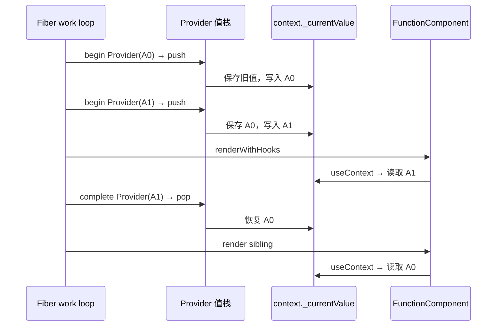

# 第21章：实现 useContext

## 本章定位

- **数据流定位**：createContext 创建 Context/Provider → beginWork push Provider.value → FunctionComponent 读取当前值 → completeWork pop 恢复外层作用域。
- **难度**：★★★★☆ —— 基础读取只需一个值栈，但必须把 Context 动态作用域与 Fiber DFS、嵌套 Provider、异常恢复和后续依赖传播分开理解。
- **前置依赖**：第 5 章（beginWork/completeWork 深度优先遍历）、第 8 章（Dispatcher）、第 20 章（FunctionComponent Hook 链）。自检：能说明 DFS 何时进入和离开一棵子树；知道模块级可变状态为什么需要成对恢复。
- **读后检验**：能手算嵌套 Provider 的 push/read/pop；能区分“本轮读到哪个值”和“value 变化后唤醒哪些 Consumer”；能指出异常 unwind 与依赖传播分别在哪一章补充。

Context 不是“全局变量方便读取”这么简单。它表达的是树作用域：

```tsx
<Theme.Provider value="dark">
	<A />
	<Theme.Provider value="light">
		<B />
	</Theme.Provider>
	<C />
</Theme.Provider>
```

A 和 C 应读到 dark，B 应读到 light。内层 Provider 结束后必须恢复外层值，因此 Context 的核心数据结构不是单个全局值，而是与 Fiber 深度优先遍历同步推进的值栈。

## 整体架构思路：用 DFS 栈实现动态作用域

Fiber render 的方向天然对应作用域进入与离开：

```text
beginWork Provider
-> 保存旧 context._currentValue
-> 写入 Provider.value
-> render 整个 children 子树
-> completeWork Provider
-> 恢复旧值
```

在 Provider 子树中执行的 FunctionComponent，不需要沿 `fiber.return` 一层层寻找 Provider，只需读取 `context._currentValue`。因为 begin/complete 已经保证这个字段始终代表当前 DFS 路径上最近的 Provider。



图里没有“Consumer 向上查找 Provider”的箭头：作用域已经由 work loop 在进入、离开 Provider 时维护好，读取只访问当前值。

### Context 实际包含两套问题

| 问题                                          | 本章是否实现 | 核心数据                                           |
| --------------------------------------------- | ------------ | -------------------------------------------------- |
| 当前 render 位置应该读哪个 value              | 是           | `context._currentValue` + Provider 值栈            |
| Provider value 变化后，哪些 Consumer 必须更新 | 否           | Consumer Fiber 的 Context dependencies 与传播 Lane |

本章没有 bailout，普通父树更新会继续向下执行所有函数组件，因此 Consumer 可以在父树重渲染时自然读到新值。第 23 章引入 bailout 后，才在 23-8 增加依赖记录与定向传播，避免真正的 Consumer 被错误跳过。

### Context 值的生命周期账本

| 时刻                          | 输入                 | 写入                                   | 消费者            | 结果                         |
| ----------------------------- | -------------------- | -------------------------------------- | ----------------- | ---------------------------- |
| `createContext(defaultValue)` | 默认值               | `context._currentValue`、Provider 对象 | JSX/Fiber 创建    | 没有 Provider 时仍有可读值   |
| begin Provider                | `pendingProps.value` | 旧值压栈，新值写入 `_currentValue`     | Provider 子树     | 后代读取最近 value           |
| render Consumer               | Context 对象         | 本章只读取，不记录依赖                 | 组件函数          | value 参与本轮 children 计算 |
| complete Provider             | 栈顶旧值             | 恢复 `_currentValue`                   | 后续 sibling/祖先 | 内层 value 不泄漏            |

## 本章实现：Context 对象、Provider 值栈与消费入口

### 21-1 实现 Context 数据结构

#### 1. Context 与 Provider 是两个相互引用的对象

[context.ts](../../packages/react/src/context.ts) 创建：

```ts
export function createContext<T>(defaultValue: T): ReactContext<T> {
	const context = {
		$$typeof: REACT_CONTEXT_TYPE,
		Provider: null,
		_currentValue: defaultValue
	};

	context.Provider = {
		$$typeof: REACT_PROVIDER_TYPE,
		_context: context
	};

	return context;
}
```

字段分工：

| 字段                    | 作用                               |
| ----------------------- | ---------------------------------- |
| `context.$$typeof`      | 标识这是 Context 对象              |
| `context._currentValue` | 当前 DFS 路径可读的 value          |
| `context.Provider`      | JSX 可使用的 Provider type         |
| `Provider.$$typeof`     | 让 Fiber 创建逻辑识别 Provider     |
| `Provider._context`     | 从 Provider Fiber 找回所属 Context |

`defaultValue` 直接写入 `_currentValue`。没有匹配 Provider 时，读取自然返回默认值；不需要额外的“是否存在 Provider”标记。

#### 2. Provider 需要独立 Fiber tag

`createFiberFromElement` 看到 `type.$$typeof === REACT_PROVIDER_TYPE` 时，把 element 转成 ContextProvider Fiber。它没有 DOM 实例，但必须保留逻辑节点，因为 begin/complete 要以它为作用域边界。

21-1 只是数据结构阶段，代码还有两个未闭环点：

1. `ContextProvider` 和 `Fragment` 都被定义为 tag 7，switch 会先命中 Fragment 分支，Provider 分支不可达。
2. `updateContextProvider` 读取 `providerType.__context`，而对象字段实际叫 `_context`。

此外，`createContext` 此时尚未从 React 公共入口导出。21-1 因此不能被描述为可运行的 Context；它只是把对象形态和 Fiber 分支先放进代码。

### 21-2 实现 Context 逻辑

#### 1. pushProvider：进入作用域

[fiberContext.ts](../../packages/react-reconciler/src/fiberContext.ts) 保存旧值并写入新值：

```ts
let prevContextValue = null;
const prevContextValueStack = [];

export function pushProvider(context, newValue) {
	prevContextValueStack.push(prevContextValue);
	prevContextValue = context._currentValue;
	context._currentValue = newValue;
}
```

`prevContextValue` 保存当前最内层 Provider 覆盖前的值；数组保存更外层历史。它不是“每个 Context 各一份数组”，但严格 LIFO 的 DFS 仍能处理不同 Context 交错嵌套。

#### 2. popProvider：离开作用域

```ts
export function popProvider(context) {
	context._currentValue = prevContextValue;
	prevContextValue = prevContextValueStack.pop();
}
```

pop 必须接收当前 Provider 的 Context，因为要恢复的是这个对象的 `_currentValue`；栈本身只保存旧值，不保存 Context。

#### 3. 与 beginWork/completeWork 配对

[beginWork.ts](../../packages/react-reconciler/src/beginWork.ts)：

```ts
function updateContextProvider(wip) {
	const context = wip.type._context;
	pushProvider(context, wip.pendingProps.value);
	reconcileChildren(wip, wip.pendingProps.children);
	return wip.child;
}
```

[completeWork.ts](../../packages/react-reconciler/src/completeWork.ts)：

```ts
case ContextProvider: {
	const context = wip.type._context;
	popProvider(context);
	bubbleProperties(wip);
	return null;
}
```

begin 在进入 children 前 push，complete 在整个 children 子树结束后 pop。这样 Provider 的所有后代都处于新值作用域，而 Provider 的 sibling 不会被污染。

21-2 修正了 `__context` 为 `_context`，但 ContextProvider 与 Fragment 的 tag 冲突仍存在，Provider switch 分支仍不可达。真正的执行闭环要等 21-3 修正 tag。

### 21-3 实现 useContext

#### 1. 修正 tag 冲突

本节把：

```ts
export const Fragment = 7;
export const ContextProvider = 8;
```

从此 Provider begin/complete 才能真正命中对应分支。这个改动不是普通重命名，而是让 21-2 的 push/pop 从“代码存在”变为“实际可执行”。

#### 2. dispatcher 接入 readContext

mount 与 update dispatcher 都直接使用同一个 `readContext`：

```ts
const hooksDispatcherOnMount = {
	// ...
	useContext: readContext
};

const hooksDispatcherOnUpdate = {
	// ...
	useContext: readContext
};
```

[fiberHooks.ts](../../packages/react-reconciler/src/fiberHooks.ts) 的读取逻辑：

```ts
function readContext<T>(context: ReactContext<T>): T {
	const consumer = currentlyRenderingFiber;
	if (consumer === null) {
		throw new Error('只能在函数组件中调用 useContext');
	}
	return context._currentValue;
}
```

它没有：

- 沿 return 指针搜索 Provider；
- 创建普通 Hook 节点；
- 把 Context 依赖写到 Consumer Fiber；
- 比较新旧 value；
- 主动调度 Consumer。

这不是遗漏了“读取最近 Provider”的算法。最近值已经由 Provider 栈维护，readContext 只需 O(1) 读取。真正尚未实现的是更新传播。

#### 3. useContext 为什么不占普通 Hook 节点

`useState` 要保存跨 render 的 state、queue、baseQueue，所以每次调用必须与 Hook 链位置对应。`useContext` 在本章只借用当前渲染环境中的 `_currentValue`，没有属于调用位置的持久状态，因此不调用 `mountWorkInProgressHook/updateWorkInProgressHook`。

这意味着从内部数据结构看，条件调用 `useContext` 不会让后续 useState 的 Hook 位置错位。但公共 API 仍叫 Hook，工程规则仍要求在组件顶层调用；允许条件调用的是第 22 章引入的实验性 `use`，不是 `useContext`。参考材料中“官方 useContext 不受 Hooks 规则约束”的说法不正确。

#### 4. 公共 API 与本节的导出缺口

本节新增 [hooks.ts](../../packages/react/src/hooks.ts)，让 `useContext` 先通过 `resolveDispatcher` 再调用当前 dispatcher；`react/index.ts` 也导出 `createContext` 与 `useContext`。

## 嵌套 Provider 手算

假设：

```tsx
const A = createContext('A-default');
const B = createContext('B-default');

<A.Provider value="A0">
	<B.Provider value="B0">
		<A.Provider value="A1">
			<Inner />
		</A.Provider>
	</B.Provider>
	<Outer />
</A.Provider>;
```

严格按 DFS 推导：

| 步骤 | 操作       | A.\_currentValue | B.\_currentValue | prevContextValue | 历史栈                       |
| ---- | ---------- | ---------------- | ---------------- | ---------------- | ---------------------------- |
| 0    | 初始       | A-default        | B-default        | null             | []                           |
| 1    | push A0    | A0               | B-default        | A-default        | [null]                       |
| 2    | push B0    | A0               | B0               | B-default        | [null, A-default]            |
| 3    | push A1    | A1               | B0               | A0               | [null, A-default, B-default] |
| 4    | Inner 读取 | **A1**           | **B0**           | A0               | 同上                         |
| 5    | pop A1     | A0               | B0               | B-default        | [null, A-default]            |
| 6    | pop B0     | A0               | B-default        | A-default        | [null]                       |
| 7    | Outer 读取 | **A0**           | B-default        | A-default        | [null]                       |
| 8    | pop A0     | A-default        | B-default        | null             | []                           |

一份值栈能工作，是因为 Provider 的进入与离开严格后进先出。若异常退出、从 WIP 中途重建或切换 root 时没有正确 unwind，这个前提就会被破坏。

## 实现边界与后续演进

- 第 22 章 22-6 的异常 unwind 为 ContextProvider 调用 `popProvider`，避免 Suspense 抛出后值栈残留。
- 第 23 章 23-8 在 Consumer Fiber 上记录 Context dependency；Provider value 变化时传播 Lane，使 bailout 不会跳过真正的 Consumer。

这些变化补充的是异常恢复、更新传播和入口可用性，不改变本章“begin push、render read、complete pop”的作用域模型。

## 与官方 React 的差异

| 能力               | big-react 本章                                       | 官方 React 的设计                                  |
| ------------------ | ---------------------------------------------------- | -------------------------------------------------- |
| 最近 Provider 读取 | 模块级值栈维护 `_currentValue`，readContext 直接读取 | 同样使用栈式当前值，但支持更多 renderer/并发边界   |
| Consumer 依赖      | 本章不记录                                           | 读取时记录依赖，Provider 变化时传播更新            |
| value 比较         | 本章不比较                                           | 以 `Object.is` 等规则判断是否需要传播              |
| 异常恢复           | 正常 complete 才 pop                                 | 所有 unwind 路径都必须恢复栈；课程第 22 章补一部分 |
| Consumer API       | 只实现 `useContext`                                  | 还覆盖 Consumer、class contextType 等形态          |
| 并发/多 root       | 单份模块栈，没有中断 root 切换保护                   | 会在重启、切换和 unwind 时维护完整栈游标           |

## 思考题

### Q1: `pushProvider` 在 `beginWork` 调用、`popProvider` 在 `completeWork` 调用，为什么这两个时点恰好覆盖 Provider 子树？

render 阶段对 Fiber 树的遍历是 DFS：**beginWork 是“向下进入”，completeWork 是“向上归位”**。一个 Provider 节点的 beginWork 必然先于其所有后代的 beginWork 执行，它的 completeWork 必然晚于所有后代的 completeWork。所以：

- push 放在 beginWork：子树里任何 FunctionComponent 执行 `renderWithHooks → useContext` 时，`_currentValue` 已经是 Provider 的 value；
- pop 放在 completeWork：子树渲染完毕才还原，**Provider 的兄弟节点、父节点的其他分支**读到的仍是外层值。

再做反事实检查：若 push 晚于 children 协调，后代会读到旧值；若 pop 提前或遗漏，内层值会泄漏到兄弟分支。push/pop 的位置不是方便选择，而是与 Fiber DFS 的进入、离开严格配对。

### Q2: 所有 Context 共用一份 `prevContextValueStack`，不同 Context 交错嵌套时为什么仍能恢复？

本章保存的是一条全局 Provider 进入历史：

```ts
let prevContextValue = null;
const prevContextValueStack = [];

function pushProvider(context, newValue) {
	prevContextValueStack.push(prevContextValue);
	prevContextValue = context._currentValue;
	context._currentValue = newValue;
}
```

只要 DFS 严格遵守 LIFO，最后 push 的 Provider 一定最先 pop。pop 又显式接收当前 Provider 对应的 context，所以能够把栈顶旧值写回正确对象。

例如 `push A → push B → pop B → pop A`：pop B 先恢复 B，并让 prev 指回 A 的旧值；pop A 再恢复 A。这个实现依赖“进入与离开绝不乱序”，异常、重启或 root 切换若漏掉 unwind，就会破坏前提。

### Q3: 没有匹配 Provider 时为什么返回 defaultValue？Provider 显式传 `undefined` 又会怎样？

`createContext(defaultValue)` 会把默认值直接写入 `context._currentValue`。没有 Provider 覆盖时，readContext 读取这个字段，自然得到 defaultValue，不需要额外搜索 Fiber 树。

但：

```tsx
<Context.Provider value={undefined}>
	<Child />
</Context.Provider>
```

会由 pushProvider 把 `_currentValue` 明确写成 undefined，Child 读到的也是 undefined，不会回退 defaultValue。默认值表示“当前路径没有 Provider”，不是对 null 或 undefined 的兜底表达式。

### Q4: `readContext` 直接返回 `context._currentValue`，组件外调用会怎样？为什么不检查是否存在匹配 Provider？

```ts
function readContext<T>(context: ReactContext<T>): T {
	const consumer = currentlyRenderingFiber;
	if (consumer === null) {
		throw new Error('只能在函数组件中调用 useContext');
	}
	return context._currentValue;
}
```

两个边界行为：

1. **组件外调用**：`currentlyRenderingFiber` 只在 `renderWithHooks` 期间被赋值，事件回调、effect、普通脚本里都是 null，因此 readContext 会抛错。这就是“useContext 只能在函数组件（和自定义 Hook）里调用”的实现根源——依靠渲染上下文变量的存在性校验。公开 useContext 还会先经过 `resolveDispatcher`；尚未建立 dispatcher 时会更早抛出 Hook 调用错误。
2. **没有 Provider**：不报错，返回 `_currentValue`——它就是 `createContext(defaultValue)` 写入的默认值。因为 `_currentValue` 始终存在（初始为 defaultValue，push/pop 只改不删），没有必要额外检查是否真的找到 Provider；**默认值兜底正是 Context API 的契约**。

需要额外注意：Provider 显式传入 undefined 与没有 Provider 不同，前者应返回 undefined，见 Q3。

### Q5: 21-1/21-2 中 `ContextProvider` 与 `Fragment` 使用相同 WorkTag，会导致什么？

这两个常量当时都等于 7。work loop 的 switch 只按数字分派，ContextProvider Fiber 会先命中 Fragment case：

```ts
case Fragment:
	return updateFragment(wip);
case ContextProvider:
	return updateContextProvider(wip);
```

第二个 case 实际不可达，Provider 不会执行 push；completeWork 也先按 Fragment 处理，不会 pop。它影响的是整条 Context 运行链，而不只是调试标签显示。

21-3 把 ContextProvider 改为 8，21-2 已经写好的 `updateContextProvider/pushProvider/popProvider` 才真正可执行。WorkTag 是 reconciler 的运行时协议，必须保证唯一。

### Q6: `readContext` 为什么读取栈维护的当前值，而不是沿 `fiber.return` 向上寻找 Provider？

沿 return 查找会让每次 useContext 都重复扫描祖先，深层树与大量 Consumer 的成本会叠加；还要逐个识别 Provider type 与目标 Context。值栈把工作移到 Provider 边界：每个 Provider 进入/离开时各操作一次，Consumer 始终 O(1) 读取 `_currentValue`。

两种方案的取舍是：

| 方案          | 读取成本           | 实现约束                                    |
| ------------- | ------------------ | ------------------------------------------- |
| 沿祖先查找    | 每次读取 O(树深度) | 状态局部，恢复简单                          |
| Provider 值栈 | 每次读取 O(1)      | 所有正常、异常、中断路径都必须正确 push/pop |

官方 React 与 big-react 都选择栈式当前值；复杂度由“查找”转移到了“维护 render 上下文”。

### Q7: demo 中 ctxA 嵌套两层 Provider，内层组件读到 A1、外层组件读到 A0 是怎样发生的？

```text
ctxA.Provider(A0)
├── ctxB.Provider(B0)
│   └── ctxA.Provider(A1)
│       └── Cpn（内层）
└── Cpn（外层）
```

只跟踪 ctxA，初始 `_currentValue = 'default A'`：

| 步骤 | 动作                | ctxA.\_currentValue | prev      | 栈                          |
| ---- | ------------------- | ------------------- | --------- | --------------------------- |
| 1    | begin A0 → push(A0) | A0                  | default A | [null]                      |
| 2    | begin B0            | A0                  | B 的旧值  | [null, default A]           |
| 3    | begin A1 → push(A1) | A1                  | A0        | [null, default A, B 的旧值] |
| 4    | render 内层 Cpn     | **A1**              | A0        | 同上                        |
| 5    | complete A1 → pop   | A0                  | B 的旧值  | [null, default A]           |
| 6    | complete B0 → pop   | A0                  | default A | [null]                      |
| 7    | render 外层 Cpn     | **A0**              | default A | [null]                      |
| 8    | complete A0 → pop   | default A           | null      | []                          |

两个关键点：

- **嵌套覆盖**：push A1 时保存 A0，最近 Provider 生效。
- **兄弟隔离**：A1 complete 后已经恢复 A0，后处理的外层 Cpn 不会读到 A1。

这也说明值栈对应的是 Fiber 逻辑树，不是 DOM 树；Provider 本身没有宿主节点。

### Q8: 本章 Provider value 变化后为什么会带着整棵子树重新执行？官方 React 如何只唤醒真正的 Consumer？

本章没有 bailout，也没有 Context 依赖记录。Provider 所在组件更新后：

```text
父组件重新 render
-> Provider beginWork push 新 value
-> reconcileChildren 继续向下
-> 经过的 FunctionComponent 再次执行
-> Consumer 再次调用 readContext
```

`readContext` 读完值就返回，不会在 Consumer Fiber 上留下“我依赖了哪个 Context”的记录。因此本章能让 Consumer 读到新值，靠的是父树整体继续遍历，不是定向通知。

第 23 章 23-8 补充两步：

1. readContext 把 Context 记录进 Consumer Fiber.dependencies。
2. Provider value 变化时，`propagateContextChange` 给匹配 Consumer 标 Lane，并沿祖先写 childLanes。

这样中间组件即使 props 不变并命中 bailout，reconciler 仍能沿 childLanes 到达真正的 Consumer。更准确的说法不是“官方 React 永远只 render Consumer”，而是 Context 依赖传播提供了定向唤醒证据，其他 Fiber 是否执行还受 props、state、childLanes 等条件共同影响。

### Q9: 值栈是模块级全局状态；并发 render 中断后重建 WIP 时，为什么可能污染 Context？后续如何补救？

设 render 已进入 A1 Provider 并 push，时间片结束时 `_currentValue` 仍是 A1，这是正常的：若下次 continuation 继续同一 WIP，就应保留当前栈现场。

危险发生在旧 WIP 不再续跑，而是因更高 Lane 或其他 root 工作重新从 HostRoot 建栈。big-react 的 `prepareFreshStack` 只重置 finishedWork、finishedLane、workInProgress 与 wipRootRenderLane，没有先回退旧 WIP 已 push 的 Provider；新 render 再次 push，会造成栈层级重复，后续 pop 恢复错位。

原参考稿把官方 React 的保护概括成“prepareFreshStack 调用 resetContextDependencies 清空 Context 栈”，这不够准确：依赖追踪重置与 Provider 栈回退不是一回事。完整实现需要沿被中断的 WIP unwind 对应栈游标，再建立新 render 现场。

课程中的后续变化是：

- 第 22 章 22-6 在 Suspense 异常 unwind 遇到 ContextProvider 时调用 `popProvider`。
- 但本课程没有完整实现官方 React 对所有并发 root 切换、重启路径的 Context 栈保护。

因此“时间片让出保留栈”本身不是 bug；“放弃这份 WIP 却没有 unwind”才是问题。

### Q10: `useContext` 不创建普通 Hook 节点，是否意味着它不受 Hooks 调用规则约束？

原参考题目的前提“官方文档说 useContext 不受 Hooks 规则约束”不正确。`useContext` 仍是 Hook，应用代码应在组件顶层调用；第 22 章的实验性 `use` 才明确允许条件调用。

但参考答案指出的内部差异成立：readContext 不调用 `mountWorkInProgressHook/updateWorkInProgressHook`，不会推进 Hook 链指针。

```tsx
function Cpn({ enabled }) {
	const [n] = useState(0); // Hook 节点 #1

	if (enabled) {
		useContext(ctxA); // 本章内部不占 Hook 节点
	}

	const ref = useRef(null); // 仍是 Hook 节点 #2
}
```

所以在本章实现里，条件执行 readContext 不会像条件 useState 那样直接造成后续 Hook 节点错位。这解释的是数据结构，不是对外调用规范。稳定的顶层调用仍有利于 lint、依赖追踪与未来实现演进，不能把“当前不占节点”推导成“可以随意条件调用 useContext”。

## 本章小结

Context 的读取主线只有四步：`createContext` 建立容器，Provider beginWork push 新值，`useContext` 读取当前值，Provider completeWork pop 旧值。真正难的不是取值语句，而是让值的动态作用域与 Fiber DFS 完全同步。

本章结束时还应记住三个边界：21-3 才修正 Provider tag 使主流程可达；异常 pop 到第 22 章补充；Consumer 依赖传播到第 23 章补充。
