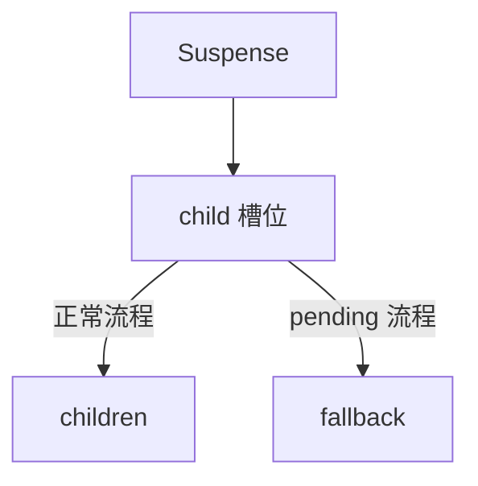
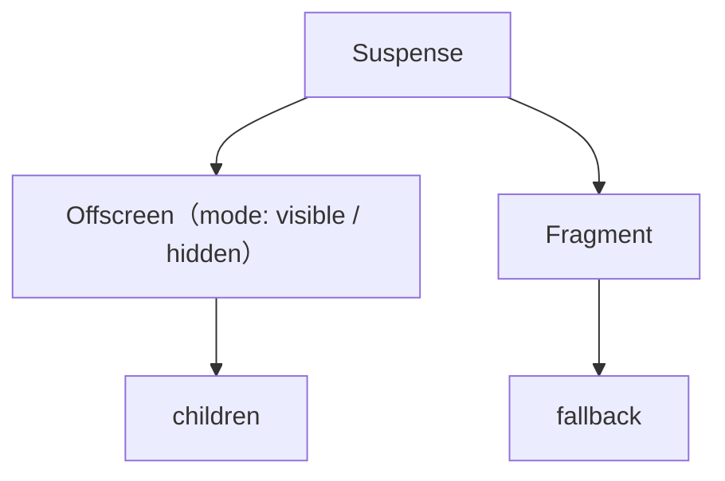
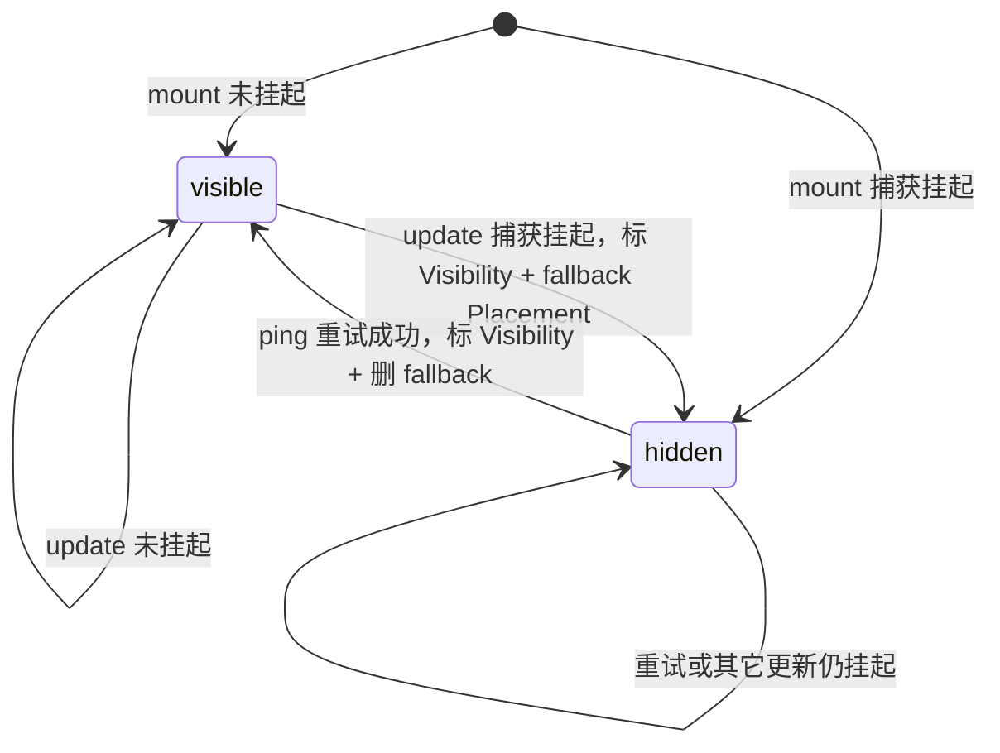
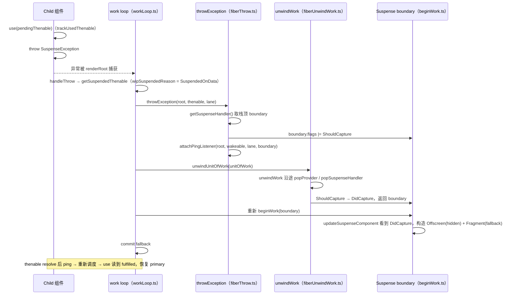
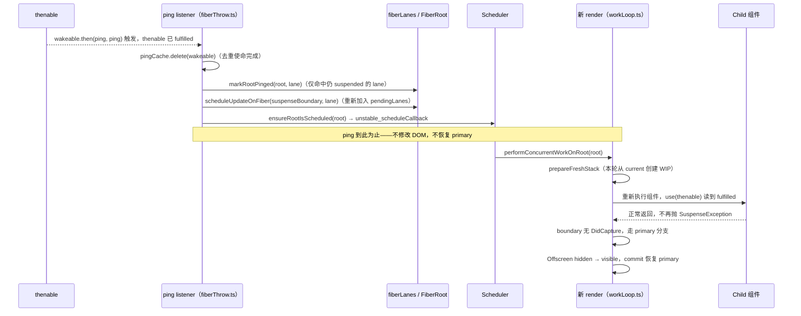

# 第22章：实现 Suspense

## 本章定位

- **数据流定位**：消费 `use(thenable)` 发出的挂起信号 → 产出 unwind/重试与 Offscreen 显隐 → 被 commit 与调度重试消费。
- **难度**：★★★★★ —— 全册最难的几章之一。它把 Fiber 的 return 回溯、异常控制流、上下文栈清理和 Lane 重试串成一条完整链路。
- **前置依赖**：第 5 章（beginWork/completeWork 递归与 `return` 回溯）、第 14 章（Lane、`markRootUpdated` 与调度）、第 19 章（TransitionLane）。自检：知道 work loop 的 catch 入口在哪；知道 `return` 链如何支持从任意深度向上回溯；知道 root 为什么需要从 Lane 集合中选择下一项工作。
- **读后检验**：能画出一张「use → throw → unwind → fallback → ping → 重试」的完整时序图；能对着源码指出 `ShouldCapture` 到 `DidCapture` 在哪一步转换；能解释 Offscreen 为什么保留 primary。

⚠️本章的目标：了解 Suspense 的实现原理及后续扩展思路，而不是“「实现全功能的Suspense」。因为在官方 React 中，与 Suspense 相关的特性有这些（工作量巨大）：

1. Lazy 组件
2. transition fallback（比如 `useTransition`）
3. `use`
4. Offscreen 组件
5. Selective Hydration
6. RSC（React Server Component）

本章只实现其中最小的一部分：`use(thenable)` 挂起、最近 boundary 捕获、fallback 提交、ping 重试，以及课程版 Offscreen 显隐。

## 整体架构思路：throw 负责退出，boundary 负责接管，ping 负责重试

```jsx
function Profile({ resource }) {
	const user = use(resource);
	return <p>{user.name}</p>;
}

<Suspense fallback={<p>loading...</p>}>
	<Profile resource={userPromise} />
</Suspense>;
```

- 正常状态：`<Suspense />` 渲染子孙组件
- 挂起状态：`<Suspense />` 渲染 fallback

其中，造成挂起状态的原因有很多，比如：

- `<Cpn />` 或其子孙是懒加载组件（Lazy）。
- `<Cpn />` 或其子孙在 transition 更新中读取尚未就绪的代码或数据；（`useTransition` 本身不制造挂起，但会影响已显示内容是否退回 fallback）。
- `<Cpn />` 或其子孙处于 Selective Hydration 流程。
- `<Cpn />` 或其子孙使用 `use` 读取 pending thenable。

总结：凡是涉及“初始状态 → 中间状态 → 结束状态”的流程，都可能需要 Suspense 协调；前提是中间状态在 render 中通过 React 能识别的挂起信号表达。Suspense 不会自动识别 effect、事件回调或任意业务异步状态。

### 两种 Suspense 设计思路

#### 思路一：只有一个 child

正常流程与 pending 流程共用同一个 child 位置，挂起时直接把 children 换成 fallback：



可以通过这个 demo 了解官方 React Suspense 的行为：https://codesandbox.io/p/sandbox/suspense-simple-pjdp86?file=%2Fsrc%2FCpn.js

缺点：

1. 无法保存 children 对应的 Fiber/Hook 状态。这里主要指 update 挂起时已经提交的 primary；首次 mount 就挂起时，本来就没有已提交状态可保留。
2. 切换到 fallback 后，children 对应 DOM 需要完全销毁。官方 React 可以将已经提交的 primary 宿主节点隐藏（给 children DOM 添加 `display: none !important` 的样式，不会销毁），而不是仅因一次 update 挂起就销毁。

#### 思路二：有两个 child

beginWork 时有选择地返回其中一个 child，但另一个分支也由 Suspense 的 Fiber 结构记录：



Offscreen 包 primary、Fragment 包 fallback。显示 fallback 时，两份分支描述同时存在，靠 Offscreen 的 mode 决定 primary 是否可见；显示 primary 时，fallback 可以不存在。`wip.child` 始终由 primary Offscreen 占据稳定位置。若 primary 曾成功提交，update 挂起会复用并隐藏这棵 current 子树；若首次 mount 就挂起，hidden Offscreen 只是保留 children 描述的占位，尚不存在一棵已提交的 primary 子树。这是 big-react 采用的方案。

对于下面代码，一共存在 4 种流程（mount/update × 正常/挂起，22-3 逐一实现）：

```jsx
<Suspense fallback={<div>loading...</div>}>
	<Cpn />
</Suspense>
```

1. mount 时正常流程
2. update 时正常流程
3. mount 时挂起流程
4. update 时挂起流程

当 `userPromise` pending 时，Profile 无法返回 children，但中间组件不应逐层传递 loading。核心问题是：**深层组件如何中止当前 render，把控制权交给最近的 Suspense 边界展示替代 UI，并在资源就绪后从一致的状态重试？**

若每个组件都手写：

```jsx
if (loading) return <Spinner />;
```

加载状态被分散到业务组件，父级边界无法统一决定展示策略；深层读取还必须层层返回特殊状态。若 Promise resolve 后直接继续原 JavaScript 调用栈也不可行，因为那段 render 栈早已退出，current/WIP 可能已经变化。

### 为什么选择 throw 表达挂起？

Fiber render 本来就有向上回溯路径。深层读取 pending thenable 时，用异常退出当前 JavaScript 调用栈，再沿 Fiber 的 `return` 寻找最近能处理挂起的 Suspense：

```text
use(thenable) 发现 pending
-> throw SuspenseException
-> throwException 标记根/边界
-> unwindWork 沿 return 清理上下文
-> 最近 Suspense 捕获 DidCapture
-> 重新 beginWork，选择 fallback
```

throw 在这里是结构化控制流：它能跳出任意深度组件调用，又复用 Fiber 的错误回溯机制。它不是把 pending 当作普通程序错误展示。

需要区分概念描述与本章协议：big-react 并不直接 `throw thenable`。`trackUsedThenable` 先把真实 thenable 保存到模块级槽位，再抛固定的 `SuspenseException`；work loop 识别哨兵后才取回 thenable。业务代码直接 `throw promise` 不会设置 `SuspendedOnData`，因而不能走通本章的 Suspense unwind 流程。

### Suspense 边界是一台状态机

至少有四种转换：

```text
mount primary：资源就绪，显示 children
mount fallback：首次挂起，构造 hidden Offscreen 占位 + 可见 fallback
update primary：未挂起；可能是 primary → primary，也可能是 fallback → primary
update fallback：本轮挂起；可能是 primary → fallback，也可能是 fallback → fallback
```

边界不只是条件渲染 fallback，它还要协调隐藏内容、fallback、挂起 Lane 和 ping 监听。

### 为什么保留 Offscreen primary？

当 primary 已经成功提交后，update 挂起若直接删除它再挂 fallback，会丢失已有 Fiber/Hook 状态，并在恢复时完全重建。Offscreen 让这棵 current primary 继续存在，只在宿主层切换可见性；fallback 作为 sibling 存在。这样 Suspense 能区分“已提交内容暂不可展示”和“内容尚未成功挂载”。首次 mount 就挂起时没有可保留的已提交状态，资源就绪后仍要正式 mount primary。

### ping 不是继续，而是重新调度

thenable settle 时，原 render 的局部变量和调用栈已经不可用。ping 只做两件事：让对应 Lane 再次具备调度资格（有 boundary 时重新加入 pending，没有 boundary 时标记 pinged），并重新安排 root。新 render 会再次执行组件、再次读取 thenable；fulfilled 时走 primary，rejected 时重新抛出 reason。React 依赖可重做 render，而不是恢复一个过期 Promise 回调中的半成品。

## 本章实现：Suspense 从挂起到恢复

### Suspense 挂起与恢复账本

| 时刻            | 输入                            | 写入对象/字段                          | 消费者                  | 结果                                      |
| --------------- | ------------------------------- | -------------------------------------- | ----------------------- | ----------------------------------------- |
| 读取 thenable   | pending/fulfilled/rejected 状态 | thenable 的状态记录或哨兵异常          | `use(thenable)`         | 返回值、发出挂起信号或抛出真实错误        |
| work loop 识别  | `SuspenseException`             | `wipThrownValue`、挂起 reason          | `throwException`        | 取回真实 thenable                         |
| 指定接管者      | thenable 与当前 Lane            | 最近 Suspense Fiber 的 `ShouldCapture` | `unwindWork`            | 注册 ping，并开始回退失败路径             |
| unwind 到边界   | `ShouldCapture`                 | 转为 `DidCapture` 并恢复上下文栈       | Suspense beginWork      | boundary 第二次 render 选择 fallback      |
| 提交 fallback   | primary 与 fallback             | hidden Offscreen、可见 fallback        | mutation/commit         | 本轮产生完整且可提交的 UI                 |
| thenable settle | thenable 与被阻塞 Lane          | pingCache、root 待重试 Lane            | `ensureRootIsScheduled` | 从 root 发起一次新 render，而非续接旧语句 |
| 重试成功        | fulfilled value                 | visible primary WIP                    | commit                  | primary 可见，fallback 被删除             |

throw、unwind、fallback 和 ping 是同一状态机的连续阶段。每个原理问题都应落回某次字段变化：为什么 `throwException` 写 `ShouldCapture`，为什么 Offscreen 要等 commit 才改变宿主可见性，为什么旧 WIP 已经 unwind 后 ping 只能发起重试。

### 22-1 Suspense 的作用

> **本节数据流**：深层读取遇到 pending thenable → 非局部退出当前路径 → 最近 Suspense 接管 → 业务组件无需逐层传递 loading。

先建立整体架构图景：boundary、primary 与 fallback 各自承担什么角色。

示例：

```jsx
<Suspense fallback={<div>loading...</div>}>
	<Content />
</Suspense>
```

Suspense 有两种展示状态：

- primary：显示 children。
- fallback：显示 fallback。

本章只处理一种输入：`use(thenable)` 读到 pending 状态。这个 thenable 会在 render 中触发非局部退出，由最近的 Suspense Fiber 选择 fallback；其它触发来源不进入本章实现步骤。

### 22-2 Suspense 的实现思路

> **本节数据流**：primary/fallback 两份描述 → Suspense/Offscreen Fiber 记录可见关系 → beginWork 根据捕获状态选择分支 → commit 只暴露完整结果。

`<Suspense>` 不是函数组件，也不会创建宿主节点。它从 JSX 到 Fiber 的识别链路是：

```text
React.Suspense
-> REACT_SUSPENSE_TYPE
-> ReactElement.type
-> createFiberFromElement
-> tag = SuspenseComponent
-> beginWork 调用 updateSuspenseComponent
```

`OffscreenComponent` 则没有对应的公开 JSX 标签，而是 reconciler 在处理 Suspense primary 时通过 `createFiberFromOffscreen` 创建的内部 Fiber。Suspense 表达“这里是一道边界”，Offscreen 表达“这段 primary 当前是否可见”。

本步确定 boundary 的 Fiber 结构：背景区「整体架构思路」已对比两种思路（一个 child 换挂会丢状态，两个 child 才能保留 primary），这里落到实现决策——Offscreen 挂 primary、Fragment 挂 fallback：

```text
Suspense
  -> Offscreen(primary, mode=visible/hidden)
  -> Fragment(fallback)
```

primary 的 Offscreen 包装始终占据 `Suspense.child`；fallback 出现时作为它的 sibling。Offscreen 的 children 描述始终存在，但 primary 后代 Fiber 是否已经构造、是否有可复用状态，取决于它此前是否完成过 render 和 commit。后续 22-3 的四种组合都建立在这个结构上。

### 22-3 实现 Suspense 工作流程

> **本节数据流**：Suspense 的 mount/update 与 DidCapture → 创建或复用 primary/fallback Fiber → 写入可见模式 → work loop 继续选定分支。

本步实现四种组合的分支处理：mount/update 与 primary/fallback 在 beginWork/completeWork 中各自怎么走。

#### mount primary

未挂起：

```text
Suspense
  -> Offscreen(mode=visible)
      -> primary children
```

#### mount fallback

挂起：

```text
Suspense
  -> Offscreen(mode=hidden, children=primary 描述)
      -> 首次挂起时本轮不继续构造 primary 后代
  -> Fragment
      -> fallback children
```

此时 beginWork 返回 fallback Fragment，而不是 hidden Offscreen。Offscreen 只是占据稳定的 primary 位置；因为首次 primary 从未 commit，其中没有可以保留的 Hook state 或 DOM。

#### update primary

本次 update 没有捕获挂起，可能是继续显示 primary，也可能是从 fallback 恢复：

- 复用 current primary Offscreen，并把 mode 设为 visible。
- 若 current 中存在 fallback Fragment，则把它加入 deletions 并标记 `ChildDeletion`。
- 如果 visibility 变化，给 Offscreen 标记 `Visibility`。

#### update fallback

本次 update 捕获了挂起，可能是从 primary 切到 fallback，也可能是已经显示 fallback 后再次挂起：

- 复用 current primary Offscreen，并把 mode 设为 hidden。
- 创建或复用 fallback Fragment。
- fallback 新建时标记 `Placement`。
- beginWork 返回 fallback，已提交的 primary 后代本轮不重新向下 render。

四种组合合起来是一台状态机：Offscreen 的 mode 决定 primary 可不可见，fallback Fragment 随切换创建或删除：



### 22-4 如何触发 Suspense（含 use 实现）

> **本节数据流**：`use(usable)` → Context 直接读取，或 thenable 交给 `trackUsedThenable` → fulfilled 返回值、pending 发出挂起信号、rejected 抛出 reason。

本节合并课程 22-4 的概念与 22-5 的实现。mount/update dispatcher 都挂载同一个 `use` 函数，它根据参数类型分派：

```text
use(thenable) -> trackUsedThenable
use(context)  -> readContext
```

`use` 不调用 `mountWorkInProgressHook` 或 `updateWorkInProgressHook`，因此不会占用 Hook 链节点，也不会因条件调用改变后续 `useState/useRef` 的链表位置。但它仍依赖 render dispatcher；在组件或自定义 Hook 之外调用并不合法。

[use(thenable)](../../packages/react-reconciler/src/fiberHooks.ts) 对 thenable 委托给 [trackUsedThenable](../../packages/react-reconciler/src/thenable.ts)，核心是 thenable 状态追踪：

```ts
// thenable.ts
switch (thenable.status) {
	case 'fulfilled':
		return thenable.value;
	case 'rejected':
		throw thenable.reason;
	default:
	// pending
}
```

第一次遇到普通 Promise 时，给它打补丁（示意，省略了类型断言；实际代码还有一个分支：`status` 已是字符串但非 fulfilled/rejected 的已追踪 thenable，只补一个 `then(noop, noop)` 后同样落到挂起）：

```ts
// thenable.ts
pending.status = 'pending';
pending.then(
	(value) => {
		if (pending.status === 'pending') {
			pending.status = 'fulfilled';
			pending.value = value;
		}
	},
	(error) => {
		if (pending.status === 'pending') {
			pending.status = 'rejected';
			pending.reason = error;
		}
	}
);
```

#### thenable 身份必须稳定

状态被直接回填到 thenable 对象，重试时就必须读到同一个对象。测试中的 `fetchData(id)` 使用 Map 缓存 promise，不只是为了避免重复请求，也是这套同步读取协议成立的前提：

```tsx
function Cpn() {
	const data = use(fetch('/api/data')); // 每次 render 都创建新 promise
	return <div>{data}</div>;
}
```

旧 promise settle 后会触发重试，但重试又得到一个全新的 pending promise，于是再次挂起。资源层应在 render 外缓存 thenable，或保证相同资源键返回稳定对象；`use` 只消费 thenable，不负责发请求和建立资源缓存。

然后保存 suspended thenable，并抛出特殊异常：

```ts
// thenable.ts
suspendedThenable = thenable;
throw SuspenseException;
```

`SuspenseException` 是一个普通 `Error` 实例，但在这里作为内部控制流标记。`getSuspendedThenable` 取回真实 thenable 后会立即清空模块级槽位；如果用户用 try/catch 吞掉哨兵，work loop 就收不到这次挂起。

rejected 分支不同：它直接抛出 `thenable.reason`，语义上应由 Error Boundary 处理，而不是显示 Suspense fallback。本章的 `throwException` 只实现 thenable 分支，普通 Error 没有完整的退出与捕获路径，因此不能把 rejected 情况视为已经可用。

### 22-5/22-6 实现 unwind 流程

> **本节数据流**：挂起值与 source Fiber → `throwException` 标记最近 boundary → `unwindWork` 恢复栈并转换捕获标记 → boundary 重新进入 beginWork。

本步实现捕获与回退：throwException 找到最近的 Suspense boundary 并标记 ShouldCapture，unwindWork 沿树回退。

[renderRoot](../../packages/react-reconciler/src/workLoop.ts) 用 `do { try ... catch } while (true)` 包住 work loop（示意）：

```ts
// workLoop.ts
try {
	workLoop();
} catch (error) {
	handleThrow(root, error);
}
```

[handleThrow](../../packages/react-reconciler/src/workLoop.ts) 如果抛的是 `SuspenseException`，取出真正 thenable：

```ts
// workLoop.ts handleThrow
if (thrownValue === SuspenseException) {
	thrownValue = getSuspendedThenable();
	wipSuspendedReason = SuspendedOnData;
}
```

它只把 thrownValue 存进 `wipThrownValue`；真正的 throw/unwind 发生在 do-while 下一轮循环开头：检测到 `wipSuspendedReason !== NotSuspended` 时调用 [throwAndUnwindWorkLoop](../../packages/react-reconciler/src/workLoop.ts)：

```ts
// workLoop.ts throwAndUnwindWorkLoop
resetHooksOnUnwind(); // 重置 FunctionComponent 的全局变量
throwException(root, thrownValue, lane);
unwindUnitOfWork(unitOfWork);
```

#### throwException

[throwException](../../packages/react-reconciler/src/fiberThrow.ts) 如果 thrownValue 是 thenable：

1. 从 `suspenseHandlerStack` 栈顶取最近 Suspense boundary。
2. 给 boundary 标记 `ShouldCapture`。
3. 给 thenable 添加 ping listener。

```ts
// fiberThrow.ts
if (suspenseBoundary) {
	suspenseBoundary.flags |= ShouldCapture;
}

attachPingListener(root, wakeable, lane, suspenseBoundary);
```

`attachPingListener` 用 `root.pingCache`（WeakMap，key 是 wakeable）去重，同一 wakeable/lane 只注册一次 `wakeable.then(ping, ping)`。

#### unwindWork

[unwindWork](../../packages/react-reconciler/src/fiberUnwindWork.ts) 遇到 Suspense boundary 且有 `ShouldCapture`：

- `popSuspenseHandler()` 清理 handler 栈。
- 去掉 `ShouldCapture`，加上 `DidCapture`。
- 返回该 boundary，让 work loop 重新 beginWork。

```ts
// fiberUnwindWork.ts
case SuspenseComponent: {
	popSuspenseHandler();
	if (
		(flags & ShouldCapture) !== NoFlags &&
		(flags & DidCapture) === NoFlags
	) {
		wip.flags = (flags & ~ShouldCapture) | DidCapture;
		return wip;
	}
	return null;
}
```

重新 beginWork 时 [updateSuspenseComponent](../../packages/react-reconciler/src/beginWork.ts)看到 `DidCapture`，就渲染 fallback。

#### boundary flags 交接账本

`ShouldCapture` 与 `DidCapture` 不是两个同义的“已经挂起”标记，而是跨 throw、unwind、beginWork 三个阶段传递控制权：

| 时刻                      | `boundary.flags` 变化                   | 写入者                    | 下一位消费者              | 结果                                        |
| ------------------------- | --------------------------------------- | ------------------------- | ------------------------- | ------------------------------------------- |
| primary 后代正常 render   | 没有捕获标记                            | —                         | 普通 completeWork         | 继续 primary                                |
| 后代抛出 pending thenable | `flags \|= ShouldCapture`               | `throwException`          | `unwindWork`              | 最近 boundary 被指定为接管者                |
| unwind 到该 boundary      | 清掉 `ShouldCapture`，写入 `DidCapture` | `unwindWork`              | `updateSuspenseComponent` | work loop 返回 boundary 并重新 beginWork    |
| boundary 第二次 beginWork | 读取后清掉 `DidCapture`                 | `updateSuspenseComponent` | 本次分支选择              | 构造 Offscreen(hidden) 与 fallback Fragment |

`ShouldCapture` 表示“异常路径请求这个 boundary 接管”，所以由 unwind 阶段消费；`DidCapture` 表示“回退已经完成，可以按 fallback 再计算一次”，所以由 beginWork 消费。若 throwException 只写 DidCapture，当前 `unwindWork` 不会认领并返回该 boundary；若强行从 catch 直接重进，Provider/Suspense 栈又尚未清理。若 unwind 只清掉 ShouldCapture 而不写 DidCapture，第二次 beginWork 则不知道为什么回来，会再次选择 primary。

### 22-7 完善 Suspense

> **本节数据流**：fallback 提交与 thenable listener → Offscreen 控制 primary、pingCache 去重重试 → root 重新调度 Lane → fulfilled 后提交 primary。

本步补全闭环：thenable settle 后用 ping 发起重试；若 primary 曾经提交，Offscreen 负责在 update 挂起期间保留其身份并控制宿主可见性。

thenable resolve 或 reject 后，`attachPingListener` 里注册的 [ping](../../packages/react-reconciler/src/fiberThrow.ts)都会被调用：

```ts
// fiberThrow.ts attachPingListener 内部
function ping() {
	pingCache.delete(wakeable);
	markRootPinged(root, lane);

	if (suspenseBoundary !== null) {
		scheduleUpdateOnFiber(suspenseBoundary, lane);
	} else {
		markRootUpdated(root, lane);
		ensureRootIsScheduled(root);
	}
}
```

[markRootPinged](../../packages/react-reconciler/src/fiberLanes.ts) 只把“确实还在 suspendedLanes 中”的 Lane 记为可重试（`root.pingedLanes |= root.suspendedLanes & pingedLane`）；`scheduleUpdateOnFiber`/[markRootUpdated](../../packages/react-reconciler/src/workLoop.ts) 负责把有 boundary 的恢复工作重新加入 pending 并调度 root。`pingCache` 防止同一个 wakeable/lane 重复注册 listener。

与 ping 对称的另一半在 22-7 补齐：`use` 发出挂起信号后如果走到 [unwindUnitOfWork](../../packages/react-reconciler/src/workLoop.ts) 末尾仍没找到 boundary，`renderRoot` 返回 `RootDidNotComplete`；`performConcurrentWorkOnRoot` 对该状态调用 `markRootSuspended(root, lane)`（把 lane 记入 `root.suspendedLanes` 并从 `pingedLanes` 移除）再 `ensureRootIsScheduled`。而 `getNextLane` 选 lane 时会排除 `suspendedLanes`，避免反复调度一个注定挂起的 lane；ping 到来时 `markRootPinged` 又把它放回可重试集合，形成「挂起 → 排除 → ping → 重试」的闭环。

#### root Lane 集合的两条恢复路径

是否找到 Suspense boundary，会决定 Lane 由哪组字段保存。设本次 Lane 为 L：

| 场景与时刻                        | `pendingLanes`                     | `suspendedLanes`           | `pingedLanes`                   | 下一步                                       |
| --------------------------------- | ---------------------------------- | -------------------------- | ------------------------------- | -------------------------------------------- |
| 有 boundary：开始 render          | 含 L                               | 不含 L                     | 不含 L                          | 捕获后完成 fallback render                   |
| 有 boundary：fallback commit      | 清除 L                             | 重置                       | 重置                            | 当前 Lane 已经产生可提交的 fallback          |
| 有 boundary：thenable settle      | `scheduleUpdateOnFiber` 重新加入 L | 不含 L                     | `markRootPinged` 不会凭空加入 L | 重新 render primary                          |
| 无 boundary：`RootDidNotComplete` | 仍含 L                             | `markRootSuspended` 加入 L | 移除 L                          | `getNextLane` 暂时选不到 L，避免忙循环       |
| 无 boundary：thenable settle      | 仍含 L                             | 仍含 L                     | `markRootPinged` 加入 L         | `getNextLane` 从 pending ∩ pinged 重新选到 L |
| 重试成功并 commit                 | 清除 L                             | 重置                       | 重置                            | 本轮闭环结束                                 |

有 boundary 时，fallback 本身就是一份完整 finishedWork，所以该 Lane 会正常 commit 并由 `markRootFinished` 清掉；资源可用后，保存在 ping listener 闭包里的 boundary 再调用 `scheduleUpdateOnFiber`，把 L 重新放进 pending。没有 boundary 时，没有可提交的 fallback，Lane 才需要留在 pending 并额外标成 suspended，等待 ping 把它变成可选择状态。把这两条路径混在一起，会误以为每次显示 fallback 都必须把 Lane 留在 `suspendedLanes`。

#### 无 boundary 时为什么要保存 HostRoot 的 render 输入？

HostRoot 的 updateQueue 会在 render 时取走并清空 `shared.pending`。若首次 render 没有 Suspense boundary，深层组件挂起后只能返回 `RootDidNotComplete`，这棵 WIP 不会 commit；promise ping 后又必须从 current 创建新 WIP。

```text
current.memoizedState = null
-> WIP 消费 root.render(element) 的 update
-> 深层 use(thenable) 挂起
-> RootDidNotComplete，不切换 current
-> ping 后从 current 重试
```

如果 current 仍是 null，而 pending update 已经被消费，重试就会丢失原本的 element。22-7 因此在 `updateHostRoot` 中把计算出的 `memoizedState` 同步保存到 current，使无 boundary 的重试仍有根元素可用。

这是简化 updateQueue 的补偿措施，不是双缓冲的一般原则：它在 commit 前修改了 current。完整实现应通过 base update 等机制保留未完成更新，而不是依赖直接回写 current。

#### Offscreen 显隐

Offscreen mode 变化会标记 `Visibility`（`completeWork.ts` 的 SuspenseComponent 分支比较 wasHidden/isHidden 后置位）。commit 阶段 `commitMutationEffectsOnFiber` 里的 [hideOrUnhideAllChildren](../../packages/react-reconciler/src/commitWork.ts) 遍历 Offscreen 子树的顶层 Host 节点：

```ts
// commitWork.ts hideOrUnhideAllChildren
if (isHidden) {
	hideInstance(instance);
} else {
	unhideInstance(instance);
}
```

DOM 版本用 `display: none !important` 隐藏元素；文本节点隐藏时清空内容，恢复时写回文本。遍历只操作每个宿主子树的顶层 Host 节点：隐藏宿主父节点已经能覆盖其 DOM 后代，遇到嵌套 hidden Offscreen 时还要跳过，避免外层恢复误伤内层可见性。

课程版 hostConfig 仍有两个明确限制：

- DOM 的 `unhideInstance` 直接把 `style.display` 设为空，不能精确恢复用户原有的内联 display 值。
- Noop renderer 的 `Instance.style` 是可选字段，而 `createInstance` 没有初始化它；因此 HostComponent 的 `hideInstance` 通常不会改变序列化输出，只有 HostText 的清空/恢复能直接体现隐藏。这也是当前 update 挂起用例会同时看到旧 primary 与 fallback 的原因。

#### throw、unwind、capture 的完整路径

```text
FunctionComponent 中 use(pendingThenable)
-> handleThrow 识别 SuspenseException
-> throwException(root, thenable, lane)
   -> 找 suspenseHandlerStack 顶部 boundary
   -> boundary.flags |= ShouldCapture
   -> attachPingListener
-> unwindUnitOfWork
   -> 清理途中 Provider/Suspense 栈
   -> boundary: ShouldCapture -> DidCapture
-> 重新 beginWork(boundary)
-> 根据 DidCapture 构造 fallback 分支
-> commit fallback
```

用 Mermaid 时序图表达同一流程（涉及的函数与文件见锚点）：



unwind 不是简单“向上找边界”，它还必须撤销 beginWork 过程中 push 的上下文。异常路径若不做对称清理，后续 render 会读到错误 Provider value 或 Suspense handler。`unwindWork` 对 `SuspenseComponent` 调 [popSuspenseHandler](../../packages/react-reconciler/src/suspenseContext.ts)，对 `ContextProvider` 调 [popProvider](../../packages/react-reconciler/src/fiberContext.ts)。

#### ping 后的恢复路径

thenable settle 后，ping listener 标记 root 对应 Lane 再调度。它不直接修改 DOM，也不续接旧 WIP，因为数据可能仍有其他 thenable pending，期间还可能发生新的 props/state 更新。正确做法是重新走 render，让 `use` 再读状态并验证整棵 primary 是否完成。

把恢复段也画进时序图（与「throw、unwind、capture 的完整路径」一节的图首尾相接，合起来就是章首「读后检验」要求的那张完整图）：



`root.pingCache` 以 wakeable 为键、以 Lane Set 为值，避免同一个 promise 在同一 Lane 的多次 render 中重复注册 listener。ping 是重试信号，不是提交结果。

#### 最近边界原则

Suspense handler 栈随深度优先遍历 push/pop。深层组件挂起时取栈顶，天然捕获最近祖先 boundary。嵌套边界因此可以局部 fallback，而不是整页退到最外层 loading。

#### 与手写 loading 的本质差异

手写 `if (loading) return fallback` 由业务代码显式管理状态；Suspense 把“某段 render 尚不能完成”变成 reconciler 控制流，使 boundary 能协调任意深度的数据依赖、保留旧树并结合 Lane 重试。Suspense 不负责替你发请求，`use` 消费的是已有 thenable/资源协议。

## 与官方 React 的差异

big-react 源码接上了最小 Suspense 闭环：

- `use(thenable)` 的 pending/fulfilled/rejected 状态读取，其中成功闭环覆盖 pending → fulfilled。
- throw → ShouldCapture → unwind → DidCapture → fallback 全链路。
- pingCache 去重 + markRootPinged/markRootSuspended 重试闭环。
- Offscreen 显隐（display/文本清空模拟）。

未实现的官方细节：

- Error Boundary（`throwException` 里只有占位注释，普通 Error 没有边界捕获）。
- `React.lazy` 与 SuspenseList。
- transition 下延迟显示 fallback 的策略（delayed/pending fallback）。
- hydration 与 selective hydration。
- Offscreen 隐藏时对 effect/布局/并发退避的精细处理（官方 React 的 Offscreen 能力远不止显隐）。
- 多个 thenable 同时挂起时的 retry 队列管理。
- Noop renderer 的 HostComponent 隐藏，以及 DOM 原有内联 display 的精确恢复。
- 完整 update queue；无 boundary 挂起目前依赖在 render 中回写 HostRoot current 的补偿逻辑。

## 思考题

### Q1: `<Suspense>` 既不是函数组件，也不是宿主标签，它是如何变成 `SuspenseComponent` Fiber 的？`OffscreenComponent` 又从哪里来？

这条链路分为“公开元素类型”和“内部 Fiber 类型”两层：

```text
React.Suspense
-> REACT_SUSPENSE_TYPE
-> ReactElement.type
-> createFiberFromElement
-> tag = SuspenseComponent
-> beginWork 调用 updateSuspenseComponent
```

`React.Suspense` 导出的是 `REACT_SUSPENSE_TYPE` symbol。JSX 只把它记录到 `ReactElement.type`；`createFiberFromElement` 识别这个 symbol 后，才创建 `SuspenseComponent` Fiber。因此 Suspense 不会像 FunctionComponent 那样被调用，也不会像 HostComponent 那样创建 DOM。

`OffscreenComponent` 则是 reconciler 的内部实现细节。应用代码没有创建 `<Offscreen>`，而是 `updateSuspenseComponent` 在协调 primary 时调用 `createFiberFromOffscreen`，把 `children` 包进 `mode: 'visible' | 'hidden'` 的 Fiber。前者负责表达“这里是一道挂起边界”，后者负责表达“primary 存在，但当前是否可见”。

### Q2: Suspense 的 mount/update × primary/fallback 四条路径，分别构造什么 Fiber 结构？为什么 `wip.child` 与 beginWork 的返回值不是一回事？

四条路径可以归纳为：

| 路径            | `wip.child` 开始的结构                                | beginWork 返回    | 关键副作用                                         |
| --------------- | ----------------------------------------------------- | ----------------- | -------------------------------------------------- |
| mount primary   | `Offscreen(visible)`                                  | primary Offscreen | 继续向下构造 primary                               |
| mount fallback  | `Offscreen(hidden) -> sibling Fragment(fallback)`     | fallback Fragment | 本轮跳过未完成的 primary，改为构造 fallback        |
| update primary  | 复用 `Offscreen(visible)`，断开 fallback sibling      | primary Offscreen | 旧 fallback 加入 deletions，并标记 `ChildDeletion` |
| update fallback | 复用 `Offscreen(hidden)`，复用或新建 fallback sibling | fallback Fragment | 新建 fallback 时标记 `Placement`                   |

`wip.child` 表示 Fiber 树的第一个孩子，所以始终让 primary Offscreen 占据这个稳定位置；beginWork 的返回值表示 work loop 下一步要处理哪个工作单元。挂起时返回 fallback，并不意味着 fallback 变成了 `wip.child`，而是让 DFS 暂时跳过无法完成的 primary。

还有一个容易混淆的细节：`mountSuspenseFallbackChildren` 没有给 fallback Fragment 单独标 `Placement`。首次挂载时，整段新子树会随外层的 Placement 插入；只有已提交边界在 update 时第一次新增 fallback，才需要给新 Fragment 标 `Placement`。

### Q3: 一次初始挂起从 `use(promise)` 到 fallback 上屏，再到 primary 恢复，完整经历了哪些阶段？

可以按五个阶段串联：

1. **读取并挂起**：`trackUsedThenable` 给未跟踪的 promise 补上 `status = 'pending'` 及 settle 回调，把它保存到 `suspendedThenable`，然后抛出 `SuspenseException`。
2. **识别并回退**：`renderRoot` 捕获哨兵；`handleThrow` 取回真实 thenable。do-while 下一轮调用 `throwAndUnwindWorkLoop`，先重置 Hook 渲染现场，再由 `throwException` 给最近边界标 `ShouldCapture`、注册 ping listener，最后沿 `return` 链 unwind。
3. **边界接管**：unwind 到目标边界时，`ShouldCapture` 被翻转成 `DidCapture`，`workInProgress` 重新指向该边界。第二次 beginWork 消费 `DidCapture`，构造 `Offscreen(hidden) + Fragment(fallback)`，并返回 fallback 继续渲染。
4. **提交 fallback**：fallback 成为完整的 finishedWork 并 commit。因为找到了 boundary，这一轮是 `RootCompleted`，其 Lane 会被 `markRootFinished` 从 `pendingLanes` 清掉；它不会因为显示了 fallback 就留在 `suspendedLanes`。
5. **ping 后重试**：promise settle 时先更新自身的 `status/value/reason`，随后 ping listener 执行。对已提交的 boundary，`scheduleUpdateOnFiber` 把原 Lane 重新加入 `pendingLanes` 并调度 root。新 render 再次执行组件；fulfilled 分支同步返回 value，Offscreen 切回 visible，旧 fallback 进入 deletions，commit 后 primary 上屏。

这里有两个“不是”：ping 不是从抛出位置继续执行，fallback 也不是 promise 的最终结果；二者之间必须再经过一次完整 render 来验证 primary 是否真的能完成。

### Q4: “Offscreen 会保留 primary 状态”在 mount 挂起与 update 挂起时都成立吗？

不完全成立，关键要看 primary 是否曾经 commit：

- **update 时挂起**：current 树中已有一棵成功提交的 primary。`updateSuspenseFallbackChildren` 用 `createWorkInProgress` 复用它，把 mode 改为 hidden，并直接返回 fallback。原有 Fiber、Hook state 和宿主节点仍有 current 身份，commit 只隐藏宿主节点，所以这时“保留 primary 状态”成立。
- **首次 mount 就挂起**：抛出前构造的 primary WIP 从未 commit，不能把其中的 mount 中间状态视为可保留状态。边界重进时会新建一个 hidden Offscreen 占位并直接渲染 fallback；资源就绪后的重试仍要正式 mount primary。

所以 Offscreen 解决的核心问题是：**不要仅因一次 update 挂起，就删除已经提交的 primary**。它不能把一次未完成、未提交的初始 render 变成合法状态。big-react 也只保留了最小的 Fiber/宿主显隐语义，并未实现官方 React 对隐藏树 effect、layout 和优先级的完整处理。

### Q5: `use` 在 mount/update dispatcher 中使用同一个函数，也不创建 Hook 节点；它到底算不算 Hook？为什么可以在条件语句中调用？

从公开 API 命名看，`use` 是 React 提供的特殊 Hook；从本章内部数据结构看，它不是依赖 Hook 链位置的传统 Hook。它不会调用 `mountWorkInProgressHook` 或 `updateWorkInProgressHook`，mount/update dispatcher 也都直接指向同一个 `use` 实现，因此一次条件调用不会推进 `workInProgressHook`，也就不会让后续 `useState/useRef` 与上次 render 错位。

本章的 `use` 根据参数类型做两种同步读取：

```text
use(thenable) -> trackUsedThenable
use(context)  -> readContext
```

“可以条件调用”不等于“可以在任意位置调用”。公开 `use` 仍先经过 `resolveDispatcher`，`use(context)` 还要求存在 `currentlyRenderingFiber`；在组件 render 之外调用仍会报错。本章能得出的结论只是：它不依赖传统 Hook 链的固定调用序号。

### Q6: `trackUsedThenable` 如何把异步 promise 变成 render 时可以同步读取的状态机？为什么 thenable 身份必须稳定？

它把状态直接记录在 thenable 对象上：

| 读取时状态    | 本次行为                                           | settle/下次读取                              |
| ------------- | -------------------------------------------------- | -------------------------------------------- |
| 没有 `status` | 写入 `pending`，注册 resolve/reject 回调，然后挂起 | 回调把同一对象改成 fulfilled 或 rejected     |
| `pending`     | 再次挂起                                           | 等待已有异步任务 settle                      |
| `fulfilled`   | 同步返回 `value`                                   | 组件继续完成 render                          |
| `rejected`    | 抛出 `reason`                                      | 应交给错误处理路径，而不是 Suspense fallback |

这种设计没有在 Fiber 外另建一张“promise → 结果”表；promise 对象本身就是缓存载体。因此重试必须再次读到**同一个 thenable**。例如下面的代码在本章实现中无法稳定恢复：

```tsx
function Cpn() {
	const data = use(fetch('/api/data')); // 每次 render 都创建新 promise
	return <div>{data}</div>;
}
```

旧 promise resolve 后会触发重试，但重试又创建一个全新的 pending promise，于是再次挂起。资源层应在 render 外缓存 thenable，或确保同一资源键返回稳定对象。`use` 消费已有 thenable，不负责发请求和缓存请求。

### Q7: 为什么 `use(thenable)` 不直接抛出 thenable，而要先存入模块级槽位，再抛固定的 `SuspenseException`？业务代码直接 `throw promise` 可以吗？

本章把“异常分类”和“等待对象”分开：

```ts
suspendedThenable = thenable;
throw SuspenseException;
```

`handleThrow` 通过引用相等识别 `SuspenseException`，再调用 `getSuspendedThenable()` 取回并清空真实 thenable，同时把 `wipSuspendedReason` 设为 `SuspendedOnData`。下一轮 work loop 只有看到这个 reason，才会进入 `throwException + unwind`。

因此在当前 big-react 中，业务代码**直接 `throw promise` 不能走通同一协议**。它虽然会被 renderRoot 的 catch 捕获，但不会设置 `SuspendedOnData`，work loop 也就不会进入 Suspense unwind，而会重新执行原工作单元。讲义中“抛出 thenable”描述的是概念效果；代码真正抛出的是哨兵，thenable 通过旁路槽位传递。

模块级单槽也带来严格约束：哨兵被捕获后必须立即取走 thenable；用户若用 try/catch 吞掉 `SuspenseException`，reconciler 就失去了这次挂起信号；该简化实现也没有支持多个并行异常现场。

### Q8: `renderRoot` 的 catch 为什么只记录现场，不在 catch 块里直接寻找 boundary 和渲染 fallback？

JavaScript 异常只负责退出组件调用栈，Fiber 自己维护的遍历现场还没有回退。`handleThrow` 因此只完成分类和暂存：

```text
catch
-> handleThrow：SuspenseException 换成真实 thenable
-> 写入 wipSuspendedReason / wipThrownValue
-> 回到 do-while 顶部
-> throwAndUnwindWorkLoop
```

`throwAndUnwindWorkLoop` 先调用 `resetHooksOnUnwind`，避免失败 FunctionComponent 的 `currentlyRenderingFiber/currentHook/workInProgressHook` 污染后续 render；再让 `throwException` 决定谁接管并挂 ping；最后让 `unwindUnitOfWork` 从仍指向出错 Fiber 的 `workInProgress` 开始，逐层撤销遍历上下文。

unwind 找到 boundary 后会把 `workInProgress` 指回它。随后再次进入正常 work loop，boundary 才能从 beginWork 入口按 fallback 分支重算。这个两段式结构把“捕获 JS 异常”“恢复 Fiber 现场”“重新执行边界”分成了清楚的状态转换。

### Q9: `ShouldCapture` 与 `DidCapture` 为什么不能合并成一个 flag？

两个 flag 分别表达“接管请求”和“回退完成”：

| 阶段                      | 操作                                         | 含义                                            |
| ------------------------- | -------------------------------------------- | ----------------------------------------------- |
| `throwException`          | 给 boundary 置位 `ShouldCapture`             | 最近 boundary 应当接管，但途中现场尚未清理      |
| `unwindWork(boundary)`    | `ShouldCapture -> DidCapture`，返回 boundary | 已经回退到目标边界，可以重新 beginWork          |
| `updateSuspenseComponent` | 读取并清除 `DidCapture`                      | 本次重进选择 fallback；下次 render 不应继续误用 |

若只有 `DidCapture` 并从 catch 直接重进，Provider、Hook 与 Suspense handler 的现场尚未恢复；若只有 `ShouldCapture`，第二次 beginWork 不知道这是捕获后的重进，会再次选择 primary，重新撞上同一个 pending thenable。两个 flag 让“谁负责接管”和“现在可以显示 fallback”由不同阶段消费。

### Q10: Suspense handler 栈怎样保证最近边界接管？异常路径为什么还必须 `popProvider` 和 `popSuspenseHandler`？

进入 Suspense beginWork 时 push，正常完成 Suspense completeWork 时 pop。深层组件挂起的瞬间，栈顶就是当前路径上最近的 Suspense，所以 `getSuspenseHandler()` 天然实现最近边界原则；外层 boundary 仍留在栈的更低位置。

异常会跳过失败路径上的正常 completeWork，因此 unwind 必须补做对称清理。考虑：

```text
Suspense A
└── Suspense C
    └── Context.Provider(value=B)
        └── Child 挂起
```

`throwException` 先选中栈顶 C。随后 unwind 先经过 Provider，恢复旧 context；到 C 时弹出 C 并完成 `ShouldCapture -> DidCapture`，然后停止向外回退。外层 A 仍在栈中，因为接下来 C 的 fallback 依然位于 A 的作用域内；C 重新 beginWork 时则会再次 push 自己。漏掉 `popProvider` 会让 fallback 读到已离开 primary 分支的值；漏掉 `popSuspenseHandler` 会把 C 重复留在栈中，让下一次挂起命中错误现场。

因此 unwind 不只是“沿 return 找祖先”，还是 beginWork 中所有栈式动态作用域的异常回滚机制。

### Q11: `Visibility` flag 从哪里产生、如何到达 commit？为什么只遍历 Offscreen 子树中的顶层宿主节点？

`completeWork(SuspenseComponent)` 比较 primary Offscreen 的前后 mode：首次以 hidden 挂载，或 update 时 visible/hidden 发生变化，就给 Offscreen 标 `Visibility`。flag 写在 child 上后还要调用 `bubbleProperties(offscreenFiber)`，再由 Suspense 和祖先继续冒泡；否则 mutation 阶段基于 `subtreeFlags` 剪枝时可能根本走不到它。

commit 的消费链是：

```text
Visibility
-> commitMutationEffectsOnFiber(Offscreen)
-> hideOrUnhideAllChildren
-> hide/unhide HostComponent 或 HostText
```

遍历只操作每个宿主子树的顶层 Host 节点，因为隐藏一个 DOM 父节点已经会隐藏其全部 DOM 后代；继续修改所有后代既多余，也可能破坏嵌套 Offscreen 自己管理的可见性。遇到另一个 hidden Offscreen 时也要跳过，避免外层恢复时错误显示仍应隐藏的内层内容。

DOM hostConfig 用 `display: none !important` 隐藏元素，文本节点则暂时清空并在恢复时写回。这里的 unhide 只是把 `style.display` 设为空，并不会精确保存用户原有的内联 display 值，说明它只是课程版宿主显隐协议，不是完整的生产实现。

### Q12: ping 为什么既不能直接修改 DOM，也不能直接把旧 WIP 接着跑？`pingCache` 为什么是 `WeakMap<Wakeable, Set<Lane>>`？

thenable settle 只证明“这项输入现在可能可读”，不能证明整个 primary 已可提交：组件可能还依赖另一个 pending thenable，期间也可能发生了 props/state 更新。原 render 已经 unwind，局部调用栈和失败 WIP 都不是可续接的完成现场。因此 ping 只能恢复调度资格并安排一次新 render，不能直接显示 primary。

同一个 thenable 可能被多次 render、多个读取点反复读到。若每次挂起都执行 `wakeable.then(ping, ping)`，settle 时会制造重复调度。root 上的 pingCache 用：

- `WeakMap` 以 wakeable 为键，避免缓存阻止 promise 被回收；
- `Set<Lane>` 记录这个 wakeable 在哪些 Lane 已注册 listener，相同 wakeable/lane 只挂一次；
- resolve 和 reject 都调用 ping，因为两种 settle 都需要重渲染，前者读取 value，后者重新抛出 reason；
- ping 时删除 wakeable 键，让本次去重记录结束生命周期。

缓存没有把 boundary 放进键中，是本章简化实现可以接受的：`scheduleUpdateOnFiber(boundary, lane)` 最终只是沿 return 找 root、标记 root Lane；第 22 章还没有 bailout，root 重渲染会重新经过相关边界。更精细的边界级 retry 队列不在本章范围内。

### Q13: 有 Suspense boundary 与没有 boundary 时，Lane 为什么走两套不同的恢复路径？

设挂起 Lane 为 L：

| 场景        | 挂起后的状态                                                                                                                | settle 后如何重新可选                                                                                               |
| ----------- | --------------------------------------------------------------------------------------------------------------------------- | ------------------------------------------------------------------------------------------------------------------- |
| 有 boundary | fallback render 完成并 commit；`markRootFinished` 清除 pending L，并重置 suspended/pinged 集合                              | `markRootPinged` 此时通常不产生变化；`scheduleUpdateOnFiber(boundary, L)` 通过 `markRootUpdated` 重新加入 pending L |
| 无 boundary | render 返回 `RootDidNotComplete`，不能 commit；pending L 仍保留，`markRootSuspended` 再把 L 加入 suspended 并从 pinged 移除 | `markRootPinged` 把 `suspended & L` 加入 pinged；`getNextLane` 可从 `pending & pinged` 重新选中 L                   |

`markRootSuspended` 并不把 Lane 从 `pendingLanes` 搬走。它通过额外的 `suspendedLanes` 让 `getNextLane` 暂时排除该 Lane，防止同一个 pending thenable 造成忙循环；pinged 则是“虽然仍被标记为 suspended，但已经允许再试”的例外集合。

两条路径的差异来自是否已有可提交结果：有 boundary 时 fallback 已经完成了这一轮 Lane，恢复属于一项新工作；无 boundary 时本轮从未完成，原 pending 工作要挂账等待唤醒。

### Q14: 22-7 为什么在 `updateHostRoot` 中把新 `memoizedState` 同时写给 WIP 和 current？删掉对 current 的写入，无 boundary 的首次挂起会怎样？

本章的 HostRoot updateQueue 会在 render 时立刻取走并清空 `shared.pending`。若首次 root render 没有 Suspense boundary：

```text
current.memoizedState = null
-> WIP 消费 root.render(element) 的 update，得到 element
-> 深层 use(promise) 挂起
-> RootDidNotComplete，不 commit，current 仍是旧树
-> promise ping，重新 prepareFreshStack
```

如果只写 WIP，重试时既拿不到已被清空的 pending update，又会从 `current.memoizedState = null` 克隆 base state，原本要渲染的 element 就丢了。22-7 因而同步写入 `current.memoizedState`，让无 boundary 的重试还能恢复根元素。

这是一项针对简化 updateQueue 的补偿措施，而不是双缓冲的一般原则：它在 render 完成前就修改 current，破坏了“current 只代表已提交结果”的理想边界。完整 React 会通过更完善的 update queue/base update 保留未完成更新，而不是依赖这次直接回写。

### Q15: pending thenable 与 rejected thenable 都会 throw，为什么前者显示 Suspense fallback，后者不应该由 Suspense 处理？当前 big-react 的 rejected 路径完整吗？

两者语义不同：pending 表示“现在不能完成，但将来可以重试”，所以 `trackUsedThenable` 抛出内部 `SuspenseException`，进入捕获、fallback 与 ping 协议；rejected 表示“资源已经失败”，所以再次读取时直接抛出 `thenable.reason`，应交给 Error Boundary。

第 22 章只实现了 thenable 挂起分支，`throwException` 中的 Error Boundary 仍是空缺。`handleThrow` 对普通 Error 也不会设置 `SuspendedOnData` 或一个明确的 root error exit status，因此当前实现不能把 rejected 路径视为已正确处理；出错工作单元会被反复执行，而不是稳定提交错误 UI。

这也限定了本章测试能证明的范围：它验证 pending → fallback → fulfilled → primary 的成功闭环，不能据此推导 rejected、普通 render Error 或 Error Boundary 已经可用。

## 本章小结

Suspense 的本质是**用异常做控制流**：数据没准备好时，组件 throw 一个哨兵异常，reconciler 捕获后放弃当前子树并尝试渲染 fallback；有边界时提交 fallback 并完成当前 Lane，无边界时把 Lane 标为 suspended、等待 ping。thenable settle 后由 ping 唤醒，重新调度、重新渲染展示真实内容。它把异步状态纳入 render 流程，而不是在组件外部手写 loading 状态，这也是 React 并发能力的重要基础。

```text
use(data) → thenable 未就绪 → throw SuspenseException
  ↓ renderRoot catch → handleThrow 取出 thenable
  ↓ throwException：标最近边界 ShouldCapture + attachPingListener
  ↓ unwindUnitOfWork：沿 return 冒泡、还原全局栈，workInProgress 指向边界
  ↓ 边界带 DidCapture 重新 beginWork → 渲染 fallback（primary 挂 Offscreen hidden）
  ↓ commit 上屏 fallback；该 Lane 由 markRootFinished 清除，本轮结束
  … thenable settle → ping() → Lane 回到待办 → 重新调度
  ↓ 新一轮 render：thenable 已 fulfilled → 直接返回值 → primary 可见、fallback 删除
```
