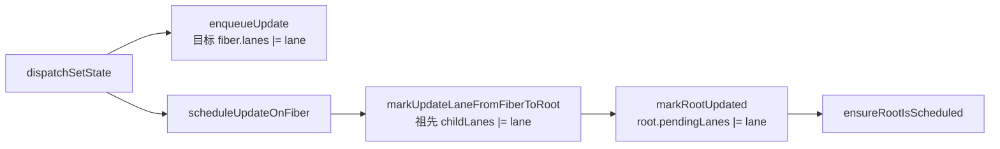
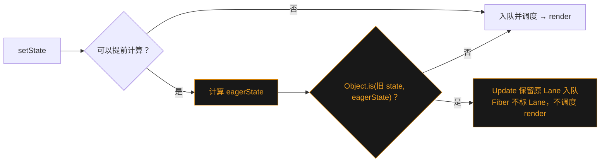
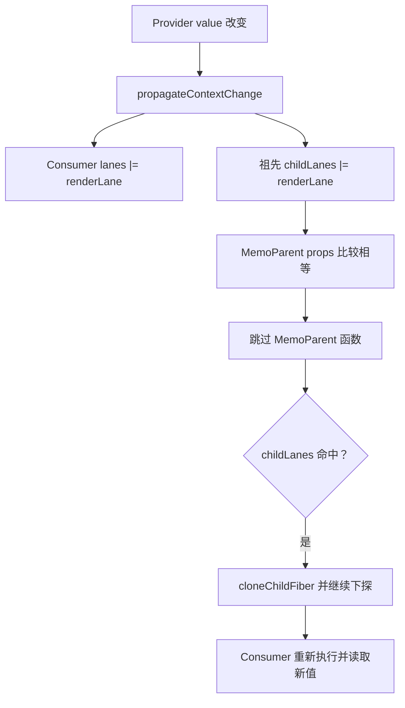
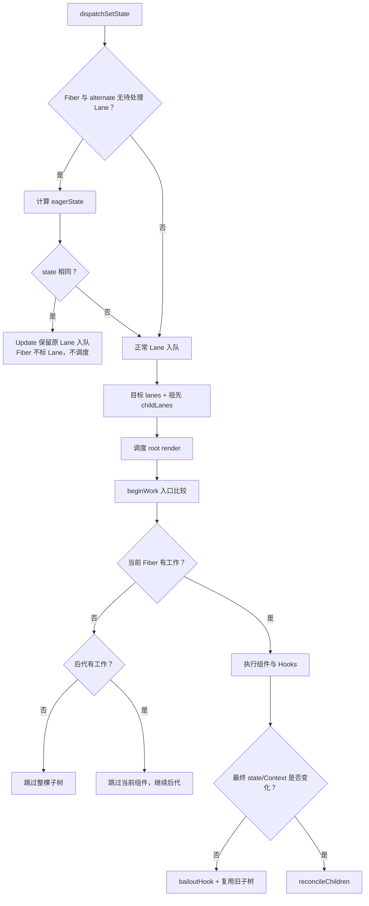

# 第23章：实现性能优化策略

## 本章定位

- **数据流定位**：更新入队时用 `lanes`/`childLanes` 标记工作及其路径；dispatch 阶段尝试用 eagerState 跳过调度；进入 render 后，再根据 props、type、Lane、Context 依赖与 memo 比较决定执行组件、进入子树还是复用已有结果。
- **难度**：★★★★☆ —— 把 Fiber、Lane、Hooks 与 Context 四套已有结构串成一条优化链路，机制多、证据链长。
- **前置依赖**：第 4 章（Fiber 双缓存与 WIP）、第 5 章（beginWork/completeWork 遍历）、第 8 章（useState 与 UpdateQueue）、第 14 章（Lane 模型与调度）、第 18 章（Update 的跳过与重放）、第 21 章（Context 值栈）。自检：能区分 current 与 WIP；能手算 `baseState`、`baseQueue` 与 `memoizedState`；知道 Lane 如何从更新目标传播到 root；知道 Provider 的值栈如何支持嵌套读取。
- **读后检验**：能画出一次 `setState` 经过 eagerState 与两级 bailout 的完整流程；能指出 `didReceiveUpdate` 在哪里被置位、在哪里被消费；能解释 Context 更新如何穿过 props 不变的 memo 中间层。

## 整体架构思路：更新账本与多层拦截

前面的章节已经能够完成一次更新：`dispatch` 创建 Update，Lane 表示优先级，Fiber 保存工作单元，render 阶段计算新树，commit 阶段提交结果。问题是：如果每次更新都从根节点重新执行整棵组件树，React 虽然“能更新”，却还没有做到“只更新必要的部分”。

本章解决的核心问题是：

> React 根据哪些证据，可以安全地证明某个组件或某棵子树在本轮没有工作，从而跳过计算？

本章会把 Fiber、Lane、Hooks 与 Context 串成一套完整的基础优化链路：

- 用 `lanes` 和 `childLanes` 记录工作分布；
- 在 `beginWork` 中实现两种粒度的 bailout；
- 用 `didReceiveUpdate` 处理“组件执行后才发现结果没变”的情况；
- 用 eagerState 在 dispatch 阶段提前拦截同值更新；
- 实现 `React.memo`、`useMemo` 与 `useCallback`；
- 记录 Context 依赖，使 Context 更新能够穿过 bailout 中间层。

阅读前应理解 Fiber 双缓存、`child/sibling/return`、UpdateQueue、Lane 调度、Hooks 链表以及 Context 值栈。本章只讨论第 23 章新增或接入的性能优化机制，不重新展开这些基础结构。

## 本章实现：从工作索引到组件级缓存

### 23-1 性能优化的一般思路

性能优化最通用的思路是：**把变化的部分与不变的部分分离**。

对函数组件来说，可能改变输出的声明式输入主要有：

- **State**：组件自己的状态；
- **Props**：父组件传入的数据；
- **Context**：组件从上下文读取的数据；
- **Type**：组件类型改变意味着不能继续复用原来的组件身份。

当 reconciler 能够证明某部分输入没有变化时，就可以复用上次提交的结果，把计算限制在真正发生变化的部分。

#### 将「变化的部分」与「不变的部分」分离案例

```tsx
function App() {
	return (
		<Wrapper>
			<ExpensiveSubtree />
		</Wrapper>
	);
}

function Wrapper({ children }) {
	const [num, setNum] = useState(0);

	return (
		<div>
			<button onClick={() => setNum(num + 1)}>{num}</button>
			{children}
		</div>
	);
}

function ExpensiveSubtree() {
	console.log('ExpensiveSubtree render');
	return <p>i am child</p>;
}
```

点击 `+1` 后，`Wrapper` 的 state 改变，所以 `Wrapper` 必须重新执行；`ExpensiveSubtree` 与这次更新无关，不应重复执行。

关键在于 `children` 的创建位置。`<ExpensiveSubtree />` 是 `App` 执行时创建的 ReactElement，随后作为 `children` prop 传给 `Wrapper`。`Wrapper` 自己的 state 更新不会让 `App` 重新执行，因此本轮 `Wrapper` 读到的 `children` 仍是上一次的 ReactElement 引用。协调到 `ExpensiveSubtree` 时，它的输入引用不变、自身没有 update、后代也没有工作，于是可以复用旧 Fiber 子树。

在这次更新中：

- **发生变化的 `Wrapper`**：必须执行组件函数并处理 state；
- **没有变化的 `ExpensiveSubtree`**：可以跳过组件函数与子树计算。

所以“命中性能优化”不等于当前更新源完全不执行，而是让变化止步于真正受影响的边界。

#### state 下沉也是同一原理

如果把 state 放进更深的 `Num` 组件：

```tsx
function App() {
	return (
		<div>
			<Num />
			<ExpensiveSubtree />
		</div>
	);
}
```

`Num` 更新时，`App` 自身没有更新，`ExpensiveSubtree` 也没有更新。React 只需沿 Fiber 树找到 `Num`，无须重新执行 `App` 和无关兄弟节点。这正是 `lanes` 与 `childLanes` 要解决的问题：**父组件自己可以没有工作，但它必须知道后代的某个位置仍然有工作。**

### 23-2 从现象理解两层优化

React 源码内部有哪些性能优化策略？观察[在线示例](https://codesandbox.io/p/sandbox/performance-2yqt23)：

```tsx
export default function App() {
	const [num, update] = useState(0);
	console.log('App render ', num);

	return (
		<div onClick={() => update(1)}>
			<Cpn />
		</div>
	);
}

function Cpn() {
	console.log('cpn render');
	return <div>cpn</div>;
}
```

可以观察到：

1. 首屏渲染打印 `App render 0` 和 `cpn render`；
2. 第一次点击完成 `0 → 1`，打印 `App render 1` 和 `cpn render`；
3. 第二次点击仍调用 `update(1)`，`App` 会执行，但 `Cpn` 不再执行；
4. 第三次及以后继续点击，`App` 和 `Cpn` 都不再执行。

对于上述例子，存在两种性能优化策略：

#### 策略一：bailout —— 减少不必要的子组件 render

第二次点击时，`num` 已经是 `1`，再次更新为 `1` 不会产生新的界面结果。React 可能仍需要执行 `App`，以确认这次状态更新是否真的带来变化；确认结果不变后，就没有必要继续处理与这次更新无关的 `Cpn`。

这就是 bailout 的基本含义：**更新流程已经开始，但如果能够证明某个组件或子树的输入没有变化，就复用上一次结果，不再重复计算。**

bailout 不保证当前组件一定不执行。它可能发生在组件执行前，也可能发生在状态计算完成后；但无论发生在哪个时机，目的都是阻止无效工作继续向子树扩散。

#### 策略二：eagerState —— 不必要的更新，没必要开启后续调度流程

第三次及以后的点击仍然会触发一次状态更新，更新内容是“把当前的 `1` 更新为 `1`”。所以这里不是“没有更新”，而是：**存在一条更新，但应用这条更新后得到的 state 与更新前相同。**

通常要进入更新流程后才能计算新 state。eagerState 策略尝试把这次计算提前：先根据当前 state 和本次更新得到下一状态，再比较更新前后的 state。若二者相同，说明这条更新不会产生新的界面结果，就没有必要继续后续流程，`App` 和 `Cpn` 都不会执行。

因此，eagerState 的基本思想是：**更新已经产生，但在安全的前提下提前算出更新结果；若更新后的 state 没有变化，就不再为这条更新启动后续工作。**

#### 两种策略的区别

| 策略       | 要解决的问题                         | 主要收益               |
| ---------- | ------------------------------------ | ---------------------- |
| bailout    | 更新已经开始，哪些组件或子树可以复用 | 减少组件执行和子树计算 |
| eagerState | 应用这条更新后 state 是否发生变化    | 省掉结果不变的更新流程 |

可以把二者理解为两道防线：eagerState 尽量在入口处拦截“存在更新但结果不变”的情况；未能提前判断的更新进入处理流程后，再由 bailout 阻止无关工作继续扩散。后续小节会分别实现这两种策略。

### 23-3 建立 bailout 的工作索引：lanes 与 childLanes

bailout 的核心判断发生在 `beginWork` 阶段。命中 bailout 后，当前 Fiber 无须根据新的 children 再次执行 reconcile：如果 `childLanes` 不包含本轮优先级，可以复用整棵已有子树；如果后代仍有工作，则只为直接子节点创建 WIP，并沿标记的路径继续下探。

bailout 需要满足四要素：

1. **props 不变**：普通组件通过全等比较判断 props 引用是否变化；使用 `React.memo` 后，默认改为浅比较，也可以提供自定义 compare。
2. **state 不变**：两种情况可能造成 state 不变：
   - 不存在 update；
   - 存在 update，但计算得出的 state 没有变化。
3. **context 不变**：组件读取的 Context 没有变化。
4. **type 不变**：类型变化时不能复用原组件身份。


这四项描述的是“组件输出是否可能变化”。代码还需要回答另一个问题：**当前 Fiber 没变化时，它的后代有没有独立更新？**

#### 为什么不能只检查 `updateQueue.pending`

一种直接思路是检查 `fiber.updateQueue.pending`。Update 自身携带 Lane，因此遍历队列也能判断其中是否存在匹配优先级的工作；但它不适合作为通用工作索引：

- 不同 Fiber 类型的 `updateQueue` 结构和用途不同；
- `pending` 只指向待处理环形队列，已经跳过的 Update 还可能保存在 `baseQueue`；
- 每次判断都遍历 UpdateQueue，无法提供 O(1) 的聚合结果；
- 父 Fiber 无法据此快速知道深层后代是否有更新；
- Context 更新也不是由父组件的 props 或 UpdateQueue 逐层传递。

因此第 23 章在 `FiberNode` 上增加：

```ts
lanes: Lanes;
childLanes: Lanes;
```

二者分工明确：

| 字段               | 含义                          |
| ------------------ | ----------------------------- |
| `fiber.lanes`      | 当前 Fiber 自身尚未完成的工作 |
| `fiber.childLanes` | 后代 Fiber 尚未完成的工作     |

`createWorkInProgress` 会把 current 的两个字段复制到 WIP，使新一轮 render 能继承尚未处理的工作。

本节实现改动文件：

- fiber.ts：为 Fiber 增加 `lanes`、`childLanes`，创建 WIP 时继承工作标记；
- updateQueue.ts：更新入队时标记目标 Fiber，并在跳过低优先级 Update 时保留对应 Lane；
- fiberHooks.ts：为 Hook 更新传递 Fiber 与 Lane，并把被跳过的 Lane 重新记录到 Fiber；
- fiberReconciler.ts：为 HostRoot 更新入队补充目标 Fiber 与 Lane；
- workLoop.ts：沿更新路径向上合并祖先的 `childLanes`；
- beginWork.ts：开始处理 Fiber 时重置本轮已消费的工作标记；
- completeWork.ts：完成 Fiber 时重新汇总子树剩余的 `childLanes`。

#### Update 入队：标记目标 Fiber

`enqueueUpdate` 把 lane 合并到更新目标及其 alternate：

```ts
fiber.lanes = mergeLanes(fiber.lanes, lane);

const alternate = fiber.alternate;
if (alternate !== null) {
	alternate.lanes = mergeLanes(alternate.lanes, lane);
}
```

同时标记两棵树，是因为 dispatch 保存的 Fiber 可能是当前树节点，也可能在一次提交后变成 alternate。无论从哪一侧发起更新，下一轮都必须看到这项工作。

#### 调度更新：标记祖先路径

`scheduleUpdateOnFiber` 调用 `markUpdateLaneFromFiberToRoot`。它从目标 Fiber 沿 `return` 向上遍历，把 lane 合并到每个祖先及其 alternate 的 `childLanes`，最后找到 HostRoot 并更新 `root.pendingLanes`。



假设 `Wrapper` 内部发生更新：

```text
HostRoot  childLanes = SyncLane
└── App   childLanes = SyncLane, lanes = NoLanes
    └── Wrapper lanes = SyncLane
```

这条路径不是说 `App` 的 state 改变了，而是说“穿过 `App` 可以找到本轮工作”。render 因而可以跳过 `App` 函数，却仍然进入 `Wrapper`。

#### completeWork：重新汇总 `childLanes`

更新入队时的向上标记服务于即将开始的 render。render 完成后，一部分 Lane 已被消费，另一部分可能因优先级不足而保留，所以 `completeWork` 还要通过 `bubbleProperties` 重新计算：

```ts
let newChildLanes = NoLanes;
let child = wip.child;

while (child !== null) {
	newChildLanes = mergeLanes(
		newChildLanes,
		mergeLanes(child.lanes, child.childLanes)
	);
	child = child.sibling;
}

wip.childLanes = newChildLanes;
```

这一步为下一轮 render 重建准确索引。`lanes/childLanes` 不是一次性标记，而是一份在“入队向上标记”和“完成阶段向上汇总”之间持续维护的工作账本。

### 23-4 实现 bailout：跳过当前 Fiber 或整棵子树

23-3 只建立了“自身是否有工作、后代是否有工作”的两级索引。本节让 `beginWork` 消费这份索引：先判断当前 Fiber 能否跳过，再决定是否还要沿子树继续寻找工作。

本节实现改动文件：

- beginWork.ts：实现入口与执行后的 bailout，并根据 `childLanes` 决定是否继续下探；
- childFibers.ts：实现 `cloneChildFiber`，为需要继续处理的直接子节点创建 WIP；
- fiberHooks.ts：比较新旧 state、标记 `didReceiveUpdate`，并实现 Hook bailout 的清理与复用；
- fiberLanes.ts：增加 Lane 相交检查与 Lane 移除操作。

#### beginWork 入口判断

`beginWork` 每处理一个 WIP Fiber，先重置本轮全局标记：

```ts
didReceiveUpdate = false;
```

如果存在 current，便比较已提交输入与本轮输入：

```ts
const current = wip.alternate;
const oldProps = current.memoizedProps;
const newProps = wip.pendingProps;

if (oldProps !== newProps || current.type !== wip.type) {
	didReceiveUpdate = true;
} else {
	const hasScheduledStateOrContext = checkScheduledUpdateOrContext(
		current,
		renderLane
	);

	if (!hasScheduledStateOrContext) {
		return bailoutOnAlreadyFinishedWork(wip, renderLane);
	}
}
```

代码中的信息如何对应四要素：

- `oldProps !== newProps`：props 引用改变；
- `current.type !== wip.type`：类型改变；
- `current.lanes` 命中 `renderLane`：当前 Fiber 有 state 或其他待处理工作；
- Context 在 23-8 中会转换成 Consumer 的 Lane，并通过依赖记录影响 `didReceiveUpdate`。

`checkScheduledUpdateOrContext` 这个名字表达了“state 或 Context 是否要求更新”，但 big-react 的函数体本身只检查 `current.lanes`。Context 的兼容由 23-8 的传播与 `prepareToReadContext` 协作完成。

#### 第一种粒度：跳过整棵子树

当前 Fiber 没有工作后，`bailoutOnAlreadyFinishedWork` 继续检查后代：

```ts
if (!includeSomeLanes(wip.childLanes, renderLane)) {
	return null;
}
```

`beginWork` 返回 `null`，work loop 会进入完成阶段，不再访问这棵子树。此时省掉的是：

- 当前组件函数；
- 当前 Fiber 的 children reconciliation；
- 全部后代的 begin/complete 工作。

#### 第二种粒度：跳过当前 Fiber，继续后代

若 `childLanes` 包含 `renderLane`，说明当前 Fiber 自身没工作，但后代有工作：

```ts
cloneChildFiber(wip);
return wip.child;
```

为什么不能直接返回 `current.child`？current 与 WIP 是两棵树。直接进入 current 子节点会导致 `return` 指针指向错误的父树，render 阶段还可能修改已提交 Fiber。`cloneChildFiber` 必须用 `createWorkInProgress` 克隆直接 child/sibling 链，并把每个子节点的 `return` 指向当前 `wip`。

这里只克隆一层是刻意的惰性策略：当前只需建立合法的下一步入口，更深层是否需要 WIP，要等遍历到对应 Fiber 后再根据它的工作标记决定。

```text
current:  Parent ── child ── A ── sibling ── B
             │                   │
             └──── alternate ────┼────────────
                                 │
WIP:      Parent' ─ child ── A' ─ sibling ── B'
```

正确的 sibling 克隆必须始终以推进后的 `currentChild` 为源。如果误用刚生成的 `newChild`，第二个及后续 sibling 就无法与 current 节点一一对应。单 child 案例不会进入循环，也就无法暴露这类问题。

#### state 有 Update，不等于 state 一定变化

入口判断只能知道 Fiber 上有当前 Lane，不能提前知道 Update 计算结果。函数组件仍要进入 `renderWithHooks`，`updateState` 消费队列后比较：

```ts
if (!Object.is(prevState, memoizedState)) {
	markWipReceivedUpdate();
}
```

如果 state 真正变化，`didReceiveUpdate` 变为 `true`；如果最终 state 与旧值相同，它仍为 `false`。

#### 第二个时机：组件执行后的 bailout

`updateFunctionComponent` 在组件执行后再次判断：

```ts
const nextChildren = renderWithHooks(wip, Component, renderLane);

if (current !== null && !didReceiveUpdate) {
	bailoutHook(wip, renderLane);
	return bailoutOnAlreadyFinishedWork(wip, renderLane);
}
```

这里虽然已经付出了组件函数与 Hooks 的计算成本，但仍可放弃新生成的 `nextChildren`，避免 children reconciliation 和后代工作。

`bailoutHook` 负责：

- 复用 current 的函数组件 `updateQueue`；
- 清除本轮不应提交的 `PassiveEffect`；
- 移除已经处理的 `renderLane`。

因此，bailout 有两个证据时点：

| 时机       | 已知信息                                     | 省掉什么                           |
| ---------- | -------------------------------------------- | ---------------------------------- |
| 组件执行前 | props、type、Lane                            | 组件函数及其后续工作               |
| 组件执行后 | UpdateQueue 计算出的最终 state、Context 标记 | children reconciliation 与后代工作 |

#### HostRoot 也能 bailout

`updateHostRoot` 处理根更新队列后，会比较 `prevChildren` 与 `nextChildren`。如果二者引用相同，说明根节点输出没有变化，也可以进入 `bailoutOnAlreadyFinishedWork`。bailout 是 Fiber 层面的复用机制，并不只服务于函数组件。

### 23-5 实现 eagerState 策略

bailout 发生在 render 阶段。如果 dispatch 时就能证明 state 不会变化，那么这次 render 根本没有必要被调度。

eagerState 策略包含两步：

1. 计算更新后的 state；
2. 与更新前的 state 比较。

通常“根据 Update 计算 state”发生在 render 阶段。eagerState 把一次安全的预计算提前到触发更新时：



本节实现改动文件：

- fiberHooks.ts：dispatch 时预计算 eager state，同值时只入队而不发起调度；
- updateQueue.ts：为 Update 保存 eager 计算结果，并在处理队列时复用或重新归约该结果。

#### Update 与队列新增字段

Update 保存预计算信息：

```ts
interface Update<State> {
	action: Action<State>;
	lane: Lane;
	hasEagerState: boolean;
	eagerState: State | null;
	next: Update<State> | null;
}
```

函数组件更新队列新增 `lastRenderedState`，记录最近一次完成 render 时得到的 state，供下一次 dispatch 使用。

#### 为什么条件必须保守

`dispatchSetState` 只有在当前 Fiber 与 alternate 都没有待处理 Lane 时才进入快速路径：

```ts
const current = fiber.alternate;

if (
	fiber.lanes === NoLanes &&
	(current === null || current.lanes === NoLanes)
) {
	// 可以尝试 eager 计算
}
```

这个条件的含义不是“UpdateQueue 对象为空”，而是“当前没有其他已知工作会改变计算基线”。如果已经存在前序 Update，新 action 应当基于前序 Update 的结果计算，不能直接基于旧的 `lastRenderedState`。

#### 预计算与同值判断

```ts
const currentState = updateQueue.lastRenderedState;
const eagerState = basicStateReducer(currentState, action);

update.hasEagerState = true;
update.eagerState = eagerState;

if (Object.is(currentState, eagerState)) {
	enqueueUpdate(updateQueue, update, fiber, NoLane);
	return;
}
```

这里的 `update` 已经通过 `createUpdate(action, lane)` 保存了本次请求到的原始 Lane。传给 `enqueueUpdate` 的第四个参数才是 `NoLane`，它只表示本次入队不向 Fiber 与 alternate 标记工作；`update.lane` 并没有被改写，未来仍可按原优先级参与队列重放。

`basicStateReducer` 同时支持直接值和函数式更新：

```ts
setState(1);
setState((prev) => prev + 1);
```

`Object.is` 与 React 其他相等判断保持一致：`NaN` 与 `NaN` 相等，`+0` 与 `-0` 不相等；对象仍只比较引用。

#### 为什么同值 Update 仍要入队

命中 eagerState 只表示“不值得为它单独调度一次 render”，不表示这条 Update 可以从历史中消失。

并发更新可能按优先级跳过和重放 Update。当前同值 action 将来可能与其他更新一起进入 rebase；如果直接丢弃，队列中的 action 顺序就不再等于用户 dispatch 的顺序。因此 Update 仍保留原 Lane 进入队列，只是本次入队不标记 Fiber Lane，也不调用 `scheduleUpdateOnFiber`。

#### eagerState 与更新队列归约必须分开理解

eagerState 决定能否提前计算并跳过调度；`processUpdateQueue` 则必须保证 render 阶段按顺序累计所有 Update。正确的基本模型是：

```ts
newState = basicStateReducer(newState, action);
```

普通 action 必须基于累计的 `newState` 归约；如果始终使用固定的 `baseState`，或者无条件采用每条 Update 携带的 `eagerState`，组合更新就会失去累计语义。当前实现会在前面已有计算结果时基于 `newState` 重新执行 eager action。单次同值更新只能验证 eager 入口，连续 Update 还必须验证执行顺序与最终结果。

### 23-6 实现 React.memo

普通函数组件的入口 bailout 要求：

```ts
oldProps === newProps;
```

父组件一旦重新执行，通常会创建新的 props 对象，即使字段值相同，引用比较也会失败。`React.memo` 允许开发者显式声明：“在 props 等价且没有其他更新来源时，可以复用上一次结果。”

本节实现改动文件：

- memo.ts：创建带有 `REACT_MEMO_TYPE`、原组件和比较函数的 memo 类型；
- index.ts：导出 `memo` 公共 API；
- ReactSymbols.ts：定义 `REACT_MEMO_TYPE`；
- shallowEqual.ts：实现默认的 props 浅比较；
- workTags.ts：定义 `MemoComponent` Fiber 类型；
- fiber.ts：识别 memo ReactElement 并创建 `MemoComponent` Fiber；
- beginWork.ts：实现 memo props 比较及其 bailout 路径；
- fiberHooks.ts：允许 `renderWithHooks` 执行 memo 包装的原组件；
- completeWork.ts：在完成 `MemoComponent` 时向上冒泡子树信息。

#### `memo` 返回的不是组件执行结果

`memo(Component, compare?)` 返回带特殊标记的包装对象：

```ts
{
	$$typeof: REACT_MEMO_TYPE,
	type: Component,
	compare: compare ?? null
}
```

`createFiberFromElement` 识别 `REACT_MEMO_TYPE`，把 Fiber 标记为 `MemoComponent`。到 `beginWork` 时，再由 `updateMemoComponent` 读取被包装组件与比较函数。

这说明 `memo` 并不在调用时缓存 ReactElement，也不执行组件；它改变的是 reconciler 为这个组件建立和处理 Fiber 的方式。

#### 默认浅比较

没有自定义 compare 时使用 `shallowEqual`。算法依次检查：

1. 两个值 `Object.is` 相等，直接返回 `true`；
2. 任一值不是对象或为 `null`，返回 `false`；
3. 自有可枚举 key 数量不同，返回 `false`；
4. 每个 key 必须在另一个对象上存在，且对应值满足 `Object.is`。

浅比较只检查第一层。嵌套对象若原地修改并保持同一引用，会被视为相同，因此 memo 与 state 一样依赖不可变数据约定。

#### `updateMemoComponent` 的完整判断

```ts
const prevProps = current.memoizedProps;
const nextProps = wip.pendingProps;
const Component = wip.type;

let compare = Component.compare;
compare = compare !== null ? compare : shallowEqual;

if (compare(prevProps, nextProps) && current.ref === wip.ref) {
	didReceiveUpdate = false;
	wip.pendingProps = prevProps;

	if (!checkScheduledUpdateOrContext(current, renderLane)) {
		wip.lanes = current.lanes;
		return bailoutOnAlreadyFinishedWork(wip, renderLane);
	}
}

return updateFunctionComponent(wip, Component.type, renderLane);
```

必须同时理解四点：

- compare 返回 `true` 只证明 props 等价；
- ref 改变时不能沿用这条 bailout；
- 组件自己的 state 或 Context 更新会让 Lane 命中，仍需执行组件；
- 后代有更新时，`bailoutOnAlreadyFinishedWork` 仍会根据 `childLanes` 继续下探。

将 `wip.pendingProps` 恢复为 `prevProps`，是为了让“props 等价”重新表现为稳定引用。这样后续通用 bailout 与被包装函数读取到的输入身份保持一致。

#### memo 不应被理解为“永远不 render”

```tsx
const Child = memo(function Child({ label }) {
	const [count, setCount] = useState(0);
	const theme = useContext(ThemeContext);

	return (
		<button onClick={() => setCount(count + 1)}>
			{label}-{count}-{theme}
		</button>
	);
});
```

即使 `label` 没变：

- `setCount` 仍必须使 Child 更新；
- `ThemeContext` 变化仍必须使 Child 更新；
- 自定义 compare 返回 `true` 也不能屏蔽这些更新。

memo 只为 props 提供额外的等价证明，不改变组件对 state 与 Context 的声明式依赖。

### 23-7 实现 useMemo 与 useCallback

- `useCallback`：缓存函数；
- `useMemo`：缓存计算结果；特殊情况下也可通过稳定 ReactElement 引用帮助子树 bailout。

两者都把 `[值, deps]` 保存到当前 Hook 的 `memoizedState`，区别是“值”如何产生。

本节实现改动文件：

- hooks.ts：提供 `useMemo`、`useCallback` 的公共 Hook 入口；
- currentDispatcher.ts：为 Dispatcher 增加两个 Hook 的类型定义；
- fiberHooks.ts：实现两个 Hook 的 mount、update 与依赖比较逻辑；
- index.ts：导出 `useMemo`、`useCallback` 公共 API。

#### 对外 API 与 Dispatcher

`react/src/hooks.ts` 只负责取得当前 Dispatcher：

```ts
export const useCallback = (callback, deps) => {
	const dispatcher = resolveDispatcher();
	return dispatcher.useCallback(callback, deps);
};

export const useMemo = (nextCreate, deps) => {
	const dispatcher = resolveDispatcher();
	return dispatcher.useMemo(nextCreate, deps);
};
```

mount 与 update 使用不同实现，与 `useState`、`useEffect` 的分发方式一致。

#### `useCallback`：复用函数引用

mount 时直接保存函数与依赖：

```ts
hook.memoizedState = [callback, nextDeps];
return callback;
```

update 时依赖相同就返回旧函数：

```ts
const [prevCallback, prevDeps] = hook.memoizedState;

if (nextDeps !== null && areHookInputsEqual(prevDeps, nextDeps)) {
	return prevCallback;
}

hook.memoizedState = [callback, nextDeps];
return callback;
```

它不会阻止本次函数表达式被创建，也不会跳过当前组件执行；它保证的是组件对外返回的函数引用在依赖不变时保持稳定。

#### `useMemo`：复用计算结果

mount 时执行工厂并保存结果：

```ts
const nextValue = nextCreate();
hook.memoizedState = [nextValue, nextDeps];
return nextValue;
```

update 时，依赖相同就复用旧值；否则重新调用 `nextCreate` 并保存新结果。

#### 依赖数组如何比较

`areHookInputsEqual` 对相同索引逐项使用 `Object.is`。未传依赖时，`nextDeps` 为 `null`，每次 render 都会重新计算或返回本次传入的函数；传入空数组时，后续 render 会复用首次结果。

当前实现只遍历两组依赖的共同长度，没有将长度变化直接判为不等。因此依赖数组的顺序和长度必须保持稳定，不能依靠增删依赖项强制刷新。官方 React 的生产比较同样逐项执行，但开发环境会额外警告依赖数组长度变化；big-react 没有这层 DEV 校验。

#### 三种 memo 化能力的边界

| API           | 复用对象           | 比较发生时机           | 能否跳过当前组件执行 |
| ------------- | ------------------ | ---------------------- | -------------------- |
| `React.memo`  | 组件上一次渲染结果 | 进入被包装组件之前     | 可以                 |
| `useMemo`     | 计算结果           | 当前组件执行到 Hook 时 | 不可以               |
| `useCallback` | 函数引用           | 当前组件执行到 Hook 时 | 不可以               |

常见配合方式是：父组件用 `useCallback` 稳定函数 prop，或用 `useMemo` 稳定对象 prop，memo 子组件的浅比较才更容易命中。

#### `useMemo` 的特殊用法：稳定 ReactElement

`useMemo` 还可以通过稳定 ReactElement 引用帮助子树 bailout：

```tsx
function App() {
	const [num, update] = useState(0);

	const child = useMemo(() => <ExpensiveSubtree />, []);

	return (
		<div onClick={() => update(num + 1)}>
			<p>{num}</p>
			{child}
		</div>
	);
}
```

依赖不变时，`child` 是同一个 ReactElement 对象，它携带的 type、key 与 props 引用也保持稳定。协调到对应 Fiber 后，通用 beginWork bailout 更容易命中，`ExpensiveSubtree` 可以不执行。

这种写法说明 JSX 本质上也是普通对象，但通常不如直接把 `ExpensiveSubtree` 包装为 `memo` 清晰。`useMemo` 的首要用途仍是复用计算结果或稳定需要传递的对象；不要为了“缓存所有 JSX”而增加难以维护的依赖关系。

### 23-8 Context 兼容 bailout

如果 bailout 只检查 props 和 state，Context 会成为正确性漏洞：

> 为什么 Consumer 不触发更新？

因为它与 Provider 之间的组件命中了 bailout，整条路径被跳过。

> Context 场景下怎样避免错误 bailout？

Provider value 改变时，提前找到依赖该 Context 的 Consumer：给 Consumer 标记 `lanes`，给 Provider 到 Consumer 之间的祖先标记 `childLanes`。这样中间组件可以跳过自身执行，但 reconciler 仍会沿路径到达 Consumer。

#### 失败场景

```text
Provider(value 改变)
└── MemoParent(props 不变)
    └── Consumer(useContext)
```

`MemoParent` 的 props 完全没变。如果 compare 返回 `true` 后无条件跳过整棵子树，`Consumer` 就会继续显示旧 Context。Context 不是通过 props 逐层传递的，因此必须建立独立的依赖索引。

本节实现改动文件：

- fiberContext.ts：记录 Context 依赖、传播 Provider 变化，并标记 Consumer 与祖先路径；
- fiber.ts：为 Fiber 增加 `dependencies`，创建 WIP 时继承 Context 依赖；
- beginWork.ts：在函数组件执行前准备依赖收集，并在 Provider 更新时传播 Context 变化；
- fiberHooks.ts：让 `useContext` 读取值的同时登记当前 Fiber 的 Context 依赖。

#### Fiber 记录 Context 依赖

`FiberNode` 新增：

```ts
dependencies: {
	firstContext: ContextItem<any> | null;
	lanes: Lanes;
} | null;
```

每个 `ContextItem` 记录：

```ts
interface ContextItem<Value> {
	context: ReactContext<Value>;
	memoizedState: Value;
	next: ContextItem<Value> | null;
}
```

一个组件可以读取多个 Context，所以 `firstContext` 指向单链表。

#### render 前准备依赖

`updateFunctionComponent` 在执行组件前调用：

```ts
prepareToReadContext(wip, renderLane);
```

`prepareToReadContext` 做两件事：

1. 将模块级 `lastContextDep` 置空，并清空旧 `firstContext`，让本轮实际的 `readContext` 重建依赖链；
2. 如果旧 `dependencies.lanes` 命中 `renderLane`，调用 `markWipReceivedUpdate`。

有新的 Context 输入时，即使 state 最终没变，也不能在组件执行后因为 `didReceiveUpdate === false` 而丢弃新 children。这两种情况会得到相反的判断结果：“有 Update 但 state 计算后没变”会让 `didReceiveUpdate` 保持 `false`，从而允许执行后 bailout；Context 更新则必须把它置为 `true`，保留本轮新生成的 children。

#### `readContext` 同时读取值与登记依赖

```ts
const value = context._currentValue;

const contextItem = {
	context,
	memoizedState: value,
	next: null
};
```

第一个 Context 创建 `consumer.dependencies`，后续 Context 追加到链尾。于是 reconciler 不再只知道“当前 Context 值是什么”，还知道“哪个 Fiber 读取了哪个 Context”。

#### Provider value 变化后传播

`updateContextProvider` 先把新值压入 Context 栈，再比较：

```ts
if (Object.is(oldValue, newValue) && oldProps.children === newProps.children) {
	return bailoutOnAlreadyFinishedWork(wip, renderLane);
}

propagateContextChange(wip, context, renderLane);
```

value 与 children 都相同时，Provider 可以复用子树；否则 `propagateContextChange` 深度优先遍历后代依赖。

只有 value 变化才需要通知 Context Consumer；children 变化但 value 相同时，只需正常协调 children。big-react 把这两种情况合并进同一个 `else`，因此会多做一次依赖扫描，但不会漏掉更新。

找到匹配 Consumer 后：

```ts
fiber.lanes = mergeLanes(fiber.lanes, renderLane);
const alternate = fiber.alternate;
if (alternate !== null) {
	alternate.lanes = mergeLanes(alternate.lanes, renderLane);
}
deps.lanes = mergeLanes(deps.lanes, renderLane);

scheduleContextWorkOnParentPath(fiber.return, wip, renderLane);
```

各字段职责如下：

| 标记位置                      | 作用                                             |
| ----------------------------- | ------------------------------------------------ |
| Consumer `lanes`              | 阻止 Consumer 在 beginWork 入口 bailout          |
| Consumer `dependencies.lanes` | 组件执行前把 Context 变化转成 `didReceiveUpdate` |
| 祖先 `childLanes`             | 允许 props 不变的中间层跳过自身，但继续进入子树  |
| alternate 对应字段            | 无论下次从哪一棵树创建 WIP，都不会丢失工作       |

#### Context 更新如何穿过 memo

完整路径为：



这套分工实现了“路径可穿透，组件可跳过”：`MemoParent` 自己不必执行，`Consumer` 又不会漏掉更新。

#### 嵌套 Provider 的遮蔽

同一种 Context 的内层 Provider 会遮蔽外层值：

```text
OuterProvider(value=A)
└── InnerProvider(value=B)
    └── Consumer // 读取 B
```

外层 `A` 改变时，不应给内层 Consumer 标记更新。`propagateContextChange` 遇到同类型的内层 Provider 后，会停止进入该分支；不同 Context 的 Provider 则不形成遮蔽，仍继续遍历。

#### Provider bailout 仍要维护值栈

ContextProvider 在通用 beginWork 入口命中 bailout 时，仍必须先执行 `pushProvider`。bailout 只表示 Provider 的计算结果可以复用，不表示后代执行时可以缺少正确的 Context 栈帧。如果不压栈，继续下探的 Consumer 可能读取外层 Provider 或默认值。

## 一次更新中的完整优化链

把本章新增机制放回一次 `setState`：



可以把每项状态理解成一份职责单一的证据：

| 状态                         | 回答的问题                       |
| ---------------------------- | -------------------------------- |
| `pendingProps/memoizedProps` | 父组件是否给了新的输入对象       |
| `memoizedState`              | 上次完成 render 的状态是什么     |
| `lanes`                      | 当前 Fiber 是否还有本轮工作      |
| `childLanes`                 | 后代是否还有本轮工作             |
| `didReceiveUpdate`           | 组件执行后是否确认输入或结果变化 |
| `dependencies`               | 当前 Fiber 读取了哪些 Context    |
| `lastRenderedState`          | dispatch 能否安全预计算下一状态  |
| memo compare / Hook deps     | 用户显式声明的等价关系是否成立   |

真正的设计主线不是“缓存得越多越好”，而是：**把更新意图、优先级、依赖和计算结果分别记录，只有证据足够时才跳过工作。**

## 与官方 React 的差异

big-react 保留了官方设计的主干，但省略了大量生产级分支。重要差异如下。

| 主题               | big-react                                                    | 官方 React                                                                                                             |
| ------------------ | ------------------------------------------------------------ | ---------------------------------------------------------------------------------------------------------------------- |
| 通用 bailout       | 检查 props/type 与 Lane，再用 `childLanes` 决定是否下探      | 还会复用依赖、记录跳过的 Lane，并处理懒 Context 传播、Profiler、热更新、Suspense、Offscreen 等                         |
| Context 传播       | Provider value 变化后主动 DFS 子树，标记 Consumer 与祖先路径 | 当前实现以懒传播为主，early bailout 前还会通过依赖值检查 Context 是否变化                                              |
| `React.memo`       | 一个 `MemoComponent` Fiber 直接调用被包装函数                | 区分 `MemoComponent` 与 `SimpleMemoComponent`：前者保留包装 Fiber 和内部 child，后者是普通函数组件默认浅比较的快速路径 |
| eagerState         | `useState` 使用 `basicStateReducer + lastRenderedState`      | 队列保存 `lastRenderedReducer`；还处理 render-phase update、异常重算、并发入队和 Transition 纠缠                       |
| Hook 依赖校验      | 按共同长度逐项 `Object.is`，无 DEV 长度警告                  | 生产路径同样逐项比较，DEV 会警告依赖数组长度或形态变化                                                                 |
| Suspense/Offscreen | bailout 未完整兼容                                           | early bailout 仍会维护 Suspense、Offscreen、Cache、Host Context 等栈和隐藏树状态                                       |

官方源码可对照：

- [ReactFiberBeginWork.js](https://github.com/facebook/react/blob/main/packages/react-reconciler/src/ReactFiberBeginWork.js)：通用 bailout、memo 与各类 Fiber 的 early bailout；
- [ReactFiberHooks.js](https://github.com/facebook/react/blob/main/packages/react-reconciler/src/ReactFiberHooks.js)：eagerState、`useMemo`、`useCallback` 与依赖比较；
- [ReactFiberNewContext.js](https://github.com/facebook/react/blob/main/packages/react-reconciler/src/ReactFiberNewContext.js)：Context 依赖与传播；
- [ReactChildFiber.js](https://github.com/facebook/react/blob/main/packages/react-reconciler/src/ReactChildFiber.js)：正确克隆 child/sibling WIP 链。

这些差异不改变本章的核心原理：Fiber 用 Lane 标记工作范围，beginWork 根据证据剪枝，显式 memo 化补充等价关系，Context 依赖保证优化不会遮蔽声明式输入。

## 思考题

### Q1: `lanes` 与 `childLanes` 分别解决什么问题，为什么 bailout 必须同时检查它们?

`fiber.lanes` 记录 **Fiber 自身**是否有待处理更新，`fiber.childLanes` 记录 **后代 Fiber** 是否有待处理更新。

以 `App → Wrapper → Counter` 为例，`Counter` 调用 `setState` 后：

- `enqueueUpdate` 将本次 lane 合并到 `Counter.lanes`；
- `markUpdateLaneFromFiberToRoot` 沿 `return` 向上，把该 lane 合并到 `Wrapper.childLanes`、`App.childLanes`，并最终标记到根节点。

渲染到 `App` 时，如果 props 没变且 `App.lanes` 不包含 `renderLane`，说明 `App` 自身不必执行；但 `App.childLanes` 命中，说明后代还有工作，因此只能跳过 `App` 自身，不能跳过整棵子树。

如果只检查 `lanes`，深层更新会被没有自身更新的祖先截断；如果只检查 `childLanes`，又无法判断当前 Fiber 自身是否要处理更新。两者共同把 bailout 分成两个粒度：

- 自身无工作、后代也无工作：跳过整棵子树；
- 自身无工作、后代有工作：跳过当前组件执行，继续向下遍历。

### Q2: `bubbleProperties` 为什么还要在 completeWork 阶段重新收集 `childLanes`?

更新入队时向祖先标记 `childLanes`，是为了给 **即将开始的渲染** 建立一条查找更新的路径；`completeWork` 中重新汇总，则是为了给 **下一次渲染** 留下准确索引。

本轮渲染可能消费部分 lane，也可能因优先级不足保留部分更新。完成一个 Fiber 时，`bubbleProperties` 遍历它的直接子节点，将每个子节点的 `lanes` 与 `childLanes` 合并到父节点：

```ts
newChildLanes = mergeLanes(
	newChildLanes,
	mergeLanes(child.lanes, child.childLanes)
);
```

这样得到的 `wip.childLanes` 才反映提交后子树中仍然存在的工作。如果只依赖入队时的向上标记，已经消费的 lane 可能长期残留；如果完全不向上汇总，下一轮又无法从祖先快速判断后代是否有工作。

### Q3: bailout 时为什么不能直接 `return current.child`，而要调用 `cloneChildFiber`? 为什么只克隆第一层?

`current` 和 `workInProgress` 是两棵通过 `alternate` 互相对应的 Fiber 树。直接返回 `current.child`，会让本轮遍历进入 current 树：

- 子节点的 `return` 仍指向 current 父节点；
- render 阶段的字段修改可能污染当前已提交的树；
- completeWork 沿 `return` 返回时会走错树；
- current/WIP 的 `alternate` 对应关系也会被破坏。

`cloneChildFiber` 使用 `createWorkInProgress` 为直接子节点创建或复用 WIP，并把 `return` 修正为当前 `wip`，从而保持两棵树彼此隔离。

这里只克隆第一层，是因为 WIP 树采用惰性构建：`beginWork` 当前只需要一个合法的下一步入口；更深层是否需要克隆，要等遍历到对应 Fiber 后再根据它的 `childLanes` 判断。预先复制整棵子树会把 bailout 节省的工作重新做一遍。

### Q4: beginWork 入口 bailout 与函数组件执行后的 bailout 有什么区别? 为什么两者都需要?

入口 bailout 使用渲染前已经掌握的信息：

- `oldProps === newProps`；
- 组件类型未变；
- 当前 Fiber 的 `lanes` 不包含 `renderLane`。

条件成立时，可以不执行组件函数和 Hooks。

但某些更新只有计算后才能确认结果没有变化。例如 Fiber 上存在 state 更新，因此入口不能跳过；`renderWithHooks` 消费更新队列后，如果新旧 state 满足 `Object.is`，`didReceiveUpdate` 仍为 `false`。此时 `updateFunctionComponent` 调用：

```ts
bailoutHook(wip, renderLane);
return bailoutOnAlreadyFinishedWork(wip, renderLane);
```

`bailoutHook` 复用 current 的 `updateQueue`、清除本轮不应提交的 `PassiveEffect`，并移除已经处理的 lane；随后仍由 `childLanes` 决定是否继续进入后代。

因此，入口 bailout 负责“执行前已能证明无变化”的情况，执行后 bailout 负责“处理更新后才证明结果未变”的情况。

### Q5: eagerState 为什么在 dispatch 阶段计算，并且只在 Fiber 与 alternate 都没有待处理 lane 时启用?

dispatch 是更新管线的最前端。如果能在这里算出 eagerState，并确认：

```ts
Object.is(eagerState, currentState);
```

就可以不调用 `scheduleUpdateOnFiber`，连调度、render 和组件执行都省掉，比进入 `beginWork` 后再 bailout 更早。

但预计算必须有可靠的 state 基线。本章只有在当前 Fiber 与 `alternate` 的 `lanes` 都是 `NoLanes` 时才使用 `queue.lastRenderedState`。如果已经存在待处理更新，新 action 的输入应当是前序更新归约后的结果，而不一定是 `lastRenderedState`；此时提前计算可能得到错误答案。

所以 eagerState 不是把 render 阶段的队列计算无条件搬到 dispatch，而是一条只在更新队列没有其他待处理工作时启用的快速路径。

### Q6: eagerState 已确认 state 不变时，为什么 Update 仍要入队，又为什么不给 Fiber 标记 Lane?

“不调度本次渲染”和“从更新历史中删除这条 Update”不是一回事。

React 允许不同优先级的更新分批处理，被跳过的更新会在后续 render 中基于 `baseState` 重放。当前的同值更新虽然不值得单独调度，但以后可能与新的正常更新一起进入队列。如果直接丢弃，重放时的 action 顺序就可能与用户实际 dispatch 的顺序不同。

因此，本章仍调用 `enqueueUpdate`。`Update` 自身保留 `createUpdate` 时取得的原始 Lane，保证未来重放仍有正确的优先级；传给 `enqueueUpdate` 的标记参数则是 `NoLane`，所以这次入队不会写入 Fiber/alternate 的 `lanes`，也不会主动开启一次 render。eager bailout 省略的是本次工作标记与调度，不是 Update，也不是更新队列的顺序语义。

### Q7: `React.memo` 与普通 FunctionComponent bailout 是什么关系? compare 返回 true 后还要检查什么?

普通 FunctionComponent 只有在新旧 props 是同一个对象时，才具备 props 层面的 bailout 证据。由 `memo` 创建的 `MemoComponent` 则在组件执行前使用自定义 `compare`，或默认使用 `shallowEqual`，允许两个不同 props 对象在第一层字段相同时视为等价。

但 compare 返回 `true` 只证明 props 没有驱动变化，还必须满足：

- 新旧 `ref` 相同；
- 当前 Fiber 没有命中 `renderLane` 的 state 或 Context 更新；
- 若后代的 `childLanes` 命中，仍要继续进入子树。

命中后，`updateMemoComponent` 将 `wip.pendingProps` 恢复为 `prevProps`，重新建立稳定的引用身份，再复用通用的 `bailoutOnAlreadyFinishedWork`。因此 `memo` 不是另一套缓存树，而是为通用 bailout 补充了一种 props 等价证据。错误的自定义 compare 可能漏掉真正的 props 变化，因此其正确性由使用者负责。

### Q8: `React.memo`、`useMemo` 与 `useCallback` 分别复用什么，为什么后两者不能阻止当前组件执行?

- `React.memo` 工作在 Fiber 的 `beginWork` 阶段，尝试复用组件上一次的渲染结果，命中时可以跳过被包装组件的函数执行；
- `useMemo` 保存 `[计算结果, deps]`，deps 相等时复用计算结果；
- `useCallback` 保存 `[函数, deps]`，deps 相等时复用函数引用。

`useMemo` 和 `useCallback` 都是组件内部的 Hook。只有组件函数已经开始执行并走到对应 Hook 时，React 才能读取上一次 Hook 并比较 deps，所以它们无法阻止当前组件执行。

它们可以帮助下游 bailout：父组件用 `useCallback` 稳定函数 prop，或用 `useMemo` 稳定对象 prop，子组件的 `React.memo` 才更可能通过浅比较。但三者剪掉的是更新管线中的不同工作，不能笼统理解为同一种缓存。

### Q9: Context 更新如何穿透 props 不变的 memo 中间层，同时又不执行这个中间组件?

考虑：

```text
Provider
└── MemoParent
    └── Consumer
```

`Consumer` 调用 `readContext` 时，会在自己的 `dependencies.firstContext` 链表中记录所读取的 Context。Provider 的 value 变化后，`propagateContextChange` 找到匹配的 Consumer：

1. 将 `renderLane` 合并到 Consumer 及其 alternate 的 `lanes`；
2. 将该 lane 记录到 `dependencies.lanes`；
3. 沿 Consumer 到 Provider 的父路径标记 `childLanes`。

渲染到 `MemoParent` 时，props 比较可以命中，因此其组件函数不用执行；但 `childLanes` 包含 `renderLane`，`bailoutOnAlreadyFinishedWork` 会克隆子 Fiber 并继续下探。到达 Consumer 后，它自己的 lane 和 Context 依赖阻止 bailout，于是重新执行并读取新值。

结果是：memo 中间层跳过自身执行，Context Consumer 仍然更新。关键分工仍是“`lanes` 标目标，`childLanes` 标路径”。

### Q10: ContextProvider 命中 beginWork 入口 bailout 时，为什么仍必须先调用 `pushProvider`?

bailout 只表示 Provider 的渲染结果可以复用，不表示遍历其子树时可以缺少 Context 环境。

Context 值通过栈管理。后代执行 `readContext` 时，读取的是当前遍历路径对应的 `context._currentValue`。如果 Provider 在入口处直接 bailout，而没有先调用 `pushProvider`，继续深入的后代可能读到外层 Provider 的值，甚至 Context 默认值。

因此，本章在通用 bailout 判断中对 `ContextProvider` 做了额外处理：

```ts
switch (wip.tag) {
	case ContextProvider: {
		const newValue = wip.memoizedProps.value;
		const context = wip.type._context;
		pushProvider(context, newValue);
		break;
	}
}
```

“跳过 Provider 的组件工作”与“建立后代所需的 Context 栈帧”是两个独立问题。后者即使在 bailout 路径上也不能省略。

### Q11: `prepareToReadContext` 为什么既要清空旧依赖链，又要根据 `dependencies.lanes` 标记 `didReceiveUpdate`?

清空旧依赖链，是为了让本轮组件执行期间的 `readContext` 重新建立真实依赖。普通 `useContext` 应遵守 Hooks 调用规则；本章支持的 `use(Context)` 则可以按条件读取 Context。无论读取路径是否变化，都应以本轮实际读取结果重建依赖，否则已经不再读取的 Context 仍可能错误地给组件标记更新。

检查 `dependencies.lanes` 则解决另一个问题：Context 是 props 和 state 之外的输入。若它在当前 `renderLane` 发生变化，`prepareToReadContext` 必须调用 `markWipReceivedUpdate`。否则组件即使因 Context 更新执行完毕，也可能因为 `didReceiveUpdate` 仍为 `false` 而走执行后 bailout，刚生成的新 children 会被丢弃。

所以这两个动作分别保证：

- 依赖集合反映本轮实际读取行为；
- Context 变化不会被执行后的 bailout 误判为“结果无变化”。

### Q12: 外层 Provider 传播 Context 变化时，为什么遇到同一种 Context 的内层 Provider 要停止向下搜索?

同一种 Context 的内层 Provider 会遮蔽外层 Provider：

```text
OuterProvider(value=A)
└── InnerProvider(value=B)
    └── Consumer
```

这里 Consumer 读取的是 `B`。外层 value 从 `A` 改为 `A2`，不应使这个 Consumer 更新。

本章的 `propagateContextChange` 遍历到 `ContextProvider` 时，会比较其类型与正在传播的 Provider 类型；若是同一种 Context，就不再把该 Provider 的 child 作为 `nextFiber`。否则外层变化会越过遮蔽边界，给实际不依赖外层值的 Consumer 标记 lane，产生错误或多余更新。

因此 Context 传播不是无条件扫描整棵子树，而是必须遵守 Provider 的嵌套作用域。

### Q13: `cloneChildFiber` 遍历多个 sibling 时，为什么每一轮都必须以 `currentChild` 为克隆源?

设计目标是把 current 的 child/sibling 链逐个映射到 WIP 链：

```text
current: A → B → C
WIP:     A′ → B′ → C′
```

因此循环推进到下一个 current sibling 后，必须用新的 `currentChild` 创建对应 WIP：

```ts
while (currentChild.sibling !== null) {
	currentChild = currentChild.sibling;
	newChild = newChild.sibling = createWorkInProgress(
		currentChild,
		currentChild.pendingProps
	);
	newChild.return = wip;
}
```

`currentChild` 表示“正在被复制的旧节点”，`newChild` 表示“刚生成的 WIP 节点”。如果误把 `newChild` 再次传给 `createWorkInProgress`，第二个及后续节点就可能复用前一个 WIP 的 `alternate`、type 和 props，无法保持一一对应。

单 child 场景只执行循环前的第一次克隆，根本不会进入 sibling 循环，所以即使循环内部写错，页面仍可能表现正常。验证这段实现必须覆盖“父 Fiber 有多个直接 child，且工作位于后一个 sibling”的树形。

最后将 `newChild.sibling` 置为 `null`，可以断开 WIP 链末尾可能残留的旧 sibling，保证新链边界明确。

### Q14: `processUpdateQueue` 为什么必须基于累计的 `newState` 处理 Update? eagerState 何时可以直接复用?

更新队列按顺序执行 action，后一条 Update 的输入必须是前一条的输出：

```ts
newState = reducer(newState, action);
```

例如初始 state 为 `0`，依次执行 `n => n + 1`、`n => n + 2`，正确结果是 `3`。如果两次都基于固定的 `baseState = 0`，结果只会是 `2`。因此普通 Update 必须执行：

```ts
newState = basicStateReducer(newState, action);
```

eagerState 是 dispatch 阶段基于 `lastRenderedState` 预计算的。处理到这条 Update 时，如果当前累计状态仍与 `baseState` 相同，说明它面对的状态基线与预计算时一致，可以直接采用 `pending.eagerState`；如果前面的 Update 已使 `newState` 改变，就要基于当前 `newState` 重新执行 action：

```ts
if (pending.hasEagerState) {
	if (Object.is(newState, baseState)) {
		newState = pending.eagerState!;
	} else {
		newState = basicStateReducer(newState, action);
	}
} else {
	newState = basicStateReducer(newState, action);
}
```

这里有两个不同层次的正确性条件：

- dispatch 阶段只有在 Fiber 与 alternate 都没有待处理 Lane 时，才允许预计算 eagerState；
- render 阶段无论是否存在 eagerState，都必须保持 Update 的顺序和累计语义。

所以 eagerState 只是一个可复用的预计算结果，不能取代 UpdateQueue 的顺序归约模型。

### Q15: beginWork 入口的 props 比较为什么默认用全等比较，而不是浅比较?

普通函数组件的默认语义是：父组件执行并为子组件创建新的 ReactElement 后，子组件也会重新执行。`beginWork` 的全等比较是一项 O(1) 的保守检查：只有父级复用了同一个 props 对象，并且没有其他更新来源时，普通组件才获得 props 层面的 bailout 证据。

浅比较需要枚举 props 的第一层字段，成本是 O(n)，而且会改变普通组件“随父组件重新执行”的默认策略。因此 reconciler 不会无条件为所有函数组件支付这项成本，而是通过 `React.memo` 让开发者显式选择，并允许提供自定义 compare。

全等比较和浅比较都不是深度变化检测，也都依赖不可变数据与纯渲染约定。如果调用方原地修改并复用同一个对象，两者都可能看不到深层变化。区别在于：全等比较只复用已经稳定的对象身份；`React.memo` 则由开发者额外声明“这些不同的 props 对象仍可视为等价”，相应的正确性责任也由开发者承担。

## 本章小结

本章的核心不是某个性能 API，而是 **用证据证明哪些工作可以不做**。组件输出可能受 props、state、Context 和 type 影响；Fiber 自身没有变化，也不代表后代没有更新。只有把这些输入和工作范围都纳入判断，bailout 才不会漏掉更新。

一次状态更新中，eagerState 尝试提前算出结果，拦截“存在更新但 state 不变”的情况。需要进入 render 的更新会写入目标 Fiber 的 `lanes`，并沿祖先记录 `childLanes`；`beginWork` 据此决定跳过整棵子树，还是只跳过当前组件并继续下探。组件执行后，`didReceiveUpdate` 还会提供第二次 bailout 机会。`React.memo`、`useMemo` 和 `useCallback` 则分别复用组件结果、计算结果和函数引用。

Context 依赖传播补齐了这套机制的正确性边界：Consumer 用 `dependencies` 记录读取关系，Provider 变化后给 Consumer 标记 `lanes`、给祖先标记 `childLanes`，使更新能够穿过 props 不变的中间层。最终形成的主线是：**记录变化，定位工作，验证输入，只复用能够证明安全的结果。**
