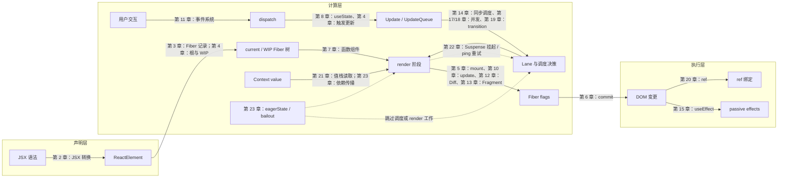

# big-react 源码精读路线

## 阅读说明

这套讲义目标是建立一套能够解释 React 行为的心智模型：为什么需要 Fiber，更新怎样从 Hook 到达 root，render 与 commit 为什么分离，Lane 如何影响状态计算，以及 Context、Suspense、bailout 如何接入同一条主线。

23 个标题保留原课程名称。每章只把章节结束时已经存在且实际接通的代码写进“本章实现”；已定义但未调用、被注释或存在行为缺口的部分也会直接标明。跨章内容只用于解释整体架构或指出某一章新增了什么，不拿后续源码替当前章节补齐结果。

判断是否读懂一章，可以检查自己能否做到：

- 用一句话说明这项设计解决了什么问题。
- 画出一次真实操作经过的主要模块和阶段。
- 解释关键字段为什么存在，以及它在什么时候变化。
- 分清这个模块负责什么、不负责什么。
- 预测删除某个关键判断后会出现什么错误。

讲义中的重要术语会在首次出现时用简洁语言说明含义，再结合后续执行流程解释具体作用。

## 每章统一阅读结构

各章主题和代码量不同，不强求相同篇幅，但使用同一套阅读骨架：

1. **本章定位**：固定回答数据位于哪条管线、理解难度、前置依赖和读后检验。
2. **整体架构思路**：先解释问题、约束和对象关系，不急于逐文件展开代码。
3. **本章实现**：按课程提交或完整调用链组织，说明数据写到哪里、由谁消费。
4. **原理深挖或完整链路**：仅在手算、时序或跨小节串联确实有帮助时增加，不作为每章硬性模板。
5. **与官方 React 的差异**：区分核心设计一致之处、课程简化以及当前实现边界。
6. **思考题**：用问题检验推理，不重复正文结论。
7. **本章小结**：收束本章新增能力，并交代它怎样成为下一章的前置。

需要集中建立源码地图时，“本章改动文件”统一放在“本章实现”开头；若一章包含多个相对独立的提交，也可以像第 23 章一样放到对应实现小节中。文件清单只保留影响主线的数据结构和调用链，不罗列格式调整、Demo 文案等偶发改动。清单中的文件名使用普通文本，不添加链接；正文中的源码链接负责定位具体实现，文件清单只负责建立模块地图。

## 讲义写作与思考题标准

讲义不设置目标字数、行数或统一篇幅。内容是否保留，只看它是否帮助读者建立本章实现的完整心智模型：问题从哪里产生，数据写入哪个对象，后续由谁消费，最终得到什么结果。不能为了缩短篇幅而删除必要的对象变化、执行时序、反事实推演、源码缺口或与官方 React 的设计联系；只有确实重复、与本章提交无关或不能增加理解的信息才应删减。

思考题也不设置固定数量。每道题进入讲义前至少满足以下条件：

- 严格位于本章实现范围内；若答案涉及后续变化，明确标注对应章节和具体补充。
- 能检验关键设计、对象字段、调用链、边界条件或常见误区，而不是复述正文标题。
- 答案给出完整推理过程，并落到本章具体源码；仅有一句结论、泛化的 React 知识或面试套话，不达到收录标准。
- 题目之间有不同的检验目标。数量再多，如果只是换一种问法重复同一结论，也不应编入。
- 以文字解释为主体；在对象快照、状态推演、执行顺序或对比关系更适合结构化表达时，使用表格、列表、代码片段或 Mermaid 辅助理解。

因此，不同章节的思考题数量可以明显不同。题目数量是本章知识密度与质量筛选后的结果，不是预先设定的配额。

## 一图看懂 React：23 章在管线上的位置

React 的全部工作可以压缩成一条管线：**声明层把用户意图变成对象，计算层决定做哪些工作、以什么优先级做，执行层把结果落到宿主环境。** 下图是全课程结束时的架构地图，箭头上的章节表示该能力开始或主要接入的位置，不表示前一章已经提前具备后续字段与行为：



图上没有直接出现、但服务于这条管线的章节：

| 章节                                | 在管线中的作用                       |
| ----------------------------------- | ------------------------------------ |
| 第 1 章 项目架构                    | 管线的工程容器：包边界与静态检查配置 |
| 第 9 章测试、第 16 章 noop renderer | 公开协议测试与第二个可观察宿主       |

读任何一章前，先在这张图上找到它的位置：它消费上游的什么数据，产出什么给下游。每章章首的「本章定位」小节也会给出数据流定位。

## 章节列表

讲义按原课程的节（如 6-1、6-2）推进。部分节为概念节，不含 reconciler 实现；Vite 调试环境在 7-2 接入。

| 节   | 标题                                        |
| ---- | ------------------------------------------- |
| 1    | 搭建项目架构                                |
| 2-1  | 实现 JSX                                    |
| 2-2  | 实现 JSX 的打包                             |
| 2-3  | 实现第一种调试方式                          |
| 3    | 实现 Reconciler 架构                        |
| 4-1  | 实现状态更新机制                            |
| 4-2  | 接入状态更新机制                            |
| 5-1  | 实现 mount 流程的 beginWork                 |
| 5-2  | 实现 mount 流程的 completeWork              |
| 6-1  | 实现 commit 阶段                            |
| 6-2  | 实现 Mutation 子阶段                        |
| 6-3  | 实现 ReactDOM                               |
| 6-4  | 调试 ReactDOM                               |
| 7-1  | 实现 FunctionComponent                      |
| 7-2  | 实现第二种调试方式（Vite）                  |
| 8-1  | 实现 Hooks 架构                             |
| 8-2  | 实现 useState                               |
| 9-1  | 实现第三种调试方式                          |
| 9-2  | 测试 JSX                                    |
| 10-1 | update 流程 render 阶段                     |
| 10-2 | update 流程 commit 阶段                     |
| 10-3 | update 流程处理 useState                    |
| 11   | 实现事件系统                                |
| 12-1 | 实现单节点 Diff                             |
| 12-2 | 实现多节点 Diff                             |
| 12-3 | Diff 算法处理 commit 阶段                   |
| 13   | 实现 Fragment                               |
| 14-1 | 批处理的概念                                |
| 14-2 | 实现 Lane 模型                              |
| 14-3 | 实现调度阶段                                |
| 14-4 | 改造更新流程                                |
| 15-1 | 实现 useEffect 数据结构                     |
| 15-2 | 实现 useEffect 工作流程                     |
| 16-1 | 实现 noop-renderer                          |
| 16-2 | 打包 noop-renderer                          |
| 16-3 | 构建可断言输出并测试 useEffect              |
| 17-1 | 观察调度 Demo 的 ImmediatePriority 同步分支 |
| 17-2 | 观察同一 Demo 的时间切片分支                |
| 18-1 | 实现并发更新的交互部分                      |
| 18-2 | 实现并发更新的策略逻辑                      |
| 18-3 | 实现并发更新的状态计算                      |
| 19-1 | useTransition 的作用（概念节）              |
| 19-2 | 实现 useTransition                          |
| 20   | 实现 useRef                                 |
| 21-1 | 实现 Context 数据结构                       |
| 21-2 | 实现 Context 逻辑                           |
| 21-3 | 实现 useContext                             |
| 22-1 | Suspense 的作用（概念节）                   |
| 22-2 | Suspense 的实现思路                         |
| 22-3 | 实现 Suspense 工作流程                      |
| 22-4 | 如何触发 Suspense（含 use 实现）            |
| 22-5 | 实现试验性 Hook——use（正文并入 22-4）       |
| 22-6 | 实现 unwind 流程（正文与 22-5 合为一节）    |
| 22-7 | 完善 Suspense                               |
| 23-1 | 性能优化的一般思路（概念节）                |
| 23-2 | 从现象理解两层优化（概念节）                |
| 23-3 | 建立 bailout 的工作索引                     |
| 23-4 | 实现两级 bailout                            |
| 23-5 | 实现 eagerState 策略                        |
| 23-6 | 实现 React.memo                             |
| 23-7 | 实现 useMemo、useCallback                   |
| 23-8 | Context 兼容 bailout 策略                   |

## 第一阶段：从 JSX 到首次提交

- [第 1 章：搭建项目架构](./01.md)：monorepo、包边界、工程规范与打包入口。
- [第 2 章：JSX 转换](./02.md)：JSX runtime、ReactElement、`jsx` 与 `createElement`。
- [第 3 章：Reconciler 架构](./03.md)：最小 Fiber 记录与尚不可运行的 work loop 骨架。
- [第 4 章：触发更新](./04.md)：Update 入队、FiberRoot/WIP 与停在空 beginWork 的 render 入口。
- [第 5 章：mount render](./05.md)：beginWork/completeWork 单元规则；完整循环与宿主实现尚未接通。
- [第 6 章：ReactDOM 与 commit](./06.md)：hostConfig、createRoot、Placement；`NoFlags = 1` 使提交判断失效，第 7 章改为 0。
- [第 7 章：FunctionComponent](./07.md)：函数组件的执行位置与 Vite 源码调试。
- [第 8 章：useState](./08.md)：mount Dispatcher、Hook 链表与 dispatch 入队；`renderWithHooks` 的 update 分支为空，Hook 游标和 Dispatcher 也未完整重置。

学完这一阶段，应该能不看代码画出：

```text
root.render(element) -> Update -> FiberRoot
    -> beginWork/completeWork -> finishedWork
    -> commitMutationEffects -> DOM
```

这条链描述第 6 章已经闭环的首次挂载；第 8 章 setter 触发后的状态消费尚未闭环。

## 第二阶段：从更新到调度

- [第 9 章：ReactElement 测试](./09.md)：从构建产物加载公开包，验证 key、ref、props、children 与元素标记协议。
- [第 10 章：update 流程](./10.md)：单节点复用、删除、宿主更新与 Hook update。
- [第 11 章：事件系统](./11.md)：click 委托、捕获/冒泡与直接改写原生 Event；优先级到第 18 章接入。
- [第 12 章：Diff 算法](./12.md)：多节点 diff、key 与 `lastPlacedIndex`；移动标记已生成，但 insert 调用名到第 14 章才接通。
- [第 13 章：Fragment](./13.md)：有 Fiber、无宿主实例的透明节点。
- [第 14 章：同步调度](./14.md)：Lane、微任务批处理、根节点 pendingLanes。
- [第 15 章：useEffect](./15.md)：effect 环形链表、PassiveEffect 和提交后执行。
- [第 16 章：noop renderer](./16.md)：提供可控对象宿主与 matcher，用于单元测试 reconciler；移动、parent 清理与普通 props 更新仍有缺口。

这一阶段的核心不是背 diff 规则，而是理解两次转换：

1. render 把“新旧 UI 的差异”转换成 Fiber flags。
2. commit 把 Fiber flags 转换成宿主环境操作。

## 第三阶段：并发能力与性能优化

- [第 17 章：并发更新原理](./17.md)：时间切片、Scheduler 与可恢复工作。
- [第 18 章：实现并发更新](./18.md)：事件优先级、Concurrent work loop 与 Update 跳过/重放骨架；baseQueue 两处接线由第 19 章补齐，函数 action 仍错误地读取固定 `baseState`。
- [第 19 章：useTransition](./19.md)：TransitionLane、`isPending`、`startTransition` 与 baseQueue 补线；Transition 被映射为 IdlePriority，异常时上下文不会恢复。
- [第 20 章：useRef](./20.md)：稳定 Hook 容器、mount attach 与删除 detach；同类型 Fiber 复用时没有接收新 ref，更新 detach 也未接通。
- [第 21 章：useContext](./21.md)：Provider 值栈与直接读取；异常 unwind 由第 22 章补充，消费者依赖传播由第 23 章补充。
- [第 22 章：Suspense](./22.md)：`use(thenable)`、throw/unwind、Offscreen、ping 与重试调度。
- [第 23 章：性能优化](./23.md)：bailout、eagerState、memo、useMemo/useCallback；组合 Update 归约与多 sibling 克隆仍有缺陷。

这一阶段建议反复追问三个问题：

- 这次更新属于哪个 Lane？
- render 被打断或跳过后，尚未处理的状态保存在哪里？
- 哪些信息能证明一棵子树安全地不做工作？

## 每章的推荐学习动作

不要只顺序读文字。每章至少完成以下四步：

1. **先理解问题**：合上源码，用自己的话说明这一章为什么存在。
2. **走调用链**：从公开 API 或更新入口开始，手动跳转到核心函数。
3. **写对象快照**：记录 render 前后 `memoizedState`、`pending`、`flags`、`pendingLanes` 等字段如何变化。
4. **做一次反事实推演**：去掉一个关键判断，先手算字段与调用链；只有本章测试环境确实可运行时，再用测试验证。

源码学习最容易陷入“每行都看懂，但合起来不知道为什么”。解决办法是始终把代码放回三层模型中：

| 层次   | 要回答的问题                   | 典型数据                              |
| ------ | ------------------------------ | ------------------------------------- |
| 声明层 | 用户想要什么 UI？              | ReactElement、props、children         |
| 计算层 | 哪些工作要做、以什么优先级做？ | Fiber、UpdateQueue、Lane、flags       |
| 执行层 | 如何改变具体宿主环境？         | hostConfig、DOM/noop instance、effect |
